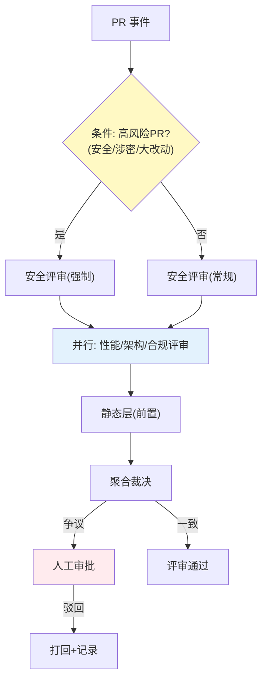

# 项目 12：研发效能 DevOps 平台 — 06-工作流编排

> **定位**：把"评审流程硬编码"升级为"DAG 工作流编排 + 状态机生命周期"——流程结构用 DAG 表达、生命周期用状态机管理、条件分支/并行/审批节点可配置。教程 36 Agent 工作流编排的落地。本文给出**完整可手写代码**（一行不省略，含全部 import）。
>
> **读者画像**：已完成 [05-多Agent评审流水线](05-多Agent评审流水线.md)。
>
> 「遇到阻塞？→ [教程 79-Agent工作流编排 全篇]、[教程 21-Agent状态管理]；API 真实性以 [附录 05-SpringAI2-API基准] 为准」

---

## 1. 四问

| 问 | 答 |
|----|----|
| **新增了什么需求** | DAG 工作流引擎（节点 = 评审步骤）；评审状态机；条件分支（如"高风险 PR 强制安全评审"） |
| **影响了哪些模块** | 新增 workflow 包（WorkflowDefinition/WorkflowNode/WorkflowEngine/ReviewStateMachine）；v5 的多 Agent 评审改为工作流节点 |
| **架构如何演进** | 硬编码流程 → 声明式 DAG（结构）+ 状态机（生命周期） |
| **上一版痛点是什么** | 评审流程硬编码，改顺序要改代码；无生命周期管理；条件分支/并行写死在代码 |

### 1.1 本节核对（四问口径）

| # | 核对项 | 判据 |
|---|--------|------|
| 1 | 四问齐全且痛点承接 | 四行均有；痛点（流程硬编码、改顺序改代码）对应对 [05 痛点 §6] |
| 2 | 架构演进成立 | 硬编码流程 → 声明式 DAG（WorkflowDefinition）+ 状态机（ReviewStateMachine），§3 均落地 |
| 3 | 新增模块有类落点 | workflow 包（WorkflowDefinition/WorkflowNode/WorkflowEngine/ReviewStateMachine）在 §3 完整存在 |

## 2. 编排架构

> **选型**（[调研 研发效能 2026 §多 Agent]）：**流程结构用 DAG（Spring AI Alibaba Graph 类），生命周期用状态机（Spring StateMachine）**——DAG 表达"哪些评审并行/顺序/条件"，状态机表达"评审从 pending→running→approved/rejected"。



### 2.1 本节核对（DAG 结构 + 状态机双轨）

| # | 核对项 | 判据 |
|---|--------|------|
| 1 | 选型口径一致 | 结构用 DAG（§3.4 WorkflowEngine）、生命周期用状态机（§3.7 ReviewStateMachine），与定位段双轨一致 |
| 2 | 条件/并行/审批节点齐全 | 图中高风险 gate、PAR 并行、HITL 审批均有对应 DAG 节点实现于 §3.5/§3.9 |

## 3. 完整代码（照抄即可）

> v6 无新 Maven 依赖——DAG 引擎与状态机为**自研业务类**（非框架 API）。若换 Spring StateMachine：需在 pom.xml 添加 `spring-statemachine-starter`（见 §3.8 可选依赖）。

### 3.1 `WorkflowContext.java`（节点间共享数据）

```java
package com.rd.devops.workflow;

import java.util.Map;
import java.util.concurrent.ConcurrentHashMap;

/** DAG 执行上下文：节点间共享数据（并行节点并发写入，故用 ConcurrentHashMap）。 */
public class WorkflowContext {

    private final Map<String, Object> data = new ConcurrentHashMap<>();

    public WorkflowContext with(String key, Object value) {
        data.put(key, value);
        return this;
    }

    @SuppressWarnings("unchecked")
    public <T> T get(String key) {
        return (T) data.get(key);
    }

    public Object getRaw(String key) {
        return data.get(key);
    }
}
```

### 3.2 `WorkflowNode.java`（DAG 节点）

```java
package com.rd.devops.workflow;

import java.util.ArrayList;
import java.util.List;
import java.util.function.Function;
import java.util.function.Predicate;

/** DAG 节点：动作 + 后继（顺序/并行/条件）+ 终态/审批标记。 */
public final class WorkflowNode {

    private final String id;
    private final List<String> nextIds;
    private final List<String> parallelIds;
    private final String joinId;
    private final Function<WorkflowContext, WorkflowContext> action;
    private final Predicate<WorkflowContext> condition;
    private final String whenTrue;
    private final String whenFalse;
    private final boolean terminal;
    private final boolean approval;

    WorkflowNode(String id, List<String> nextIds, List<String> parallelIds, String joinId,
                 Function<WorkflowContext, WorkflowContext> action,
                 Predicate<WorkflowContext> condition, String whenTrue, String whenFalse,
                 boolean terminal, boolean approval) {
        this.id = id;
        this.nextIds = nextIds;
        this.parallelIds = parallelIds;
        this.joinId = joinId;
        this.action = action;
        this.condition = condition;
        this.whenTrue = whenTrue;
        this.whenFalse = whenFalse;
        this.terminal = terminal;
        this.approval = approval;
    }

    public String id() { return id; }
    public List<String> nextIds() { return nextIds; }
    public List<String> parallelIds() { return parallelIds; }
    public String joinId() { return joinId; }
    public boolean isParallel() { return !parallelIds.isEmpty(); }
    public boolean isTerminal() { return terminal; }
    public boolean isApproval() { return approval; }
    public boolean hasCondition() { return condition != null; }
    public Predicate<WorkflowContext> condition() { return condition; }
    public String whenTrue() { return whenTrue; }
    public String whenFalse() { return whenFalse; }
    public Function<WorkflowContext, WorkflowContext> action() { return action; }

    /** 声明式节点构造器。 */
    public static final class Builder {
        private final String id;
        private final List<String> next = new ArrayList<>();
        private final List<String> parallel = new ArrayList<>();
        private String joinId;
        private Function<WorkflowContext, WorkflowContext> action = ctx -> ctx;
        private Predicate<WorkflowContext> condition;
        private String whenTrue;
        private String whenFalse;
        private boolean terminal;
        private boolean approval;

        Builder(String id) { this.id = id; }

        public Builder action(Function<WorkflowContext, WorkflowContext> action) {
            this.action = action;
            return this;
        }

        public Builder next(String id) {
            this.next.add(id);
            return this;
        }

        public Builder parallel(String... ids) {
            this.parallel.addAll(List.of(ids));
            return this;
        }

        public Builder join(String id) {
            this.joinId = id;
            return this;
        }

        public Builder condition(Predicate<WorkflowContext> condition) {
            this.condition = condition;
            return this;
        }

        public Builder whenTrue(String id) { this.whenTrue = id; return this; }
        public Builder whenFalse(String id) { this.whenFalse = id; return this; }
        public Builder terminal() { this.terminal = true; return this; }
        public Builder approval() { this.approval = true; return this; }

        public WorkflowNode build() {
            return new WorkflowNode(id, next, parallel, joinId, action,
                    condition, whenTrue, whenFalse, terminal, approval);
        }
    }
}
```

### 3.3 `WorkflowDefinition.java`（DAG 定义 + 声明式 Builder）

```java
package com.rd.devops.workflow;

import java.util.HashMap;
import java.util.LinkedHashMap;
import java.util.Map;
import java.util.function.Consumer;

/** 工作流定义：声明式 DAG（改流程不改代码）。 */
public final class WorkflowDefinition {

    private final String name;
    private final Map<String, WorkflowNode> nodes;
    private final String startId;

    private WorkflowDefinition(String name, Map<String, WorkflowNode> nodes, String startId) {
        this.name = name;
        this.nodes = nodes;
        this.startId = startId;
    }

    public String name() { return name; }
    public String startId() { return startId; }
    public WorkflowNode node(String id) { return nodes.get(id); }

    public static Builder builder(String name) { return new Builder(name); }

    public static final class Builder {
        private final String name;
        private final Map<String, WorkflowNode.Builder> builders = new LinkedHashMap<>();
        private String startId;

        private Builder(String name) { this.name = name; }

        public Builder start(String id) { this.startId = id; return this; }

        public Builder node(String id, Consumer<WorkflowNode.Builder> cfg) {
            WorkflowNode.Builder b = new WorkflowNode.Builder(id);
            cfg.accept(b);
            builders.put(id, b);
            return this;
        }

        public WorkflowDefinition build() {
            Map<String, WorkflowNode> nodes = new HashMap<>();
            for (WorkflowNode.Builder b : builders.values()) {
                WorkflowNode node = b.build();
                nodes.put(node.id(), node);
            }
            return new WorkflowDefinition(name, nodes, startId);
        }
    }
}
```

### 3.4 `WorkflowEngine.java`（响应式 DAG 执行引擎）

```java
package com.rd.devops.workflow;

import org.springframework.stereotype.Component;
import reactor.core.publisher.Flux;
import reactor.core.publisher.Mono;
import reactor.core.scheduler.Schedulers;

import java.util.List;

/** DAG 执行：就绪节点并行调度（响应式，禁固定线程池；节点动作含 LLM，放 boundedElastic）。 */
@Component
public class WorkflowEngine {

    public Flux<WorkflowEvent> execute(WorkflowDefinition def, WorkflowContext initial) {
        return executeNode(def, def.startId(), initial);
    }

    private Flux<WorkflowEvent> executeNode(WorkflowDefinition def, String nodeId, WorkflowContext ctx) {
        WorkflowNode node = def.node(nodeId);
        // 节点动作（可能含 LLM 调用）在 boundedElastic 执行，EventLoop 不 block
        return Mono.fromCallable(() -> node.action().apply(ctx))
                .subscribeOn(Schedulers.boundedElastic())
                .flatMapMany(applied -> {
                    WorkflowEvent event = new WorkflowEvent(node.id(),
                            node.isApproval() ? "AWAITING_APPROVAL" : "RUNNING");

                    if (node.isTerminal()) {
                        return Flux.just(event.withStatus("COMPLETED"));
                    }

                    Flux<WorkflowEvent> self = Flux.just(event);

                    if (node.isParallel()) {
                        // 并行子节点并发执行，全部完成后在 join 节点汇合
                        Flux<WorkflowEvent> parallel = Flux.fromIterable(node.parallelIds())
                                .flatMap(childId -> executeNode(def, childId, applied));
                        return self.concatWith(parallel.collectList()
                                .flatMapMany(results -> executeNode(def, node.joinId(), applied)));
                    }

                    List<String> nexts = nextOf(node, applied);
                    return self.concatWith(
                            Flux.fromIterable(nexts).concatMap(nid -> executeNode(def, nid, applied)));
                });
    }

    private List<String> nextOf(WorkflowNode node, WorkflowContext ctx) {
        if (node.hasCondition()) {
            return List.of(node.condition().test(ctx) ? node.whenTrue() : node.whenFalse());
        }
        return node.nextIds();
    }

    /** 工作流事件（执行轨迹，可回放）。 */
    public record WorkflowEvent(String nodeId, String status) {
        WorkflowEvent withStatus(String s) { return new WorkflowEvent(nodeId, s); }
    }
}
```

### 3.5 `ReviewWorkflow.java`（评审流程 DAG 定义）

```java
package com.rd.devops.workflow;

import com.rd.devops.review.ReviewReport;

/** 评审工作流：节点 + 边 + 条件（声明式，改流程不改代码）。 */
public class ReviewWorkflow {

    public static WorkflowDefinition define(ReviewWorkflowActions actions) {
        return WorkflowDefinition.builder("pr-review")
                .start("start")
                .node("start", n -> n.action(actions::evaluateRisk).next("gate"))
                .node("gate", n -> n.condition(ctx ->
                                ctx.<RiskLevel>get("riskLevel") == RiskLevel.HIGH)
                        .whenTrue("security-review").whenFalse("parallel"))
                .node("security-review", n -> n.action(actions::securityReview).next("aggregate"))
                .node("parallel", n -> n.parallel("performance-review", "architecture-review", "compliance-review")
                        .join("aggregate"))
                .node("performance-review", n -> n.action(actions::performanceReview))
                .node("architecture-review", n -> n.action(actions::architectureReview))
                .node("compliance-review", n -> n.action(actions::complianceReview))
                .node("aggregate", n -> n.action(actions::aggregate)
                        .condition(ctx -> ctx.<ReviewReport>get("report").hasDisputes())
                        .whenTrue("human-approval").whenFalse("approved"))
                .node("human-approval", n -> n.approval().next("approved"))
                .node("approved", n -> n.terminal())
                .build();
    }

    public enum RiskLevel { HIGH, NORMAL }
}
```

### 3.6 `ReviewWorkflowActions.java`（节点动作实现——复用 v5 的评审逻辑）

```java
package com.rd.devops.workflow;

import com.rd.devops.review.PrContext;
import com.rd.devops.review.ReviewAggregator;
import com.rd.devops.review.ReviewComment;
import com.rd.devops.review.ReviewReport;
import org.springframework.ai.chat.client.ChatClient;
import org.springframework.core.ParameterizedTypeReference;
import org.springframework.stereotype.Service;

import java.util.List;

/** 工作流节点动作：把 v5 的专家评审封装成可编排的步骤。 */
@Service
public class ReviewWorkflowActions {

    private final ChatClient securityReviewer;
    private final ChatClient performanceReviewer;
    private final ChatClient architectureReviewer;
    private final ChatClient complianceReviewer;
    private final ReviewAggregator aggregator;

    public ReviewWorkflowActions(ChatClient securityReviewer,
                                 ChatClient performanceReviewer,
                                 ChatClient architectureReviewer,
                                 ChatClient complianceReviewer,
                                 ReviewAggregator aggregator) {
        this.securityReviewer = securityReviewer;
        this.performanceReviewer = performanceReviewer;
        this.architectureReviewer = architectureReviewer;
        this.complianceReviewer = complianceReviewer;
        this.aggregator = aggregator;
    }

    public WorkflowContext evaluateRisk(WorkflowContext ctx) {
        PrContext pr = ctx.get("prContext");
        boolean highRisk = pr.diff().changedFiles().stream()
                .anyMatch(f -> f.path().contains("security") || f.path().contains("payment"));
        return ctx.with("riskLevel", highRisk ? ReviewWorkflow.RiskLevel.HIGH : ReviewWorkflow.RiskLevel.NORMAL);
    }

    public WorkflowContext securityReview(WorkflowContext ctx) {
        PrContext pr = ctx.get("prContext");
        return ctx.with("securityComments", review(securityReviewer, pr));
    }

    public WorkflowContext performanceReview(WorkflowContext ctx) {
        PrContext pr = ctx.get("prContext");
        return ctx.with("performanceComments", review(performanceReviewer, pr));
    }

    public WorkflowContext architectureReview(WorkflowContext ctx) {
        PrContext pr = ctx.get("prContext");
        return ctx.with("architectureComments", review(architectureReviewer, pr));
    }

    public WorkflowContext complianceReview(WorkflowContext ctx) {
        PrContext pr = ctx.get("prContext");
        return ctx.with("complianceComments", review(complianceReviewer, pr));
    }

    public WorkflowContext aggregate(WorkflowContext ctx) {
        ReviewReport report = aggregator.aggregate(List.of(
                ctx.get("securityComments"),
                ctx.get("performanceComments"),
                ctx.get("architectureComments"),
                ctx.get("complianceComments")));
        return ctx.with("report", report);
    }

    private List<ReviewComment> review(ChatClient reviewer, PrContext pr) {
        return reviewer.prompt()
                .user(pr.toPrompt())
                .call()
                .entity(new ParameterizedTypeReference<List<ReviewComment>>() {});
    }
}
```

### 3.7 `ReviewState.java` + `ReviewStateMachine.java`（生命周期状态机）

```java
package com.rd.devops.workflow;

import java.util.EnumMap;
import java.util.EnumSet;
import java.util.Map;
import java.util.Set;

/** 评审生命周期状态：PENDING → RUNNING → AWAITING_APPROVAL → APPROVED/REJECTED；APPROVED → ROLLED_BACK。 */
public enum ReviewState {
    PENDING, RUNNING, AWAITING_APPROVAL, APPROVED, REJECTED, ROLLED_BACK;

    private static final Map<ReviewState, Set<ReviewState>> LEGAL = new EnumMap<>(ReviewState.class);

    static {
        LEGAL.put(PENDING, EnumSet.of(RUNNING));
        LEGAL.put(RUNNING, EnumSet.of(AWAITING_APPROVAL, APPROVED, REJECTED));
        LEGAL.put(AWAITING_APPROVAL, EnumSet.of(APPROVED, REJECTED));
        LEGAL.put(APPROVED, EnumSet.of(ROLLED_BACK));
        LEGAL.put(REJECTED, EnumSet.noneOf(ReviewState.class));
        LEGAL.put(ROLLED_BACK, EnumSet.noneOf(ReviewState.class));
    }

    public boolean canTransitionTo(ReviewState next) {
        return LEGAL.get(this).contains(next);
    }
}
```

```java
package com.rd.devops.workflow;

import org.springframework.stereotype.Component;

import java.util.concurrent.atomic.AtomicReference;

/** 评审生命周期状态机（自研实现；生产可换 Spring StateMachine，依赖见 §3.8）。 */
@Component
public class ReviewStateMachine {

    private final AtomicReference<ReviewState> state = new AtomicReference<>(ReviewState.PENDING);

    public ReviewState current() {
        return state.get();
    }

    /** 带合法性校验的 CAS 迁移（非法迁移抛异常，无并发竞态）。 */
    public ReviewState transition(ReviewState next) {
        while (true) {
            ReviewState cur = state.get();
            if (!cur.canTransitionTo(next)) {
                throw new IllegalStateException("非法状态迁移: " + cur + " → " + next);
            }
            if (state.compareAndSet(cur, next)) {
                return next;
            }
        }
    }
}
```

### 3.8 可选依赖（换 Spring StateMachine 时）

```xml
        <!-- 可选（v6）：若用 Spring StateMachine 替代自研状态机 -->
        <dependency>
            <groupId>org.springframework.statemachine</groupId>
            <artifactId>spring-statemachine-starter</artifactId>
            <version>4.0.0</version>
        </dependency>
```

> 自研状态机（§3.7）已满足"评审生命周期可迁移、非法迁移拒绝"的验收；Spring StateMachine 提供持久化/守卫/动作等更重能力，按需引入。

### 3.9 `WorkflowController.java`

```java
package com.rd.devops.web;

import com.rd.devops.review.Diff;
import com.rd.devops.review.PrContext;
import com.rd.devops.workflow.ReviewState;
import com.rd.devops.workflow.ReviewStateMachine;
import com.rd.devops.workflow.ReviewWorkflow;
import com.rd.devops.workflow.ReviewWorkflowActions;
import com.rd.devops.workflow.WorkflowContext;
import com.rd.devops.workflow.WorkflowEngine;
import org.springframework.web.bind.annotation.PathVariable;
import org.springframework.web.bind.annotation.PostMapping;
import org.springframework.web.bind.annotation.RequestBody;
import org.springframework.web.bind.annotation.RequestMapping;
import org.springframework.web.bind.annotation.RestController;
import reactor.core.publisher.Flux;

import java.util.List;

@RestController
@RequestMapping("/api/v1/workflow")
public class WorkflowController {

    private final WorkflowEngine engine;
    private final ReviewWorkflowActions actions;
    private final ReviewStateMachine stateMachine;

    public WorkflowController(WorkflowEngine engine, ReviewWorkflowActions actions,
                              ReviewStateMachine stateMachine) {
        this.engine = engine;
        this.actions = actions;
        this.stateMachine = stateMachine;
    }

    /** 启动评审工作流，SSE 返回执行轨迹（可回放）。 */
    @PostMapping(value = "/{repo}/{pr}", produces = "text/event-stream")
    public Flux<WorkflowEngine.WorkflowEvent> run(@PathVariable String repo, @PathVariable int pr,
                                                  @RequestBody WorkflowStartRequest req) {
        PrContext prContext = new PrContext(repo, pr, req.diff(), List.of());
        WorkflowContext wfCtx = new WorkflowContext().with("prContext", prContext);
        stateMachine.transition(ReviewState.RUNNING);
        return engine.execute(ReviewWorkflow.define(actions), wfCtx)
                .doOnNext(ev -> {
                    if (ev.status().equals("AWAITING_APPROVAL")
                            && stateMachine.current() == ReviewState.RUNNING) {
                        stateMachine.transition(ReviewState.AWAITING_APPROVAL);
                    }
                })
                .doOnComplete(() -> {
                    if (stateMachine.current() == ReviewState.RUNNING) {
                        stateMachine.transition(ReviewState.APPROVED);
                    }
                });
    }

    @PostMapping("/state/transition")
    public ReviewState transition(@RequestBody StateTransitionRequest req) {
        return stateMachine.transition(req.target());
    }

    public record WorkflowStartRequest(Diff diff) {}

    public record StateTransitionRequest(ReviewState target) {}
}
```

> 生产实现把 `WorkflowEngine.WorkflowEvent` 落库做断点续跑（[教程 40 §长任务持久化与中断恢复]）。

### 3.10 本节测试与验证（DAG 条件分支、并行节点与评审状态机）

**前置条件**：复用 v5 的四专家评审类存在；`DEEPSEEK_API_KEY` 已设置；服务按 §3.1-§3.9 照抄并启动。

**材料 A——低风险 PR（无 security/payment 路径改动）启动工作流**：

```sh
curl -s -N -X POST http://localhost:8080/api/v1/workflow/core/102 \
  -H "Content-Type: application/json" \
  -d '{"diff":{"changedFiles":[{"path":"src/main/java/com/rd/order/OrderService.java","diffHunk":"@@ -1,5 +1,6 @@"}]}}'
```

**材料 B——高风险 PR（含 security 路径改动）+ 状态机迁移**：

```sh
curl -s -N -X POST http://localhost:8080/api/v1/workflow/core/103 \
  -H "Content-Type: application/json" \
  -d '{"diff":{"changedFiles":[{"path":"src/main/java/com/rd/security/AuthService.java","diffHunk":"@@ -10,3 +10,4 @@"}]}}'
curl -s -X POST http://localhost:8080/api/v1/workflow/state/transition \
  -H "Content-Type: application/json" -d '{"target":"REJECTED"}'
```

**步骤与断言**：

| # | 操作 | 预期（PASS 判据） |
|---|------|------------------|
| 1 | 材料 A（低风险） | SSE 轨迹含 `start→gate→R NORMAL→parallel→(perf/arch/compliance 并行)→aggregate`，**不含 security-review**（条件分支 whenFalse 生效） |
| 2 | 材料 B（高风险） | SSE 轨迹含 `gate→security-review→aggregate`（高风险强制安全评审，条件 whenTrue 命中） |
| 3 | 并行生效 | performance/architecture/compliance 三路 `flatMap` 并发执行（有重叠时间片），汇总节点 join 后汇合 |
| 4 | 审批节点状态 | 有争议时 `aggregate→human-approval`，SSE 事件状态为 `AWAITING_APPROVAL` |
| 5 | 状态机迁移合法 | 材料 B transition 到 `REJECTED`：从 AWAITING_APPROVAL→REJECTED 合法，返回 REJECTED |
| 6 | 非法迁移拒绝 | 从 `REJECTED` 再 `transition(APPROVED)` → 抛 `IllegalStateException("非法状态迁移")`（§3.7 canTransitionTo 防护） |
| 7 | 可回放 | 每次执行的 SSE 事件序列可按序遍历（start→…→approved/rejected），构成执行轨迹 |

**失败排查**：①低风险仍进 security-review→`evaluateRisk` 的高风险判定（含 `security`/`payment` 子串）未生效，核对 §3.6 路径匹配；②无 SSE 输出→produces=`text/event-stream` 已设但 `changedFiles` 为空或 JSON 字段名不匹配（`diff`/`changedFiles`/`path`）；③并行退化为串行→`WorkflowEngine` 并行分支用 `flatMap` 并发，误用 `concatMap` 会串行；④`非法状态迁移`在不该抛时抛出→多路并发重复 `transition(APPROVED)` 或状态已在终态，核对 `current()` 与调用时机。

## 4. 验收标准（量化）

| # | 验收项 | 标准 |
|---|--------|------|
| 1 | 流程可配 | 改评审顺序/加节点无需改代码（DAG 声明变更） |
| 2 | 条件正确 | 高风险 PR 强制安全评审 100% 命中 |
| 3 | 并行生效 | 性能/架构/合规评审并行（耗时 ≤ 最慢单个） |
| 4 | 状态完整 | 评审生命周期状态机无非法迁移 |
| 5 | 可回放 | 每次评审的执行轨迹可回放（DAG + 状态） |

## 5. 本迭代的 ADR

| # | 决策 | 理由 |
|---|------|------|
| ADR-718 | DAG 表达流程 + 状态机表达生命周期 | 结构用 DAG、状态用状态机（业界收敛） |
| ADR-719 | 流程声明式可配 | 评审规则是业务，业务不该改代码 |
| ADR-720 | DAG 执行响应式 | WebFlux 栈；就绪节点并行，禁固定线程池 |

## 6. v6 的痛点（驱动下一迭代）

工作流编排稳了，但**"评审质量到底如何"说不清**：采纳率多少？误报率多少？v7 版本是不是比 v6 好？**需要评估闭环**（离线 golden 集 + 线上埋点 + 盲评 + 灰度对照）。→ [07-评估闭环.md](07-评估闭环.md)

---

## 7. 总结

v6 把评审流程从硬编码升级为声明式 DAG + 状态机：`WorkflowDefinition/WorkflowNode` 提供完整可手写的 DAG DSL（`node(id, cfg)` 声明式配置动作/条件/并行/审批/终态），`WorkflowEngine` 用 `Flux` 响应式执行（并行节点 `flatMap` 并发、join 节点汇合），`ReviewState` 用 `EnumMap` 表达合法迁移、`ReviewStateMachine` 用 CAS 做非法迁移拒绝。**自研状态机满足验收，Spring StateMachine 作为可选增强**。
