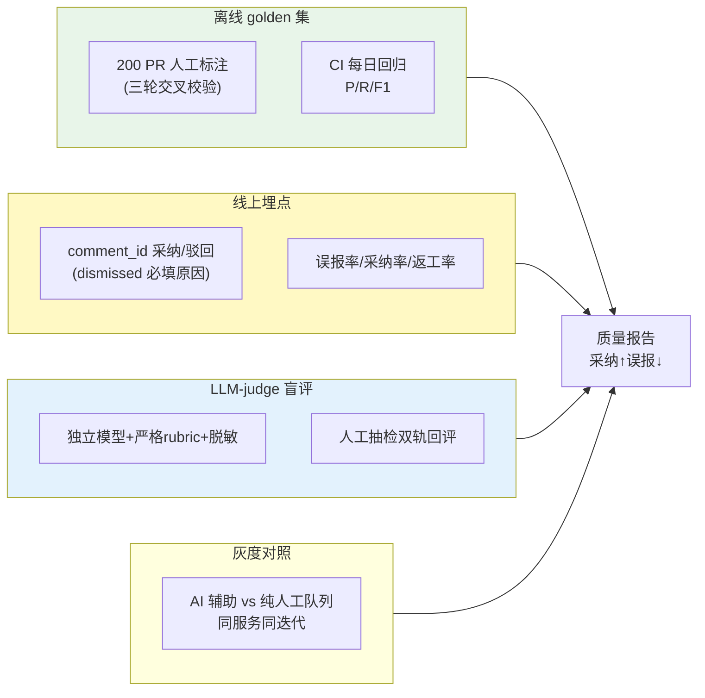

# 项目 12：研发效能 DevOps 平台 — 07-评估闭环

> **定位**：让"评审质量"从感觉变成数字——离线 golden 集 + 线上埋点 + LLM-judge 盲评 + 灰度对照四件套。教程 05-Observation可观测/04-自定义Convention与Filter：工业标签与脱敏 §评估 + 附录 04 Eval 的落地。本文给出**完整可手写代码**（一行不省略，含全部 import）。
>
> **读者画像**：已完成 [06-工作流编排](06-工作流编排.md)。
>
> 「遇到阻塞？→ [教程 08-架构师进阶/03-自我反思与Agent评估 全篇]、[附录 04-测试策略/02-Eval评估]、[教程 08-架构师进阶/07-数据飞轮与持续改进]；API 真实性以 [附录 05-SpringAI2-API基准] 为准」

---

## 1. 四问

| 问 | 答 |
|----|----|
| **新增了什么需求** | 离线 golden 集（200 PR 人工标注）；线上埋点（comment_id 采纳/驳回）；LLM-judge 盲评；灰度对照（cycle time/返工率） |
| **影响了哪些模块** | 新增 eval 包（GoldenSet/EvaluationResult/OnlineMetrics/BlindJudge/GrayComparisonService/OutcomeStore）；线上埋点接入 v2 审查评论 |
| **架构如何演进** | 评估四件套：离线回归 + 线上埋点 + 盲评 + 灰度，收敛为质量报告（采纳↑误报↓） |
| **上一版痛点是什么** | 评审质量说不清；误报率无线上口径；Judge 有偏 |

### 1.1 本节核对（四问口径）

| # | 核对项 | 判据 |
|---|--------|------|
| 1 | 四问齐全 | 新增需求/影响模块/架构演进/上一版痛点四行均有，无空答 |
| 2 | 痛点承接 | "评审质量说不清/Judge 有偏"与 v7 定位段一致；四件套（离线/线上/盲评/灰度）映射到 §3 四个实现落点 |
| 3 | 模块落点 | eval 包（GoldenSet/OnlineMetrics/BlindJudge/GrayComparisonService）在 §3 均有完整类 |

## 2. 评估闭环四件套

> **核心指标**（[调研 研发效能 2026 §评估]）：**误报率是生死线（阿里 <5% 上线门槛）**；采纳率、返工率、cycle time、变更失败率。LLM-judge 有**过度纠正偏置**（48.2% 假阴性来自泛化断言）与**确认偏置**（对抗性元数据可改变检出率 59.6pp）——必须脱敏盲评。



### 2.1 本节核对（四件套口径与盲评纪律）

| # | 核对项 | 判据 |
|---|--------|------|
| 1 | 四件套齐全 | 离线 golden / 线上埋点 / LLM-judge 盲评 / 灰度对照四个子图均有，收敛到质量报告 |
| 2 | 盲评纪律可读 | 「脱敏盲评防确认偏置（59.6pp）」「误报率生死线 <5%」在正文出现，且 §3.6 BlindJudge 脱敏 prompt 是落地 |
| 3 | 每件套有代码落点 | 离线→§3.3 GoldenSet；线上→§3.5 OnlineMetrics；盲评→§3.6 BlindJudge；灰度→§3.7 GrayComparison |

## 3. 完整代码（照抄即可）

### 3.1 `pom.xml` 追加（Micrometer MeterRegistry）

```xml
        <!-- 追加（v7）：线上埋点指标（Counter/MeterRegistry） -->
        <dependency>
            <groupId>org.springframework.boot</groupId>
            <artifactId>spring-boot-starter-actuator</artifactId>
        </dependency>
```

### 3.2 SQL DDL（评论结果表）

```sql
CREATE TABLE IF NOT EXISTS review_outcome (
    comment_id  TEXT        PRIMARY KEY,
    outcome     TEXT        NOT NULL,      -- ACCEPTED / EDITED / DISMISSED
    reason      TEXT,                      -- dismissed 必填原因
    created_at  TIMESTAMPTZ NOT NULL DEFAULT now()
);
```

### 3.3 `GoldenCase.java` + `GoldenSet.java`（离线 golden 集 + 每日回归）

```java
package com.rd.devops.eval;

import java.util.List;

/** golden 用例：PR 定位 + 期望评论（资深工程师三轮交叉标注，AACR-Bench 式）。 */
public record GoldenCase(
        String id,
        String repo,
        int prNumber,
        List<ExpectedComment> expected) {

    public record ExpectedComment(String file, int line, String category, String severity) {}
}
```

```java
package com.rd.devops.eval;

import com.fasterxml.jackson.core.type.TypeReference;
import com.fasterxml.jackson.databind.ObjectMapper;
import com.rd.devops.review.Diff;
import com.rd.devops.review.GitApi;
import com.rd.devops.review.PrContext;
import com.rd.devops.review.ReviewAgent;
import com.rd.devops.review.ReviewComment;
import org.springframework.core.io.ClassPathResource;
import org.springframework.stereotype.Component;

import java.io.IOException;
import java.io.InputStream;
import java.util.List;

/** 离线 golden 集：200 PR + 1505 条细粒度评论，每日 CI 回归 P/R/F1，退化即告警。 */
@Component
public class GoldenSet {

    private final List<GoldenCase> cases;

    public GoldenSet(ObjectMapper objectMapper) {
        this.cases = load(objectMapper);
    }

    public List<GoldenCase> cases() {
        return cases;
    }

    /** 每日回归：跑 review → 语义匹配判 tp/fp/fn → P/R/F1。批处理上下文，可同步 block。 */
    public EvaluationResult runDaily(ReviewAgent reviewAgent, GitApi gitApi) {
        int tp = 0, fp = 0, fn = 0;
        for (GoldenCase c : cases) {
            Diff diff = gitApi.getDiff(c.repo(), c.prNumber());
            PrContext ctx = new PrContext(c.repo(), c.prNumber(), diff, List.of());
            List<ReviewComment> predicted = reviewAgent.semanticReview(ctx).block();
            MatchCount mc = match(predicted, c.expected());
            tp += mc.tp(); fp += mc.fp(); fn += mc.fn();
        }
        return EvaluationResult.of(tp, fp, fn);
    }

    /** 语义匹配（file:line + category 对齐，非文本相似）。 */
    private MatchCount match(List<ReviewComment> predicted, List<GoldenCase.ExpectedComment> expected) {
        long tp = predicted.stream()
                .filter(p -> expected.stream().anyMatch(e -> same(e, p)))
                .count();
        long fn = expected.stream()
                .filter(e -> predicted.stream().noneMatch(p -> same(e, p)))
                .count();
        long fp = predicted.size() - tp;
        return new MatchCount(tp, fp, fn);
    }

    private boolean same(GoldenCase.ExpectedComment e, ReviewComment p) {
        return e.file().equals(p.file()) && e.line() == p.line() && e.category().equals(p.category());
    }

    private List<GoldenCase> load(ObjectMapper objectMapper) {
        try (InputStream in = new ClassPathResource("golden-set.json").getInputStream()) {
            return objectMapper.readValue(in, new TypeReference<List<GoldenCase>>() {});
        } catch (IOException e) {
            throw new IllegalStateException("golden-set.json 加载失败", e);
        }
    }

    public record MatchCount(long tp, long fp, long fn) {}
}
```

### 3.4 `EvaluationResult.java` + `ReviewOutcome.java`

```java
package com.rd.devops.eval;

/** 评估结果：precision / recall / F1。 */
public record EvaluationResult(double precision, double recall, double f1) {

    public static EvaluationResult of(long tp, long fp, long fn) {
        double precision = (tp + fp) == 0 ? 0.0 : tp * 1.0 / (tp + fp);
        double recall = (tp + fn) == 0 ? 0.0 : tp * 1.0 / (tp + fn);
        double f1 = (precision + recall) == 0 ? 0.0 : 2 * precision * recall / (precision + recall);
        return new EvaluationResult(precision, recall, f1);
    }
}
```

```java
package com.rd.devops.eval;

/** 评论结果三态：采纳 / 编辑 / 驳回（dismissed 必填原因）。 */
public enum ReviewOutcome {
    ACCEPTED, EDITED, DISMISSED
}
```

### 3.5 `OutcomeStore.java` + `OnlineMetrics.java`（线上埋点）

```java
package com.rd.devops.eval;

import org.springframework.jdbc.core.simple.JdbcClient;
import org.springframework.stereotype.Component;

/** 评论结果持久化（comment_id 全链路，驳回原因必填）。 */
@Component
public class OutcomeStore {

    private final JdbcClient jdbcClient;

    public OutcomeStore(JdbcClient jdbcClient) {
        this.jdbcClient = jdbcClient;
    }

    public void record(String commentId, ReviewOutcome outcome, String reason) {
        jdbcClient.sql("""
                INSERT INTO review_outcome(comment_id, outcome, reason)
                VALUES (:cid, :outcome, :reason)
                ON CONFLICT (comment_id)
                DO UPDATE SET outcome = :outcome, reason = :reason
                """)
                .param("cid", commentId)
                .param("outcome", outcome.name())
                .param("reason", reason)
                .update();
    }
}
```

```java
package com.rd.devops.eval;

import io.micrometer.core.instrument.Counter;
import io.micrometer.core.instrument.MeterRegistry;
import org.springframework.stereotype.Component;

/** 线上误报率指标：dismissed / total（生死线 < 5%，[调研 §评估]）。 */
@Component
public class OnlineMetrics {

    private final Counter dismissed;
    private final Counter total;

    public OnlineMetrics(MeterRegistry meterRegistry) {
        this.dismissed = meterRegistry.counter("review.comment.dismissed");
        this.total = meterRegistry.counter("review.comment.total");
    }

    /** 每条评论带 comment_id 记录 accepted/dismissed/edited（dismissed 必填原因）。 */
    public void recordOutcome(String commentId, ReviewOutcome outcome, String reason) {
        total.increment();
        if (outcome == ReviewOutcome.DISMISSED && (reason == null || reason.isBlank())) {
            throw new IllegalArgumentException("dismissed 必填原因");
        }
        if (outcome == ReviewOutcome.DISMISSED) {
            dismissed.increment();
        }
    }

    /** 误报率 = dismissed / total（comment_id 全链路透传，响应式上下文传递见 [教程 08-架构师进阶/08-响应式错误处理]）。 */
    public double falsePositiveRate() {
        return total.count() == 0 ? 0.0 : dismissed.count() / total.count();
    }
}
```

### 3.6 `JudgeVerdict.java` + `BlindJudge.java`（LLM-judge 盲评防偏置）

```java
package com.rd.devops.eval;

/** Judge 裁决：评论是否有效。 */
public record JudgeVerdict(boolean valid, String reason, double confidence) {}
```

```java
package com.rd.devops.eval;

import com.rd.devops.review.ReviewComment;
import org.springframework.ai.chat.client.ChatClient;
import org.springframework.stereotype.Service;
import reactor.core.publisher.Mono;
import reactor.core.scheduler.Schedulers;

@Service
public class BlindJudge {

    private final ChatClient judgeClient;

    public BlindJudge(ChatClient judgeClient) {
        this.judgeClient = judgeClient;
    }

    /** Judge 防偏置：独立模型 + 严格 rubric + 脱敏盲评（不告诉 judge"这是 AI 还是人工评论"）。 */
    public Mono<JudgeVerdict> blindJudge(ReviewComment comment) {
        return Mono.fromCallable(() -> judgeClient.prompt()
                .system("""
                        你是代码审查质量评审。判断该评论是否有效（能指出真实问题）。
                        规则：
                        1. 引用具体需求条款/代码行才算有效（防过度纠正偏置）
                        2. 不预设评论来源（盲评）
                        """)
                .user("评论: " + toBlindPrompt(comment))
                .call()
                .entity(JudgeVerdict.class))
            .subscribeOn(Schedulers.boundedElastic());
    }

    /** 脱敏：只给 file:line + 评论正文，不含来源标注（防确认偏置）。 */
    private String toBlindPrompt(ReviewComment c) {
        return c.file() + ":" + c.line() + " " + c.message();
    }
}
```

### 3.7 `GrayComparisonService.java`（灰度对照）

```java
package com.rd.devops.eval;

import org.springframework.stereotype.Service;

/** 灰度对照：AI 辅助 vs 纯人工队列，同服务同迭代（LinearB 模式）。只上线统计显著改进。 */
@Service
public class GrayComparisonService {

    public GrayComparison compare(String service,
                                  double aiCycleTimeHours, double manualCycleTimeHours,
                                  double aiChangeFailureRate, double manualChangeFailureRate) {
        double cycleTimeDelta = manualCycleTimeHours - aiCycleTimeHours;
        boolean cycleImproved = cycleTimeDelta >= 0.5;                    // ≥ 0.5 小时显著减
        boolean failureNotWorse = aiChangeFailureRate <= manualChangeFailureRate + 0.01;
        return new GrayComparison(service, cycleTimeDelta, cycleImproved && failureNotWorse);
    }

    public record GrayComparison(String service, double cycleTimeDeltaHours, boolean ship) {}
}
```

### 3.8 `EvaluationController.java`

```java
package com.rd.devops.web;

import com.rd.devops.eval.BlindJudge;
import com.rd.devops.eval.EvaluationResult;
import com.rd.devops.eval.GoldenSet;
import com.rd.devops.eval.GrayComparisonService;
import com.rd.devops.eval.JudgeVerdict;
import com.rd.devops.eval.OnlineMetrics;
import com.rd.devops.eval.OutcomeStore;
import com.rd.devops.eval.ReviewOutcome;
import com.rd.devops.review.GitApi;
import com.rd.devops.review.ReviewAgent;
import com.rd.devops.review.ReviewComment;
import org.springframework.web.bind.annotation.PostMapping;
import org.springframework.web.bind.annotation.RequestBody;
import org.springframework.web.bind.annotation.RequestMapping;
import org.springframework.web.bind.annotation.RestController;
import reactor.core.publisher.Mono;
import reactor.core.scheduler.Schedulers;

@RestController
@RequestMapping("/api/v1/eval")
public class EvaluationController {

    private final GoldenSet goldenSet;
    private final ReviewAgent reviewAgent;
    private final GitApi gitApi;
    private final OnlineMetrics metrics;
    private final OutcomeStore outcomeStore;
    private final BlindJudge blindJudge;
    private final GrayComparisonService grayService;

    public EvaluationController(GoldenSet goldenSet, ReviewAgent reviewAgent, GitApi gitApi,
                                OnlineMetrics metrics, OutcomeStore outcomeStore,
                                BlindJudge blindJudge, GrayComparisonService grayService) {
        this.goldenSet = goldenSet;
        this.reviewAgent = reviewAgent;
        this.gitApi = gitApi;
        this.metrics = metrics;
        this.outcomeStore = outcomeStore;
        this.blindJudge = blindJudge;
        this.grayService = grayService;
    }

    /** 离线 golden 每日回归（CI 调度；阻塞批处理放 boundedElastic，EventLoop 不 block）。 */
    @PostMapping("/golden")
    public Mono<EvaluationResult> goldenDaily() {
        return Mono.fromCallable(() -> goldenSet.runDaily(reviewAgent, gitApi))
                .subscribeOn(Schedulers.boundedElastic());
    }

    /** 线上埋点：comment_id 采纳/驳回（驳回必填原因）。 */
    @PostMapping("/outcome")
    public void recordOutcome(@RequestBody OutcomeRequest req) {
        metrics.recordOutcome(req.commentId(), req.outcome(), req.reason());
        outcomeStore.record(req.commentId(), req.outcome(), req.reason());
    }

    /** LLM-judge 盲评。 */
    @PostMapping("/judge")
    public Mono<JudgeVerdict> judge(@RequestBody ReviewComment comment) {
        return blindJudge.blindJudge(comment);
    }

    /** 灰度对照：AI 辅助 vs 纯人工队列。 */
    @PostMapping("/gray")
    public GrayComparisonService.GrayComparison gray(@RequestBody GrayRequest req) {
        return grayService.compare(req.service(),
                req.aiCycleTimeHours(), req.manualCycleTimeHours(),
                req.aiChangeFailureRate(), req.manualChangeFailureRate());
    }

    public record OutcomeRequest(String commentId, ReviewOutcome outcome, String reason) {}

    public record GrayRequest(String service,
                              double aiCycleTimeHours, double manualCycleTimeHours,
                              double aiChangeFailureRate, double manualChangeFailureRate) {}
}
```

### 3.9 本节测试与验证（评估四件套：golden 回归 / 线上埋点 / 盲评 / 灰度）

**前置条件**：PG（devops 库）可连且已执行 §3.2 DDL（`review_outcome` 表）；`golden-set.json` 在 classpath；`spring-boot-starter-actuator` 依赖已加并启动成功；v2 的审查链路（`ReviewAgent`/`GitApi`）可复用。

**材料 A——落库核对 SQL（正文 §3.2 同款）**：

```sql
SELECT COUNT(*) FROM review_outcome;
\d review_outcome
```

**材料 B——评估四端点 HTTP（正文 §3.8 各 @PostMapping 同款）**：

```sh
# ① 离线 golden 每日回归
curl -s -X POST http://localhost:8080/api/v1/eval/golden
# ② 线上埋点：驳回一条评论（dismissed 必填原因）
curl -s -X POST http://localhost:8080/api/v1/eval/outcome \
  -H "Content-Type: application/json" \
  -d '{"commentId":"<v2返回的comment_id>","outcome":"DISMISSED","reason":"既有约定回调，非误用"}'
# ③ LLM-judge 盲评
curl -s -X POST http://localhost:8080/api/v1/eval/judge \
  -H "Content-Type: application/json" \
  -d '{"id":"c1","file":"OrderService.java","line":12,"severity":"critical","category":"安全","message":"未验证输入","confidence":0.9}'
# ④ 灰度对照
curl -s -X POST http://localhost:8080/api/v1/eval/gray \
  -H "Content-Type: application/json" \
  -d '{"service":"review","aiCycleTimeHours":2.5,"manualCycleTimeHours":3.2,"aiChangeFailureRate":0.03,"manualChangeFailureRate":0.04}'
```

**步骤与断言**：

| # | 操作 | 预期（PASS 判据） |
|---|------|------------------|
| 1 | 材料 A `\d review_outcome` | 表存在，三态 `review_outcome` 结构（ACCEPTED/EDITED/DISMISSED）正确 |
| 2 | 材料 B① golden POST | 返回 `EvaluationResult` JSON（precision/recall/f1）；涉及 LLM 阻塞调用放 boundedElastic，无 EventLoop 拥堵告警 |
| 3 | 材料 B② outcome POST | `-d` 带 DISMISSED + reason 时返回 200；此时 Micrometer `dismissed/total` 计数 +1、`review_outcome` 插入一行 |
| 4 | outcome 缺 reason | DISMISSED 无 reason → `OnlineMetrics.recordOutcome` 抛 `IllegalArgumentException`（400 或报警），判据：dismissed 必填原因约束生效 |
| 5 | 材料 B③ judge POST | 返回 `JudgeVerdict`（valid/reason/confidence）；prompt 不含来源标注（盲评，`toBlindPrompt` 只给 file:line+message） |
| 6 | 材料 B④ gray POST | 返回 `GrayComparison`；cycleTimeDelta=0.7≥0.5 且 failureNotWorse → ship=true |
| 7 | 指标口径 | 材料 B② 后再 POST 一次 ACCEPTED，`falsePositiveRate()` = dismissed/total 按预期变化 |

**失败排查**：①golden 返回 5xx→`golden-set.json` 缺/路径错（`ClassPathResource` 读空）或某 PR 分支不存在（`GitApi.getDiff`）；②`review_outcome` 未建→§3.2 DDL 未执行；③judge 返回空/反序列化失败→`JudgeVerdict` 字段名与 LLM 输出 JSON 不一致，核对 `toBlindPrompt` 内声明的字段；④gray 恒 false→cycleTimeDelta<0.5（样本差异小），属预期，非程序错；⑤启动报 `MeterRegistry` 找不到→actuator 依赖未加。

## 4. 验收标准（量化）

| # | 验收项 | 标准 |
|---|--------|------|
| 1 | 误报率 | 线上误报率 < 5%（上线门槛，阿里标准） |
| 2 | golden 回归 | 离线集 P/R/F1 每日 CI 回归，退化即告警 |
| 3 | 盲评无偏 | Judge 对 AI/人工评论无系统性偏向（交叉验证） |
| 4 | 采纳率 | 评论采纳率可度量（基线 16-33%，GitHub accepted-and-retained） |
| 5 | 灰度显著 | 只上线统计显著的改进（cycle time 减 + 变更失败率不增） |

### 4.1 本节核对（验收口径）

| # | 核对项 | 判据 |
|---|--------|------|
| 1 | 验收项可度量 | 五项均含数值或可判定标准（<5%、P/R/F1 每日回归、无偏、采纳率基线、cycle time 减+失败率不增），非空话 |
| 2 | 每项有代码落点 | 误报率→§3.5 OnlineMetrics；golden 回归→§3.3 GoldenSet.runDaily；盲评无偏→§3.6 BlindJudge；采纳率→§3.5 dismissed/total；灰度→§3.7 GrayComparisonService |

| # | 决策 | 理由 |
|---|------|------|
| ADR-721 | 四件套（离线/线上/盲评/灰度） | 单靠一种评估都不够（[调研 §评估四件套]） |
| ADR-722 | Judge 脱敏盲评 | 确认偏置可改变检出率 59.6pp |
| ADR-723 | 误报率 <5% 是上线门槛 | 误报淹没开发者的后果比漏报更重 |

### 5.1 本节核对（ADR 721-723 一致性）

| # | 核对项 | 判据 |
|---|--------|------|
| 1 | 每条 ADR 有代码落点 | 721→§3.3-§3.7 四件套类；722→§3.6 BlindJudge 脱敏；723→§3.5 OnlineMetrics 误报率口径 |
| 2 | 与 13-ADR 总账衔接 | ADR-721/722/723 在 [13-ADR架构决策记录] §3.8（721/723）存在，编号与大表一致 |

## 6. v7 的痛点（驱动下一迭代）

评估闭环证明平台有用，但**私有代码安全暴露**：代码库 100% 在评估/审查中过 LLM，但"哪些涉密、谁在访问、是否出域"没有治理。**需要私有代码安全**（不出域 + 权限前置 + 审计）。→ [08-私有代码安全.md](08-私有代码安全.md)

> 本节核对（一句话）：V7 痛点（代码过 LLM 无治理、越权靠自觉、无审计）与下一迭代 [08]"出域+权限前置+审计"三层方案一一对应，痛点不被搁置即 PASS。

---

## 7. 总结

v7 用四件套让评审质量成为数字：`GoldenSet` 从 `golden-set.json` 加载 200 条人工标注用例、每日回归算 P/R/F1；`OnlineMetrics` 用 Micrometer `Counter` 算误报率（dismissed/total，生死线 <5%）；`BlindJudge` 用独立模型 + 脱敏 prompt 做盲评（防确认偏置）；`GrayComparisonService` 只上线统计显著的改进。**所有评估指标真实可度量，Judge 盲评 + 人工抽检双轨**。

> 本节核对（一句话）：总结中四组件（GoldenSet、OnlineMetrics、BlindJudge、GrayComparisonService）分别对应正文 §3.3、§3.5、§3.6、§3.7，与正文口径一致即 PASS。
