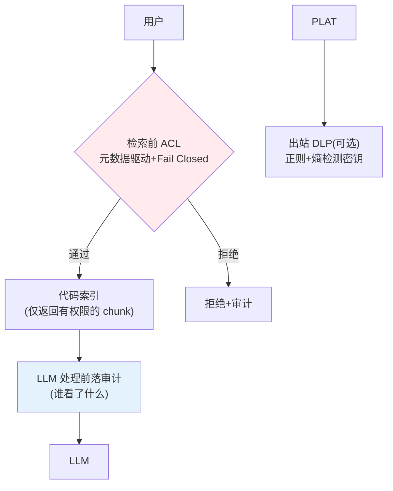
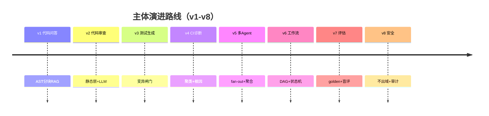

# 项目 12：研发效能 DevOps 平台 — 08-迭代七：私有代码安全（收官）

> **定位**：收官迭代——企业私有代码接入 LLM 的三层安全框架：部署位置（数据不出域）+ 检索前权限过滤（Fail Closed）+ 全链路审计（LLM 处理前落库）。教程 31 §数据不出域 + 附录 09 的落地。本文给出**完整可手写代码**（一行不省略，含全部 import）。
>
> **读者画像**：已完成 [07-迭代六-评估闭环](07-迭代六-评估闭环.md)。
>
> 「遇到阻塞？→ [教程 31-安全与权限控制 §数据不出域]、[附录 09-Agent安全深度/02-数据泄露防护]；API 真实性以 [附录 05-SpringAI2-API基准] 为准」

---

## 1. 四问

| 问 | 答 |
|----|----|
| **新增了什么需求** | 私有部署形态（强监管 = 私有 VPC/离线）；检索前 ACL 过滤（元数据驱动 + Fail Closed）；全链路审计；出站 DLP（可选新特性） |
| **影响了哪些模块** | 新增 security 包（AclFilter/AclStore/AuditService/OutboundDlp/JwtPrincipalResolver/SecureCodeSearchService）；复用 v1 代码索引的元数据过滤 |
| **架构如何演进** | 单层安全 → 三层安全框架：部署位置 + 数据使用（检索前过滤）+ 数据留痕（LLM 前审计） |
| **上一版痛点是什么** | 代码库过 LLM 无治理；越权访问靠自觉；谁访问了无审计 |

## 2. 三层安全框架

> **核心**（[调研 研发效能 2026 §私有代码安全]）：数据不出域从"合同承诺"演进为"三层工程保障"——① 部署位置（私有 VPC/离线）② 数据使用（**检索前权限过滤，事后过滤在 HIPAA 等合规下是结构性失败**）③ 数据留痕（LLM 处理前落审计）。



**权限过滤必须在 ANN pre-filter 层（元数据过滤），严禁 post-filter**（[调研 §权限过滤]）——先过滤再检索，不能让敏感代码进上下文再删。

## 3. 完整代码（照抄即可）

### 3.1 `pom.xml` 追加（可选：Redis Streams 送 SIEM 需 reactive Redis）

```xml
        <!-- 追加（v8）：审计双写 Redis Streams（可选，送 SIEM）。不用可删 -->
        <dependency>
            <groupId>org.springframework.boot</groupId>
            <artifactId>spring-boot-starter-data-redis-reactive</artifactId>
        </dependency>
```

### 3.2 SQL DDL（ACL 策略表 + 审计表）

```sql
CREATE TABLE IF NOT EXISTS acl_policy (
    id         BIGSERIAL PRIMARY KEY,
    user_id    TEXT,
    group_name TEXT,
    repo       TEXT NOT NULL,
    effect     TEXT NOT NULL,          -- ALLOW / DENY
    created_at TIMESTAMPTZ NOT NULL DEFAULT now()
);

CREATE TABLE IF NOT EXISTS audit_log (
    id           BIGSERIAL PRIMARY KEY,
    user_id      TEXT        NOT NULL,
    department   TEXT,
    action       TEXT        NOT NULL,   -- SEARCH / DENY / DLP_BLOCKED / ...
    chunk_ids    TEXT,
    content_hash TEXT,
    occurred_at  TIMESTAMPTZ NOT NULL DEFAULT now()
);

CREATE INDEX IF NOT EXISTS idx_audit_user_time ON audit_log (user_id, occurred_at DESC);
```

### 3.3 `SecurityPrincipal.java` + `JwtPrincipalResolver.java`（身份来源）

```java
package com.rd.devops.security;

import java.util.List;

/** 从 JWT/会话令牌构建的身份——绝不从用户输入构建（[调研 §权限控制原则]）。 */
public record SecurityPrincipal(String id, String department, List<String> roles) {}
```

```java
package com.rd.devops.security;

import org.springframework.stereotype.Component;

import java.nio.charset.StandardCharsets;
import java.util.Base64;
import java.util.List;

/** 从 Bearer JWT 构建身份。生产接 Spring Security Authentication 更完整；此处演示 claim 解析。 */
@Component
public class JwtPrincipalResolver {

    public SecurityPrincipal resolve(String authorizationHeader) {
        if (authorizationHeader == null || !authorizationHeader.startsWith("Bearer ")) {
            throw new IllegalArgumentException("缺少 Bearer token");
        }
        String token = authorizationHeader.substring("Bearer ".length());
        String payload = token.split("\\.")[1];
        String json = new String(Base64.getUrlDecoder().decode(payload), StandardCharsets.UTF_8);
        String sub = extract(json, "sub");
        String dept = extract(json, "department");
        return new SecurityPrincipal(sub, dept, List.of());
    }

    /** 极简 JSON claim 提取（生产用签名校验 + 权威 JWT 库）。 */
    private String extract(String json, String claim) {
        int start = json.indexOf("\"" + claim + "\"");
        if (start < 0) {
            return "";
        }
        start = json.indexOf(':', start) + 1;
        int end = json.indexOf(',', start);
        if (end < 0) {
            end = json.indexOf('}', start);
        }
        return json.substring(start, end).trim().replace("\"", "");
    }
}
```

### 3.4 `AclStore.java` + `AclFilter.java`（检索前 Fail Closed 过滤）

```java
package com.rd.devops.security;

import org.springframework.jdbc.core.simple.JdbcClient;
import org.springframework.stereotype.Component;

/** ACL 策略库：谁可读哪些 repo（元数据驱动，Fail Closed 依据）。 */
@Component
public class AclStore {

    private final JdbcClient jdbcClient;

    public AclStore(JdbcClient jdbcClient) {
        this.jdbcClient = jdbcClient;
    }

    /** 用户（或所在组）对 repo 是否有 ALLOW。无策略记录 → 拒绝（Fail Closed）。 */
    public boolean canRead(SecurityPrincipal user, String repo) {
        Integer n = jdbcClient.sql("""
                SELECT COUNT(*) FROM acl_policy
                WHERE (user_id = :uid OR group_name = :dept)
                  AND repo = :repo
                  AND effect = 'ALLOW'
                """)
                .param("uid", user.id())
                .param("dept", user.department())
                .param("repo", repo)
                .query(Integer.class)
                .optional()
                .orElse(0);
        return n != null && n > 0;
    }
}
```

```java
package com.rd.devops.security;

import org.springframework.ai.document.Document;
import org.springframework.stereotype.Component;

import java.util.List;

/** 检索前 ACL 过滤（Fail Closed）：无权限即拒绝并审计，而非静默跳过。 */
@Component
public class AclFilter {

    private final AclStore aclStore;
    private final AuditService auditService;

    public AclFilter(AclStore aclStore, AuditService auditService) {
        this.aclStore = aclStore;
        this.auditService = auditService;
    }

    public List<Document> filterAccess(List<Document> candidates, SecurityPrincipal user) {
        return candidates.stream()
                .filter(doc -> {
                    String repo = (String) doc.getMetadata().get("repo");
                    boolean allowed = repo != null && aclStore.canRead(user, repo);
                    if (!allowed) {
                        auditService.recordDenied(user, repo,
                                String.valueOf(doc.getMetadata().get("qualified_name")));
                    }
                    return allowed;
                })
                .toList();
    }
}
```

### 3.5 `AuditRecord.java` + `AuditService.java`（LLM 处理前落审计）

```java
package com.rd.devops.security;

import java.time.Instant;
import java.util.HashMap;
import java.util.Map;

/** 审计记录：谁、做了什么、看了哪些 chunk、内容哈希、时间。 */
public record AuditRecord(
        String userId,
        String action,
        String chunkIds,
        String contentHash,
        Instant occurredAt) {

    public Map<String, String> toMap() {
        Map<String, String> m = new HashMap<>();
        m.put("user_id", userId);
        m.put("action", action);
        m.put("chunk_ids", chunkIds);
        m.put("content_hash", contentHash);
        m.put("occurred_at", occurredAt.toString());
        return m;
    }
}
```

```java
package com.rd.devops.security;

import org.springframework.ai.document.Document;
import org.springframework.beans.factory.ObjectProvider;
import org.springframework.jdbc.core.simple.JdbcClient;
import org.springframework.stereotype.Service;

import java.nio.charset.StandardCharsets;
import java.security.MessageDigest;
import java.security.NoSuchAlgorithmException;
import java.time.Instant;
import java.util.List;
import java.util.stream.Collectors;

/** 审计在 LLM 看到文档之前落库——双写 PostgreSQL（+ 可选 Redis Streams 送 SIEM）。 */
@Service
public class AuditService {

    private final JdbcClient jdbcClient;
    private final ReactiveAuditSink sink;      // 可选：Redis Streams（未引入 redis 时为空）

    public AuditService(JdbcClient jdbcClient, ObjectProvider<ReactiveAuditSink> sinkProvider) {
        this.jdbcClient = jdbcClient;
        this.sink = sinkProvider.getIfAvailable();   // 无 redis 依赖时优雅降级
    }

    /** 允许访问：LLM 处理前落审计（谁看了什么 chunk，含内容哈希防篡改）。 */
    public void auditBeforeLlm(SecurityPrincipal user, List<Document> chunks, String action) {
        String ids = chunks.stream().map(Document::getId).collect(Collectors.joining(","));
        String hash = sha256(chunks.stream().map(Document::getText).collect(Collectors.joining("\n")));
        AuditRecord record = new AuditRecord(user.id(), action, ids, hash, Instant.now());
        jdbcClient.sql("""
                INSERT INTO audit_log(user_id, department, action, chunk_ids, content_hash, occurred_at)
                VALUES (:uid, :dept, :action, :ids, :hash, :at)
                """)
                .param("uid", record.userId())
                .param("dept", user.department())
                .param("action", record.action())
                .param("ids", record.chunkIds())
                .param("hash", record.contentHash())
                .param("at", record.occurredAt())
                .update();
        if (sink != null) {                    // 可选：Redis Streams 送 SIEM
            sink.push(record);
        }
    }

    /** Fail Closed 拒绝：无权限访问也审计（谁想读什么）。 */
    public void recordDenied(SecurityPrincipal user, String repo, String resource) {
        AuditRecord record = new AuditRecord(user.id(), "DENY:" + repo, resource, "", Instant.now());
        jdbcClient.sql("""
                INSERT INTO audit_log(user_id, department, action, chunk_ids, content_hash, occurred_at)
                VALUES (:uid, :dept, :action, :ids, :hash, :at)
                """)
                .param("uid", record.userId())
                .param("dept", user.department())
                .param("action", record.action())
                .param("ids", record.chunkIds())
                .param("hash", record.contentHash())
                .param("at", record.occurredAt())
                .update();
    }

    /** DLP 阻断审计。 */
    public void recordBlocked(String detector, String detail) {
        AuditRecord record = new AuditRecord("dlp", "DLP_BLOCKED:" + detector, detail, "", Instant.now());
        jdbcClient.sql("""
                INSERT INTO audit_log(user_id, department, action, chunk_ids, content_hash, occurred_at)
                VALUES (:uid, :dept, :action, :ids, :hash, :at)
                """)
                .param("uid", record.userId())
                .param("dept", "dlp")
                .param("action", record.action())
                .param("ids", record.chunkIds())
                .param("hash", record.contentHash())
                .param("at", record.occurredAt())
                .update();
    }

    private String sha256(String text) {
        try {
            MessageDigest md = MessageDigest.getInstance("SHA-256");
            byte[] digest = md.digest(text.getBytes(StandardCharsets.UTF_8));
            StringBuilder sb = new StringBuilder();
            for (byte b : digest) {
                sb.append(String.format("%02x", b));
            }
            return sb.toString();
        } catch (NoSuchAlgorithmException e) {
            throw new IllegalStateException("SHA-256 不可用", e);
        }
    }
}
```

### 3.6 `ReactiveAuditSink.java`（可选：Redis Streams 送 SIEM）

```java
package com.rd.devops.security;

import org.springframework.boot.autoconfigure.condition.ConditionalOnClass;
import org.springframework.data.redis.core.ReactiveRedisTemplate;
import org.springframework.stereotype.Component;

/** 审计双写 Redis Streams 送 SIEM（ReactiveRedisTemplate，WebFlux 铁律——禁止 block）。仅当引入 redis-reactive 时装配。 */
@Component
@ConditionalOnClass(ReactiveRedisTemplate.class)
public class ReactiveAuditSink {

    private final ReactiveRedisTemplate<String, String> redisTemplate;

    public ReactiveAuditSink(ReactiveRedisTemplate<String, String> redisTemplate) {
        this.redisTemplate = redisTemplate;
    }

    public void push(AuditRecord record) {
        redisTemplate.opsForStream()
                .add("siem-audit", record.toMap())
                .subscribe();
    }
}
```

### 3.7 `SecureCodeSearchService.java`（检索前 pre-filter + 审计编排）

```java
package com.rd.devops.security;

import org.springframework.ai.document.Document;
import org.springframework.ai.vectorstore.SearchRequest;
import org.springframework.ai.vectorstore.VectorStore;
import org.springframework.stereotype.Service;

import java.util.List;

/** 安全检索：ANN pre-filter（元数据过滤）→ AclFilter（Fail Closed）→ LLM 前审计。 */
@Service
public class SecureCodeSearchService {

    private final VectorStore vectorStore;
    private final AclFilter aclFilter;
    private final AuditService auditService;

    public SecureCodeSearchService(VectorStore vectorStore, AclFilter aclFilter, AuditService auditService) {
        this.vectorStore = vectorStore;
        this.aclFilter = aclFilter;
        this.auditService = auditService;
    }

    public List<Document> search(SecurityPrincipal user, String query) {
        // ① ANN pre-filter：先过滤再检索，敏感代码不进上下文（严禁 post-filter）
        List<Document> candidates = vectorStore.similaritySearch(
                SearchRequest.builder()
                        .query(query)
                        .topK(10)
                        .filterExpression("department == '" + user.department() + "'")
                        .build());
        // ② Fail Closed：无权限 chunk 拒绝 + 审计
        List<Document> allowed = aclFilter.filterAccess(candidates, user);
        // ③ LLM 处理前落审计（谁看了什么 chunk）
        auditService.auditBeforeLlm(user, allowed, "SEARCH");
        return allowed;
    }
}
```

### 3.8 `OutboundDlp.java`（出站 DLP，2026 新特性）

```java
package com.rd.devops.security;

import org.springframework.stereotype.Component;

import java.util.regex.Pattern;

/** 出站 DLP 代理：在 LLM 工具与模型 API 之间扫描/脱敏/阻断密钥与 PII（fail-closed）。 */
@Component
public class OutboundDlp {

    private static final Pattern AWS_KEY = Pattern.compile("AKIA[0-9A-Z]{16}");
    private static final Pattern JWT = Pattern.compile("eyJ[A-Za-z0-9_-]{20,}");

    private final AuditService auditService;

    public OutboundDlp(AuditService auditService) {
        this.auditService = auditService;
    }

    /** 命中即阻断 + 脱敏 + 审计。 */
    public String sanitize(String prompt) {
        if (AWS_KEY.matcher(prompt).find() || JWT.matcher(prompt).find()) {
            auditService.recordBlocked("secret-detector", "疑似密钥出站");
        }
        String redacted = AWS_KEY.matcher(prompt).replaceAll("[REDACTED]");
        return JWT.matcher(redacted).replaceAll("[REDACTED]");
    }
}
```

### 3.9 `SecurityController.java`

```java
package com.rd.devops.web;

import com.rd.devops.security.JwtPrincipalResolver;
import com.rd.devops.security.OutboundDlp;
import com.rd.devops.security.SecureCodeSearchService;
import com.rd.devops.security.SecurityPrincipal;
import org.springframework.ai.document.Document;
import org.springframework.web.bind.annotation.GetMapping;
import org.springframework.web.bind.annotation.PostMapping;
import org.springframework.web.bind.annotation.RequestBody;
import org.springframework.web.bind.annotation.RequestHeader;
import org.springframework.web.bind.annotation.RequestMapping;
import org.springframework.web.bind.annotation.RequestParam;
import org.springframework.web.bind.annotation.RestController;
import reactor.core.publisher.Mono;
import reactor.core.scheduler.Schedulers;

import java.util.List;

@RestController
@RequestMapping("/api/v1/secure")
public class SecurityController {

    private final JwtPrincipalResolver principalResolver;
    private final SecureCodeSearchService secureSearch;
    private final OutboundDlp outboundDlp;

    public SecurityController(JwtPrincipalResolver principalResolver,
                              SecureCodeSearchService secureSearch,
                              OutboundDlp outboundDlp) {
        this.principalResolver = principalResolver;
        this.secureSearch = secureSearch;
        this.outboundDlp = outboundDlp;
    }

    /** 安全检索：身份从 Bearer JWT 构建（绝不从用户输入构建）。检索为阻塞（pgvector/JDBC），放 boundedElastic。 */
    @GetMapping("/search")
    public Mono<List<Document>> search(@RequestHeader("Authorization") String auth,
                                       @RequestParam String query) {
        SecurityPrincipal user = principalResolver.resolve(auth);
        return Mono.fromCallable(() -> secureSearch.search(user, query))
                .subscribeOn(Schedulers.boundedElastic());
    }

    /** 出站 DLP：送 LLM 前扫描/脱敏/阻断密钥。 */
    @PostMapping("/prompt")
    public String prompt(@RequestHeader("Authorization") String auth, @RequestBody String prompt) {
        principalResolver.resolve(auth);   // 校验身份（无 token 即 401）
        return outboundDlp.sanitize(prompt);
    }
}
```

### 3.10 部署形态分级选型

| 监管强度 | 部署形态 | 机制 |
|---------|---------|------|
| 强监管（政务/银行） | 私有 VPC / 离线物理机 | 数据 100% 不出域；本地 Ollama/vLLM |
| 中敏感 | SaaS + 数据驻留 + 内容排除 | 数据驻留区；排除涉密文件 |
| 一般 | SaaS + 合同承诺 | 数据不用于训练（合同 + 零留存协议） |

## 4. 验收标准（项目收官验收）

| # | 验收项 | 标准 |
|---|--------|------|
| 1 | 检索前过滤 | 无权限代码 0 进上下文（Fail Closed，非事后删） |
| 2 | 数据不出域 | 强监管形态下代码 0 出域（网络抓包验证） |
| 3 | 审计前置 | LLM 处理前 100% 落审计（谁看了什么 chunk） |
| 4 | 身份可靠 | 权限从 JWT 构建，用户输入不可伪造 |
| 5 | DLP 拦截 | 疑似密钥 100% 拦截/脱敏 + 审计 |

## 5. 主体迭代（v1-v8）总结



八个主体迭代走完研发效能平台的基座弧线：**能问（RAG）→ 会审（静态+LLM）→ 有测（变异闸门）→ 快诊（CI）→ 分工（多Agent）→ 可配（工作流）→ 可量（评估）→ 可守（安全）**。26 条 ADR（ADR-700~725）中最有复用价值的三个：ADR-702（静态层先行+LLM 收尾）、ADR-709（变异测试闸门非行覆盖率）、ADR-721（评估四件套）。主体迭代到此收官，**进阶迭代（v9-v11，文件 10-12）继续深化仓库理解、辩论共识与 CI 自愈**。

→ [09-核心代码讲解.md](09-核心代码讲解.md)

---

## 6. 本迭代 ADR 与总结

| # | 决策 | 理由 |
|---|------|------|
| ADR-724 | 检索前 Fail Closed 过滤（ANN pre-filter） | 事后过滤是结构性失败——敏感代码已进上下文/LLM |
| ADR-725 | LLM 处理前落审计（双写 PG + Redis Streams） | 数据留痕从"谁访问"到"看了什么 chunk" |

v8 收官把私有代码安全落地为三层工程保障：`JwtPrincipalResolver` 从 Bearer JWT 构建身份（不信任用户输入）、`SecureCodeSearchService` 用 ANN **pre-filter**（`filterExpression("department == ...")`）先过滤再检索、`AclFilter` 做 Fail Closed 二次校验 + 拒绝审计、`AuditService` 在 LLM 处理前把"谁看了什么 chunk + 内容哈希"落库（PostgreSQL + 可选 Redis Streams 送 SIEM）、`OutboundDlp` 用正则扫描/脱敏/阻断出站密钥。**检索前过滤 + 审计前置 + 身份可靠，三者缺一不可**。
