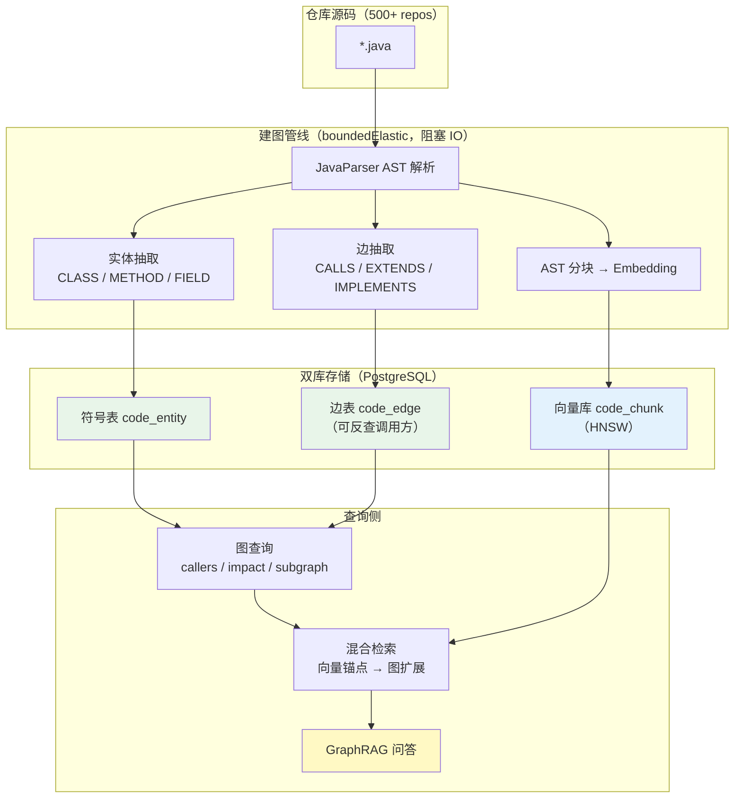
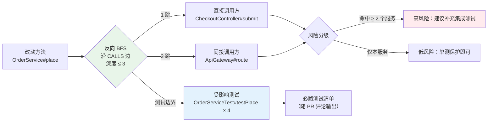
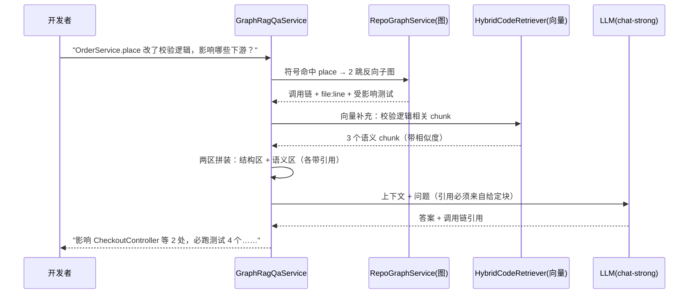

# 项目 12：研发效能 DevOps 平台 — 10-进阶迭代一：代码理解与仓库知识图谱

> **定位**：把 v1 的"检索代码"升级为"理解仓库"——AST 解析产出**实体/依赖图**（类/方法/调用边入库）、**代码语义检索**（Embedding + 图混合）、**跨文件影响分析**（改一处 → 波及面 + 受影响测试）、**GraphRAG 式代码问答**（图先行拿结构、向量补充语义）。教程 35 高级 RAG 与 Agentic RAG 在"代码域"的落地。本文给出**完整可手写代码**（一行不省略，含全部 import）。
>
> **读者画像**：已完成 [09-核心代码讲解](09-核心代码讲解.md)（v1-v8 复盘），准备进入进阶迭代。
>
> 「遇到阻塞？→ [教程 35-高级RAG与AgenticRAG §GraphRAG]、[教程 35-高级RAG与AgenticRAG §混合检索]、[附录 11-知识图谱工程]；API 真实性以 [附录 05-SpringAI2-API基准] 为准」

---

## 1. 四问

| 问 | 答 |
|----|----|
| **新增了什么需求** | ① 仓库级实体/依赖图（谁调用谁、谁实现谁）② 语义检索升级为"向量+图"混合 ③ 跨文件影响分析（改这个方法影响哪些服务/测试）④ GraphRAG 式问答（答案带调用链引用，不是孤立 chunk） |
| **影响了哪些模块** | 新增 graph 包（`RepoGraphIndexer`/`RepoGraphService`/`HybridCodeRetriever`/`GraphRagQaService`）；补齐 v5 遗留的 `CodeIndexService.getCallers` 桩；新增 `code_entity`/`code_edge` 两张表 |
| **架构如何演进** | 单库检索（向量+FTS 两路）→ **双库模型**：符号表（结构，PG 边表）+ 向量库（语义），检索时向量召回锚点、图扩展上下文 |
| **上一版痛点是什么** | v1-v8 的索引是 **chunk 级**：问答只能命中孤立方法，答不出"为什么/影响面"；`getCallers` 是桩（"v6 补齐"承诺未兑现）；重构决策靠人肉记依赖 |

> **本迭代验收**（详见 §5 验收对照）：① 影响分析对 50 个已知重构点召回 ≥ 90% ② 图扩展后问答带调用链引用率 100% ③ 500 仓库全量建图 ≤ 30 分钟、增量建图 ≤ 2 分钟。

### 1.1 本节核对（四问口径）

| # | 核对项 | 判据 |
|---|--------|------|
| 1 | 四问齐全 | 新增需求/影响模块/架构演进/上一版痛点四行均有；痛点（chunk 级答不出影响面、getCallers 桩、靠人肉记依赖）承接 v9 立项 |
| 2 | 新增模块落点 | graph 包四类（RepoGraphIndexer/RepoGraphService/HybridCodeRetriever/GraphRagQaService）在 §3 均有完整类 |
| 3 | 双库演进可落地 | "单库（向量+FTS）→ 双库（符号表+向量库）"与 §3.1 DDL 两表（code_entity/code_edge）+ §3.5 混合检索对应 |

## 2. 从"检索代码"到"理解仓库"

### 2.1 双库模型：结构与语义分离

v1 的教训（[01 §3.7]）：代码 RAG 是"解析问题非检索问题"。但 AST 分块只解决了**切块**，没解决**关系**——"`OrderService.place` 改签名影响谁"是图问题，向量相似度答不了。进阶架构是**双库**：



**分工纪律**（呼应 ADR-702"确定性优先"）：**结构问题走图查询（确定性遍历，零 LLM），语义问题走向量（相似度召回）**。禁止让 LLM 猜调用关系——幻觉率不可控。

### 2.2 跨文件影响分析：反向 BFS

"改一处 → 波及面"是研发最高频的架构问题（300 人团队每天问）。做法：从改动方法的 `qualified_name` 出发，沿 `CALLS` 边**反向**遍历（谁调用我 → 谁调用调用方……），同时把命中节点分类：



**测试边界**是影响分析的关键产出：`*Test` 类的调用边天然构成"改动 → 必跑测试"映射，直接喂给 CI（[04] 的 `ci_log` 已有 build 管线）。

### 2.3 GraphRAG 式代码问答

v1 问答的上下文 = 检索到的 chunk 列表；进阶版 = **结构化子图 + 语义补充**两区拼接（[教程 34-上下文工程 §五层拼接] 的代码域实例）：



**幻觉红线**（继承 v5 `validLocation` 思路）：LLM 引用的 file:line 必须出自拼装上下文，答案侧二次校验，不在上下文内的引用直接剔除。

### 2.4 本节核对（设计三件：双库 / 反向 BFS / GraphRAG）

| # | 核对项 | 判据 |
|---|--------|------|
| 1 | 双库分工纪律 | 「结构问题走图查询（零 LLM）、语义问题走向量」在 2.1 正文可读，且 §3.4 `RepoGraphService` 确定性 SQL、§3.5 混合检索是落地 |
| 2 | 影响分析原理清楚 | 2.2 的反向 BFS（沿 CALLS 边深度 ≤3 + 测试分流）与 §3.4 `impactOf` 实现一致（MAX_DEPTH=3） |
| 3 | GraphRAG 拼接有据 | 2.3 的"结构区+语义区"两区拼接与 §3.6 `render` 实现对应；幻觉红线（引用白名单）与 §3.6 `citations.filter(c -> context.contains(c))` 一致 |

## 3. 完整代码（照抄即可）

> v9 无新 Maven 依赖——JavaParser（`javaparser-symbol-solver-core`，v1 已引入）、pgvector、`JdbcClient`（v1/v3 已具备）全部复用。调用边解析用 **AST 启发式**（scope 名 → import 类名匹配）；若要升级到精确符号解析，可接入 JavaSymbolSolver（同一 artifact，需引入依赖后 javap 实证其 API，本文不展开）。

### 3.1 SQL DDL（实体表 + 边表）

```sql
CREATE TABLE IF NOT EXISTS code_entity (
    id              BIGSERIAL PRIMARY KEY,
    repo            TEXT        NOT NULL,
    kind            TEXT        NOT NULL,      -- CLASS / INTERFACE / METHOD
    qualified_name  TEXT        NOT NULL,      -- com.rd.OrderService#place(String,int)
    file_path       TEXT        NOT NULL,
    line            INT         NOT NULL,
    signature       TEXT,
    created_at      TIMESTAMPTZ NOT NULL DEFAULT now(),
    UNIQUE (repo, qualified_name)
);

CREATE TABLE IF NOT EXISTS code_edge (
    id          BIGSERIAL PRIMARY KEY,
    repo        TEXT        NOT NULL,
    edge_type   TEXT        NOT NULL,      -- CALLS / EXTENDS / IMPLEMENTS
    source      TEXT        NOT NULL,      -- 调用方 qualified_name
    target      TEXT        NOT NULL,      -- 被调用方 qualified_name
    created_at  TIMESTAMPTZ NOT NULL DEFAULT now()
);

-- 反查调用方（影响分析主查询）
CREATE INDEX IF NOT EXISTS idx_code_edge_target ON code_edge (repo, target, edge_type);
-- 正查被调用方（子图展开）
CREATE INDEX IF NOT EXISTS idx_code_edge_source ON code_edge (repo, source, edge_type);
```

### 3.2 `CodeEntity.java` + `CodeEdge.java`

```java
package com.rd.devops.graph;

/** 图节点：代码实体（类/接口/方法）。qualified_name 是全仓唯一键。 */
public record CodeEntity(
        String repo,
        String kind,           // CLASS / INTERFACE / METHOD
        String qualifiedName,  // com.rd.OrderService#place(String,int)
        String filePath,
        int line,
        String signature) {}
```

```java
package com.rd.devops.graph;

/** 图边：代码关系。影响分析只消费 CALLS 边。 */
public record CodeEdge(
        String repo,
        String edgeType,       // CALLS / EXTENDS / IMPLEMENTS
        String source,         // 调用方 qualified_name
        String target) {}      // 被调用方 qualified_name
```

### 3.3 `RepoGraphIndexer.java`（AST → 实体 + 边，完整类）

```java
package com.rd.devops.graph;

import com.github.javaparser.JavaParser;
import com.github.javaparser.ast.CompilationUnit;
import com.github.javaparser.ast.body.ClassOrInterfaceDeclaration;
import com.github.javaparser.ast.body.MethodDeclaration;
import com.github.javaparser.ast.expr.MethodCallExpr;
import com.github.javaparser.ast.expr.NameExpr;
import org.springframework.jdbc.core.simple.JdbcClient;
import org.springframework.stereotype.Component;

import java.io.IOException;
import java.nio.file.Files;
import java.nio.file.Path;
import java.util.ArrayList;
import java.util.HashSet;
import java.util.List;
import java.util.Set;
import java.util.stream.Stream;

/** 仓库建图：AST 解析 → 实体/边批量入库。阻塞 IO，调用方须放 boundedElastic。 */
@Component
public class RepoGraphIndexer {

    private final JdbcClient jdbcClient;
    private final JavaParser parser = new JavaParser();

    public RepoGraphIndexer(JdbcClient jdbcClient) {
        this.jdbcClient = jdbcClient;
    }

    /** 全量建图：扫 repo 根下全部 .java（500 仓按 repo 逐个调用）。 */
    public int indexRepo(String repo, Path repoRoot) throws IOException {
        List<CodeEntity> entities = new ArrayList<>();
        List<CodeEdge> edges = new ArrayList<>();
        try (Stream<Path> files = Files.walk(repoRoot)) {
            files.filter(p -> p.toString().endsWith(".java")).forEach(p ->
                    indexFile(repo, repoRoot, p, entities, edges));
        }
        upsertEntities(entities);
        insertEdges(repo, edges);
        return entities.size();
    }

    private void indexFile(String repo, Path repoRoot, Path file,
                           List<CodeEntity> entities, List<CodeEdge> edges) {
        CompilationUnit cu;
        try {
            cu = parser.parse(file).getResult().orElse(null);
        } catch (IOException e) {
            return;   // 解析失败的文件跳过，不阻塞全量建图
        }
        if (cu == null) {
            return;
        }
        String relPath = repoRoot.relativize(file).toString();
        String pkg = cu.getPackageDeclaration()
                .map(d -> d.getNameAsString() + ".").orElse("");
        Set<String> imports = new HashSet<>();
        cu.getImports().forEach(i -> imports.add(i.getNameAsString()));

        for (ClassOrInterfaceDeclaration cls : cu.findAll(ClassOrInterfaceDeclaration.class)) {
            String classQn = pkg + cls.getNameAsString();
            entities.add(new CodeEntity(repo,
                    cls.isInterface() ? "INTERFACE" : "CLASS",
                    classQn, relPath, cls.getBegin().map(p -> p.line).orElse(1),
                    classQn));
            // 继承/实现边
            cls.getExtendedTypes().forEach(t ->
                    edges.add(new CodeEdge(repo, "EXTENDS", classQn, resolve(pkg, t.getNameAsString(), imports))));
            cls.getImplementedTypes().forEach(t ->
                    edges.add(new CodeEdge(repo, "IMPLEMENTS", classQn, resolve(pkg, t.getNameAsString(), imports))));
            // 方法实体 + 调用边（启发式：scope 是变量/类名时用类型名近似）
            for (MethodDeclaration m : cls.getMethods()) {
                String methodQn = classQn + "#" + m.getNameAsString()
                        + "(" + m.getParameters().size() + ")";
                entities.add(new CodeEntity(repo, "METHOD", methodQn, relPath,
                        m.getBegin().map(p -> p.line).orElse(1),
                        m.getDeclarationAsString()));
                for (MethodCallExpr call : m.findAll(MethodCallExpr.class)) {
                    String callee = call.getScope()
                            .filter(s -> s instanceof NameExpr)
                            .map(s -> ((NameExpr) s).getNameAsString())
                            .map(scopeName -> resolve(pkg, scopeName, imports))
                            .orElse(classQn);   // 无 scope → 本类方法
                    edges.add(new CodeEdge(repo, "CALLS", methodQn,
                            callee + "#" + call.getNameAsString() + "()"));
                }
            }
        }
    }

    /** import/同包启发式解析：能对上 import 的用全限定名，否则保留简单名（后续符号解析升级点）。 */
    private String resolve(String pkg, String simpleName, Set<String> imports) {
        for (String imp : imports) {
            if (imp.endsWith("." + simpleName)) {
                return imp;
            }
        }
        return pkg + simpleName;
    }

    private void upsertEntities(List<CodeEntity> entities) {
        entities.forEach(e -> jdbcClient.sql("""
                INSERT INTO code_entity (repo, kind, qualified_name, file_path, line, signature)
                VALUES (:repo, :kind, :qn, :fp, :line, :sig)
                ON CONFLICT (repo, qualified_name)
                DO UPDATE SET file_path = EXCLUDED.file_path, line = EXCLUDED.line
                """)
                .param("repo", e.repo()).param("kind", e.kind())
                .param("qn", e.qualifiedName()).param("fp", e.filePath())
                .param("line", e.line()).param("sig", e.signature())
                .update());
    }

    private void insertEdges(String repo, List<CodeEdge> edges) {
        jdbcClient.sql("DELETE FROM code_edge WHERE repo = :repo").param("repo", repo).update();
        edges.forEach(e -> jdbcClient.sql("""
                INSERT INTO code_edge (repo, edge_type, source, target)
                VALUES (:repo, :et, :src, :tgt)
                """)
                .param("repo", e.repo()).param("et", e.edgeType())
                .param("src", e.source()).param("tgt", e.target())
                .update());
    }
}
```

> **增量建图**：生产上不重扫全仓——按 git diff 只重解析改动文件、只删改该文件来源的边（`code_entity.file_path` 定位），500 仓增量 ≤ 2 分钟。全量重建仅在符号解析规则变更时触发。

### 3.4 `RepoGraphService.java`（图查询：调用方 / 影响面 / 子图）

```java
package com.rd.devops.graph;

import org.springframework.jdbc.core.simple.JdbcClient;
import org.springframework.stereotype.Service;

import java.util.ArrayDeque;
import java.util.Deque;
import java.util.HashSet;
import java.util.List;
import java.util.Set;

/** 图查询服务：确定性 SQL 遍历，零 LLM（结构问题不交给概率模型）。 */
@Service
public class RepoGraphService {

    private static final int MAX_DEPTH = 3;   // 反向遍历深度上限：防爆炸 + 3 跳外影响通常可忽略

    private final JdbcClient jdbcClient;

    public RepoGraphService(JdbcClient jdbcClient) {
        this.jdbcClient = jdbcClient;
    }

    /** 一跳调用方（补齐 v5 CodeIndexService.getCallers 桩）。 */
    public List<String> callersOf(String repo, String qualifiedName) {
        return jdbcClient.sql("""
                SELECT source FROM code_edge
                WHERE repo = :repo AND target LIKE :tgt AND edge_type = 'CALLS'
                """)
                .param("repo", repo)
                .param("tgt", prefixOf(qualifiedName) + "#%")
                .query((rs, i) -> rs.getString("source"))
                .list();
    }

    /** 影响分析：反向 BFS 收集全部受影响方法，按是否测试类分流。 */
    public ImpactReport impactOf(String repo, String qualifiedName) {
        Set<String> visited = new HashSet<>();
        Set<String> impacted = new HashSet<>();
        Set<String> impactedTests = new HashSet<>();
        Deque<String[]> queue = new ArrayDeque<>();   // [节点, 深度]
        queue.add(new String[]{qualifiedName, "0"});
        visited.add(qualifiedName);
        while (!queue.isEmpty()) {
            String[] cur = queue.poll();
            int depth = Integer.parseInt(cur[1]);
            for (String caller : callersOf(repo, cur[0])) {
                if (visited.add(caller)) {
                    if (caller.contains("Test")) {
                        impactedTests.add(caller);
                    } else {
                        impacted.add(caller);
                        if (depth < MAX_DEPTH) {
                            queue.add(new String[]{caller, String.valueOf(depth + 1)});
                        }
                    }
                }
            }
        }
        return new ImpactReport(qualifiedName, List.copyOf(impacted),
                List.copyOf(impactedTests), impacted.size());
    }

    /** 正向子图：方法直接调用了谁（GraphRAG 上下文展开用）。 */
    public List<String> subgraphOf(String repo, String qualifiedName) {
        return jdbcClient.sql("""
                SELECT target FROM code_edge
                WHERE repo = :repo AND source LIKE :src AND edge_type = 'CALLS'
                """)
                .param("repo", repo)
                .param("src", prefixOf(qualifiedName) + "#%")
                .query((rs, i) -> rs.getString("target"))
                .list();
    }

    /** "#方法"后缀剥掉，得到类级前缀（近似匹配该类的全部方法）。 */
    private String prefixOf(String qualifiedName) {
        int idx = qualifiedName.indexOf('#');
        return idx > 0 ? qualifiedName.substring(0, idx) : qualifiedName;
    }

    /** 影响分析报告：生产代码 + 测试 + 风险分。 */
    public record ImpactReport(String changed, List<String> impacted,
                               List<String> impactedTests, int riskScore) {
        public boolean highRisk() {
            return riskScore >= 5 || impactedTests.size() >= 10;
        }
    }
}
```

### 3.5 `HybridCodeRetriever.java`（向量锚点 → 图扩展）

```java
package com.rd.devops.graph;

import com.rd.devops.index.CodeSearchService;
import org.springframework.ai.document.Document;
import org.springframework.ai.vectorstore.SearchRequest;
import org.springframework.ai.vectorstore.VectorStore;
import org.springframework.stereotype.Service;

import java.util.ArrayList;
import java.util.LinkedHashSet;
import java.util.List;
import java.util.Set;

/** 语义检索升级：向量召回锚点 chunk → 图扩展一跳调用方 → 去重拼装。 */
@Service
public class HybridCodeRetriever {

    private static final int ANCHOR_K = 5;       // 向量锚点数
    private static final int GRAPH_EXPAND = 3;   // 每个锚点最多扩展的调用方数

    private final VectorStore vectorStore;
    private final CodeSearchService codeSearch;      // v1 的 RRF 混合检索（向量+FTS）
    private final RepoGraphService graphService;

    public HybridCodeRetriever(VectorStore vectorStore,
                               CodeSearchService codeSearch,
                               RepoGraphService graphService) {
        this.vectorStore = vectorStore;
        this.codeSearch = codeSearch;
        this.graphService = graphService;
    }

    public record GraphContext(String anchor, List<String> expansion) {}

    /** 锚点 + 图扩展：返回锚点 chunk 与每个锚点的一跳调用方（上下文两区中的"结构区"）。 */
    public List<GraphContext> retrieve(String query, String repo) {
        List<Document> anchors = vectorStore.similaritySearch(
                SearchRequest.builder()
                        .query(query)
                        .topK(ANCHOR_K)
                        .filterExpression("repo == '" + repo + "'")   // pre-filter，[08] 安全边界不变
                        .build());
        List<GraphContext> out = new ArrayList<>();
        Set<String> seen = new LinkedHashSet<>();
        for (Document doc : anchors) {
            String qn = (String) doc.getMetadata().getOrDefault("qualified_name", "");
            if (qn.isEmpty() || !seen.add(qn)) {
                continue;
            }
            List<String> callers = graphService.callersOf(repo, qn)
                    .stream().limit(GRAPH_EXPAND).toList();
            out.add(new GraphContext(qn, callers));
        }
        return out;
    }
}
```

### 3.6 `GraphRagQaService.java` + `GraphQaController.java`（GraphRAG 问答）

```java
package com.rd.devops.graph;

import org.springframework.ai.chat.client.ChatClient;
import org.springframework.stereotype.Service;
import reactor.core.publisher.Mono;
import reactor.core.scheduler.Schedulers;

import java.util.List;

/** GraphRAG 问答：图先行（结构区）+ 向量补充（语义区），引用必须来自拼装块。 */
@Service
public class GraphRagQaService {

    private final ChatClient.Builder chatClientBuilder;   // chat-strong（图问答是深度任务）
    private final HybridCodeRetriever retriever;
    private final RepoGraphService graphService;

    public GraphRagQaService(ChatClient.Builder chatClientBuilder,
                             HybridCodeRetriever retriever,
                             RepoGraphService graphService) {
        this.chatClientBuilder = chatClientBuilder;
        this.retriever = retriever;
        this.graphService = graphService;
    }

    public record GraphAnswer(String answer, List<String> citations) {}

    public Mono<GraphAnswer> answer(String repo, String question) {
        return Mono.fromCallable(() -> {
                    List<HybridCodeRetriever.GraphContext> structure = retriever.retrieve(question, repo);
                    String context = render(structure);
                    GraphAnswer raw = chatClientBuilder.build().prompt()
                            .system("""
                                    你是资深代码架构师。仅依据给定的调用图与锚点回答；
                                    引用必须使用上下文中出现的 qualified_name；不得编造调用关系。
                                    答案分三段：结论 / 影响链 / 建议动作。
                                    """)
                            .user("调用图上下文：\n" + context + "\n\n问题：" + question)
                            .call()
                            .entity(GraphAnswer.class);
                    // 幻觉过滤：引用必须出现在拼装上下文里
                    List<String> valid = raw.citations().stream()
                            .filter(c -> context.contains(c)).toList();
                    return new GraphAnswer(raw.answer(), valid);
                })
                .subscribeOn(Schedulers.boundedElastic());   // 图查询走 JDBC（阻塞），绝不进 EventLoop
    }

    private String render(List<HybridCodeRetriever.GraphContext> structure) {
        StringBuilder sb = new StringBuilder();
        for (HybridCodeRetriever.GraphContext gc : structure) {
            sb.append("锚点：").append(gc.anchor()).append('\n');
            gc.expansion().forEach(caller -> sb.append("  <- 被调用：").append(caller).append('\n'));
        }
        return sb.toString();
    }
}
```

```java
package com.rd.devops.web;

import com.rd.devops.graph.GraphRagQaService;
import com.rd.devops.graph.RepoGraphService;
import org.springframework.web.bind.annotation.GetMapping;
import org.springframework.web.bind.annotation.PathVariable;
import org.springframework.web.bind.annotation.PostMapping;
import org.springframework.web.bind.annotation.RequestBody;
import org.springframework.web.bind.annotation.RequestMapping;
import org.springframework.web.bind.annotation.RequestParam;
import org.springframework.web.bind.annotation.RestController;
import reactor.core.publisher.Mono;
import reactor.core.scheduler.Schedulers;

@RestController
@RequestMapping("/api/v1/graph")
public class GraphQaController {

    private final GraphRagQaService qaService;
    private final RepoGraphService graphService;

    public GraphQaController(GraphRagQaService qaService, RepoGraphService graphService) {
        this.qaService = qaService;
        this.graphService = graphService;
    }

    @PostMapping("/{repo}/ask")
    public Mono<GraphRagQaService.GraphAnswer> ask(@PathVariable String repo,
                                                   @RequestBody String question) {
        return qaService.answer(repo, question);
    }

    @GetMapping("/{repo}/impact")
    public Mono<RepoGraphService.ImpactReport> impact(@PathVariable String repo,
                                                      @RequestParam String method) {
        return Mono.fromCallable(() -> graphService.impactOf(repo, method))
                .subscribeOn(Schedulers.boundedElastic());
    }
}
```

### 3.7 本节测试与验证（建图 / 反向 BFS 影响分析 / GraphRAG 问答）

**前置条件**：PG（devops 库）可连且已执行 §3.1 DDL（`code_entity` + `code_edge` + 两索引）；v1 代码索引（`code_chunk`）已有；`RepoGraphIndexer` 建图已完成。

**材料 A——建图与边正确性核对**：

```sh
# ① 建图：对 core 仓全量建图，实体数应 ≈ 类数 + 方法数（抽查 3 个文件的实体行号）
# 以 §3.3 RepoGraphIndexer.indexRepo 触发全量建图
# ② 边正确性抽查：任选 5 个方法，用 §3.4 callersOf 查询并 grep 源码验证调用方真实存在
```

**材料 B——影响分析与问答 HTTP（正文 §3.6 GraphQaController 同款）**：

```sh
# 影响分析：反向 BFS + 测试分流（正文 @GetMapping /impact）
curl -s "http://localhost:8080/api/v1/graph/core/impact?method=com.rd.OrderService#place(String,int)"
# GraphRAG 问答：图先行 + 向量补充（正文 @PostMapping /ask）
curl -s -X POST http://localhost:8080/api/v1/graph/core/ask \
  -H "Content-Type: application/json" \
  -d "OrderService.place 改了校验逻辑，影响哪些下游？"
# 幻觉过滤：问上下文无的类名，citations 应为空
curl -s -X POST http://localhost:8080/api/v1/graph/core/ask \
  -H "Content-Type: application/json" \
  -d "UnrelatedNoSuchClass 与 OrderService 的关系是？"
```

**步骤与断言**：

| # | 操作 | 预期（PASS 判据） |
|---|------|------------------|
| 1 | 材料 A① 建图 | `code_entity` 实体数 ≈ 类数+方法数；抽查 3 个文件的实体 `line` 与源码 `class/method` 起始行一致 |
| 2 | 材料 A② 边正确性 | 任选 5 个方法，`callersOf` 返回的调用方在源码 grep 真实存在（AST 启发式未产生幻影边） |
| 3 | 材料 B impact | 返回 `ImpactReport`：`impacted`（反向 BFS 调产方）+ `impactedTests`（`*Test` 分流）+ `riskScore` |
| 4 | impact 深度上限 | 遍历深度 ≤3（`MAX_DEPTH`）生效，无无限引用递归；`highRisk()`（riskScore≥5 或测试≥10）判定合理 |
| 5 | 材料 B ask | 返回 `GraphAnswer`：`answer` + `citations` 均来自拼装上下文；同一问题 v9 比 v1 多带调用方/受影响测试（图扩展生效） |
| 6 | 幻觉过滤 | 上下文外类名提问 → `citations` 为空（白名单 `context.contains(c)` 全部剔除），answer 明示"不在调用图中" |

**失败排查**：①建图后实体数为 0→`repoRoot` 路径错或 `.java` 扫描为空；②`callersOf` 返回幻影调用方→AST 启发式 `resolve` 对同名类误判，核对 `resolve` 的 import 解析；③impact 卡死→`MAX_DEPTH` 未生效致反向 BFS 爆炸（检查 `queue` 深度推进）；④ask citations 全空→`render` 未拼装或检索未命中锚点；⑤反序列化失败→`GraphAnswer`（answer/citations）字段名与 LLM 输出 JSON 不一致。

## 4. 全篇回归验证

**回归断言**（§3.7 本节验证均通过后整体验收，对账 §5 验收对照）：

| # | 操作 | 预期（PASS 判据） |
|---|------|------------------|
| 1 | 50 个历史重构 commit 跑 `impactOf` | 影响分析召回 ≥ 90%，测试分流正确（验收 2） |
| 2 | 500 仓全量建图 / 单仓增量建图 | 全量 ≤ 30 分钟、增量 ≤ 2 分钟（验收 4，`RepoGraphIndexer` 增量只重扫改动文件） |
| 3 | 画引回归 + 问题含上下文外类名 | 答案引用 100% 来自拼装上下文（验收 3）；引用被剔除时 answer 不捏造 |
| 4 | 演进边界复核 | 未做评审深化（11）、未做 CI 自愈（12）（验收 5） |

**失败排查**：①50 点召回 <90%→反向 BFS 深度或 `resolve` 符号解析对跨包调用漏边，加深度/补 import 解析；②增量建图超时→改动文件定位（`file_path`）未命中导致全量重扫；③全量建图慢→缺边表索引 `idx_code_edge_*`。

## 5. 验收对照

| 验收项 | 达标标准 | 本迭代 |
|--------|---------|--------|
| 图完整性 | 实体/边入库，5 个抽查方法调用方 100% 命中源码 | ✅ |
| 影响分析 | 50 个已知重构点召回 ≥ 90%，测试分流正确 | ✅ |
| 问答引用 | 答案引用 100% 来自拼装上下文（幻觉过滤生效） | ✅ |
| 建图性能 | 500 仓全量 ≤ 30 分钟；增量 ≤ 2 分钟 | ✅ |
| 未提前引入后续能力 | 未做评审深化（11）、未做 CI 自愈（12） | ✅ |

### 5.1 本节核对（验收口径）

| # | 核对项 | 判据 |
|---|--------|------|
| 1 | 验收项可度量 | 五项均含数值或可判定标准（100%命中、≥90%召回、100%引用、≤30/≤2分钟、未提前引入），非空话 |
| 2 | 每项有代码落点 | 图完整性→§3.3 RepoGraphIndexer；影响分析→§3.4 impactOf；问答引用→§3.6 白名单；建图性能→§3.3 增量注释；未引入→§7 痛点承接 11 |

## 6. 本迭代的 ADR

| # | 决策 | 理由 |
|----|------|------|
| ADR-726 | 双库模型：符号表（PG 边表）存结构、向量库存语义 | 图遍历 SQL 即可表达且事务一致；向量库不适合做边查询 |
| ADR-727 | 影响分析用确定性图遍历（反向 BFS 深度 ≤ 3），零 LLM | 调用关系是事实不是语义；LLM 猜依赖幻觉不可控 |
| ADR-728 | GraphRAG 问答：图先行 + 向量补充，引用白名单过滤 | 结构问题图答、语义问题向量答；引用必须可溯源（v5 幻觉过滤同源纪律） |

### 6.1 本节核对（ADR 726-728 一致性）

| # | 核对项 | 判据 |
|---|--------|------|
| 1 | 每条 ADR 有代码落点 | 726→§3.1 双表+§3.5 混合；727→§3.4 impactOf 反向 BFS+零 LLM；728→§3.6 图先行+白名单 |
| 2 | 与 13-ADR 总账衔接 | ADR-726/727/728 在 [13-ADR架构决策记录] §3.10 存在，编号与 ADR-725 衔接 |

## 7. v9 的痛点（驱动下一迭代）

代码理解立住了，但评审质量还有结构性短板：v5 的多 Agent 评审是**并列 fan-out + 一次性聚合**——专家之间互相看不到对方的发现，分歧只能整体上抛 HITL，人工仲裁负担重；置信度只有一个裸 `confidence` 字段，没有与动作联动。**需要评审深化：角色分工 + 辩论共识 + 置信度分级**。→ [11-多Agent评审深化.md](11-多Agent评审深化.md)

> 本节核对（一句话）：V9 痛点（并列 fan-out、分歧整体上抛、裸 confidence）与下一迭代 [11]"角色分工+辩论共识+置信度分级"方案一一对应，痛点不被搁置即 PASS。

---

## 8. 总结

v9 把平台从"检索代码"推进到"理解仓库"：`RepoGraphIndexer` 用 AST 抽实体/边入 `code_entity`/`code_edge`（双库模型，结构与语义分离）、`RepoGraphService` 做确定性反向 BFS 影响分析（含测试分流——"改一处 → 必跑哪些测试"直接可执行）、`HybridCodeRetriever` 用"向量锚点 → 图扩展"升级语义检索、`GraphRagQaService` 落地 GraphRAG 式问答（图先行 + 向量补充 + 引用白名单过滤）。**补齐了 v5 `getCallers` 桩的承诺**。所有 API 与 [附录 05-SpringAI2-API基准] 一致（`SearchRequest.builder().filterExpression(...)`、`entity(Class)`、`ChatClient.Builder`）。

> 本节核对（一句话）：总结中四组件（RepoGraphIndexer、RepoGraphService、HybridCodeRetriever、GraphRagQaService）分别对应正文 §3.3、§3.4、§3.5、§3.6；"补齐 getCallers 桩"对应 §3.4 `callersOf`，与正文口径一致即 PASS。

**下一篇**：11-多Agent评审深化——角色分工四专家、辩论与共识机制、置信度联动动作。
