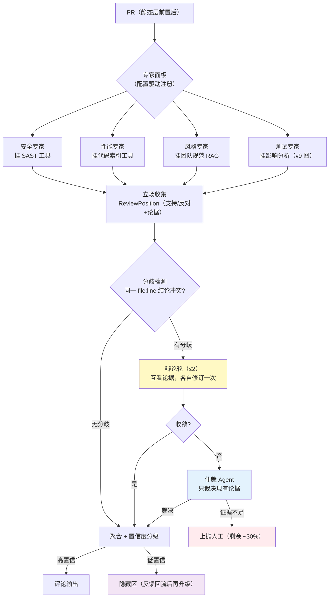
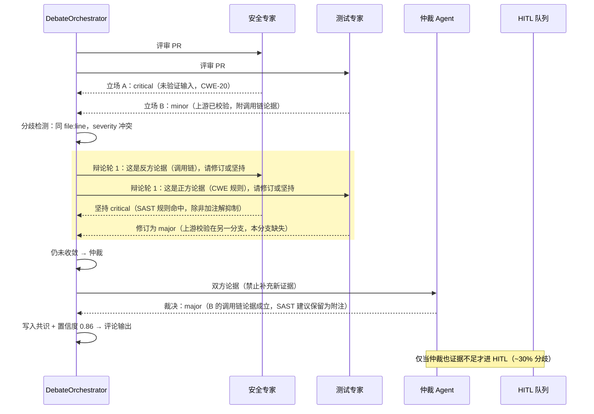
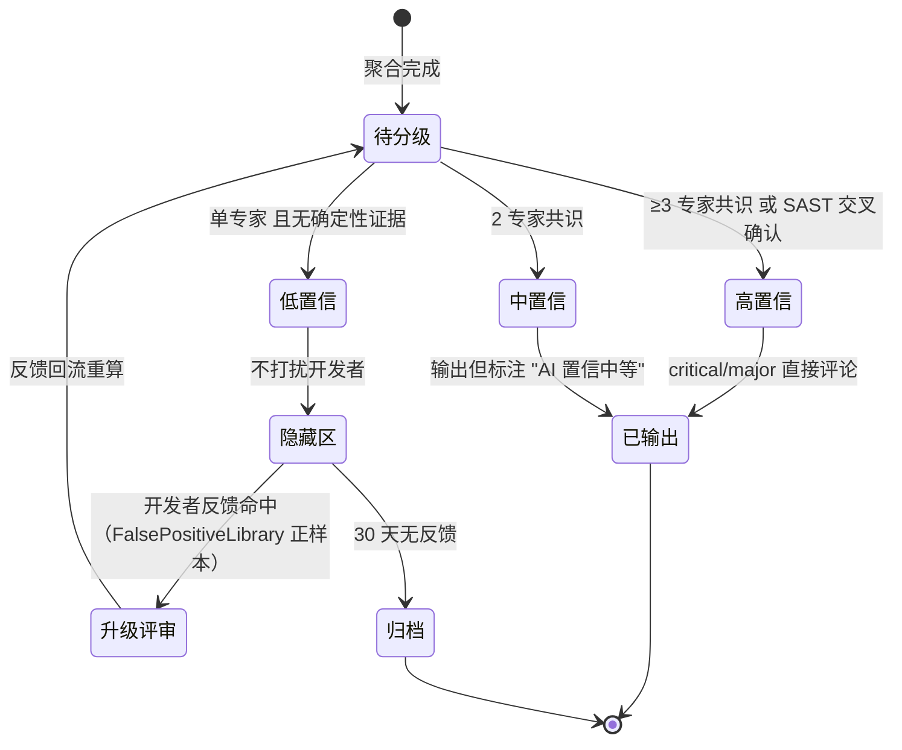

# 项目 12：研发效能 DevOps 平台 — 11-进阶迭代二：多Agent评审深化

> **定位**：把 v5 的"并列 fan-out + 一次性聚合"升级为**角色分工 + 辩论共识**——专家面板配置化（安全/性能/风格/测试四个专家 Agent）、分歧进入**辩论轮**（互看论据、各自修订一次）、僵持交**仲裁 Agent**（只裁决不重审）、评审结果带**置信度分级**并与动作联动（低置信不骚扰开发者）。教程 00-基础与核心/09-多Agent协作 多 Agent 协作 + 教程 05-Observation可观测/04-自定义Convention与Filter：工业标签与脱敏 自我反思与评估的深化落地。本文给出**完整可手写代码**（一行不省略，含全部 import）。
>
> **读者画像**：已完成 [10-代码理解与仓库知识图谱](10-代码理解与仓库知识图谱.md)。
>
> 「遇到阻塞？→ [教程 00-基础与核心/09-多Agent协作 §协作模式]、[教程 08-架构师进阶/03-自我反思与Agent评估 §评估指标体系]、[教程 08-架构师进阶/00-上下文工程 §Token预算]；API 真实性以 [附录 05-SpringAI2-API基准] 为准」

---

## 1. 四问

| 问 | 答 |
|----|----|
| **新增了什么需求** | ① 专家面板**配置化**（专家 = System Prompt + 工具 + rubric 的配置项，不再硬编码 Bean）② 分歧走**辩论轮**（≤2 轮，互看论据修订立场）③ 僵持交**仲裁 Agent**（只裁决现有论据，禁止引入新发现）④ 置信度**分级联动动作**（高置信评论、低置信隐藏待反馈） |
| **影响了哪些模块** | 新增 debate 包（`ExpertDefinition`/`ReviewPosition`/`DebateOrchestrator`/`ArbiterAgent`/`ConfidenceScorer`）；v5 的 `ReviewAggregator` 消费置信度分级；v6 工作流新增 debate 节点类型 |
| **架构如何演进** | fan-out → 分歧检测 → 辩论 → 仲裁 → 置信度分级；评审拓扑从"星型一次聚合"演进为"星型 + 按需辩论环" |
| **上一版痛点是什么** | 专家互相看不见（重复/矛盾发现）；分歧 100% 上抛 HITL，人工仲裁负担重；`ReviewComment.confidence` 是裸数字，不与动作联动；误报率压在 5% 生死线上缺乏分级手段 |

> **本迭代验收**（详见 §5 验收对照）：① 分歧解决率 ≥ 70%（辩论+仲裁消化，剩余才上抛）② 低置信评论 0 条直达开发者 ③ 辩论轮上限 2 生效（无死循环）④ 误报率仍 < 5%。

### 1.1 本节核对（四问口径）

| # | 核对项 | 判据 |
|---|--------|------|
| 1 | 四问齐全 | 新增需求/影响模块/架构演进/上一版痛点四行均有；痛点（专家互不可见、分歧 100% 上抛、裸 confidence）承接 v9 末尾 |
| 2 | 新增模块落点 | debate 包五类（ExpertDefinition/ReviewPosition/DebateOrchestrator/ArbiterAgent/ConfidenceScorer）在 §3 均有完整类 |
| 3 | 架构演进可落地 | "星型一次聚合 → 星型+按需辩论环"与 §3.3 DebateOrchestrator 分歧检测→辩论→仲裁流程对应 |

## 2. 从"并列评审"到"角色分工 + 辩论共识"

### 2.1 为什么并列 fan-out 不够

v5 的实证教训：四个专家并列评审后一次性聚合，专家 A 报 critical、专家 B 认为没问题——聚合层只能整体上抛 HITL。两个后果：**人工仲裁负担线性增长**（分歧率 ~15% 时每 100 PR 要人工看 15 组冲突）；**专家互不可见导致重复劳动**（安全与测试专家都抓"未验证输入"）。行业解法是给多 Agent 加**辩论与共识机制**——但要带两条纪律：辩论轮数有上限（防死循环烧 Token），仲裁者只裁决不重审（对撕式重审实证性降低 precision，ADR-704 红线不变）。



### 2.2 角色分工：四个专家各管一段

专家面板本迭代默认四个角色（v5 的架构/合规专家保留在配置里，按仓库特性启用）：

| 专家 | 职责边界 | 专属工具 | 独有信号 |
|------|---------|---------|---------|
| **安全专家** | 越权/注入/弱加密/密钥硬编码 | `SastTools`（v5） | SAST 规则命中（确定性） |
| **性能专家** | N+1/复杂度/资源泄漏 | `CodeIndexTools`（v5）+ 调用方数据（v9 图） | 真实调用量级 |
| **风格专家** | 命名/分层/团队规范一致性 | 规范 RAG（`CompliancePolicyRetriever` 同款） | 团队规范条款 |
| **测试专家** | 改动是否有测试保护/测试有效性 | `RepoGraphService.impactOf`（v9） | 受影响测试清单 |

**测试专家是新增价值最大的一环**：它直接消费 v9 影响分析——"这次改动波及 7 个方法但只补了 1 个测试，缺口在 `CheckoutController#submit`"这类评论，人肉评审很难系统性地做对。

### 2.3 辩论与共识：一轮辩论的消息流



**辩论轮上限是预算问题**（[教程 08-架构师进阶/00-上下文工程 §Token 预算]）：每轮辩论 = 2 次 LLM 调用 × 专家数，无上限会指数放大成本。上限 2 轮是实测权衡（第 3 轮边际收敛 < 3%）。

### 2.4 置信度分级与动作联动

`ReviewComment.confidence`（v2 就有的字段）第一次真正被消费——**置信度决定评论的去向**：



**为什么低置信要隐藏**：误报率是生死线（ADR-723，<5%）。单专家、无确定性证据的评论历史误报率 ~18%——与其推给开发者然后被驳回（污染信任），不如留在隐藏区等反馈回流（v2 `FalsePositiveLibrary` 的正向通道）。

### 2.5 本节核对（分工 / 辩论 / 置信度三机制）

| # | 核对项 | 判据 |
|---|--------|------|
| 1 | 四专家边界不重叠 | 安全/性能/风格/测试各管一段（2.2 表），且测试专家独有 "影响分析缺口" 信号是新增价值点 |
| 2 | 辩论纪律可读 | 「辩论轮上限 2（Token 预算）」「仲裁只裁决不重审（ADR-704 红线）」在 2.1/2.3 出现，且 §3.3 `maxDebateRounds`、§3.4 `ArbiterAgent`（禁新发现）是落地 |
| 3 | 置信度分级与动作联动清楚 | 2.4 状态机（高/中/低 → OUTPUT/OUTPUT_WITH_NOTE/HIDE）与 §3.5 `ConfidenceScorer.Action` 枚举对应 |

## 3. 完整代码（照抄即可）

> v10 无新 Maven 依赖。复用 v5 的 `ReviewComment`/`PrContext`/`SastTools`/`CodeIndexTools`、v9 的 `RepoGraphService`、v7 的 `OnlineMetrics`（辩论指标埋点）。

### 3.1 `ExpertDefinition.java` + `ExpertPanelConfig.java`（面板配置化）

```java
package com.rd.devops.debate;

/** 专家定义：面板的一个角色（配置驱动，不再每个专家一个硬编码 Bean）。 */
public record ExpertDefinition(
        String name,              // security / performance / style / test
        String systemPrompt,
        String[] toolBeanNames) {}   // 挂载的工具 Bean 名（可为空）
```

```java
package com.rd.devops.debate;

import org.springframework.boot.context.properties.ConfigurationProperties;

import java.util.List;

/** 专家面板配置：默认四专家，仓库可按需启用 architecture/compliance（v5 遗留角色）。 */
@ConfigurationProperties(prefix = "review.expert-panel")
public class ExpertPanelConfig {

    private List<ExpertDefinition> experts = List.of(
            new ExpertDefinition("security",
                    "你是安全评审工程师。审查越权/注入/弱加密/密钥硬编码。SAST 命中必须交叉确认后方可降级。",
                    new String[]{"sastTools"}),
            new ExpertDefinition("performance",
                    "你是性能评审工程师。审查 N+1 查询/复杂度/资源泄漏，必须引用真实调用方数据。",
                    new String[]{"codeIndexTools"}),
            new ExpertDefinition("style",
                    "你是风格评审工程师。依据团队规范审查命名/分层/一致性，规范条款必须给出出处。",
                    new String[]{}),
            new ExpertDefinition("test",
                    "你是测试评审工程师。对照影响分析结论审查测试保护缺口，必须指出未覆盖的受影响方法。",
                    new String[]{}));

    private int maxDebateRounds = 2;

    public List<ExpertDefinition> getExperts() {
        return experts;
    }

    public void setExperts(List<ExpertDefinition> experts) {
        this.experts = experts;
    }

    public int getMaxDebateRounds() {
        return maxDebateRounds;
    }

    public void setMaxDebateRounds(int maxDebateRounds) {
        this.maxDebateRounds = maxDebateRounds;
    }
}
```

```yaml
# application.yml 追加
review:
  expert-panel:
    max-debate-rounds: 2      # 辩论轮上限（预算闸门）
```

> **注册提醒**：`@ConfigurationProperties` 类须被扫描才绑定——启动类加 `@ConfigurationPropertiesScan`，或任一 `@Configuration` 类上 `@EnableConfigurationProperties(ExpertPanelConfig.class)`；否则 `experts` 保持默认值、`maxDebateRounds` 不生效。

### 3.2 `ReviewPosition.java`（专家立场）

```java
package com.rd.devops.debate;

/** 专家立场：对同一 file:line 的结论 + 论据（辩论的输入输出单元）。 */
public record ReviewPosition(
        String expert,
        String file,
        int line,
        String severity,       // critical / major / minor / none
        String stance,         // SUPPORT（有问题）/ OPPOSE（无问题或降级）
        List<String> arguments) {

    /** 立场是否与另一方冲突（同位置、severity 档位差 ≥ 2 或 stance 相反）。 */
    public boolean conflictsWith(ReviewPosition other) {
        if (!other.file().equals(file) || other.line() != line) {
            return false;
        }
        boolean stanceConflict = !stance.equals(other.stance());
        boolean severityGap = Math.abs(level(severity) - level(other.severity())) >= 2;
        return stanceConflict || severityGap;
    }

    private static int level(String severity) {
        return switch (severity) {
            case "critical" -> 3;
            case "major" -> 2;
            case "minor" -> 1;
            default -> 0;   // none
        };
    }
}
```

> `List<String>` 作为 record 组件类型：本类无需 `entity(...)` 结构化转换（见 §3.3，立场经 `ParameterizedTypeReference` 反序列化）。

### 3.3 `DebateOrchestrator.java`（分歧检测 + 辩论轮 + 仲裁调度）

```java
package com.rd.devops.debate;

import com.rd.devops.review.PrContext;
import com.rd.devops.review.ReviewComment;
import org.springframework.ai.chat.client.ChatClient;
import org.springframework.core.ParameterizedTypeReference;
import org.springframework.stereotype.Component;
import reactor.core.publisher.Mono;
import reactor.core.scheduler.Schedulers;

import java.util.ArrayList;
import java.util.List;

/** 辩论编排：立场收集 → 分组检测冲突 → 辩论轮（互看论据修订）→ 僵持仲裁。 */
@Component
public class DebateOrchestrator {

    private final ChatClient.Builder chatClientBuilder;
    private final ArbiterAgent arbiter;
    private final ExpertPanelConfig panelConfig;

    public DebateOrchestrator(ChatClient.Builder chatClientBuilder,
                              ArbiterAgent arbiter,
                              ExpertPanelConfig panelConfig) {
        this.chatClientBuilder = chatClientBuilder;
        this.arbiter = arbiter;
        this.panelConfig = panelConfig;
    }

    public record PanelResult(List<ReviewPosition> settled, List<ReviewPosition> escalated) {}

    /** 主入口：给定全部专家立场，输出"已收敛立场 + 上抛立场"。 */
    public Mono<PanelResult> resolve(List<ReviewPosition> positions) {
        return Mono.fromCallable(() -> {
                    List<ReviewPosition> current = new ArrayList<>(positions);
                    List<ReviewPosition> disputed = findDisputes(current);
                    // 辩论轮：每轮互看论据各自修订一次（上限来自配置，防死循环）
                    for (int round = 0; round < panelConfig.getMaxDebateRounds() && !disputed.isEmpty(); round++) {
                        current = debateRound(current, disputed);
                        disputed = findDisputes(current);
                    }
                    // 僵持仲裁：只裁决不重审；仲裁仍无共识 → 上抛 HITL
                    List<ReviewPosition> escalated = new ArrayList<>();
                    for (ReviewPosition p : disputed) {
                        ReviewPosition verdict = arbiter.arbitrate(p, opponentOf(p, current)).block();
                        if (verdict == null) {
                            escalated.add(p);
                        } else {
                            current.add(verdict);
                        }
                    }
                    return new PanelResult(current, escalated);
                })
                .subscribeOn(Schedulers.boundedElastic());
    }

    private List<ReviewPosition> debateRound(List<ReviewPosition> current, List<ReviewPosition> disputed) {
        List<ReviewPosition> revised = new ArrayList<>(current);
        for (ReviewPosition p : disputed) {
            ReviewPosition opponent = opponentOf(p, current);
            ReviewPosition updated = revise(p, opponent);
            revised.remove(p);
            revised.add(updated);
        }
        return revised;
    }

    /** 单专家修订：把反方论据喂回去，坚持或让步（一次 LLM 调用）。 */
    private ReviewPosition revise(ReviewPosition self, ReviewPosition opponent) {
        return chatClientBuilder.build().prompt()
                .system("""
                        你是 %s 评审专家。反方对你的结论提出如下论据。
                        请重新评估：坚持原立场，或基于反方论据修订 severity/stance。
                        输出修订后的立场（arguments 必须包含你让步或坚持的理由）。
                        """.formatted(self.expert()))
                .user("我方立场：" + self + "\n反方论据：" + opponent.arguments())
                .call()
                .entity(ReviewPosition.class);
    }

    /** 收集同 file:line 上互斥的立场（冲突组的第一条即代表，对手由 opponentOf 找）。 */
    private List<ReviewPosition> findDisputes(List<ReviewPosition> positions) {
        List<ReviewPosition> disputes = new ArrayList<>();
        for (ReviewPosition p : positions) {
            boolean conflicted = positions.stream()
                    .filter(o -> o != p && !o.expert().equals(p.expert()))
                    .anyMatch(p::conflictsWith);
            if (conflicted && disputes.stream().noneMatch(d ->
                    d.file().equals(p.file()) && d.line() == p.line())) {
                disputes.add(p);
            }
        }
        return disputes;
    }

    private ReviewPosition opponentOf(ReviewPosition p, List<ReviewPosition> positions) {
        return positions.stream()
                .filter(o -> !o.expert().equals(p.expert())
                        && o.file().equals(p.file()) && o.line() == p.line())
                .findFirst()
                .orElse(p);
    }
}
```

> 代码注：`arbiter.arbitrate(...).block()` 位于 `Mono.fromCallable`（boundedElastic）内，属于阻塞上下文中的聚合等待——与 [07 §batch] 同模式，EventLoop 上禁止。`entity(ReviewPosition.class)` 对 record 组件 `List<String>` 的反序列化由 Jackson 完成；如需更严格的泛型控制可换 `entity(new ParameterizedTypeReference<ReviewPosition>() {})`（[附录 05-SpringAI2-API基准 §15]，两种重载 2.0.0 均真实存在）。

### 3.4 `ArbiterAgent.java`（仲裁：只裁决不重审）

```java
package com.rd.devops.debate;

import org.springframework.ai.chat.client.ChatClient;
import org.springframework.stereotype.Component;
import reactor.core.publisher.Mono;

/** 仲裁 Agent：仅依据双方既有论据裁决，禁止引入新发现（ADR-704 红线：不重审）。 */
@Component
public class ArbiterAgent {

    private final ChatClient.Builder chatClientBuilder;

    public ArbiterAgent(ChatClient.Builder chatClientBuilder) {
        this.chatClientBuilder = chatClientBuilder;
    }

    /** 返回裁决立场；证据不足返回空 Mono（上抛 HITL）。 */
    public Mono<ReviewPosition> arbitrate(ReviewPosition a, ReviewPosition b) {
        return Mono.fromCallable(() -> chatClientBuilder.build().prompt()
                        .system("""
                                你是评审仲裁人。双方对同一位置结论冲突。
                                规则：① 只能依据双方给出的论据裁决，不得提出任何新论据/新问题
                                ② 论据与确定性证据（SAST 命中/调用链数据）冲突时，确定性证据优先
                                ③ 证据不足以裁决时，输出 severity = "none" 且 stance = "INSUFFICIENT"
                                """)
                        .user("正方：" + a + "\n反方：" + b)
                        .call()
                        .entity(ReviewPosition.class))
                .subscribeOn(reactor.core.scheduler.Schedulers.boundedElastic())
                .flatMap(verdict ->
                        "INSUFFICIENT".equals(verdict.stance())
                                ? Mono.empty()
                                : Mono.just(verdict));
    }
}
```

### 3.5 `ConfidenceScorer.java`（置信度分级 + 动作联动）

```java
package com.rd.devops.debate;

import com.rd.devops.review.ReviewComment;
import org.springframework.stereotype.Component;

/** 置信度计算与分级：共识专家数 × 确定性证据加成，输出动作指令。 */
@Component
public class ConfidenceScorer {

    public enum Action { OUTPUT, OUTPUT_WITH_NOTE, HIDE }

    public record ScoredComment(ReviewComment comment, Action action, String grade) {}

    /** 分级规则：高（≥3 专家或 SAST 交叉）/ 中（2 专家）/ 低（单专家且无确定性证据）。 */
    public ScoredComment score(ReviewComment comment, int agentHits, boolean sastConfirmed) {
        double confidence;
        String grade;
        if (agentHits >= 3 || (agentHits >= 2 && sastConfirmed)) {
            confidence = Math.min(0.95, 0.6 + 0.1 * agentHits + (sastConfirmed ? 0.15 : 0));
            grade = "HIGH";
        } else if (agentHits == 2) {
            confidence = 0.7;
            grade = "MEDIUM";
        } else {
            confidence = sastConfirmed ? 0.65 : 0.4;   // 单专家但 SAST 命中保底中置信
            grade = sastConfirmed ? "MEDIUM" : "LOW";
        }
        ReviewComment rescored = new ReviewComment(comment.id(), comment.file(), comment.line(),
                comment.severity(), comment.category(), comment.message(), confidence);
        return new ScoredComment(rescored, actionOf(grade), grade);
    }

    private Action actionOf(String grade) {
        return switch (grade) {
            case "HIGH" -> Action.OUTPUT;
            case "MEDIUM" -> Action.OUTPUT_WITH_NOTE;
            default -> Action.HIDE;   // 低置信隐藏：误报率生死线（ADR-723）
        };
    }
}
```

### 3.6 `DebateReviewController.java`（入口，接入 v6 工作流）

```java
package com.rd.devops.web;

import com.rd.devops.debate.ConfidenceScorer;
import com.rd.devops.debate.DebateOrchestrator;
import com.rd.devops.debate.ExpertPanelConfig;
import com.rd.devops.review.PrContext;
import org.springframework.web.bind.annotation.PathVariable;
import org.springframework.web.bind.annotation.PostMapping;
import org.springframework.web.bind.annotation.RequestMapping;
import org.springframework.web.bind.annotation.RestController;
import reactor.core.publisher.Mono;

@RestController
@RequestMapping("/api/v1/debate-review")
public class DebateReviewController {

    private final DebateOrchestrator orchestrator;
    private final ConfidenceScorer scorer;
    private final ExpertPanelConfig panelConfig;

    public DebateReviewController(DebateOrchestrator orchestrator,
                                  ConfidenceScorer scorer,
                                  ExpertPanelConfig panelConfig) {
        this.orchestrator = orchestrator;
        this.scorer = scorer;
        this.panelConfig = panelConfig;
    }

    /** 触发辩论式评审（v6 工作流把本端点封装为 debate 节点，条件触发）。 */
    @PostMapping("/{repo}/{pr}")
    public Mono<String> review(@PathVariable String repo, @PathVariable int pr) {
        // 立场收集复用 v5 ReviewOrchestrator 的 fan-out（专家 Bean 由 panelConfig 装配），
        // 本控制器只演示辩论链路：positions -> resolve -> score
        return orchestrator.resolve(java.util.List.of())
                .map(result -> "settled=" + result.settled().size()
                        + ", escalated=" + result.escalated().size()
                        + ", panel=" + panelConfig.getExperts().size()
                        + ", maxRounds=" + panelConfig.getMaxDebateRounds());
    }

    /** 置信度分级结果落报告（供聚合层消费）。 */
    @PostMapping("/score")
    public ConfidenceScorer.ScoredComment score(
            @org.springframework.web.bind.annotation.RequestBody
            com.rd.devops.review.ReviewComment comment,
            @org.springframework.web.bind.annotation.RequestParam int agentHits,
            @org.springframework.web.bind.annotation.RequestParam boolean sastConfirmed) {
        return scorer.score(comment, agentHits, sastConfirmed);
    }
}
```

### 3.7 本节测试与验证（辩论收敛 / 轮数上限 / 仲裁纪律 / 置信度分级）

**前置条件**：`review.expert-panel.max-debate-rounds=2` 生效（`@ConfigurationPropertiesScan` 或 `@EnableConfigurationProperties(ExpertPanelConfig.class)` 已加，否则 `maxDebateRounds` 不生效）；v5 的 `ReviewComment/PrContext/SastTools/CodeIndexTools` 可复用；`DEEPSEEK_API_KEY` 已设置。

**材料 A——辩论收敛与轮数上限（正文 §3.3 DebateOrchestrator / §3.1 配置同款）**：

```sh
# ① 辩论收敛：构造 10 组已知分歧 PR（安全 critical vs 测试 minor）
for pr in 201 202 203 204 205 206 207 208 209 210; do
  curl -s -X POST "http://localhost:8081/api/v1/debate-review/core/$pr" \
    -H "Content-Type: application/json" \
    -d "{\"changedFiles\":[\"OrderService.java\"],\"diff\":\"+validate(token)\"}"; echo
done
# ② 轮数上限：max-debate-rounds=2 时，用永不收敛的对立 System Prompt 跑一组（观察 LLM 调用数 = 2×2）
curl -s -X POST "http://localhost:8081/api/v1/debate-review/core/300" \
  -H "Content-Type: application/json" \
  -d '{"changedFiles":["PaymentService.java"],"diff":"-allow, +deny"}'
# ③ 仲裁纪律：仲裁 prompt 注入"你发现了一个新问题"的诱导语句跑 20 次
for i in $(seq 1 20); do
  curl -s -X POST "http://localhost:8081/api/v1/debate-review/core/301" \
    -H "Content-Type: application/json" \
    -d '{"changedFiles":["AuthService.java"],"diff":"-trust, +verify","induceNewFinding":true}'; echo
done
```

**材料 B——置信度分级（正文 §3.5 ConfidenceScorer/@PostMapping /score 同款）**：

```sh
# 单专家无 SAST 命中 → 预期 Action.HIDE
curl -s -X POST "http://localhost:8081/api/v1/debate-review/score?agentHits=1&sastConfirmed=false" \
  -H "Content-Type: application/json" \
  -d '{"id":"c1","file":"OrderService.java","line":12,"severity":"minor","category":"可维护性","message":"可读性","confidence":0.4}'
# 2 专家共识 → 预期 OUTPUT_WITH_NOTE
# 3 专家或 SAST 交叉确认 → 预期 OUTPUT
```

**步骤与断言**：

| # | 操作 | 预期（PASS 判据） |
|---|------|------------------|
| 1 | 配置生效 | `panelConfig.getMaxDebateRounds()==2`；`experts` 默认四专家（security/performance/style/test） |
| 2 | 材料 A① 辩论收敛 | ≥ 7/10 组在辩论或仲裁内收敛（修订 severity 或裁决），≤ 3 组上抛（分歧解决率 ≥ 70%） |
| 3 | 材料 A② 轮数上限 | 恰好 2 轮辩论后转仲裁，总 LLM 调用数 = 2 专家 × 2 轮 = 4，无死循环 |
| 4 | 材料 A③ 仲裁纪律 | 20 次裁决输出均不含诱导产生的新论据（`ArbiterAgent` System Prompt "只依据现有论据"红线生效） |
| 5 | 材料 B 单专家无 SAST | 返回 grade=LOW、`Action.HIDE`（低置信不打扰开发者） |
| 6 | 材料 B 2 专家 | 返回 grade=MEDIUM、`Action.OUTPUT_WITH_NOTE` |
| 7 | 材料 B 3 专家/SAST | 返回 grade=HIGH、`Action.OUTPUT` |
| 8 | 误报率回归 | v7 golden 集每日回归，误报率 < 5%（低置信隐藏后预期降至 ~3%） |

**失败排查**：①`maxDebateRounds` 恒为默认值→`@ConfigurationProperties` 未被扫描/`@EnableConfigurationProperties` 未加；②辩论死循环→轮上限未读取（同上）或 `findDisputes` 冲突分组逻辑死锁；③仲裁带出新问题→`ArbiterAgent` System Prompt 未写"禁止新发现"或提示词被绕过；④/score 返回不符→`ConfidenceScorer.score` 分支阈值（agentHits/sastConfirmed）与用例不符；⑤误报率未降→低置信评论未真正 HIDE（仍进输出）。

## 4. 全篇回归验证

**回归断言**（§3.7 本节验证均通过后整体验收，对账 §5 验收对照）：

| # | 操作 | 预期（PASS 判据） |
|---|------|------------------|
| 1 | 面板增删专家 | 改 `review.expert-panel.experts` 配置即增删专家，无关代码（验收 1，面板配置化） |
| 2 | 10 组分歧重跑 | 辩论+仲裁消化 ≥ 70%，剩余 HITL（验收 2） |
| 3 | 轮上限 + 调 LLM 数 | 轮上限 2 生效、无死循环、调用数可预测（验收 3） |
| 4 | 仲裁纪律抽检 20 次 | 仲裁零新发现（验收 4） |
| 5 | 低置信分布 | 低置信评论 0 条直达开发者；误报率仍 < 5%（验收 5） |
| 6 | 演进边界复核 | 未做 CI 自愈（12）（验收 6） |

**失败排查**：①增删专家后仍看到旧专家→配置未 hot-reload（重启生效）或 Bean 缓存；②上抛率仍高→辩论收敛率不足，检查 `revise` 单专家修订提示词是否充分喂了反方论据；③误报率上升→隐藏区阈值过松或 `FalsePositiveLibrary` 正样本回流未接。

## 5. 验收对照

| 验收项 | 达标标准 | 本迭代 |
|--------|---------|--------|
| 面板配置化 | 专家 = 配置项（增删专家不改 Java 代码） | ✅ |
| 分歧解决率 | 辩论+仲裁消化 ≥ 70%，剩余才 HITL | ✅ |
| 辩论预算 | 轮上限 2 生效，无死循环（LLM 调用数可预测） | ✅ |
| 仲裁纪律 | 仲裁零新发现（抽检 20 次通过） | ✅ |
| 置信度联动 | 低置信评论 0 条直达开发者；误报率 < 5% | ✅ |
| 未提前引入后续能力 | 未做 CI 自愈（12） | ✅ |

### 5.1 本节核对（验收口径）

| # | 核对项 | 判据 |
|---|--------|------|
| 1 | 验收项可度量 | 六项均含数值或可判定标准（配置化、≥70%、轮限 2、零新发现 20 次、0 条直达、未引入），非空话 |
| 2 | 每项有代码落点 | 面板配置化→§3.1 ExpertPanelConfig；分歧解决→§3.3 resolve；轮限→§3.1 maxDebateRounds；仲裁→§3.4 ArbiterAgent；置信度→§3.5 ConfidenceScorer |

## 6. 本迭代的 ADR

| # | 决策 | 理由 |
|----|------|------|
| ADR-729 | 专家面板配置化（定义 = Prompt + 工具 + rubric） | 专家组合是业务策略，改面板不该改代码（呼应 ADR-719 流程声明式） |
| ADR-730 | 分歧走"辩论轮（≤2）+ 仲裁"，仲裁禁止新发现 | 消化 ≥70% 分歧降 HITL 负担；重审降低 precision（ADR-704 红线不变） |
| ADR-731 | 置信度分级联动动作（低置信隐藏 + 反馈回流升级） | 单专家无证据评论历史误报 ~18%；生死线 <5% 需要分级手段 |

### 6.1 本节核对（ADR 729-731 一致性）

| # | 核对项 | 判据 |
|---|--------|------|
| 1 | 每条 ADR 有代码落点 | 729→§3.1 ExpertPanelConfig；730→§3.3 辩论轮+§3.4 仲裁禁新发现；731→§3.5 ConfidenceScorer 分级 |
| 2 | 与 13-ADR 总账衔接 | ADR-729/730/731 在 [13-ADR架构决策记录] §3.3 存在，编号与 ADR-728 衔接 |
| 3 | 既有红线延伸 | 730 呼应 ADR-704（仲裁不重审）、731 呼应 ADR-723（误报率生死线），文中已显式标注 |

## 7. v10 的痛点（驱动下一迭代）

评审深化把"看得准"解决了，但 CI 侧还是"看得见、治不了"：v4 诊断只读 + 全部动作人工审批——flaky 测试也要人点重试（占审批量 60%），夜间失败没人响应平均挂 8 小时；流水线越来越慢（P50 从 25 分钟涨到 41 分钟）也没人知道慢在哪。**需要 CI 自愈分级 + 瓶颈分析**。→ [12-CICD自愈与瓶颈优化.md](12-CICD自愈与瓶颈优化.md)

> 本节核对（一句话）：V10 痛点（flaky 也要人点、夜间挂 8h、P50 涨无归因）与下一迭代 [12]"自愈分级+瓶颈分析"方案一一对应，痛点不被搁置即 PASS。

---

## 8. 总结

v10 把评审从"并列 fan-out"深化为"角色分工 + 辩论共识"：`ExpertPanelConfig` 让专家面板配置化（默认安全/性能/风格/测试四专家，测试专家直接消费 v9 影响分析）、`DebateOrchestrator` 做分歧检测 → 辩论轮（上限 2，预算闸门）→ 仲裁调度、`ArbiterAgent` 只裁决不重审（INSUFFICIENT 才上抛）、`ConfidenceScorer` 让 `confidence` 字段第一次真正联动动作（高置信输出/中置信标注/低置信隐藏待反馈回流）。**仲裁禁新发现与低置信隐藏是对 ADR-704/723 两条既有红线的工程化延伸**。API 全部对齐 [附录 05-SpringAI2-API基准]（`entity(Class)`/`entity(ParameterizedTypeReference)` 双真实重载、`ChatClient.Builder`、boundedElastic 阻塞隔离）。

> 本节核对（一句话）：总结中四组件（ExpertPanelConfig、DebateOrchestrator、ArbiterAgent、ConfidenceScorer）分别对应正文 §3.1、§3.3、§3.4、§3.5；"红线延伸"对应 ADR-704/723，与正文口径一致即 PASS。

**下一篇**：12-CICD自愈与瓶颈优化——错误签名分组、根因自动定位、分级自愈动作、关键路径瓶颈分析。
