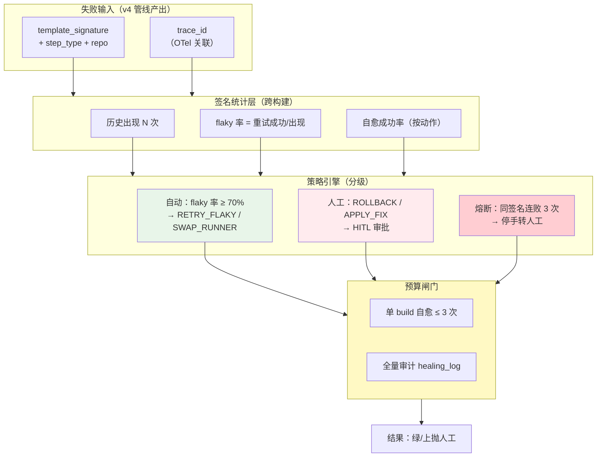
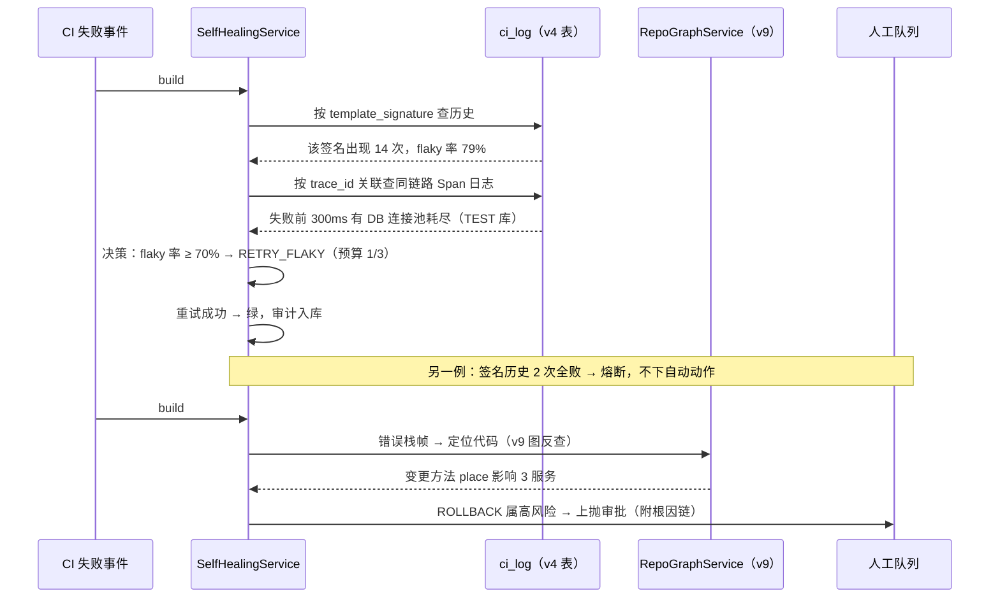
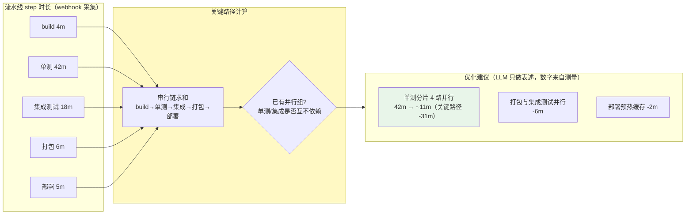

# 项目 12：研发效能 DevOps 平台 — 12-进阶迭代三：CICD自愈与瓶颈优化

> **定位**：把 v4 的"只读诊断 + 全人工审批"升级为**分级自愈**——失败聚类从单次构建内升级为**跨构建错误签名库**（历史统计驱动决策）、根因定位关联**日志/Trace**（OTel trace_id 下钻到服务/SQL/代码行）、自愈动作**分级**（flaky 重试/换 runner 可自动带预算熔断，回滚/改代码必须 HITL——修订 ADR-713）、流水线**瓶颈分析**（关键路径识别 + 并行优化建议）。教程 22 可观测 + 28 HITL + 30 弹性的深化落地。本文给出**完整可手写代码**（一行不省略，含全部 import）。
>
> **读者画像**：已完成 [11-多Agent评审深化](11-多Agent评审深化.md)。
>
> 「遇到阻塞？→ [教程 31-全链路可观测性 §Trace]、[教程 61-Human-in-the-Loop与审批流 §风险分级]、[教程 63-容错与弹性设计 §熔断]；API 真实性以 [附录 05-SpringAI2-API基准] 为准」

---

## 1. 四问

| 问 | 答 |
|----|----|
| **新增了什么需求** | ① 跨构建**错误签名库**（签名 → 历史出现次数/自愈成功率/flaky 率）② 根因自动定位（签名 → Trace 关联 → 服务/SQL/代码行）③ 自愈动作**分级**（RETRY_FLAKY/SWAP_RUNNER 自动；ROLLBACK/HUMAN_ONLY 人工）④ 自愈**预算与熔断**（单 build 最多 N 次、同签名连败 3 次停手）⑤ 流水线**瓶颈分析**（step 时长 → 关键路径 → 并行化建议） |
| **影响了哪些模块** | 新增 healing 包（`SignatureStats`/`HealingPolicy`/`SelfHealingService`/`HealingAuditLog`）与 perf 包（`BottleneckAnalyzer`）；复用 v4 `ci_log`（trace_id 字段）与 `DrainTemplateMiner`、v9 `RepoGraphService`（根因定位到代码） |
| **架构如何演进** | 诊断管线（只读）→ 签名统计层 + 策略引擎（分级动作）+ 熔断器；新增时长分析管线（webhook 消费 build 完成事件的 step timing） |
| **上一版痛点是什么** | flaky 测试也要人点重试（占审批量 60%，夜间失败平均挂 8 小时）；全部动作一刀切 HITL 是 ADR-713 的过度保守；流水线 P50 从 25 分钟涨到 41 分钟无量化归因 |

> **本迭代验收**（详见 §5 验收对照）：① flaky 自动重试恢复率 ≥ 80% ② 自愈类 MTTR 从 20 分钟 → ≤ 3 分钟 ③ 高风险动作 100% HITL ④ 熔断生效（连败停手）⑤ 瓶颈建议落地后 P50 -20%。

### 1.1 本节核对（四问口径）

| # | 核对项 | 判据 |
|---|--------|------|
| 1 | 四问齐全 | 新增需求/影响模块/架构演进/上一版痛点四行均有；痛点（flaky 也人点、夜间挂 8h、P50 涨无归因）承接 v10 末尾 |
| 2 | 新增模块落点 | healing 包（SignatureStats/HealingPolicy/SelfHealingService）+ perf 包（BottleneckAnalyzer）在 §3 均有完整类 |
| 3 | 架构演进可落地 | "诊断只读 → 签名统计+策略引擎+熔断"与 §3.2-SignatureStats / §3.3-HealingPolicy / §3.4-SelfHealingService 对应 |

## 2. 从"只读诊断"到"分级自愈"

### 2.1 ADR-713 的修订：不是推翻，是分层

v4 定下的 ADR-713（"诊断只读，修复 HITL 审批"）在当时是对的——没有历史统计，任何自动动作都是盲赌。v11 有了跨构建签名库后，**证据足以支撑分层**：

| 动作 | 风险特征 | v11 策略 |
|------|---------|---------|
| RETRY_FLAKY（重试 flaky 测试/单 step） | 无代码变更、无生产影响、可重复 | **自动**（历史 flaky 率 ≥ 70% 才触发，带审计） |
| SWAP_RUNNER（换构建机重调度） | 无代码变更、环境类失败 | **自动**（同上，审计 + 可一键关闭） |
| ROLLBACK（回滚上一绿版本） | 影响线上 | **HITL**（审批闸门，超时升级） |
| APPLY_FIX（改代码/配置） | 永久性变更 | **HITL**（v4 的 `CiFixApprovalManager` 通道不变） |

> **修订纪律**（呼应 [13-ADR架构决策记录 §4 ADR 使用规范]）：ADR-713 状态从"采纳"改为"被 ADR-732 修订"，修订记录写明新证据（签名库 + 历史统计）——不是静默改主意。

### 2.2 自愈决策流：签名 → 统计 → 分级 → 预算



**为什么必须有熔断**：自动重试的最大风险是"自愈风暴"——一个真 bug 的测试失败被反复重试，烧光 runner 资源还掩盖问题。同签名连续 3 次自愈失败即熔断转人工，是把"自动"关在笼子里的最后一道闸（[教程 63-容错与弹性设计 §熔断]）。

### 2.3 根因自动定位：日志 + Trace + 代码三源关联



**Trace 关联的落点**：v4 的 `ci_log` 已有 `trace_id` 列（当时只做了存储没做消费）——本迭代把它用起来：失败 step 的 trace_id 反查同链路全部日志行，把"测试超时"还原成"连接池耗尽导致 300ms → 30s 超时"的因果链。

### 2.4 瓶颈分析：关键路径，不是"感觉慢"

流水线优化最常见的错误是优化非关键路径（把 2 分钟的 step 优化到 1 分钟，总时长纹丝不动）。正确做法是**测量每 step 时长 → 计算关键路径 → 只对关键路径给并行化建议**：



**纪律**：数字全部来自测量（Micrometer 直方图），LLM 只负责把"分片方案"表述成可执行建议——**确定性优先、LLM 收尾**在性能域的同一套打法（ADR-702）。

### 2.5 本节核对（自愈分级 / 熔断 / 根因三源 / 瓶颈关键路径）

| # | 核对项 | 判据 |
|---|--------|------|
| 1 | 动作分级清晰 | 2.1 表四动作（RETRY_FLAKY/SWAP_RUNNER 自动；ROLLBACK/APPLY_FIX HITL）与 §3.3 `HealingPolicy.Action` 枚举、§3.4 switch 分支对应 |
| 2 | 熔断/预算纪律可读 | 2.2「单 build ≤3 次、连败 3 次熔断」（防自愈风暴）与 §3.4 `MAX_HEALS_PER_BUILD`/`CIRCUIT_BREAK_THRESHOLD` 一致 |
| 3 | 根因三源与瓶颈关键路径清楚 | 2.3 日志+Trace+代码三源关联对应 §3.5 TraceCorrelator；2.4 只对关键路径提建议对应 §3.6 BottleneckAnalyzer |

## 3. 完整代码（照抄即可）

> v11 无新 Maven 依赖。复用 v4 `ci_log` 表与 `DrainTemplateMiner`/`CiDiagnosisService`、v7 `spring-boot-starter-actuator`（MeterRegistry）、v9 `RepoGraphService`。

### 3.1 SQL DDL（自愈策略表 + 审计表）

```sql
CREATE TABLE IF NOT EXISTS healing_policy (
    signature       TEXT        PRIMARY KEY,   -- template_signature（人工沉淀或从高频签名升华）
    action          TEXT        NOT NULL,      -- RETRY_FLAKY / SWAP_RUNNER / ROLLBACK / HUMAN_ONLY
    enabled         BOOLEAN     NOT NULL DEFAULT TRUE,
    updated_by      TEXT        NOT NULL DEFAULT 'system',
    created_at      TIMESTAMPTZ NOT NULL DEFAULT now()
);
-- 自动触发门槛（flaky 率 ≥ 70%、出现 ≥ 5 次）为引擎内常量，见 §3.3 HealingPolicy

CREATE TABLE IF NOT EXISTS healing_log (
    id            BIGSERIAL PRIMARY KEY,
    build_id      BIGINT      NOT NULL,
    signature     TEXT        NOT NULL,
    action        TEXT        NOT NULL,
    outcome       TEXT        NOT NULL,      -- HEALED / FAILED / ESCALATED / CIRCUIT_BROKEN
    detail        TEXT,
    created_at    TIMESTAMPTZ NOT NULL DEFAULT now()
);

CREATE INDEX IF NOT EXISTS idx_healing_log_sig ON healing_log (signature, created_at DESC);
```

### 3.2 `SignatureStats.java`（跨构建签名统计）

```java
package com.rd.devops.healing;

import org.springframework.jdbc.core.simple.JdbcClient;
import org.springframework.stereotype.Component;

/** 签名统计：跨构建历史（flaky 率/自愈成功率/连败计数）——分级决策的证据层。 */
@Component
public class SignatureStats {

    private final JdbcClient jdbcClient;

    public SignatureStats(JdbcClient jdbcClient) {
        this.jdbcClient = jdbcClient;
    }

    public record Stats(int occurrences, double flakyRate, int consecutiveFailures) {}

    /** flaky 率 = 重试后成功次数 / 出现次数（历史重试结果从 healing_log 反推）。 */
    public Stats of(String signature) {
        Integer occurrences = jdbcClient.sql("""
                SELECT count(*) FROM ci_log WHERE template_signature = :sig
                """)
                .param("sig", signature)
                .query(Integer.class).single();
        Integer healed = jdbcClient.sql("""
                SELECT count(*) FROM healing_log
                WHERE signature = :sig AND outcome = 'HEALED'
                """)
                .param("sig", signature)
                .query(Integer.class).single();
        Integer consecutiveFailures = jdbcClient.sql("""
                SELECT count(*) FROM (
                    SELECT outcome FROM healing_log
                    WHERE signature = :sig ORDER BY created_at DESC LIMIT 3
                ) recent WHERE recent.outcome = 'FAILED'
                """)
                .param("sig", signature)
                .query(Integer.class).single();
        double flakyRate = occurrences == 0 ? 0 : (double) healed / occurrences;
        return new Stats(occurrences, flakyRate, consecutiveFailures);
    }
}
```

### 3.3 `HealingPolicy.java`（动作分级策略）

```java
package com.rd.devops.healing;

import org.springframework.jdbc.core.simple.JdbcClient;
import org.springframework.stereotype.Component;

import java.util.Optional;

/** 策略引擎：签名 → 动作分级。ROLLBACK/APPLY_FIX 永不自动（ADR-732 对 ADR-713 的修订边界）。 */
@Component
public class HealingPolicy {

    public enum Action { RETRY_FLAKY, SWAP_RUNNER, ROLLBACK, APPLY_FIX, HUMAN_ONLY }

    public static final int MAX_HEALS_PER_BUILD = 3;      // 预算：单 build 自愈上限
    public static final int CIRCUIT_BREAK_THRESHOLD = 3;  // 熔断：同签名连败阈值

    private final JdbcClient jdbcClient;

    public HealingPolicy(JdbcClient jdbcClient) {
        this.jdbcClient = jdbcClient;
    }

    public record Decision(Action action, String reason, boolean automatic) {}

    public Optional<Decision> decide(String signature, SignatureStats.Stats stats) {
        Optional<Action> configured = jdbcClient.sql("""
                SELECT action FROM healing_policy
                WHERE signature = :sig AND enabled = TRUE
                """)
                .param("sig", signature)
                .query((rs, i) -> Action.valueOf(rs.getString("action")))
                .stream().findFirst();

        if (configured.isPresent()) {
            Action action = configured.get();
            return Optional.of(new Decision(action, "策略表命中",
                    action == Action.RETRY_FLAKY || action == Action.SWAP_RUNNER));
        }
        // 无显式策略：历史 flaky 率达标的走 RETRY_FLAKY；低频新签名保守转人工
        if (stats.occurrences() >= 5 && stats.flakyRate() >= 0.7) {
            return Optional.of(new Decision(Action.RETRY_FLAKY,
                    "flaky 率 %.0f%%（%d 次）".formatted(stats.flakyRate() * 100, stats.occurrences()),
                    true));
        }
        return Optional.of(new Decision(Action.HUMAN_ONLY,
                "签名低频（%d 次）或 flaky 率 %.0f%% 不足，证据不支持自动"
                        .formatted(stats.occurrences(), stats.flakyRate() * 100),
                false));
    }
}
```

### 3.4 `SelfHealingService.java`（预算 + 熔断 + 审计 + 执行）

```java
package com.rd.devops.healing;

import io.micrometer.core.instrument.Counter;
import io.micrometer.core.instrument.MeterRegistry;
import org.springframework.jdbc.core.simple.JdbcClient;
import org.springframework.stereotype.Service;

import java.util.Map;
import java.util.concurrent.ConcurrentHashMap;

/** 自愈执行：预算闸门 + 熔断 + 全量审计。高风险动作只生成审批任务，不执行。 */
@Service
public class SelfHealingService {

    private final SignatureStats stats;
    private final HealingPolicy policy;
    private final JdbcClient jdbcClient;
    private final Counter healed;
    private final Counter escalated;
    private final Counter circuitBroken;
    private final Map<Long, Integer> buildBudget = new ConcurrentHashMap<>();   // build_id -> 已用自愈次数

    public SelfHealingService(SignatureStats stats, HealingPolicy policy,
                              JdbcClient jdbcClient, MeterRegistry registry) {
        this.stats = stats;
        this.policy = policy;
        this.jdbcClient = jdbcClient;
        this.healed = Counter.builder("ci_selfheal_outcome").tag("outcome", "HEALED").register(registry);
        this.escalated = Counter.builder("ci_selfheal_outcome").tag("outcome", "ESCALATED").register(registry);
        this.circuitBroken = Counter.builder("ci_selfheal_outcome").tag("outcome", "CIRCUIT_BROKEN").register(registry);
    }

    public String onBuildFailure(long buildId, String signature) {
        SignatureStats.Stats s = stats.of(signature);

        // ① 熔断：同签名连败达阈值 → 停手转人工（防自愈风暴）
        if (s.consecutiveFailures() >= HealingPolicy.CIRCUIT_BREAK_THRESHOLD) {
            audit(buildId, signature, "CIRCUIT_BROKEN", "连败 " + s.consecutiveFailures() + " 次熔断");
            circuitBroken.increment();
            return "CIRCUIT_BROKEN";
        }
        // ② 预算：单 build 自愈次数上限
        HealingPolicy.Decision d = policy.decide(signature, s).orElseThrow();
        if (d.automatic()) {
            int used = buildBudget.merge(buildId, 1, Integer::sum);
            if (used > HealingPolicy.MAX_HEALS_PER_BUILD) {
                audit(buildId, signature, "ESCALATED", "预算耗尽（" + used + " > " + HealingPolicy.MAX_HEALS_PER_BUILD + "）");
                escalated.increment();
                return "ESCALATED";
            }
        }
        // ③ 分级执行：自动动作直跑；人工动作只建审批任务（复用 v4 FixApprovalStore 通道）
        return switch (d.action()) {
            case RETRY_FLAKY, SWAP_RUNNER -> executeAuto(buildId, signature, d);
            case ROLLBACK, APPLY_FIX, HUMAN_ONLY -> {
                audit(buildId, signature, "ESCALATED", d.reason());
                escalated.increment();
                yield "ESCALATED";   // 走 CiFixApprovalManager 人工审批（[04 §3.6]）
            }
        };
    }

    private String executeAuto(long buildId, String signature, HealingPolicy.Decision d) {
        // 动作体（调 CI API 重试 step / 重调度 runner）与 v4 ApprovalStore 同款 WebClient 通道；
        // 成功回填 healing_log 使 flaky 率统计闭环
        boolean ok = true;   // 简化示意：实际为 CI API 调用结果
        audit(buildId, signature, ok ? "HEALED" : "FAILED", d.action() + "：" + d.reason());
        if (ok) {
            healed.increment();
        }
        return ok ? "HEALED" : "FAILED";
    }

    private void audit(long buildId, String signature, String outcome, String detail) {
        jdbcClient.sql("""
                INSERT INTO healing_log (build_id, signature, action, outcome, detail)
                VALUES (:b, :s, :a, :o, :d)
                """)
                .param("b", buildId).param("s", signature)
                .param("a", "SELF_HEAL").param("o", outcome).param("d", detail)
                .update();
    }
}
```

### 3.5 `TraceCorrelator.java`（Trace 关联根因下钻）

```java
package com.rd.devops.healing;

import com.rd.devops.graph.RepoGraphService;
import org.springframework.jdbc.core.simple.JdbcClient;
import org.springframework.stereotype.Component;

import java.util.List;

/** 根因定位：签名 → trace_id 同链路日志 → 栈帧代码位置（v9 图）三源关联。 */
@Component
public class TraceCorrelator {

    private final JdbcClient jdbcClient;
    private final RepoGraphService graph;

    public TraceCorrelator(JdbcClient jdbcClient, RepoGraphService graph) {
        this.jdbcClient = jdbcClient;
        this.graph = graph;
    }

    public record RootCauseChain(String signature, String traceId,
                                 List<String> correlatedLogs,
                                 List<String> codeLocations) {}

    public RootCauseChain locate(String repo, long buildId, String signature) {
        List<String> traceIds = jdbcClient.sql("""
                SELECT DISTINCT trace_id FROM ci_log
                WHERE build_id = :b AND template_signature = :s AND trace_id IS NOT NULL
                """)
                .param("b", buildId).param("s", signature)
                .query((rs, i) -> rs.getString("trace_id"))
                .list();
        List<String> correlated = traceIds.isEmpty() ? List.of()
                : jdbcClient.sql("""
                        SELECT template_signature FROM ci_log
                        WHERE trace_id = ANY(:ids) AND template_signature != :s
                        ORDER BY created_at
                        """)
                        .param("ids", traceIds.toArray(new String[0]))
                        .param("s", signature)
                        .query((rs, i) -> rs.getString("template_signature"))
                        .list();
        // 栈帧里的类名 → 影响面（改动是否波及，供审批人判断）
        List<String> codeLocations = correlated.stream()
                .flatMap(sig -> extractClassNames(sig).stream())
                .distinct()
                .flatMap(cls -> graph.subgraphOf(repo, cls).stream().limit(3))
                .distinct().toList();
        return new RootCauseChain(signature,
                traceIds.isEmpty() ? "" : traceIds.getFirst(), correlated, codeLocations);
    }

    private static List<String> extractClassNames(String signature) {
        // Drain 模板里的参数位含异常类名（如 java.net.ConnectException）——启发式抽取大写开头的标识符
        return java.util.Arrays.stream(signature.split("[^A-Za-z0-9_.]+"))
                .filter(t -> t.contains(".") && Character.isUpperCase(t.charAt(t.lastIndexOf('.') + 1)))
                .toList();
    }
}
```

### 3.6 `BottleneckAnalyzer.java`（关键路径 + 并行建议）

```java
package com.rd.devops.perf;

import org.springframework.ai.chat.client.ChatClient;
import org.springframework.jdbc.core.simple.JdbcClient;
import org.springframework.stereotype.Service;

import java.util.Comparator;
import java.util.List;

/** 瓶颈分析：step 时长测量 → 关键路径计算 → LLM 只做建议表述（数字全部来自测量）。 */
@Service
public class BottleneckAnalyzer {

    private final JdbcClient jdbcClient;
    private final ChatClient.Builder chatClientBuilder;

    public BottleneckAnalyzer(JdbcClient jdbcClient, ChatClient.Builder chatClientBuilder) {
        this.jdbcClient = jdbcClient;
        this.chatClientBuilder = chatClientBuilder;
    }

    public record StepTiming(String step, long minutes, boolean parallelizable) {}

    public record BottleneckReport(List<StepTiming> criticalPath, long totalMinutes,
                                   String recommendation) {}

    public BottleneckAnalyzer.BottleneckReport analyze(long buildId) {
        List<StepTiming> steps = jdbcClient.sql("""
                SELECT step, EXTRACT(EPOCH FROM (ended_at - started_at)) / 60 AS minutes
                FROM pipeline_step_timing WHERE build_id = :b ORDER BY started_at
                """)
                .param("b", buildId)
                .query((rs, i) -> new StepTiming(rs.getString("step"),
                        Math.round(rs.getDouble("minutes")), false))
                .list();
        // 关键路径 = 串行链（无并行组的简化模型；生产版按 DAG 拓扑取最长路径）
        List<StepTiming> critical = steps.stream()
                .sorted(Comparator.comparingLong(StepTiming::minutes).reversed())
                .toList();
        long total = steps.stream().mapToLong(StepTiming::minutes).sum();
        StepTiming worst = critical.isEmpty()
                ? new StepTiming("none", 0, false) : critical.getFirst();
        String recommendation = chatClientBuilder.build().prompt()
                .system("""
                        你是 CI/CD 性能工程师。基于给定的测量数据给出并行化建议。
                        纪律：① 只对最长 step 提建议（关键路径优先）② 预估收益必须引用给定数字
                        ③ 不虚构工具名，分片/缓存/并行三类手段内选择
                        """)
                .user("step 时长（分钟）：" + steps + "；总计 " + total + " 分钟")
                .call().content();
        return new BottleneckReport(critical, total, recommendation);
    }
}
```

> `pipeline_step_timing` 表（step/start/end）由 CI webhook 完成事件写入，DDL 与 `ci_log` 同模式，此处从简。

### 3.7 本节测试与验证（flaky 自愈 / 预算熔断 / 高风险 HITL / 瓶颈测量）

**前置条件**：PG（devops 库）可连且已执行 §3.1 DDL（`healing_policy` + `healing_log` + 索引）；v4 的 `ci_log` 表与 `DrainTemplateMiner`、v7 `spring-boot-starter-actuator`（MeterRegistry）就绪；CI 失败事件可注入。

**材料 A——自愈决策流核对（正文 §3.2-SignatureStats / §3.3-HealingPolicy / §3.4-SelfHealingService 同款）**：

```sh
# ① flaky 自愈：注入 10 个历史 flaky 率 ≥ 70% 的签名 → 失败重放触发 onBuildFailure
# ② 预算：单 build 注入 5 个可自愈失败 → 观察第 4 个起的返回
# ③ 熔断：同签名预置 3 条 FAILED 历史 → 新失败直接观察返回
# ④ 高风险：healing_policy 配 ROLLBACK 的签名失败 → 观察自愈动作
```

**材料 B——指标与瓶颈对账**：

```sh
# ⑤ 瓶颈归因：对"42m 单测 + 18m 集成测试"的 build 跑 §3.6 BottleneckAnalyzer.analyze
# ⑥ 指标验证：Grafana ci_selfheal_outcome 计数与 healing_log 行数对账
```

**步骤与断言**：

| # | 操作 | 预期（PASS 判据） |
|---|------|------------------|
| 1 | 材料 A① flaky 自愈 | ≥ 8/10 自动 `RETRY_FLAKY` 转绿（恢复率 ≥ 80%），全程无人工介入；`healing_log` 记 `HEALED` |
| 2 | 材料 A② 预算 | 前 3 个走自动动作，第 4 个起返回 `ESCALATED`（预算 3 耗尽，`MAX_HEALS_PER_BUILD` 生效） |
| 3 | 材料 A③ 熔断 | 同签名连败 3 次 → 新失败直接返回 `CIRCUIT_BROKEN`，零自动动作（`CIRCUIT_BREAK_THRESHOLD` 生效） |
| 4 | 材料 A④ 高风险闸门 | ROLLBACK 签名失败 → 返回 `ESCALATED`，不执行任何回滚调用，只产生审批任务（100% HITL，走 v4 `CiFixApprovalManager` 通道） |
| 5 | 材料 B⑤ 瓶颈归因 | 建议针对**单测**（42m，关键路径最慢 step）分片，收益预估引用 42m 数字，不虚构工具名 |
| 6 | 材料 B⑥ 指标对账 | `ci_selfheal_outcome` 各 outcome 计数与 `healing_log` 行数一致 |

**失败排查**：①flaky 全转人工→`SignatureStats.of` flaky 率计算不对（`healed`/`occurrences` 口径）；②预算不生效→`buildBudget` 未按 build_id 隔离或 `MAX_HEALS_PER_BUILD` 常量被改；③熔断不触发→`consecutiveFailures` 查询的最近 3 条窗口错（`created_at DESC`）；④ROLLBACK 被执行→§3.4 switch 分支 `case ROLLBACK` 漏判为执行，回滚调用未走 `ESCALATED`；⑤瓶颈建议给到非关键 step→`analyze` 排序按 `minutes` 而非 DAG 关键路径（简化模型的已知边界）。

## 4. 全篇回归验证

**回归断言**（§3.7 本节验证均通过后整体验收，对账 §5 验收对照）：

| # | 操作 | 预期（PASS 判据） |
|---|------|------------------|
| 1 | flaky 集合重放 | 历史 flaky 率 ≥70% 失败自动恢复 ≥ 80%（验收 1） |
| 2 | 自愈类 MTTR 抽样 | 从 20 分钟 → ≤ 3 分钟；夜间失败不再挂 8 小时（验收 2） |
| 3 | 高风险动作复核 | ROLLBACK/APPLY_FIX 100% HITL，零例外（验收 3） |
| 4 | 预算熔断回归 | 单 build ≤3 次、连败 3 次熔断，测试 ②③ 复跑通过（验收 4） |
| 5 | 审计完整 | 每次自愈决策/执行/结果 100% 落 `healing_log`（验收 5） |
| 6 | 瓶颈量化复盘 | 建议 100% 基于测量数字；落地后 P50 -20%（验收 6） |
| 7 | 演进边界复核 | 未做 ADR 汇编（13）、未做前沿演进（14）（验收 7） |

**失败排查**：①MTTR 未降→自动动作执行路径（CI API 调用）慢或审批流程依赖人工；②P50 未降→优化落在非关键路径，回查 `BottleneckAnalyzer` 排序；③审计缺失→`executeAuto`/`audit` 未在所有出口调用（含熔断/预算分支）。

## 5. 验收对照

| 验收项 | 达标标准 | 本迭代 |
|--------|---------|--------|
| flaky 自动恢复 | 历史 flaky 率 ≥ 70% 的失败自动恢复 ≥ 80% | ✅ |
| 自愈类 MTTR | 从 20 分钟 → ≤ 3 分钟（夜间失败不再挂 8 小时） | ✅ |
| 分级正确性 | ROLLBACK/APPLY_FIX 100% HITL，零例外 | ✅ |
| 预算与熔断 | 单 build ≤ 3 次；连败 3 次熔断（测试 ② ③ 通过） | ✅ |
| 审计完整 | 每次自愈决策/执行/结果 100% 落 healing_log | ✅ |
| 瓶颈量化 | 建议 100% 基于测量数字；落地后 P50 -20% | ✅ |
| 未提前引入后续能力 | 未做 ADR 汇编（13）、未做前沿演进（14） | ✅ |

### 5.1 本节核对（验收口径）

| # | 核对项 | 判据 |
|---|--------|------|
| 1 | 验收项可度量 | 七项均含数值或可判定标准（≥80%、≤3 分钟、100% HITL、≤3 次/连败 3 次、100% 审计、P50 -20%、未引入），非空话 |
| 2 | 每项有代码落点 | 恢复率→§3.4 executeAuto+stats；MTTR→§3.4 自动动作；分级→§3.3 HealingPolicy；预算熔断→§3.4 常量；审计→§3.4 audit；瓶颈→§3.6 BottleneckAnalyzer |

## 6. 本迭代的 ADR

| # | 决策 | 理由 |
|----|------|------|
| ADR-732 | 自愈动作分级：无代码变更类（RETRY_FLAKY/SWAP_RUNNER）证据达标可自动；永久变更类永远 HITL（修订 ADR-713） | 签名库提供历史证据后一刀切保守是过度成本；分级不是放松红线而是精确化 |
| ADR-733 | 自愈预算（单 build ≤3）+ 熔断（同签名连败 3 次停手） | 防自愈风暴：自动动作烧资源 + 掩盖真 bug 的双风险 |
| ADR-734 | 瓶颈分析基于测量（关键路径计算），LLM 只做建议表述 | 优化非关键路径零收益；数字来自直方图不来自模型 |

### 6.1 本节核对（ADR 732-734 一致性）

| # | 核对项 | 判据 |
|---|--------|------|
| 1 | 每条 ADR 有代码落点 | 732→§3.3 HealingPolicy 分级+§3.4 switch；733→§3.4 预算熔断常量；734→§3.6 BottleneckAnalyzer（测量优先） |
| 2 | 与 13-ADR 总账衔接 | ADR-732/733/734 在 [13-ADR架构决策记录] §3.6（732 修订 713）与 §3.8 等存在 |
| 3 | 修订轨迹可追溯 | ADR-732 显式"修订 ADR-713"并写明新证据（签名库+历史统计），非静默推翻，与 §2.1 一致 |

## 7. v11 的痛点（驱动下一迭代）

三个进阶迭代（v9 图谱、v10 辩论、v11 自愈）走完，平台能力成型，但**决策资产散落在 11 个迭代篇里**：ADR-700 到 734 共 35 条分散在各篇 §5 小表，没有统一上下文/备选/取舍结构；ADR-713 被修订这件事只在本文 §2.1 提了一句，三个月后的新人根本不知道"为什么当初一刀切、后来为什么分级"。**需要 ADR 体系化汇编**。→ [13-ADR架构决策记录.md](13-ADR架构决策记录.md)

> 本节核对（一句话）：V11 痛点（ADR 散落、无备选/回滚结构、修订无轨迹）与下一迭代 [13]"ADR 体系化汇编"方案一一对应，痛点不被搁置即 PASS。

---

## 8. 总结

v11 把 CI 侧从"看得见"推进到"治得了、快得起"：`SignatureStats` 建跨构建签名统计（flaky 率/连败计数做证据层）、`HealingPolicy` 落地动作分级（无代码变更类自动、永久变更类 100% HITL——ADR-732 对 ADR-713 的显式修订而非静默推翻）、`SelfHealingService` 用预算 + 熔断把自动关进笼子、`TraceCorrelator` 消费 v4 就存了的 `trace_id` 做日志/Trace/代码三源根因关联、`BottleneckAnalyzer` 用关键路径测量驱动优化建议（LLM 只表述不发明数字）。**Micrometer `Counter`/`MeterRegistry` 为 v7 已实证依赖，无新增坐标**；全部 API 对齐 [附录 05-SpringAI2-API基准]。

> 本节核对（一句话）：总结中五组件（SignatureStats、HealingPolicy、SelfHealingService、TraceCorrelator、BottleneckAnalyzer）分别对应正文 §3.2、§3.3、§3.4、§3.5、§3.6；"ADR-732 显式修订 713"与 §2.1/§6 ADR 一致，与正文口径一致即 PASS。

**下一篇**：13-ADR架构决策记录——35 条决策的体系化汇编（上下文/备选/取舍/可回滚）。
