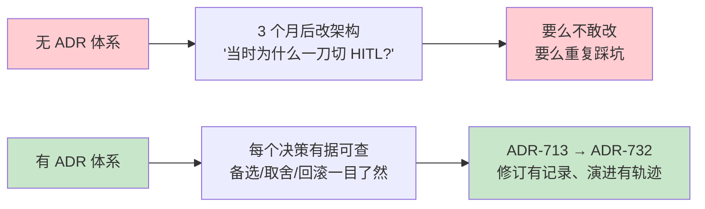
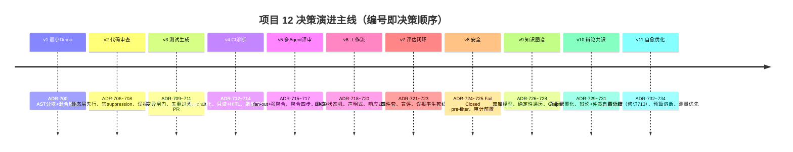
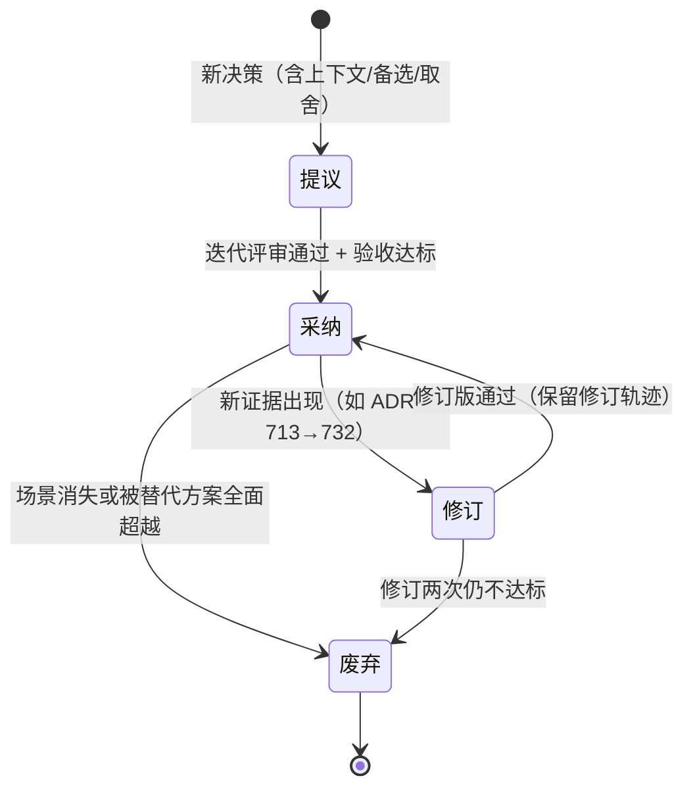

# 项目 12：研发效能 DevOps 平台 — 13-ADR架构决策记录

> **定位**：把项目 12 全部 11 个迭代（v1-v8 主体 + v9-v11 进阶）的 **35 条架构决策**汇集成体系化 ADR（Architecture Decision Record）——每条关键决策补齐**决策上下文 / 备选方案 / 取舍理由 / 后果与可回滚性**。这是本项目的"决策资产"：三个月后的你（或接手的新人）想改架构时，能查到"当时为什么这么定、放弃了什么、怎么回滚"。读者画像：想理解项目 12 每个"为什么"的读者，以及想把 ADR 当架构纪律范式的读者。前置阅读：[00-需求分析与架构设计](00-需求分析与架构设计.md)、方法论见 [附录 07-架构决策方法论]。
>
> **铁律 0**：涉及 Spring AI 2.0 API 的决策均经本地 jar `javap` 实证（[附录 05-SpringAI2-API基准] 为 ground truth）。

---

## 1. 为什么需要 ADR

v11 的痛点（[12 §7]）很典型：决策散落在 11 个迭代篇的 §5 小表里，只有"决策 + 理由"两列——没有备选方案、没有回滚路径；ADR-713 被修订这件事只在 [12 §2.1] 提了一句，新人无从追溯。

**ADR 四要素**（[附录 07-架构决策方法论]）：上下文（当时面对什么问题与证据）、决策（选了什么）、后果（付出什么代价、如何回滚）、状态（采纳/修订/废弃）。本项目 ADR 编号 700-734，与各迭代篇的小表一一对应。

### 1.1 本节核对（ADR 动机与四要素）

| # | 核对项 | 判据 |
|---|--------|------|
| 1 | 痛点承接真实 | "决策散落 11 篇 §5 小表、ADR-713 修订只有一句"与 [12 §7] 痛点一致，非空谈 |
| 2 | 四要素可操作 | 上下文/决策/后果/状态四项均已定义，且 §3 每条按此展开 |
| 3 | 编号口径一致 | 编号 700-734 共 35 条，与 §2 总览及各迭代篇 §5 小表可对账 |

## 2. ADR 总览（v1-v11，35 条）

| 主题域 | ADR | 一句话决策 |
|--------|-----|-----------|
| 检索与理解 | 700、701、726、727、728 | AST 分块 + 混合检索；结构走图、语义走向量 |
| 审查分层 | 702、706、707、708 | 确定性优先 + LLM 收尾；禁止 LLM suppression 真阳性 |
| 测试质量 | 703、709、710、711 | 变异测试闸门（不可刷分）+ 五重过滤 + draft PR |
| CI 治理 | 712、713、714、732、733、734 | 日志结构化先行；自愈分级 + 预算熔断（713 被 732 修订） |
| 多 Agent | 704、715、716、717、729、730、731 | fan-out + 强聚合；辩论 + 仲裁；置信度联动动作 |
| 编排 | 718、719、720 | 结构 DAG、生命周期状态机、流程声明式 |
| 评估 | 721、722、723 | 四件套接入发布闸门；盲评；误报率 <5% 生死线 |
| 安全 | 705、724、725 | 永不 auto-merge；检索前 Fail Closed；审计前置 |

### 2.1 本节核对（总览口径）

| # | 核对项 | 判据 |
|---|--------|------|
| 1 | 35 条可对账 | timeline 各迭代 ADR 号段（700/706-708/709-711/712-714/715-717/718-720/721-723/724-725/726-728/729-731/732-734）与主题表合计 35 条一致 |
| 2 | 主题域覆盖 8 域 | 检索/审查/测试/CI 治理/多 Agent/编排/评估/安全 8 域无遗漏，ADV-700~734 全部归域 |

## 3. 关键 ADR 详解（10 条）

> 每条按四要素展开：上下文 → 备选 → 取舍 → 后果与回滚。未展开的 25 条见各迭代篇 §5。

### 3.1 ADR-700/701：代码索引用 AST 分块 + 混合检索

- **上下文**（v1）：200 万行 Java 核心仓要支撑"代码问答"。文本切块把方法切开、丢失作用域；纯向量检索对符号名（`place` vs `submit`）几乎失明。
- **备选**：① 文本切块 + 纯向量（实现最快）② AST 分块 + 纯 FTS（符号准、语义盲）③ AST 分块 + 向量/FTS/符号三路 RRF 融合。
- **取舍**：选③。依据是"代码 RAG 是解析问题非检索问题"——AST 分块 Recall@5 +4.3（cAST 论文）；三路成本是索引管线复杂度（可接受），收益是符号与语义双准。代价：JavaParser 依赖 + 建图时长（v9 用增量建图缓解）。
- **后果与回滚**：`code_chunk` 表的 `scope_chain`/`qualified_name` 元数据是后续全部能力（审查上下文切片、幻觉过滤、图谱）的地基。回滚路径：分块策略可降级为行窗口（保留 schema 不变），检索路数可配置关闭。

### 3.2 ADR-702/706：确定性优先 + LLM 收尾的分层策略

- **上下文**（v2）：PR 审查直接用 LLM，误报率 ~33%（Copilot 实测口径），开发者两周内就会忽略所有 AI 评论。
- **备选**：① 纯 LLM 审查（语义强但误报超标）② 纯 SAST（零误报但语义盲，复杂度/架构问题全漏）③ SAST 硬门禁（L1）+ LLM 语义收尾（L2）。
- **取舍**：选③。SAST+LLM 混合 F1 0.91-0.95 vs 纯 LLM 0.61-0.68。分层本质：**确定性规则抓"已知问题"，LLM 只处理"规则写不出的语义判断"**。代价：两级管线延迟 +~4 秒（可并行化缓解）。
- **后果与回滚**：这条分层策略后来贯穿全项目（CI 诊断的结构化先行 [04]、瓶颈分析的测量先行 [12 §2.4]），是项目 12 的第一设计哲学。回滚：L1 可按规则集灰度关闭，L2 独立可用。

### 3.3 ADR-704/715/730：评审多 Agent 拓扑（fan-out → 强聚合 → 辩论仲裁）

- **上下文**（v5→v10）：单 Agent 审查顾此失彼（一个 PR 同时涉安全/性能/架构）；四专家并列后评论重复矛盾；分歧只能整体上抛，人工仲裁负担重。
- **备选**：① 串行专家（一个看完另一个看）② 对撕式重审（专家 A 发现后专家 B 复核）③ 并行 fan-out + 强聚合（聚合只融合不重审）④ ③ + 按需辩论轮 + 仲裁。
- **取舍**：v5 选③——串行延迟翻倍；对撕式重审实证性降低 precision。v10 升级到④：分歧率 ~15% 时人工负担不可接受，辩论 + 仲裁消化 ≥70%。两条红线不变：**聚合/仲裁层禁止重新审查**（只融合/裁决既有论据）、**辩论轮数上限 2**（Token 预算）。
- **后果与回滚**：拓扑 = "星型一次聚合" + "按需辩论环"，专家面板配置化（ADR-729）意味着改拓扑不改代码。回滚：关闭辩论即退回 v5 行为；关闭多 Agent 即退回 v2 单 Agent。

### 3.4 ADR-705：AI 永不 auto-merge，全部人工审批

- **上下文**（v2 定，v8 复核）：AI 审查的 PR 合并率 45.2% vs 人工 68.4%（MSR 2026）——自动合并的信任成本远超效率收益；研发场景一次错误合并可能污染主干数百人。
- **备选**：① 高置信评论自动 approve ② 人工抽检 + 自动合并 ③ 全量人工审批（AI 锁死在"建议者"）。
- **取舍**：选③。这是全项目唯一**零例外**的决策——v11 的自愈分级（ADR-732）修订了 ADR-713，但从未触碰本条：回滚生产版本可以审批后执行，**合并代码永远是人签字**。
- **后果与回滚**：评审采纳率是核心北极星指标（v7 埋点），而非合并自动化率。回滚：不适用（本条不可回滚——回滚即放弃红线）。

### 3.5 ADR-703/709：测试用变异测试闸门（非行覆盖率）

- **上下文**（v3）：LLM 生成测试可把行覆盖率刷到 92%，但只杀 58-62% 变异（人类 78%）——"跑过"不等于"抓住 bug"。
- **备选**：① 行覆盖率闸门（快但可刷分）② 分支覆盖率（略好仍可刷）③ 变异测试 kill rate 闸门（PIT 注入变异体，测试必须杀死）。
- **取舍**：选③。变异分数不可刷——变异体是注入的真实行为变更。代价：PIT 运行时长（CI 增 ~8 分钟，v11 用分片并行压到 ~3 分钟）。
- **后果与回滚**：`MutationGate` 解析 `mutations.xml` 算 kill rate 是质量闸门的本质；行覆盖率保留为参考指标（不阻断）。回滚：闸门阈值可调，变异测试可降级为周度任务。

### 3.6 ADR-713→732：自愈动作分级（一条被修订的 ADR）

- **上下文**（v4 定 → v11 修订）：v4 时代无历史数据，"诊断只读 + 全部动作 HITL"是对的；但 v11 统计显示 flaky 重试占审批量 60%，夜间失败平均挂 8 小时——一刀切保守的代价显性化。
- **备选**：① 维持 ADR-713 不变（人工负担不可持续）② 全自动自愈（盲赌，掩盖真 bug）③ 按动作风险特征分级：无代码变更类（重试/换 runner）证据达标可自动，永久变更类（回滚/改代码）永远 HITL。
- **取舍**：选③，以 ADR-732 显式修订 ADR-713（非静默推翻）。修订依据是新证据：跨构建签名库能算 flaky 率（≥70% 且出现 ≥5 次才触发）。配套两道笼子：预算（单 build ≤3 次）与熔断（同签名连败 3 次停手转人工，ADR-733）。
- **后果与回滚**：这是本项目"决策可演进"的范本——ADR 不是刻在石头上，修订要留轨迹（谁、何时、凭什么新证据）。回滚：`healing_policy.enabled=false` 一键退回全人工（v4 行为）。

### 3.7 ADR-718/719/720：结构用 DAG、生命周期用状态机、流程声明式

- **上下文**（v6）：评审流程硬编码在 Java 里（安全先于合规、性能可并行），改一个顺序要发版。
- **备选**：① 代码硬编码（现状）② 纯状态机（表达并行/汇合笨拙）③ 纯 DAG（表达生命周期迁移笨拙）④ DAG（结构）+ 状态机（生命周期）双层。
- **取舍**：选④，业界收敛结论（Spring AI Alibaba Graph / Koog 同型）。`WorkflowEngine` 响应式执行（就绪节点 `flatMap` 并行，[教程 79]）；评审规则是业务，业务不该改代码（声明式 YAML/DB 配置）。
- **后果与回滚**：v10 的 debate 节点、v11 的自愈动作都作为工作流节点接入——编排层是扩展点。回滚：`ReviewWorkflow` 可退回 v5 硬编码路径（保留双实现一迭代期）。

### 3.8 ADR-721/723：评估闭环接入发布闸门

- **上下文**（v7）：评审质量说不清——"v6 是不是比 v5 好"靠感觉；上线一次劣化，开发者信任崩塌需数周重建。
- **备选**：① 只看线上反馈（滞后、混杂因素多）② 只做离线 golden 回归（离线好≠线上好）③ 四件套：离线 golden + 线上埋点 + 盲评 + 灰度对照，且**误报率 <5% 是发布闸门**（不达标禁止全量）。
- **取舍**：选③。单靠一种评估都有盲区（LLM-judge 确认偏置可改变检出率 59.6pp，必须脱敏盲评 + 人工抽检双轨）。代价：golden 集维护成本（每周 ~2 小时人工标注）。
- **后果与回滚**：`GrayComparisonService` 只上线统计显著的改进——评估从"报表"变成"闸门"。回滚：闸门阈值可调；灰度可一键回退上一版本（[教程 62]）。

### 3.9 ADR-724/725：私有代码数据不出域（检索前 Fail Closed + 审计前置）

- **上下文**（v8）：代码 100% 过 LLM（审查/问答/测试生成），但"哪些涉密、谁在访问、是否出域"无治理；事后过滤是结构性失败——敏感代码已经进了上下文。
- **备选**：① 检索后过滤（先召回再删敏感——已泄露进 prompt）② 检索前 ANN pre-filter（`filterExpression` 元数据过滤）+ Fail Closed 二次校验 ③ 完全私有化 LLM（成本高、能力受限）。
- **取舍**：选②为主、③为可选增强（涉密仓走本地模型）。纪律：权限过滤在 pre-filter 层、无权限即拒绝（不静默跳过）、审计在 **LLM 处理前**落库（谁看了什么 chunk + 内容哈希）。
- **后果与回滚**：`acl_policy`/`audit_log` 表 + Redis Streams 送 SIEM。回滚：Filter 摘除即退回（不推荐——合规义务不可回滚，技术路径可切换 ②↔③）。

### 3.10 ADR-726/728：双库模型 + GraphRAG 式代码问答

- **上下文**（v9）：chunk 级索引答不出"影响面/为什么"——调用关系是图问题，向量相似度原理上答不了。
- **备选**：① 全塞向量库（边查询做不了）② 图数据库（Neo4j 等新组件）③ PG 边表（`code_entity`/`code_edge`）+ 向量库双库。
- **取舍**：选③。PG 边表 + 反向 BFS 足够（500 仓库规模量级），不引入新存储组件；结构问题走确定性图遍历（零 LLM），语义问题走向量，GraphRAG 问答"图先行 + 向量补充 + 引用白名单"。
- **后果与回滚**：影响分析成为测试专家（v10）与 CI 根因定位（v11）的共享底座。回滚：图能力独立开关，退回 v1 检索不影响主链路；未来量级超 PG 承载再议图数据库（决策点已记录）。

### 3.11 本节核对（十条详解完整性）

| # | 核对项 | 判据 |
|---|--------|------|
| 1 | 10 条四要素齐全 | 3.1-3.10 每条均含上下文/备选/取舍/后果与回滚四项，无省略（未展开 25 条已明示见各迭代篇 §5） |
| 2 | 与迭代篇对账 | 抽查 3.6（ADR-713→732）与 [12 §2.1/§6] 一致；3.3（704/715/730）与 [10/11] 一致 |
| 3 | 决策点落地可回滚 | 每条"后果与回滚"给出可操作回滚路径（配置开关/功能降级/方案切换），非空话 |

## 4. ADR 使用规范（决策纪律）

1. **编号即顺序**：ADR-700 起顺序分配，不复用废弃编号（废弃保留在总览表，状态标 ❌）。
2. **修订不删除**：被修订的 ADR 保留原文，新 ADR 引用旧编号并说明新证据（ADR-732 → ADR-713 是范本）。
3. **每迭代 ≤3 条**：防决策通胀——小选择不进 ADR，进迭代篇正文即可。
4. **四问绑定**：每条 ADR 必须能回溯到"当次迭代的四问"（新增需求/影响模块/演进/痛点）。

### 4.1 本节核对（决策纪律五条）

| # | 核对项 | 判据 |
|---|--------|------|
| 1 | 四规则可执行 | 编号顺序/修订保留/每迭代≤3/四问绑定四条均有明确动作，且状态机图（提议→采纳→修订→废弃）呼应 |
| 2 | 与正文实例一致 | "修订不删除"以 ADR-713→732 为范本，与 §3.6 一致；"每迭代≤3"与各迭代篇 §5 小表 2-3 条吻合 |

## 5. 总结

35 条 ADR 收敛出项目 12 的三条不变铁律：**确定性优先 + LLM 收尾**（702/712/734 一脉相承）、**AI 锁死建议者 + 高风险动作 HITL**（705 从未被触碰，713 只是被 732 精确化）、**评估是闸门不是报表**（721/723 让每次上线可证明不劣化）。这套决策资产配合 [附录 07-架构决策方法论] 的四要素模板，可直接复用到任何 Agent 平台项目。

### 5.1 本节核对（总结铁律可回溯）

| # | 核对项 | 判据 |
|---|--------|------|
| 1 | 三条铁律有 ADR 依据 | 确定性优先→702/712/734；AI 锁建议者+HITL→705/732；评估是闸门→721/723，均可回查 §3 |
| 2 | 复用性成立 | 四要素模板（[附录 08]）+35 条 ADR 可复用于任何 Agent 平台，非项目 12 专属结论 |

**下一篇**：[14-工业前沿与演进方向.md](14-工业前沿与演进方向.md)——站在 2026 年行业前沿（Google Bake-Off / AWS / Nebius）审视平台缺口与演进路线。
