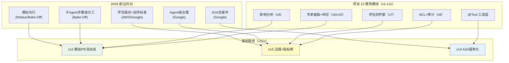
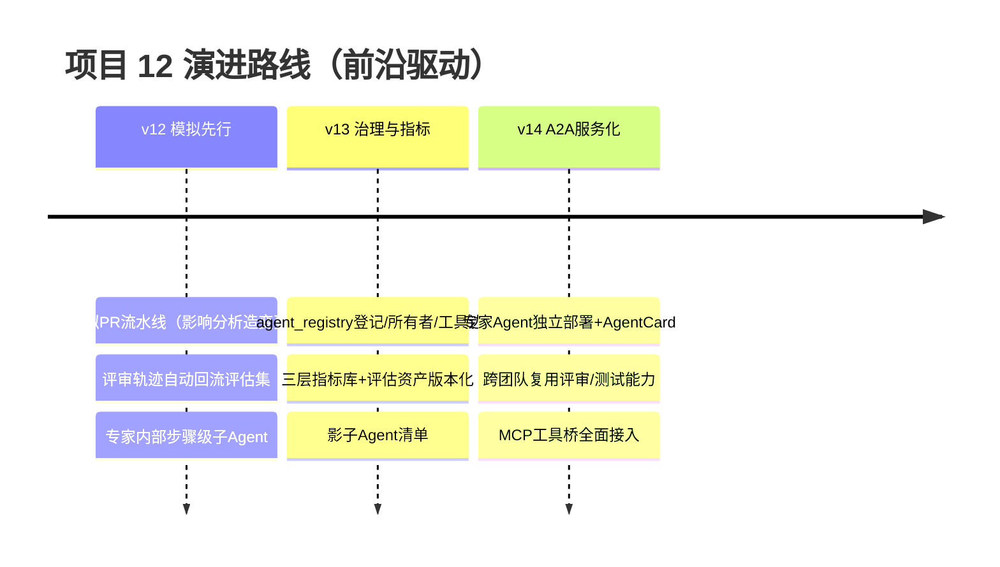
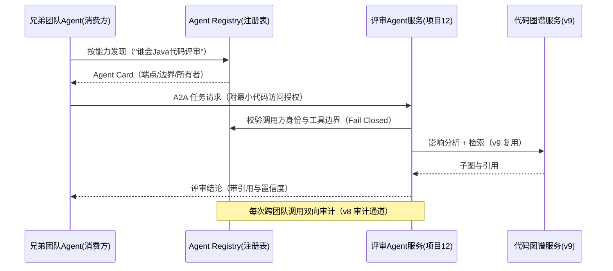

# 项目 12：研发效能 DevOps 平台 — 14-工业前沿与演进方向

> **定位**：对项目 12 做**工业前沿对照**——梳理 2026 年 Google（Agent Bake-Off、生产指南）、AWS、Nebius 关于研发效能 Agent / 企业 Agent 生产落地的公开经验，逐条映射到本平台 11 个迭代（v1-v11）的既有能力，找出缺口并给出**演进路线（v12+）**。读者画像：读完 00-13 想站在行业前沿审视平台设计的读者。前置阅读：[13-ADR架构决策记录](13-ADR架构决策记录.md)、[教程 41-数据飞轮与持续改进]、[教程 43-Agent治理与合规框架]。
>
> **来源**：本文引用均为真实外部资料，已标注链接（CLAUDE.md 规则 14）；引用内容的表述以原文为准，推断处明确标注「平台映射（本文观点）」。

---

## 1. 调研结论：2026 研发效能 Agent 的五个共识

### 1.1 子 Agent 分工是最大的效率杠杆

Google 在 Agent Bake-Off（内部多团队 Agent 竞赛，数百真实工程任务）总结的五条开发者经验中，**用专门化的子 Agent 分工替代单个通用 Agent**是反复出现的赢家模式：单一"超级 Agent"要在一个上下文里塞进全部工具/规则，检索与推理互相干扰；拆成职责单一的子 Agent 后，其中一支队伍把任务处理时间**从约 1 小时压到约 10 分钟**（[Google Bake-Off](https://developers.googleblog.com/build-better-ai-agents-5-developer-tips-from-the-agent-bake-off/)）。

**平台映射（本文观点）**：这正是 v5/v10 已经落地的路径——专家面板（安全/性能/风格/测试）+ 强聚合 + 辩论仲裁。Bake-Off 的增量启示在**粒度**：他们拆的是"任务步骤级"子 Agent（如"专门读代码的"“专门跑测试的”），而我们拆的是"评审维度级"——v12+ 可下沉一层（见 §3 N2）。

### 1.2 评估驱动开发（evaluation-driven development）

Google 生产指南强调：生产级 Agent 的分水岭不是模型选型，而是**有没有可持续运行的评估集与回归基线**——上线前跑评估、每次改动跑回归、失败案例回流评估集（[Google 五篇生产指南](https://cloud.google.com/blog/topics/developers-practitioners/five-guides-to-building-and-scaling-production-ready-ai-agents)）。AWS 企业指南给出更冷的数据视角：大量 Agent 项目因无法证明价值被砍，**评估标准必须企业自持**（golden 集是护城河，不是外购品）（[AWS 企业级 Agent 实践](https://cloud.it168.com/a2026/0708/6939/000006939041.shtml)）。

**平台映射**：v7 四件套（golden + 埋点 + 盲评 + 灰度）正是这个范式；ADR-723 把误报率 <5% 设为发布闸门。缺口在**评估集的自动生长**——目前 golden 集靠人工标注（每周 ~2 小时），Bake-Off 的"模拟先行"提供了自动化路径（§1.3）。

### 1.3 模拟先行：部署前产出回归集

Nebius Agents Blueprint 把"simulate before you scale"列为核心工程纪律：Agent 上线/改版前，先在沙箱里跑**数百个模拟任务**，把失败与成功轨迹沉淀为评估集和回归套件——用模拟换确定性，而不是拿生产流量试错（[Nebius Agents Blueprint](https://nebius.com/blog/posts/introducing-the-nebius-agents-blueprint)）。Google Bake-Off 的队伍同样靠"先造评估任务集再开发 Agent"拿下高名次（[Google Bake-Off](https://developers.googleblog.com/build-better-ai-agents-5-developer-tips-from-the-agent-bake-off/)）。

**平台映射**：这是 v7 之后最大的缺口。我们已有全部原料——v9 影响分析能生成"改这里"的模拟变更、v2 `FalsePositiveLibrary` 有历史正负样本、CI 有真实失败签名库——缺的是把它们组装成"模拟 PR 流水线"（§3 N1）。

### 1.4 Agent 级治理：把 Agent 当一等公民管理

Google 生产指南提出 Agent 治理栈：每个 Agent **集中登记**（所有者、目标数据、允许工具、行为边界），网关层用自然语言安全策略管住"Agent 能做什么"，行为异常进看板——防"影子 AI"（无人认领的 Agent 在生产乱跑）（[Google 五篇生产指南](https://cloud.google.com/blog/topics/developers-practitioners/five-guides-to-building-and-scaling-production-ready-ai-agents)）。

**平台映射**：v8 做到了"人 → 代码"的 ACL 与审计，但**Agent 本身没有登记表**——v10 面板配置化后，专家 Agent 是配置衍生物，无所有者/无工具边界清单/无行为基线。缺口见 §3 N4。

### 1.5 开放互操作：MCP 是工具桥，A2A 是 Agent 桥

Google 生产指南反复强调 MCP（工具接入）+ A2A（Agent 间互操作）双标准：企业内部 Agent 要跨团队互调（你的评审 Agent 调我的测试 Agent），靠 Agent Card 声明能力与端点（[Google 五篇生产指南](https://cloud.google.com/blog/topics/developers-practitioners/five-guides-to-building-and-scaling-production-ready-ai-agents)；协议详解见 [前沿 00-A2A协议]）。

**平台映射**：工具层已是 Spring AI 2.0 `@Tool` + `ToolCallbackProvider` 形态（可平滑接 MCP，[教程 11-MCP协议]）；但四个专家 Agent 目前是进程内 Bean，**未对外发布能力**——兄弟团队（如中台、安全团队）无法复用（§3 N5）。

### 1.6 本节核对（五共识 + 平台映射）

| # | 核对项 | 判据 |
|---|--------|------|
| 1 | 五共识齐全 | 子 Agent 分工/评估驱动/模拟先行/Agent 治理/开放互操作（MCP+A2A）五条均有外部来源链接 |
| 2 | 每条有平台映射结论 | 1.1-1.5 每条均标注「平台映射（本文观点）」并指认 v5/v7/v8/v10 对应能力或缺口，无悬空断言 |
| 3 | 引用来源真实 | 五条分别引用 Google Bake-Off / 生产指南 / AWS / Nebius 链接，无未标注来源的推断 |

## 2. 前沿对照：平台现状 vs 缺口

| # | 前沿特性 | 来源 | 平台现状（v11） | 缺口与演进 |
|---|---------|------|----------------|-----------|
| N1 | **模拟先行**：部署前跑模拟任务，产出评估集/回归套件 | [Nebius](https://nebius.com/blog/posts/introducing-the-nebius-agents-blueprint)、[Bake-Off](https://developers.googleblog.com/build-better-ai-agents-5-developer-tips-from-the-agent-bake-off/) | v7 golden 集纯人工标注 | v12：模拟 PR 流水线（影响分析造变更 → 跑评审 → 轨迹回流评估集） |
| N2 | **子 Agent 步骤级分工**（1h→10min 量级） | [Bake-Off](https://developers.googleblog.com/build-better-ai-agents-5-developer-tips-from-the-agent-bake-off/) | 维度级专家面板（v5/v10） | v12：评审专家内部再拆"读代码/查证据/写结论"子步骤 |
| N3 | **评估驱动开发 + 企业自持标准** | [AWS](https://cloud.it168.com/a2026/0708/6939/000006939041.shtml)、[Google](https://cloud.google.com/blog/topics/developers-practitioners/five-guides-to-building-and-scaling-production-ready-ai-agents) | 四件套 + 发布闸门（v7） | v13：三层指标库（任务级/维度级/系统级）+ 评估资产版本化 |
| N4 | **Agent 级治理**：登记/所有者/工具边界/行为异常 | [Google](https://cloud.google.com/blog/topics/developers-practitioners/five-guides-to-building-and-scaling-production-ready-ai-agents) | 人→代码 ACL（v8），Agent 无登记 | v13：agent_registry（所有者/工具边界/行为基线/影子清单） |
| N5 | **A2A 互操作**：Agent Card 发布能力 | [Google](https://cloud.google.com/blog/topics/developers-practitioners/five-guides-to-building-and-scaling-production-ready-ai-agents) | 专家 Agent 进程内 Bean | v14：专家 Agent 服务化 + Agent Card，跨团队复用 |
| N6 | **失败是系统失败**：检索/编排/评估的影响大于模型增量 | [Nebius](https://nebius.com/blog/posts/introducing-the-nebius-agents-blueprint) | 已内化（ADR-700 系列全在系统工程） | 持续：每迭代"四问"驱动，无模型升级依赖 |

**映射的关键判断**：六个前沿特性里有三个（N1/N2/N4）的落地材料**平台已经具备**——影响分析、专家面板、ACL 审计都是现成积木，缺的只是组装。这印证了 Nebius 的判断：难的从来不是模型，是系统工程。

### 2.1 本节核对（前沿对照表）

| # | 核对项 | 判据 |
|---|--------|------|
| 1 | N1-N6 六行对照完整 | 每行含前沿特性/来源/平台现状/缺口与演进 4 列，N1-N5 有演进版本号（v12/v13/v14），N6 为持续项 |
| 2 | "缺口有材料"判断可落地 | "N1/N2/N4 材料已具备（影响分析/专家面板/ACL）"与 §3 对应模块（v9/v10/v8）一致，非口号 |

## 3. 演进路线 v12+

### 3.1 v12：模拟先行（最高优先级——直接强化发布闸门）

用 v9 影响分析**批量生成模拟 PR**（对历史重构点做语义变异——改签名/改边界条件），推送模拟流水线：静态层 → 专家面板 → 辩论仲裁，全部轨迹（发现/漏报/误报）自动沉淀为评估集样本。人工标注从"每周标 2 小时"变为"每周抽检 30 分钟"。**验收**：评估集样本周增速 ≥ 10 倍，回归覆盖的历史失败模式 ≥ 80%。

### 3.2 v13：Agent 治理 + 三层指标库

`agent_registry` 表登记每个 Agent（所有者/目标数据/允许工具/行为基线），v10 的 `ExpertPanelConfig` 升级为"从注册表装配"——未登记的专家不允许上岗（Fail Closed，继承 ADR-724 纪律）。三层指标库：任务级（PR 评审质量）/ 维度级（各专家 P/R）/ 系统级（延迟/成本/自愈率），评估资产全部版本化（哪个 golden 版本放行哪个平台版本，可追溯）。

### 3.3 v14：A2A 服务化

评审/测试/影响分析 Agent 独立部署，发布 Agent Card（能力声明 + 端点 + 安全边界），兄弟团队经 A2A 协议互调——研发效能平台从"内部工具"演进为"企业 Agent 生态的一个能力提供方"（[前沿 00-A2A协议]）。

**治理联动**：跨团队调用双向审计（消费方是谁、调了什么、返回了什么）——复用 v8 `AuditService` 通道，A2A 不开辟审计旁路。

### 3.4 本节核对（演进路线 v12+）

| # | 核对项 | 判据 |
|---|--------|------|
| 1 | 三步演进有优先级 | v12（模拟先行）标注最高优先级并给验收（样本周增速 ≥10 倍、回归覆盖 ≥80%）；v13/v14 递进 |
| 2 | 每步复用既有积木 | v12 用 v9 影响分析；v13 复用 v8 Fail Closed + v10 ExpertPanelConfig；v14 复用 v8 AuditService，均指明源头模块 |
| 3 | 治理红线不破 | v14 A2A 双向审计复用 v8 通道（不开旁路），v13 Fail Closed 继承 ADR-724，与项目红线一致 |

## 4. 架构师视角：三条不变的铁律

前沿会变（明年可能有新框架、新协议），但项目 12 的三条铁律在上述全部外部资料中都被独立印证，**演进中不破**：

1. **确定性优先 + LLM 收尾**（ADR-702/712/734）：Bake-Off 赢家同样是"规则/工具做重活，LLM 做语义判断"；Nebius 的"Harness 占 80%"同一结论。
2. **AI 锁死建议者，高风险动作 HITL**（ADR-705/732）：Google 治理栈的"网关层安全策略"、AWS 的"人在环上"是同一红线的不同表述。
3. **评估是闸门不是报表**（ADR-721/723）：评估驱动开发成为行业共识，只会让这条铁律更硬——v12 的模拟先行本质上就是给闸门"自动补弹药"。

### 4.1 本节核对（三条铁律被外部资料印证）

| # | 核对项 | 判据 |
|---|--------|------|
| 1 | 三条各有 ADR 依据 | 第 1~3 条分别引用 ADR-702/712/734、705/732、721/723，可回查 [13] |
| 2 | 每条有外部印证 | 每条均对应 Bake-Off/Nebius/Google/AWS 表述，证明"前沿印证既有设计"非自说自话 |

## 5. 总结

项目 12 至此完整收官：**11 个迭代（v1-v11）+ 35 条 ADR + 5 篇进阶（图谱/辩论/自愈/ADR/前沿）**，从"代码库问答"一路演进到"仓库知识图谱、辩论共识评审、分级自愈 CI"。前沿对照的结论令人踏实：2026 年行业共识（子 Agent 分工、评估驱动、模拟先行、Agent 治理、A2A 互操作）没有一条推翻本项目的设计，反而全部落在既有模块的延伸方向上——v12-v14 的演进材料（影响分析、专家面板、ACL 审计）都已在手。**这正是"系统工程优先"路线的回报：模型会换代，架构资产复利。**

### 5.1 本节核对（收官三问 + 演进资产）

| # | 核对项 | 判据 |
|---|--------|------|
| 1 | 三问可回答 | 误报率生死线→v7 ADR-723；变异不可刷分→v3 ADR-709；自愈分级+熔断→v12 ADR-732/733，均可在前文回溯 |
| 2 | 演进材料在案 | "影响分析/专家面板/ACL 审计"分别对应 v9/v10/v8 章节，与 §2.1 缺口判断一致，非留白 |

**至此，项目 09-12 四个工业落地项目全部完成。** 检验标准：能独立讲清"为什么研发效能 Agent 的生死线是误报率而不是检出率"、"为什么变异测试不可刷分而覆盖率可刷"、"为什么自愈必须分级且有熔断"——能回答这三问，你就从"会用 AI 编码工具"跨入了"能设计研发效能平台"。
