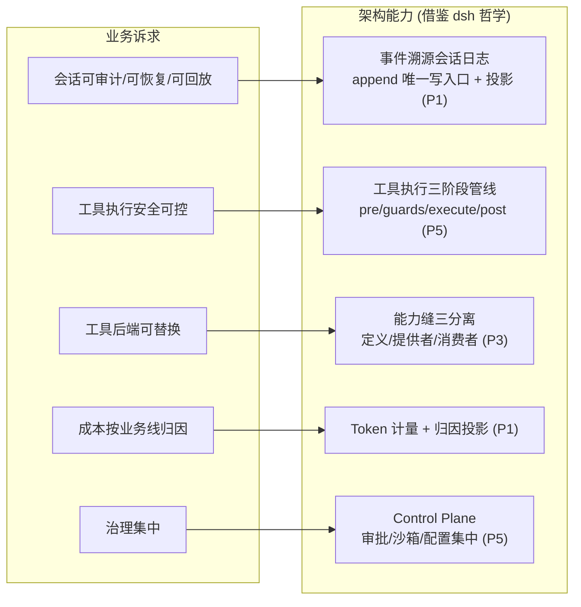
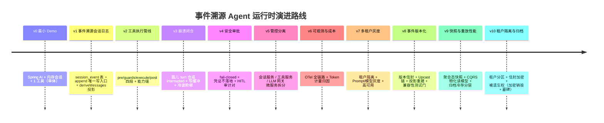

# 项目 13：事件溯源 Agent 运行时平台 — 00-需求分析与架构设计

> **定位**：本文是项目 13 的起点——一个以「**会话日志即真相**」为核心哲学的工业级 Agent 运行时平台。项目 13 是**完整独立**的项目，不依赖也不引用任何其他项目（00-12、14+）的内容。**本项目的核心使命：把 DeepSeek Harness 的设计哲学（事件溯源会话日志、能力缝、工具执行管线、fail-closed）从 TS 世界移植到 Spring AI 2.0，并演进到工业可落地**。设计哲学借鉴自 [附录 14-开源代码深度分析/00-deepseek-harness/11-设计哲学与架构模式]。
>
> 「遇到阻塞？→ [教程 00-基础与核心/02-ChatClient与对话模型]、[教程 00-基础与核心/03-工具调用]、[教程 02-SpringAI核心机制/01-Advisor链与拦截器]、[教程 04-企业级架构主干/05-历史记录持久化与合规]、[教程 04-企业级架构主干/08-Human-in-the-Loop与审批流]、[教程 04-企业级架构主干/11-安全与权限控制]、[附录 07-架构决策方法论/00-ADR架构决策记录]」

---

## ★ 阅读顺序总览（序号 = 你的实际阅读顺序）

> 本子文件夹 15 个文件，**文件名编号 00-14 即阅读顺序**。按「全貌 → 起步 → 主体迭代 → 代码讲解 → 进阶迭代 → 决策资产 → 前沿收官」组织，每文件标注读者应在什么阶段读：

| 阶段 | 文件 | 读者定位 |
|------|------|---------|
| ① 全貌 | 00-需求分析与架构设计 | **先读**：为什么建这个平台、借鉴什么哲学、演进路线与验收基线 |
| ② 起步 | 01-最小Demo搭建 | **动手**：跑通最小闭环，故意暴露痛点 |
| ③ 主体迭代 | 02~08（迭代一~七） | **严格顺序**：事件溯源地基 → 工具管线 → 崩溃恢复 → 安全审批 → 管控分离 → 可观测成本 → 多租户灰度高可用——每迭代先跑量化验收再进下一步 |
| ④ 代码讲解 | 09-核心代码讲解 | **回顾**：代码地图 + 五段核心代码精讲 + 手写顺序（读完 01-08 回来对照） |
| ⑤ 进阶迭代 | 10~12（迭代八~十） | **进阶**：事件版本化与模式演进 → 快照与重放性能（CQRS/归档）→ 多租户事件隔离与被遗忘权——工业化深水区，读完 09 后按序深入 |
| ⑥ 决策资产 | 13-ADR架构决策记录 | **按需查阅**：23 条 ADR 的全景、关联链与生命周期——改任何架构决策前必读 |
| ⑦ 前沿收官 | 14-工业前沿与演进方向 | **收官**：2026 前沿对照（Google / Nebius / PagerDuty）+ 五条演进方向与优先级 |

> 按此顺序，读者从「知道为什么建」一路走到「能照着搭到生产、并能判断下一步往哪演进」。

---

## 1. 业务场景

### 1.1 背景

某集团（员工 3 万+，含强合规的金融与政务业务线）建设了一个 Spring AI Agent 平台，遇到四个尖锐问题：

| 问题 | 表现 | 根因 |
|------|------|------|
| **会话不可信** | 客服会话崩溃后上下文丢失；审计要回放对话拿不出完整记录；"当时模型看到了什么"无法证明 | 会话存在内存，无事件溯源 |
| **工具不可换** | "查订单"工具本机直连 DB；要切到沙箱/远程后端，改动波及所有业务线 | 工具实现与模型面 schema 耦合 |
| **执行不可控** | 工具调用没有统一策略位：审批、超时、沙箱、重复提醒要么没有、要么各写各的 | 无工具执行管线 |
| **成本说不清** | LLM 调用 Token 无法按业务线归因，预算无法分配 | 无 Token 计量与归因 |

### 1.2 集团需求（原始诉求）

1. **会话可审计、可恢复、可回放**（合规硬要求）——"任何一个会话，过去发生的每一件事都能从日志重建"
2. **工具执行安全可控**——"模型调用工具，先过审批/沙箱/超时，默认拒绝"
3. **工具后端可替换**——"换执行环境，不换模型提问方式"
4. **成本按业务线归因**——"每个业务线 AI 花了多少钱，逐 Token 可查"
5. **治理集中**——"安全策略、Prompt、模型路由一处配置，各处生效"

### 1.3 需求到架构能力的映射（设计哲学借鉴）

本项目的架构能力直接来自 DeepSeek Harness 的五条设计哲学（[附录 14-开源代码深度分析/00-deepseek-harness/11-设计哲学与架构模式 §二]），翻译到 Spring AI 2.0：

> **设计哲学来源**：本项目的五条架构能力分别对应 dsh 的 P1（日志即真相）、P3（能力可整体替换）、P4（状态由数据推导）、P5（fail-closed）。移植时机制用 Java 表达（Spring 事件总线 + 拦截器 + SPI），决策不变。

### 1.4 非目标

- 不做多租户 SaaS（业务线内共享租户，对外 SaaS 是别的项目问题域）
- 不做 Agent 业务逻辑（业务线自理，平台提供运行时能力）
- 不做前端 UI（消费方是业务线后端/前端，平台提供 API）
- 不追求比 dsh 更强的沙箱（沙箱深度交给安全团队，平台提供策略位）

### 1.5 本节核对（业务场景与架构能力）

- [ ] 四个尖锐问题（会话不可信/工具不可换/执行不可控/成本说不清）与五条架构能力（C1-C5）能一一映射，说不出映射即 FAIL
- [ ] 五条设计哲学（P1/P3/P4/P5）与五条架构能力对应关系与正文一致（尤其 P4 状态由数据推导 → C1）
- [ ] 四条非目标均未悄悄混入地图（尤其"不做多租户 SaaS"与"不做 Agent 业务逻辑"）

---

## 2. 演进路线总设计（本项目的灵魂）

**核心纪律：禁止一上来就给最终版架构。** 每一步迭代都由真实痛点驱动，每个迭代回答四问：新增了什么需求、影响了哪些模块、架构如何演进、上一版痛点是什么。

**为什么是这个顺序**（顺序本身就是架构决策）：

| 顺序 | 决策理由 | 反面（先做什么会怎样） |
|------|---------|----------------------|
| 先事件溯源再做一切 | 会话日志是后面所有能力（恢复/审计/回放/投影/归因）的地基；地基晚做，前面的数据全要迁移 | 先做微服务——拆分时才发现会话状态是内存的，无法跨服务重建 |
| 先工具管线再微服务 | 管线是单体内的策略位；先切服务，策略散落各服务更难统一 | 先拆分——审批逻辑在各服务各写一份，治理失效 |
| 先安全再拆分 | fail-closed 语义要在单体内先验证，拆分后边界不变 | 先拆分——安全边界横切服务，排查成本倍增 |
| 可观测/成本放在中后段 | 需要先有稳定的执行链路，观测才有意义 | 先观测——观测的是还不稳定的架构，指标常失真 |

### 2.1 本节核对（演进路线）

- [ ] v0~v10 的 timeline 每个版本与后续迭代篇（01-12）标题一一对应，无缺漏错位
- [ ] "为什么这个顺序"四条理由（先事件溯源/先工具管线/先安全/可观测后置）能不看正文复述，且能指出每条的反面后果
- [ ] 能说出「先做微服务」为何会失败（会话状态在内存，拆分时无法跨服务重建）

---

## 3. 里程碑：企业级能力落地清单

本项目将以下企业级能力作为**迭代里程碑**（不是文末展望）：

| 能力 | 落地迭代 | 落地形态 |
|------|---------|---------|
| **管控分离（Control/Data Plane）** | 迭代五（v5） | 会话/工具/LLM 网关三服务；配置与策略集中 |
| **Human-in-the-Loop 审批** | 迭代四（v4） | `approval/asked + decided` 审计对，fail-closed |
| **全链路可观测** | 迭代六（v6） | Micrometer + OTel，`gen_ai.*` 语义，跨服务 Trace |
| **成本治理（Token 归因）** | 迭代六（v6） | 按业务线归因的 Token 计量投影 |
| **多租户隔离** | 迭代七（v7） | 会话/工具/配额按租户隔离 |
| **灰度发布** | 迭代七（v7） | Prompt/模型按流量切分、可回滚 |

> 对照 [附录 14-开源代码深度分析/00-deepseek-harness/12-Java工程师借鉴手册]：本项目是那条「8 步移植路线图」在 Spring AI 2.0 上的完整演绎——每迭代对应一个取经点。

### 3.1 本节核对（里程碑清单）

- [ ] 六大企业级能力的落地迭代（管控分离/迭代五、HITL/迭代四、可观测/迭代六、成本/迭代六、多租户/迭代七、灰度/迭代七）与迭代索引一致，无错位
- [ ] 能指出这些能力是**迭代里程碑**（在迭代中真正实现）而非文末展望——抽查任一能力落点与对应迭代篇 §4 ADR 呼应

---

## 4. 技术栈与约束

| 组件 | 版本 | 用途 |
|------|------|------|
| Spring Boot | 4.1.0 | 主框架 |
| Spring AI BOM | 2.0.0 | AI 能力（ChatClient/Advisor/@Tool） |
| spring-boot-starter-webflux | 4.1.0 | 响应式（非 MVC） |
| PostgreSQL + JSONB | 稳定 | 事件溯源会话日志 |
| Micrometer + OTel | 稳定 | 可观测 |
| Java | 21 | 编译目标 |

**硬约束**：
- 不生成可运行的完整工程，只讲架构、设计决策与关键代码片段——代码由你手写（[教程 00-基础与核心/03-工具调用] 是代码基础）
- 事件日志写侧**只有一个入口**（`append`），违反即架构违规
- 工具执行**默认拒绝**（fail-closed），显式放行才执行
- 所有模型可见输入必须能从会话日志重建——这是本项目的运行时不变式

### 4.1 本节核对（技术栈与约束）

- [ ] 技术栈与 CLAUDE.md 一致：Spring Boot 4.1.0、Spring AI BOM 2.0.0、webflux（非 MVC）、Java 21——不出现 MVC/旧版本
- [ ] 三条硬约束能复述（唯一 append 入口 / 工具 fail-closed / 模型可见=可重放），并知道它们分别由后续哪篇落地（01/05/02）

---

## 5. ADR 记录（演进决策起点）

### ADR 013-01：会话状态采用事件溯源而非关系型行存储

- **上下文**：合规要求会话可审计可回放；现有会话存内存 + 关系表（只存最终消息，无中间状态）
- **决策**：会话采用「追加式事件日志 + 投影」——`session_event` 表为唯一真相，模型历史、标题、统计、Token 计量都是投影
- **备选方案**：① 关系表存会话最终态（简单但丢失中间过程、不可回放）② 内存 + 定期快照（崩溃丢窗口）③ 事件溯源（本文选择）
- **取舍理由**：事件溯源以「写侧复杂 + 读侧要 fold」换取「可审计、可回放、可恢复、可派生」——合规是硬需求，值得
- **参考**：[附录 14-开源代码深度分析/00-deepseek-harness/02-核心引擎与Agent生命周期 §二]、[教程 04-企业级架构主干/05-历史记录持久化与合规]

### ADR 013-02：工具策略外置为执行管线而非硬编码进工具

- **上下文**：安全/审批/超时策略散落各工具实现
- **决策**：工具执行走「pre/guards/execute/post」四段管线（Spring 拦截器链）；策略以拦截器存在，删掉策略拦截器工具仍能裸跑
- **备选方案**：① 工具内自检（每工具写一套，重复）② AOP 横切（无法按调用精细化决策）③ 拦截器管线（本文选择）
- **取舍理由**：治理不污染执行，策略可独立装卸；呼应 [教程 02-SpringAI核心机制/01-Advisor链与拦截器]

### 5.1 本节核对（预录 ADR）

- [ ] ADR 013-01（事件溯源 vs 关系行存）的取舍能复述：以写侧复杂 + 读侧 fold 换可审计/可回放/可恢复/可派生
- [ ] ADR 013-02 的拦截器管线与 [13-ADR架构决策记录] 的四主题分类能对应（执行与安全)

---

## 6. 迭代索引（本文件是路线图，各迭代独立成篇）

| 篇 | 迭代 | 里程碑 |
|----|------|--------|
| [01-最小Demo搭建] | v0 | 能跑通的 Spring AI 单体 |
| [02-事件溯源会话日志] | v1 | 会话可重建 |
| [03-工具执行管线与能力缝] | v2 | 工具可换、策略外置 |
| [04-崩溃闭合与会话恢复] | v3 | 崩溃不丢会话 |
| [05-安全审批与凭证] | v4 | 默认拒绝 + HITL |
| [06-管控分离微服务] | v5 | 三服务拆分 |
| [07-可观测与成本治理] | v6 | 全链路 + 归因 |
| [08-多租户灰度高可用] | v7 | 工业落地 |
| [09-核心代码讲解] | — | 关键片段精讲 |
| [10-事件版本化与模式演进] | v8 | 事件陪你走过五年 |
| [11-快照与重放性能] | v9 | 重放性能 + CQRS + 归档 |
| [12-多租户事件隔离与归档] | v10 | 租户隔离 + 被遗忘权 |
| [13-ADR架构决策记录] | — | 23 条决策资产汇总 |
| [14-工业前沿与演进方向] | — | 2026 前沿对照 + 演进清单 |

### 6.1 本节核对（迭代索引）

- [ ] 15 个文件（00-14）编号连续无跳号，迭代篇（01-12）的 v1~v10 与里程碑一一对应
- [ ] 能指出阅读顺序：00 → 01 → 02~08（严格顺序）→ 09 → 10~12 → 13/14（按需）

> **定位回顾**：本文定义「为什么建这个项目、借鉴什么哲学、往哪演进」。接下来从 [01-最小Demo搭建] 开始，每一步都站在上一步的痛点上推进。
