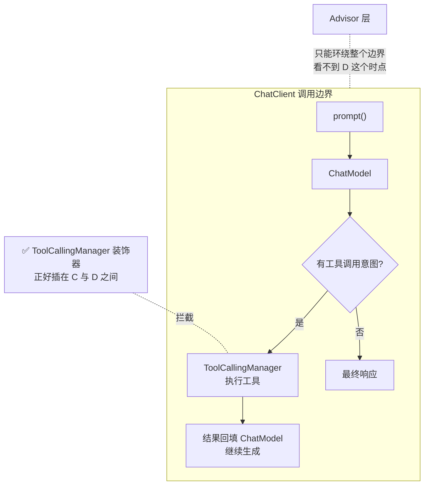

# 项目 13：事件溯源 Agent 运行时平台 — 03-迭代二·工具执行管线与能力缝

> **定位**：v2——把工具从「@Tool 直连数据源」升级为「**能力缝三分离 + 工具执行拦截**」。工具从此可换后端；工具执行有了稳定拦截点（`ToolCallingManager` 装饰器），审批/超时/记录都可插入。**设计哲学借鉴**：[附录 15-开源代码深度分析/04-模型可见能力]、[附录 15-开源代码深度分析/12-Java工程师借鉴手册 §K1 §K5]。
> 「遇到阻塞？→ [教程 03-工具调用]、[教程 28-Human-in-the-Loop与审批流 §正确落点]、[附录 05-SpringAI2-API基准/02-Tool与Observation真实API §1.3]」

---

## 1. 四问

| 问 | 答 |
|----|----|
| **新增了什么需求** | ① 工具后端可替换 ② 工具执行有统一拦截点 ③ 工具调用过程进日志 |
| **影响了哪些模块** | 工具层、执行路径、事件日志 |
| **架构如何演进** | 工具从「@Tool 直连」→「**能力缝（端口/提供者/消费者）**」；执行从「裸调」→「**`ToolCallingManager` 装饰器拦截**」 |
| **上一版痛点是什么** | ① 工具实现与 schema 耦合 ② 无拦截点 ③ 工具调用过程没进日志 |

## 2. 为什么拦截点是 ToolCallingManager 装饰器（关键架构决策）

> **Advisor 拦不到「工具意图已返回、工具执行前」**——它环绕整个 ChatClient 调用，工具执行发生在 ChatModel 内部循环。`ToolCallingManager` 装饰器正好插在「模型决定调工具」与「工具实际执行」之间（[教程 28-Human-in-the-Loop与审批流 §正确落点]、[附录 05-SpringAI2-API基准/02-Tool与Observation真实API §1.3]）。



## 3. 完整代码（照抄即可）

### 3.1 `pom.xml` 追加依赖（HTTP 工具后端）

```xml
        <!-- 追加（v2）：远程工具后端 -->
        <dependency>
            <groupId>org.springframework.boot</groupId>
            <artifactId>spring-boot-starter-webflux</artifactId>
        </dependency>
```

### 3.2 能力缝三分离

**定义 `OrderQueryPort.java`（端口）**：

```java
package com.group.agent.seam;

import com.group.agent.tool.OrderInfo;

/** 查询订单的抽象能力——提供者可替换，消费者只依赖本端口。 */
public interface OrderQueryPort {
    OrderInfo query(String orderId);
}
```

**提供者 `OrderQueryLocal.java`（本机内存）**：

```java
package com.group.agent.seam;

import com.group.agent.tool.OrderInfo;
import org.springframework.boot.autoconfigure.condition.ConditionalOnProperty;
import org.springframework.stereotype.Component;
import java.util.Map;
import java.util.concurrent.ConcurrentHashMap;

@Component
@ConditionalOnProperty(name = "tool.order-query.backend", havingValue = "local", matchIfMissing = true)
public class OrderQueryLocal implements OrderQueryPort {

    private final Map<String, OrderInfo> store = new ConcurrentHashMap<>();

    public OrderQueryLocal() {
        store.put("ORD-001", new OrderInfo("ORD-001", 199.0, "已发货"));
        store.put("ORD-002", new OrderInfo("ORD-002", 599.0, "待支付"));
    }

    @Override
    public OrderInfo query(String orderId) {
        return store.get(orderId);
    }
}
```

**提供者 `OrderQueryHttp.java`（远程，切后端只改配置）**：

```java
package com.group.agent.seam;

import com.group.agent.tool.OrderInfo;
import org.springframework.boot.autoconfigure.condition.ConditionalOnProperty;
import org.springframework.stereotype.Component;
import org.springframework.web.reactive.function.client.WebClient;

@Component
@ConditionalOnProperty(name = "tool.order-query.backend", havingValue = "http")
public class OrderQueryHttp implements OrderQueryPort {

    private final WebClient webClient;

    public OrderQueryHttp(WebClient.Builder webClientBuilder) {
        this.webClient = webClientBuilder.baseUrl("http://order-service").build();
    }

    @Override
    public OrderInfo query(String orderId) {
        // WebFlux 生产代码应返回 Mono 并在调用链上不 block；这里为工具同步面做 block 演示
        return webClient.get().uri("/orders/{id}", orderId)
                .retrieve().bodyToMono(OrderInfo.class).block();
    }
}
```

**消费者 `ToolOrderQuery.java`（模型面，schema 永远不变）**：

```java
package com.group.agent.tool;

import com.group.agent.seam.OrderQueryPort;
import org.springframework.ai.tool.annotation.Tool;
import org.springframework.ai.tool.annotation.ToolParam;
import org.springframework.stereotype.Component;

@Component
public class ToolOrderQuery {

    private final OrderQueryPort orderQueryPort;

    public ToolOrderQuery(OrderQueryPort orderQueryPort) {
        this.orderQueryPort = orderQueryPort;
    }

    @Tool(name = "query_order", description = "按订单号查询订单金额与状态")
    public OrderInfo queryOrder(@ToolParam(description = "订单号") String orderId) {
        return orderQueryPort.query(orderId);
    }
}
```

**切后端 = 改配置（`application.yml`）**：

```yaml
tool:
  order-query:
    backend: http     # local | http —— 换后端不改任何工具代码
```

### 3.3 工具执行拦截：`ToolCallingManager` 装饰器

**`ToolExecutionManager.java`（装饰器：记录 tool/call + tool/result，留策略位）**：

```java
package com.group.agent.tool;

import com.group.agent.event.*;
import org.springframework.ai.chat.messages.AssistantMessage;
import org.springframework.ai.chat.messages.ToolResponseMessage;
import org.springframework.ai.chat.model.ChatResponse;
import org.springframework.ai.chat.prompt.Prompt;
import org.springframework.ai.model.tool.ToolCallingChatOptions;
import org.springframework.ai.model.tool.ToolCallingManager;
import org.springframework.ai.model.tool.ToolExecutionResult;
import org.springframework.ai.tool.definition.ToolDefinition;
import org.springframework.stereotype.Component;

import java.util.List;
import java.util.concurrent.atomic.AtomicLong;

/**
 * ToolCallingManager 装饰器 —— 工具执行层的唯一稳定拦截点。
 * 职责：① 执行前记录 tool/call ② 执行后记录 tool/result ③ 预留守卫位（v4 加审批）。
 */
@Component
public class ToolExecutionManager implements ToolCallingManager {

    private final ToolCallingManager delegate;
    private final SessionEventStore eventStore;
    private final AtomicLong seq = new AtomicLong(0);

    public ToolExecutionManager(ToolCallingManager delegate,
                                SessionEventStore eventStore) {
        this.delegate = delegate;
        this.eventStore = eventStore;
    }

    @Override
    public ToolExecutionResult executeToolCalls(Prompt prompt, ChatResponse chatResponse) {

        List<AssistantMessage.ToolCall> calls = extractToolCalls(chatResponse);
        String sessionId = sessionIdOf(prompt);

        // ① 执行前：记录 tool/call（"模型想要什么"先进日志）
        for (AssistantMessage.ToolCall call : calls) {
            eventStore.append(new ToolCall(sessionId, seq.incrementAndGet(),
                    System.currentTimeMillis(), call.id(), call.name(), call.arguments()));
        }

        // ② 守卫位：v4 在此检查危险工具/审批（先留空）
        // for (AssistantMessage.ToolCall call : calls) { checkGuards(call); }

        ToolExecutionResult result = delegate.executeToolCalls(prompt, chatResponse);

        // ③ 执行后：ToolExecutionResult 以 conversationHistory() 承载工具响应，
        //    从中提取 ToolResponseMessage 记录 tool/result
        result.conversationHistory().forEach(msg -> {
            if (msg instanceof ToolResponseMessage trm) {
                trm.getResponses().forEach(r -> eventStore.append(new ToolResult(sessionId,
                        seq.incrementAndGet(), System.currentTimeMillis(),
                        r.id(), r.responseData(), List.of())));
            }
        });
        return result;
    }

    // —— 工具方法（生产可提取到工具类）——
    private List<AssistantMessage.ToolCall> extractToolCalls(ChatResponse chatResponse) {
        return chatResponse.getResults().stream()
                .map(g -> g.getOutput().getToolCalls())
                .flatMap(List::stream)
                .toList();
    }

    @Override
    public List<ToolDefinition> resolveToolDefinitions(ToolCallingChatOptions options) {
        return delegate.resolveToolDefinitions(options);
    }

    private String sessionIdOf(Prompt prompt) {
        return (String) ((ToolCallingChatOptions) prompt.getOptions()).getToolContext().get("sessionId");
    }
}
```

> ⚠️ 说明：真实 `ToolCallingManager` 接口签名是 `executeToolCalls(Prompt, ChatResponse)`（工具意图从 `chatResponse.getResults()` 的 `Generation.getOutput().getToolCalls()` 取），非 `(Prompt, ToolCallingChatOptions, List<ToolDefinition>)`（javap 实证，[附录 05-SpringAI2-API基准/02-Tool与Observation真实API §1.3]）。`sessionId` 的传递应经 `toolContext` 通道：调用侧 `chatClient.prompt().toolContext(Map.of("sessionId", sessionId))`，装饰器侧从 `((ToolCallingChatOptions) prompt.getOptions()).getToolContext()` 读取。核心不变式是：**tool/call 先于执行落日志，tool/result 后于执行落日志**。

### 3.4 验证 `application.yml`（工具事件也进日志）

- 工具调用后，`GET /api/session/{id}/events` 能看到 `ToolCall → ToolResult` 配对

## 4. ADR 演进决策

### ADR 013-06：工具拦截用 ToolCallingManager 装饰器，不用 AOP 拦 @Tool
- **Why**：Advisor 环绕整个 ChatClient 调用，看不到「工具执行」这个时点；`ToolCallingManager` 正好插在「意图已定、执行未发生」之间（[教程 28-Human-in-the-Loop与审批流 §正确落点]）
- **备选方案**：① AOP 拦 `@Tool`（拦不到执行时点，且 Spring AI 文档明确不推荐）② Advisor 检查 toolCalls（机制不成立）③ ToolCallingManager 装饰器（本文选择）

### ADR 013-07：能力缝用「接口 + 条件装配」，消费者只见端口
- **Why**：换后端不换模型提问方式——`@Tool` 只依赖 `OrderQueryPort`
- **参考**：[附录 15/12 §K1]

## 5. 验收与遗留痛点

**验收**：后端 local→http schema 零改动、工具事件成对进日志、装饰器可插入守卫。

**遗留痛点（供 v3/v4 决策）**：
1. 崩溃时 `tool/call` 已落但 `tool/result` 未落——孤儿工具调用（v3 崩溃闭合）
2. 写事件同步阻塞（v3 写缓冲）
3. 危险工具无审批（v4 审批守卫）
4. 历史增长每次全量 fold（v3 冷读阶梯）

> **定位回顾**：v2 完成「工具可换 + 执行可拦」。下一站 [04-迭代三-崩溃闭合与会话恢复]。
