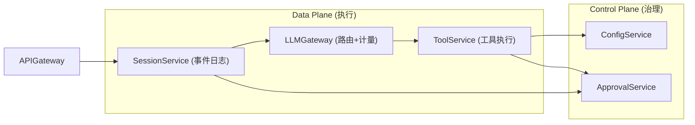

# 项目 13：事件溯源 Agent 运行时平台 — 06-管控分离微服务

> **定位**：v5——把单体拆成 **会话服务 / 工具服务 / LLM 网关** 三服务 + **Control Plane**（配置/审批/策略）。这是本项目「管控分离」里程碑落地。**设计哲学借鉴**：[附录 14-开源代码深度分析/00-deepseek-harness/07-宿主-API-客户端与Web前端 §一]、[附录 14-开源代码深度分析/00-deepseek-harness/11-设计哲学与架构模式 §三-模式四]。本文给出**关键服务完整代码**（三服务全量代码量巨大，本文给每个服务的入口、核心类与 API 契约；其余按同一模式补齐）。
> 「遇到阻塞？→ [教程 04-企业级架构主干/00-管控分离架构]、[教程 04-企业级架构主干/01-微服务拆分与Agent部署]」

---

## 1. 四问

| 问 | 答 |
|----|----|
| **新增了什么需求** | ① 服务独立扩缩容 ② 审批可远程 ③ 配置/策略集中 |
| **影响了哪些模块** | 单体拆三服务；事件日志归属会话服务 |
| **架构如何演进** | 单体 → 会话服务 + 工具服务 + LLM 网关 + Control Plane |
| **上一版痛点是什么** | ① 单体膨胀 ② 审批与引擎耦合 ③ 数据/容量归属不清 |

### 1.1 本节核对（四问）

- [ ] 能画出四服务（Session/LLMGateway/ToolService/ControlPlane）边界，并说出各自职责（写事件/模型调用/工具执行/治理）
- [ ] 三个痛点（单体膨胀/审批耦合/数据归属不清）与四服务拆分、ADR 013-12/013-13 的写权收口 + 治理归 CP 对应

## 2. 目标与量化验收

| # | 目标 | 验收 |
|---|------|------|
| 1 | 独立扩缩容 | 工具服务 3 实例、会话 1 实例，不中断 |
| 2 | 管控分离 | 治理只在 Control Plane，Data Plane 零治理逻辑 |
| 3 | 跨服务链路 | 一次对话 Trace 跨 会话→LLM→工具 可见 |
| 4 | 写侧唯一入口 | 事件表只被会话服务读写 |
| 5 | 契约版本化 | API 契约变更需版本化，旧版保留 2 周期 |

### 2.1 本节核对（目标与量化验收）

- [ ] 验收 2/4（管控分离/写侧唯一入口）把 v1 的"单方法唯一入口"升级为"单服务唯一入口"——违反即网络层不可达，不靠 code review，能复述这一升级
- [ ] 验收 5（契约版本化）提示拆分后 API 是跨服务契约，变更要留旧版——后续 v8 事件版本化同哲学

## 3. 服务划分与 API 契约



**API 契约**（HTTP）：

| 服务 | 端点 | 职责 |
|------|------|------|
| SessionService | `POST /api/session/{id}/chat` | 对话入口；写事件 |
| SessionService | `GET /api/session/{id}/events` | 审计导出 |
| LLMGateway | `POST /api/llm/stream` | 模型调用 + Token 计量 |
| ToolService | `POST /api/tool/execute` | 工具执行（经 ToolCallingManager） |
| ControlPlane | `GET /api/config/policy/{tool}` | 策略下发 |
| ControlPlane | `POST /api/approvals/{id}/decide` | 审批决策 |

### 3.1 本节核对（服务划分与 API 契约）

- [ ] 能不看正文画出 API 调用链：`POST /api/session/{id}/chat` → LLM 网关 → 工具服务；写事件只经 SessionService
- [ ] 六个契约端点中每个能指出承载方（Session/LLM/Tool/Control）与职责，无归属错位
- [ ] 事件表只被 SessionService 写（其余服务经 API/外发，不直连事件库）

### 3.2 端口矩阵与两段式配置（各服务独立进程）

拆分后四服务各自独立进程，**端口矩阵**如下（基准端口 8081 起，按服务递增；单体阶段全项目统一 8081）：

| 服务 | 包前缀 | 端口 | 职责 |
|------|--------|------|------|
| SessionService（会话） | `com.group.session` | **8081** | 对话入口、事件日志写侧唯一入口 |
| LlmGateway（LLM 网关） | `com.group.gateway` | **8082** | 模型调用 + Token 计量 |
| ToolService（工具服务） | `com.group.tool` | **8083** | 工具执行（ToolCallingManager） |
| ControlPlane（控制面） | `com.group.control` | **8084** | 策略下发 + 远程审批（治理） |

每个服务沿用**两段式配置**（与 [01 §3.1] 同口径）：`application.yaml` 只做 `.env` 装载与 profile 激活，业务配置（含 `server.port`）写在 `application-eventsrc.yaml`；启动命令统一 `mvn spring-boot:run -Dspring-boot.run.profiles=eventsrc`。四服务各持一份（各自独立端口，互不冲突）：

`application.yaml`（各服务相同——只做环境装载与 profile 激活）：

```yaml
spring:
  config:
    import: optional:file:.env[.properties]   # 环境变量从 .env 装载（可选文件，缺失不报错）
  profiles:
    active: eventsrc
```

`application-eventsrc.yaml`（会话服务示例——端口 8081；其余服务仅 `server.port` 与专属配置不同）：

```yaml
server:
  port: 8081                       # 会话服务（端口矩阵见上表）
spring:
  datasource:
    url: jdbc:postgresql://${DB_HOST:localhost}:5432/agent_runtime
    username: ${DB_USER:postgres}
    password: ${DB_PASSWORD:postgres}
management:
  endpoints:
    web:
      exposure:
        include: health,metrics,prometheus
```

> 端口矩阵是四服务全部 HTTP 端点的本机联调基准（§4.6 材料直接用）；K8s 部署时以 Service 名互访（`http://session-service` / `http://llm-gateway` / `http://tool-service` / `http://control-plane`），见 [08 §3.6]。

## 4. 完整代码（各服务核心类）

### 4.1 SessionService：`SessionServiceApplication.java`

```java
package com.group.session;

import org.springframework.boot.SpringApplication;
import org.springframework.boot.autoconfigure.SpringBootApplication;

@SpringBootApplication
public class SessionServiceApplication {
    public static void main(String[] args) {
        SpringApplication.run(SessionServiceApplication.class, args);
    }
}
```

`SessionController.java`（对话入口，写事件归本服务）：

```java
package com.group.session.web;

import com.group.session.event.AssistantMessage;
import com.group.session.event.SessionEvent;
import com.group.session.event.SessionEventStore;
import com.group.session.event.SessionWriteBuffer;
import com.group.session.event.RecoveryService;
import com.group.session.event.SessionProjectionCache;
import com.group.session.event.UserMessage;
import com.group.session.gateway.LlmGatewayClient;
import org.springframework.web.bind.annotation.*;
import reactor.core.publisher.Flux;
import reactor.core.publisher.Mono;

import java.util.List;
import java.util.concurrent.atomic.AtomicLong;

@RestController
@RequestMapping("/api/session")
public class SessionController {

    private final SessionEventStore eventStore;
    private final SessionWriteBuffer writeBuffer;
    private final RecoveryService recoveryService;
    private final SessionProjectionCache projectionCache;
    private final LlmGatewayClient llmGateway;
    private final AtomicLong seq = new AtomicLong(0);   // 演示用；生产按会话独立计数器

    public SessionController(SessionEventStore eventStore,
                             SessionWriteBuffer writeBuffer,
                             RecoveryService recoveryService,
                             SessionProjectionCache projectionCache,
                             LlmGatewayClient llmGateway) {
        this.eventStore = eventStore;
        this.writeBuffer = writeBuffer;
        this.recoveryService = recoveryService;
        this.projectionCache = projectionCache;
        this.llmGateway = llmGateway;
    }

    // 对话入口：先恢复（崩溃闭合）→ 写 user 事件 → 调 LLM 网关 → 写 assistant 事件（透传）
    @PostMapping("/{sessionId}/chat")
    public Mono<String> chat(@PathVariable String sessionId, @RequestBody String message) {
        recoveryService.recover(sessionId);        // 崩溃闭合
        long t = System.currentTimeMillis();
        // 1. 写 user/message（写侧唯一入口仍是 SessionEventStore.append）
        eventStore.append(new UserMessage(sessionId, seq.incrementAndGet(), t,
                message, UserMessage.Source.USER, List.of()));
        // 2. 调 LLMGateway（WebClient，非阻塞）→ 3. 写 assistant/message 后透传
        // （v6 起 businessLine 由 07 的 chat 入参透传；此处用默认业务线）
        return llmGateway.stream(sessionId, "default", message)
                .doOnNext(answer -> eventStore.append(new AssistantMessage(sessionId,
                        seq.incrementAndGet(), System.currentTimeMillis(), answer, "deepseek", List.of())));
    }

    // 审计导出：完整事件链（合规回放）
    @GetMapping("/{sessionId}/events")
    public List<SessionEvent> events(@PathVariable String sessionId) {
        return eventStore.load(sessionId);
    }

    // turn 边界 flush + checkpoint
    @PostMapping("/{sessionId}/flush")
    public void flush(@PathVariable String sessionId) {
        writeBuffer.flush(sessionId);
        projectionCache.checkpoint(sessionId, writeBuffer);
    }
}
```

### 4.2 LLMGateway：`LlmGatewayApplication.java` + `LlmController.java` + `TokenMeter.java`

```java
package com.group.gateway;

import org.springframework.boot.SpringApplication;
import org.springframework.boot.autoconfigure.SpringBootApplication;

@SpringBootApplication
public class LlmGatewayApplication {
    public static void main(String[] args) {
        SpringApplication.run(LlmGatewayApplication.class, args);
    }
}
```

`LlmController.java`（模型调用 + 计量）：

```java
package com.group.gateway.web;

import com.group.gateway.meter.TokenMeter;
import org.springframework.ai.chat.client.ChatClient;
import org.springframework.ai.chat.memory.ChatMemory;
import org.springframework.web.bind.annotation.*;
import reactor.core.publisher.Flux;

@RestController
@RequestMapping("/api/llm")
public class LlmController {

    private final ChatClient chatClient;
    private final TokenMeter tokenMeter;

    public LlmController(ChatClient chatClient, TokenMeter tokenMeter) {
        this.chatClient = chatClient;
        this.tokenMeter = tokenMeter;
    }

    @PostMapping(value = "/stream", produces = "text/event-stream")
    public Flux<String> stream(@RequestBody LlmRequest req) {
        // 请求前记录 input tokens（估算），流式返回并累计 usage
        return chatClient.prompt()
                .user(req.message())
                .advisors(a -> a.param(ChatMemory.CONVERSATION_ID, req.sessionId()))
                .stream()
                .content()
                .doOnComplete(() -> tokenMeter.record(req.businessLine(), req.sessionId()));
    }

    public record LlmRequest(String sessionId, String businessLine, String message) {}
}
```

`TokenMeter.java`（gen_ai.* 语义计量 + 归因投影源）：

```java
package com.group.gateway.meter;

import io.micrometer.core.instrument.MeterRegistry;
import org.springframework.stereotype.Component;

/** Token 计量：发出 gen_ai.* 指标，供 v6 归因投影。 */
@Component
public class TokenMeter {

    private final MeterRegistry registry;

    public TokenMeter(MeterRegistry registry) {
        this.registry = registry;
    }

    public void record(String businessLine, String sessionId) {
        // 真实实现从模型响应 usage 取数；此处示例计数
        // Spring AI 语义约定的 Token 指标是 gen_ai.client.token.usage，用 type 标签区分 input/output
        registry.counter("gen_ai.client.token.usage",
                "type", "input", "businessLine", businessLine).increment();
        registry.counter("gen_ai.client.token.usage",
                "type", "output", "businessLine", businessLine).increment();
    }
}
```

### 4.3 ToolService：`ToolServiceApplication.java` + `ToolController.java`

```java
package com.group.tool;

import org.springframework.boot.SpringApplication;
import org.springframework.boot.autoconfigure.SpringBootApplication;

@SpringBootApplication
public class ToolServiceApplication {
    public static void main(String[] args) {
        SpringApplication.run(ToolServiceApplication.class, args);
    }
}
```

`ToolController.java`（工具执行入口，ToolCallingManager 已含审批/记录守卫）：

```java
package com.group.tool.web;

import org.springframework.ai.chat.messages.Message;
import org.springframework.ai.chat.model.ChatResponse;
import org.springframework.ai.chat.prompt.Prompt;
import org.springframework.ai.model.tool.ToolCallingChatOptions;
import org.springframework.ai.model.tool.ToolCallingManager;
import org.springframework.ai.model.tool.ToolExecutionResult;
import org.springframework.web.bind.annotation.*;

import java.util.List;

@RestController
@RequestMapping("/api/tool")
public class ToolController {

    private final ToolCallingManager toolCallingManager;

    public ToolController(ToolCallingManager toolCallingManager) {
        this.toolCallingManager = toolCallingManager;
    }

    @PostMapping("/execute")
    public ToolExecutionResult execute(@RequestBody ToolExecRequest req) {
        // 模型响应（含 Generation.getOutput().getToolCalls()）由 LLM 网关转发；
        // 2.0 唯一真实签名是 executeToolCalls(Prompt, ChatResponse)
        Prompt prompt = new Prompt(req.messages(), req.options());
        return toolCallingManager.executeToolCalls(prompt, req.chatResponse());
    }

    public record ToolExecRequest(List<Message> messages,
                                  ToolCallingChatOptions options,
                                  ChatResponse chatResponse) {}
}
```

> ⚠️ `ChatResponse`（模型返回、含工具调用意图）由 LLM 网关序列化转发到工具服务。生产建议用轻量 DTO 承载 `AssistantMessage.ToolCall` 再在工具服务内重建 `ChatResponse`，避免整体序列化 `ChatResponse` 的重量结构；**API 不变式：`executeToolCalls(Prompt, ChatResponse)` 二参**（javap 实证，[附录 05-SpringAI2-API基准/02-Tool与Observation真实API §1.3]）。

### 4.4 ControlPlane：`ControlPlaneApplication.java` + `ConfigController.java` + `ApprovalController.java`

```java
package com.group.control;

import org.springframework.boot.SpringApplication;
import org.springframework.boot.autoconfigure.SpringBootApplication;

@SpringBootApplication
public class ControlPlaneApplication {
    public static void main(String[] args) {
        SpringApplication.run(ControlPlaneApplication.class, args);
    }
}
```

`ConfigController.java`（策略下发——Data Plane 从本服务拉取）：

```java
package com.group.control.web;

import org.springframework.web.bind.annotation.*;
import java.util.Map;
import java.util.concurrent.ConcurrentHashMap;

@RestController
@RequestMapping("/api/config")
public class ConfigController {

    private final Map<String, String> toolPolicies = new ConcurrentHashMap<>();

    @GetMapping("/policy/{tool}")
    public String policy(@PathVariable String tool) {
        return toolPolicies.getOrDefault(tool, "DENY");   // fail-closed 默认
    }

    @PutMapping("/policy/{tool}")
    public void setPolicy(@PathVariable String tool, @RequestBody String policy) {
        toolPolicies.put(tool, policy);    // ALLOW | DENY | REQUIRES_APPROVAL
    }
}
```

`ApprovalController.java`（远程审批）：

```java
package com.group.control.web;

import com.group.control.approval.ApprovalOutcome;
import com.group.control.approval.ApprovalService;
import org.springframework.web.bind.annotation.*;

@RestController
@RequestMapping("/api/approvals")
public class ApprovalController {

    private final ApprovalService approvalService;

    public ApprovalController(ApprovalService approvalService) {
        this.approvalService = approvalService;
    }

    @PostMapping("/{approvalId}/decide")
    public void decide(@PathVariable String approvalId, @RequestBody ApprovalOutcome outcome) {
        approvalService.decide(approvalId, outcome);
    }
}
```

### 4.5 服务间通信（WebFlux WebClient）

`LlmGatewayClient.java`（SessionService → LLMGateway 的响应式客户端，不阻塞）：

```java
package com.group.session.gateway;

import org.springframework.stereotype.Component;
import org.springframework.web.reactive.function.client.WebClient;
import reactor.core.publisher.Mono;

/** 会话服务 → LLM 网关的响应式客户端。WebClient 非阻塞，EventLoop 上禁 block（WebFlux 铁律）。 */
@Component
public class LlmGatewayClient {

    private final WebClient webClient;

    public LlmGatewayClient(WebClient.Builder builder) {
        // 本机联调走端口矩阵（§3.2）8082；K8s 内以服务名 http://llm-gateway
        this.webClient = builder.baseUrl("http://localhost:8082").build();
    }

    /** POST /api/llm/stream：转发给 LLM 网关并取回整段回答（SSE 文本）；businessLine 透传（v6 归因投影数据源）。 */
    public Mono<String> stream(String sessionId, String businessLine, String message) {
        return webClient.post()
                .uri("/api/llm/stream")
                .bodyValue(new LlmRequest(sessionId, businessLine, message))
                .retrieve()
                .bodyToMono(String.class);
    }

    /** 与 LlmController.LlmRequest 同构的 DTO（网关侧 §4.2）。 */
    public record LlmRequest(String sessionId, String businessLine, String message) {}
}
```

### 4.6 本节测试与验证（完整代码：四服务拆分）

**前置条件**：已按 §4 手写四个 `*Application` 与各 Controller/网关/meter；会话服务（含事件库）、LLM 网关、工具服务、ControlPlane 四进程分别启动（端口矩阵见 §3.2：8081/8082/8083/8084）；服务间 URL（`http://session-service` / `http://llm-gateway` / `http://tool-service` / `http://control-plane`）可在本机互相访问（用本机不同端口或 K8s 服务名）。

**材料**：

```bash
# A：经 APIGateway/直接走 SessionService 对话
curl -X POST "http://localhost:8081/api/session/s1/chat" -H "Content-Type: text/plain" -d "订单 ORD-001 金额多少"
# B：审计导出（会话服务）
curl "http://localhost:8081/api/session/s1/events"
# C：ControlPlane 策略下发 + 拉取
curl -X PUT "http://localhost:8084/api/config/policy/delete_order" -H "Content-Type: text/plain" -d "DENY"
curl "http://localhost:8084/api/config/policy/delete_order"
# D：工具服务独立执行入口（校验 ToolCallingManager 仍在 ToolService）
curl -X POST "http://localhost:8083/api/tool/execute" -H "Content-Type: application/json" -d '{}'
```

**步骤与断言**：

| # | 操作 | 预期（PASS 判据） |
|---|------|------------------|
| 1 | 三服务 + ControlPlane 全部启动 | 各自健康（`/actuator/health`）；会话 / LLM / 工具三进程独立可跑（验收 1 独立部署前提） |
| 2 | 材料 A（会话服务对话入口） | 会话服务收请求 → 调 LLM 网关 →（含工具）→ 回写事件；一次对话全链路串起来 |
| 3 | 材料 B（会话服务审计导出） | `session_event` 数据仍只由会话服务读写（验收 4 写侧唯一入口）：其他服务无直连事件库写路径 |
| 4 | 治理只在 Control Plane（验收 2） | `Data Plane`（会话/LLM/工具）代码零治理逻辑——加策略 = 改材料 C 的 `ConfigController`，不动 Data Plane |
| 5 | 扩缩容抽查（验收 1） | 工具服务启动 3 实例、会话 1 实例，会话访问不中断（注册中心/负载均衡按实例转发） |
| 6 | 契约版本化意识（验收 5） | 任一 API 变更需版本化并留旧版 2 周期——本次无破格变更 |

**失败排查**：①会话请求调不到 LLM→WebClient `baseUrl`/端口错，或服务未注册；②写侧唯一入口被破坏→某代码直连了事件库（搜 `INSERT INTO session_event` 出现在非会话服务）；③治理逻辑跑进 Data Plane→`ConfigController`/策略判断写进了工具服务；④审批远程不畅→`ApprovalController` 挂在 ControlPlane、`HumanApprovalToolManager` 在工具服务经 HTTP 调审批。

## 5. ADR 演进决策

### ADR 013-12：会话日志只归会话服务，其它服务经 API 写
- **Why**：写侧唯一入口是架构不变式，拆分不能破坏（[附录 14-开源代码深度分析/00-deepseek-harness/12-Java工程师借鉴手册 §M1]）

### ADR 013-13：治理归 Control Plane，Data Plane 只执行
- **Why**：对应 [教程 04-企业级架构主干/00-管控分离架构]——加治理策略 = 改 Control Plane，不动 Data Plane

### 5.1 本节核对（ADR 013-12 / 013-13）

- [ ] ADR 013-12 能复述"写侧唯一入口"从单方法升级为单服务的意义，违反即网络层不可达
- [ ] ADR 013-13 能指出 Data Plane（会话/LLM/工具）零治理逻辑，治理策略集中在 Control Plane

### 5.2 全篇回归（轻量）——复跑 §4.6 三条核心断言

| # | 操作 | 预期（PASS 判据） |
|---|------|------------------|
| 1 | 重启四服务后重跑 §4.6 材料 A | 跨服务对话链路 + 写事件仍正常 |
| 2 | 扩缩容复检 | 工具服务多实例、会话单实例如常访问 |
| 3 | 治理隔离复检 | Data Plane 无治理逻辑、Control Plane 下发生效（加策略不动 Data Plane） |

> §2 五条验收已被 §4.6 覆盖，此处回归仅抽核心三条；跨服务链路 Trace 可见性在 v6（[07]）补 OTel。

## 6. 验收与遗留痛点

**验收**：独立扩缩容、治理只在 Control Plane、跨服务 Trace、写侧唯一入口、契约版本化。

**遗留痛点（供 v6 决策）**：Token 计量有了但未归因、指标未接 OTel、配置下发是启动时拉取。

### 6.1 本节核对（验收与遗留痛点）

- [ ] 验收五条与 §2 一致；三个遗留痛点（计量未归因/未接 OTel/配置启动拉取）正是 [07-可观测与成本治理] 的 v6 主攻，对应 ADR 013-14/013-15

## 7. 验收对照

| 验收项 | 标准 | 状态 |
|--------|------|------|
| 独立扩缩容 | 工具服务 3 实例、会话 1 实例，不中断（§4.6 步骤 5） | ☐ |
| 管控分离 | 治理只在 Control Plane，Data Plane 零治理逻辑（§4.6 步骤 4） | ☐ |
| 跨服务链路 | 一次对话 Trace 跨 会话→LLM→工具 可见（§4.6 步骤 2） | ☐ |
| 写侧唯一入口 | 事件表只被会话服务读写（§4.6 步骤 3） | ☐ |
| 契约版本化 | API 契约变更需版本化，旧版保留 2 周期（§4.6 步骤 6） | ☐ |

> **定位回顾**：v5 完成管控分离（里程碑 1/6）。下一站 [07-可观测与成本治理]。
