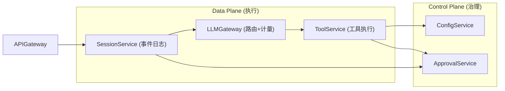

# 项目 13：事件溯源 Agent 运行时平台 — 06-迭代五·管控分离微服务

> **定位**：v5——把单体拆成 **会话服务 / 工具服务 / LLM 网关** 三服务 + **Control Plane**（配置/审批/策略）。这是本项目「管控分离」里程碑落地。**设计哲学借鉴**：[附录 15-开源代码深度分析/07-宿主-API-客户端与Web前端 §一]、[附录 15-开源代码深度分析/11-设计哲学与架构模式 §三-模式四]。本文给出**关键服务完整代码**（三服务全量代码量巨大，本文给每个服务的入口、核心类与 API 契约；其余按同一模式补齐）。
> 「遇到阻塞？→ [教程 20-管控分离架构]、[教程 21-微服务拆分与Agent部署]」

---

## 1. 四问

| 问 | 答 |
|----|----|
| **新增了什么需求** | ① 服务独立扩缩容 ② 审批可远程 ③ 配置/策略集中 |
| **影响了哪些模块** | 单体拆三服务；事件日志归属会话服务 |
| **架构如何演进** | 单体 → 会话服务 + 工具服务 + LLM 网关 + Control Plane |
| **上一版痛点是什么** | ① 单体膨胀 ② 审批与引擎耦合 ③ 数据/容量归属不清 |

## 2. 目标与量化验收

| # | 目标 | 验收 |
|---|------|------|
| 1 | 独立扩缩容 | 工具服务 3 实例、会话 1 实例，不中断 |
| 2 | 管控分离 | 治理只在 Control Plane，Data Plane 零治理逻辑 |
| 3 | 跨服务链路 | 一次对话 Trace 跨 会话→LLM→工具 可见 |
| 4 | 写侧唯一入口 | 事件表只被会话服务读写 |
| 5 | 契约版本化 | API 契约变更需版本化，旧版保留 2 周期 |

## 3. 服务划分与 API 契约



**API 契约**（HTTP）：

| 服务 | 端点 | 职责 |
|------|------|------|
| SessionService | `POST /api/session/{id}/chat` | 对话入口；写事件 |
| SessionService | `GET /api/session/{id}/events` | 审计导出 |
| LLMGateway | `POST /api/llm/stream` | 模型调用 + Token 计量 |
| ToolService | `POST /api/tool/execute` | 工具执行（经 ToolCallingManager） |
| ControlPlane | `GET /api/config/policy/{tool}` | 策略下发 |
| ControlPlane | `POST /api/approvals/{id}/decide` | 审批决策 |

## 4. 完整代码（各服务核心类）

### 4.1 SessionService：`SessionServiceApplication.java`

```java
package com.group.session;

import org.springframework.boot.SpringApplication;
import org.springframework.boot.autoconfigure.SpringBootApplication;

@SpringBootApplication
public class SessionServiceApplication {
    public static void main(String[] args) {
        SpringApplication.run(SessionServiceApplication.class, args);
    }
}
```

`SessionController.java`（对话入口，写事件归本服务）：

```java
package com.group.session.web;

import com.group.session.event.SessionEvent;
import com.group.session.event.SessionEventStore;
import com.group.session.event.SessionWriteBuffer;
import com.group.session.event.RecoveryService;
import com.group.session.event.SessionProjectionCache;
import org.springframework.web.bind.annotation.*;
import reactor.core.publisher.Flux;

import java.util.List;

@RestController
@RequestMapping("/api/session")
public class SessionController {

    private final SessionEventStore eventStore;
    private final SessionWriteBuffer writeBuffer;
    private final RecoveryService recoveryService;
    private final SessionProjectionCache projectionCache;

    public SessionController(SessionEventStore eventStore,
                             SessionWriteBuffer writeBuffer,
                             RecoveryService recoveryService,
                             SessionProjectionCache projectionCache) {
        this.eventStore = eventStore;
        this.writeBuffer = writeBuffer;
        this.recoveryService = recoveryService;
        this.projectionCache = projectionCache;
    }

    // 对话入口：先恢复（崩溃闭合）→ 转发 LLM 网关 → 写事件
    @PostMapping("/{sessionId}/chat")
    public String chat(@PathVariable String sessionId, @RequestBody String message) {
        recoveryService.recover(sessionId);        // 崩溃闭合
        // 1. 写 user/message → 2. 调 LLMGateway → 3. 写 assistant/message
        // 简版：直接返回透传（完整链路见 v6 的 ChatService 拆分）
        return "ack:" + sessionId;
    }

    // 审计导出：完整事件链（合规回放）
    @GetMapping("/{sessionId}/events")
    public List<SessionEvent> events(@PathVariable String sessionId) {
        return eventStore.load(sessionId);
    }

    // turn 边界 flush + checkpoint
    @PostMapping("/{sessionId}/flush")
    public void flush(@PathVariable String sessionId) {
        writeBuffer.flush(sessionId);
        projectionCache.checkpoint(sessionId, writeBuffer);
    }
}
```

### 4.2 LLMGateway：`LlmGatewayApplication.java` + `LlmController.java` + `TokenMeter.java`

```java
package com.group.gateway;

import org.springframework.boot.SpringApplication;
import org.springframework.boot.autoconfigure.SpringBootApplication;

@SpringBootApplication
public class LlmGatewayApplication {
    public static void main(String[] args) {
        SpringApplication.run(LlmGatewayApplication.class, args);
    }
}
```

`LlmController.java`（模型调用 + 计量）：

```java
package com.group.gateway.web;

import com.group.gateway.meter.TokenMeter;
import org.springframework.ai.chat.client.ChatClient;
import org.springframework.ai.chat.memory.ChatMemory;
import org.springframework.web.bind.annotation.*;
import reactor.core.publisher.Flux;

@RestController
@RequestMapping("/api/llm")
public class LlmController {

    private final ChatClient chatClient;
    private final TokenMeter tokenMeter;

    public LlmController(ChatClient chatClient, TokenMeter tokenMeter) {
        this.chatClient = chatClient;
        this.tokenMeter = tokenMeter;
    }

    @PostMapping(value = "/stream", produces = "text/event-stream")
    public Flux<String> stream(@RequestBody LlmRequest req) {
        // 请求前记录 input tokens（估算），流式返回并累计 usage
        return chatClient.prompt()
                .user(req.message())
                .advisors(a -> a.param(ChatMemory.CONVERSATION_ID, req.sessionId()))
                .stream()
                .content()
                .doOnComplete(() -> tokenMeter.record(req.businessLine(), req.sessionId()));
    }

    public record LlmRequest(String sessionId, String businessLine, String message) {}
}
```

`TokenMeter.java`（gen_ai.* 语义计量 + 归因投影源）：

```java
package com.group.gateway.meter;

import io.micrometer.core.instrument.MeterRegistry;
import org.springframework.stereotype.Component;

/** Token 计量：发出 gen_ai.* 指标，供 v6 归因投影。 */
@Component
public class TokenMeter {

    private final MeterRegistry registry;

    public TokenMeter(MeterRegistry registry) {
        this.registry = registry;
    }

    public void record(String businessLine, String sessionId) {
        // 真实实现从模型响应 usage 取数；此处示例计数
        // Spring AI 语义约定的 Token 指标是 gen_ai.client.token.usage，用 type 标签区分 input/output
        registry.counter("gen_ai.client.token.usage",
                "type", "input", "businessLine", businessLine).increment();
        registry.counter("gen_ai.client.token.usage",
                "type", "output", "businessLine", businessLine).increment();
    }
}
```

### 4.3 ToolService：`ToolServiceApplication.java` + `ToolController.java`

```java
package com.group.tool;

import org.springframework.boot.SpringApplication;
import org.springframework.boot.autoconfigure.SpringBootApplication;

@SpringBootApplication
public class ToolServiceApplication {
    public static void main(String[] args) {
        SpringApplication.run(ToolServiceApplication.class, args);
    }
}
```

`ToolController.java`（工具执行入口，ToolCallingManager 已含审批/记录守卫）：

```java
package com.group.tool.web;

import org.springframework.ai.chat.messages.Message;
import org.springframework.ai.chat.model.ChatResponse;
import org.springframework.ai.chat.prompt.Prompt;
import org.springframework.ai.model.tool.ToolCallingChatOptions;
import org.springframework.ai.model.tool.ToolCallingManager;
import org.springframework.ai.model.tool.ToolExecutionResult;
import org.springframework.web.bind.annotation.*;

import java.util.List;

@RestController
@RequestMapping("/api/tool")
public class ToolController {

    private final ToolCallingManager toolCallingManager;

    public ToolController(ToolCallingManager toolCallingManager) {
        this.toolCallingManager = toolCallingManager;
    }

    @PostMapping("/execute")
    public ToolExecutionResult execute(@RequestBody ToolExecRequest req) {
        // 模型响应（含 Generation.getOutput().getToolCalls()）由 LLM 网关转发；
        // 2.0 唯一真实签名是 executeToolCalls(Prompt, ChatResponse)
        Prompt prompt = new Prompt(req.messages(), req.options());
        return toolCallingManager.executeToolCalls(prompt, req.chatResponse());
    }

    public record ToolExecRequest(List<Message> messages,
                                  ToolCallingChatOptions options,
                                  ChatResponse chatResponse) {}
}
```

> ⚠️ `ChatResponse`（模型返回、含工具调用意图）由 LLM 网关序列化转发到工具服务。生产建议用轻量 DTO 承载 `AssistantMessage.ToolCall` 再在工具服务内重建 `ChatResponse`，避免整体序列化 `ChatResponse` 的重量结构；**API 不变式：`executeToolCalls(Prompt, ChatResponse)` 二参**（javap 实证，[附录 05-SpringAI2-API基准/02-Tool与Observation真实API §1.3]）。

### 4.4 ControlPlane：`ControlPlaneApplication.java` + `ConfigController.java` + `ApprovalController.java`

```java
package com.group.control;

import org.springframework.boot.SpringApplication;
import org.springframework.boot.autoconfigure.SpringBootApplication;

@SpringBootApplication
public class ControlPlaneApplication {
    public static void main(String[] args) {
        SpringApplication.run(ControlPlaneApplication.class, args);
    }
}
```

`ConfigController.java`（策略下发——Data Plane 从本服务拉取）：

```java
package com.group.control.web;

import org.springframework.web.bind.annotation.*;
import java.util.Map;
import java.util.concurrent.ConcurrentHashMap;

@RestController
@RequestMapping("/api/config")
public class ConfigController {

    private final Map<String, String> toolPolicies = new ConcurrentHashMap<>();

    @GetMapping("/policy/{tool}")
    public String policy(@PathVariable String tool) {
        return toolPolicies.getOrDefault(tool, "DENY");   // fail-closed 默认
    }

    @PutMapping("/policy/{tool}")
    public void setPolicy(@PathVariable String tool, @RequestBody String policy) {
        toolPolicies.put(tool, policy);    // ALLOW | DENY | REQUIRES_APPROVAL
    }
}
```

`ApprovalController.java`（远程审批）：

```java
package com.group.control.web;

import com.group.control.approval.ApprovalOutcome;
import com.group.control.approval.ApprovalService;
import org.springframework.web.bind.annotation.*;

@RestController
@RequestMapping("/api/approvals")
public class ApprovalController {

    private final ApprovalService approvalService;

    public ApprovalController(ApprovalService approvalService) {
        this.approvalService = approvalService;
    }

    @PostMapping("/{approvalId}/decide")
    public void decide(@PathVariable String approvalId, @RequestBody ApprovalOutcome outcome) {
        approvalService.decide(approvalId, outcome);
    }
}
```

### 4.5 服务间通信（WebFlux WebClient）

```java
// SessionService 调 LLMGateway（响应式，不阻塞）
// （完整代码：注入 WebClient.Builder + baseUrl("http://llm-gateway")，POST /api/llm/stream）
```

## 5. ADR 演进决策

### ADR 013-12：会话日志只归会话服务，其它服务经 API 写
- **Why**：写侧唯一入口是架构不变式，拆分不能破坏（[附录 15/12 §M1]）

### ADR 013-13：治理归 Control Plane，Data Plane 只执行
- **Why**：对应 [教程 20-管控分离架构]——加治理策略 = 改 Control Plane，不动 Data Plane

## 6. 验收与遗留痛点

**验收**：独立扩缩容、治理只在 Control Plane、跨服务 Trace、写侧唯一入口、契约版本化。

**遗留痛点（供 v6 决策）**：Token 计量有了但未归因、指标未接 OTel、配置下发是启动时拉取。

> **定位回顾**：v5 完成管控分离（里程碑 1/6）。下一站 [07-迭代六-可观测与成本治理]。
