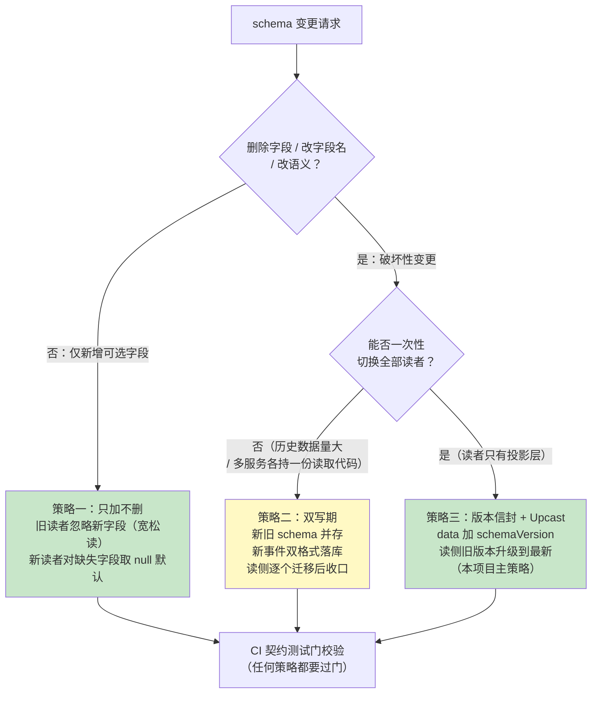
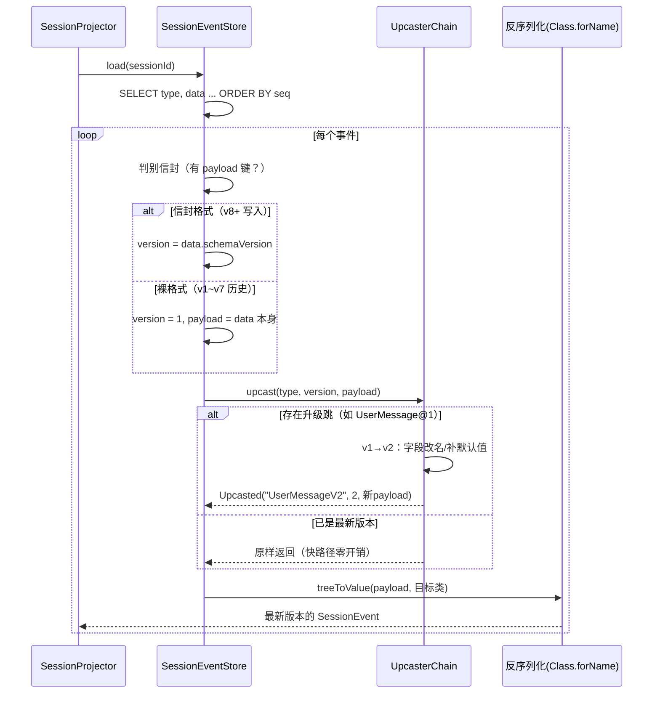
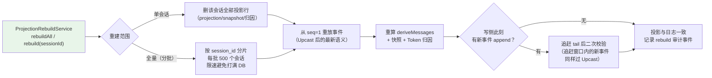

# 项目 13：事件溯源 Agent 运行时平台 — 10-事件版本化与模式演进

> **定位**：v8——解决事件溯源系统的"第二座山"：**不可变日志 vs 演进代码的矛盾**。平台运行一年后，`UserMessage` 要加字段、`ToolCall` 的参数语义要改、投影逻辑要修正——但 `session_event` 里躺着的十万级历史事件**一个字节都不能重写**（审计红线）。本迭代建立一套完整的**事件 schema 演进机制**：演进策略三分法（只加不删/双写期/版本信封）、Upcast 旧事件升级转换链、投影重建工具、CI 兼容性测试门。前置阅读：[02-事件溯源会话日志]（事件模型基础）、[04-崩溃闭合与会话恢复]（冷读阶梯）。
> 「遇到阻塞？→ [教程 25-历史记录持久化与合规]、[教程 40-长任务持久化与中断恢复]；JSONB/Jackson 机制见 [教程 13-结构化输出]；API 真实性以 [附录 05-SpringAI2-API基准] 为准」

---

## 1. 四问

| 问 | 答 |
|----|----|
| **新增了什么需求** | 事件 schema 要演进（加字段/改语义/换枚举），但历史事件不可重写——旧日志必须能被新代码读、新语义必须能从旧事实推导 |
| **影响了哪些模块** | `SessionEventStore`（反序列化管道插 Upcast 链）、事件 record 家族（sealed permits 扩员）、`SessionProjector`、CI 流水线（新增兼容性测试门） |
| **架构如何演进** | 写侧引入**版本信封**（`data.schemaVersion` + payload）；读侧引入 **Upcaster 链**（旧 JSON → 新 JSON 单向升级）；新增 `ProjectionRebuildService`（投影可推倒重建）+ **兼容性测试门**（schema 演进过 CI 才准发布） |
| **上一版痛点是什么** | ① 事件 `data` 无版本标识，改 record 字段后旧日志反序列化直接抛异常 ② 投影逻辑修 bug 后，已生成的 `session_projection` 无法重新计算 ③ schema 变更无门禁，一次手滑就能让全量历史会话不可读 |

## 2. 目标与量化验收

| # | 目标 | 验收 |
|---|------|------|
| 1 | 旧事件可读 | v1~v7 期间写入的全部历史事件，v8 代码加载零异常 |
| 2 | 破坏性演进可落地 | 演示一次 `UserMessage` 语义升级（V1→V2），旧会话投影结果与升级前等价 |
| 3 | 投影可重建 | `ProjectionRebuildService` 全量重建 10 万事件的投影，且重建期间**写侧不中断** |
| 4 | 兼容性测试门 | CI 中 schema 契约 diff（删字段/改类型）被拦截，阻断发布 |
| 5 | 性能不回退 | Upcast 链引入后，事件加载耗时增幅 ≤ 5%（旧事件已是新版本时链为空转） |

## 3. 为什么事件 schema 演进是"第二座山"

[02-迭代一] 立下的运行时不变式是「所有模型可见输入必须能从会话日志重建」。这句话隐含一个前提：**今天写下的反序列化代码，一年后还能读懂今天的数据**。普通 CRUD 系统改表结构可以 `ALTER TABLE ... USING`，事件溯源系统不行：

| 系统类型 | 状态存储 | schema 变更手段 | 历史数据 |
|---------|---------|----------------|---------|
| CRUD | 行存（当前态） | `ALTER TABLE` + 数据迁移 | **只保留迁移后的当前态** |
| 事件溯源 | append-only 日志 | **禁止改写历史**（审计红线 + 哈希链完整性） | 必须原地保留**所有历史版本的数据形态** |

结论：事件溯源把 schema 演进的复杂度从"一次性迁移"变成"**读侧永久兼容**"。这不是缺陷，是代价——换来的是审计与回放能力（ADR 013-01 的取舍在一年后才开始真正付费）。

### 3.1 演进策略三分法

不是所有变更都需要同一重量的武器。按"对旧读者的破坏程度"分三档：



三条策略的适用边界：

| 策略 | 适用变更 | 代价 | 本项目落点 |
|------|---------|------|-----------|
| **只加不删** | 新增可选字段（如 `UserMessage` 加 `clientLocale`） | 几乎为零：Jackson 对未知字段忽略、缺失字段反序列化为 null | record 直接加组件，`schemaVersion` 不动 |
| **双写期** | 枚举值改义、外部契约联动（如 Kafka 消费方未同步升级） | 双倍存储 + 收口运维动作（谁都不想永远双写） | 仅跨服务事件外发时启用（见 [12-迭代十 §3]） |
| **版本信封 + Upcast** | 删字段、拆字段、单位/语义变化 | 读侧永久多一条升级链；升级逻辑本身要测试 | `data` 外层包 `{"schemaVersion":N,"payload":{...}}` |

### 3.2 版本信封：`SessionEventStore` 写入侧改造

信封不改 sealed 事件 record 本身（契约面干净），在**落库边界**包一层：

```java
// SessionEventStore 内部（v8 改造）：写侧统一信封
private String serializeEnvelope(SessionEvent e) {
    com.fasterxml.jackson.databind.node.ObjectNode envelope =
            mapper.createObjectNode();
    envelope.put("schemaVersion", currentVersionOf(e));   // 新事件 = 2（信封引入即 v2）
    envelope.set("payload", mapper.valueToTree(e));
    return mapper.writeValueAsString(envelope);
}

private int currentVersionOf(SessionEvent e) {
    return e instanceof UserMessageV2 ? 2 : 1;            // 见 §3.4 升级示例
}
```

历史事件没有信封（裸 record JSON）。读侧判别规则：**节点含 `payload` 字段即信封格式，否则视为裸格式 + `schemaVersion=1`**——一条 `if` 兼容七年老数据，这是"信封方案优于改 record 加字段"的关键：旧数据**零迁移**。

## 4. Upcast：旧事件升级转换链

Upcast（上抛/升级）是事件溯源生态的标准术语（Axon Framework 的 `Upcaster`、Event StoreDB 的 `$v` projection 同构）：**读旧版本事件时，在反序列化之前把 JSON 升级成最新版本**。写下的历史不动，读的时候"化妆"。

### 4.1 `EventUpcaster` 接口与链式解析

```java
package com.group.agent.event.upcast;

import com.fasterxml.jackson.databind.JsonNode;

/**
 * 单步升级器：把 (sourceType, sourceVersion) 的 JSON 升一级。
 * 破坏性演进时新增实现类，永不修改已上线的 Upcaster（Upcaster 自身也是 append-only）。
 */
public interface EventUpcaster {
    String sourceType();      // 如 "UserMessage"
    int sourceVersion();      // 如 1
    String targetType();      // 如 "UserMessageV2"
    JsonNode upcast(JsonNode oldPayload);
}
```

```java
package com.group.agent.event.upcast;

import com.fasterxml.jackson.databind.JsonNode;
import org.springframework.stereotype.Component;

import java.util.List;
import java.util.Map;
import java.util.stream.Collectors;

/** 按 (type, version) 建跳转表，多级演进自动串联（v1→v2→v3）。 */
@Component
public class UpcasterChain {

    private final Map<String, EventUpcaster> hops;   // key = type + "@" + version

    public UpcasterChain(List<EventUpcaster> upcasters) {
        this.hops = upcasters.stream().collect(Collectors.toMap(
                u -> u.sourceType() + "@" + u.sourceVersion(), u -> u));
    }

    public record Upcasted(String type, int version, JsonNode payload) {}

    /** 逐跳升级直到没有下一跳；无升级器时原样返回（零开销快路径）。 */
    public Upcasted upcast(String type, int version, JsonNode payload) {
        EventUpcaster hop = hops.get(type + "@" + version);
        if (hop == null) {
            return new Upcasted(type, version, payload);
        }
        return upcast(hop.targetType(), version + 1, hop.upcast(payload));
    }
}
```

### 4.2 读路径：反序列化管道插入升级链

`SessionEventStore.deserialize` 从 [02-迭代一] 的"直接 `readValue`"演进为四段管道。**旧事件升级发生在内存，日志一个字节不动**：



### 4.3 一次真实的破坏性演进演练：`UserMessage` V1→V2

业务诉求：客服会话要区分「用户原始输入」与「脱敏后输入」（[教程 31-安全与权限控制] 的 DLP 要求）。旧事件里 `content` 是未脱敏原文——**语义要拆成两个字段**，这是教科书级破坏性变更：

```java
// V2：content 拆为 rawContent + sanitizedContent（sealed permits 追加，只加不删）
public record UserMessageV2(String sessionId, long seq, long time,
                            String rawContent, String sanitizedContent,
                            Source source, List<Long> sourceEventSeqs)
        implements SessionEvent, SessionEvent.Surface {
    public enum Source { USER, INJECTED, GOAL }
}

// 对应 Upcaster：旧 content 双写进两个字段（保守策略：脱敏前=脱敏后，由投影层按需再脱敏）
@Component
public class UserMessageV1ToV2Upcaster implements EventUpcaster {

    @Override public String sourceType() { return "UserMessage"; }
    @Override public int sourceVersion() { return 1; }
    @Override public String targetType() { return "UserMessageV2"; }

    @Override
    public com.fasterxml.jackson.databind.JsonNode upcast(
            com.fasterxml.jackson.databind.JsonNode old) {
        var next = (com.fasterxml.jackson.databind.node.ObjectNode) old.deepCopy();
        next.put("rawContent", old.path("content").asText());
        next.put("sanitizedContent", old.path("content").asText());
        next.remove("content");
        return next;
    }
}
```

`SessionProjector` 的 switch 分支同步扩展（sealed 的编译期强制在这里兑现价值——**忘写 V2 分支编译不过**，这就是 [02-迭代一] ADR 013-05 说的"契约面闭合"在演进期的回报）。

> ⚠️ 纪律：**Upcaster 永不修改已上线版本**。升级逻辑错了就再发一版新 Upcaster 纠偏（如 v2→v3 修复 v1→v2 的映射错误）——它和历史事件一样是 append-only 的。修改已上线的 Upcaster 等于隐式重写历史语义。

## 5. 投影重建：读模型可以推倒重来

事件演进后，所有**派生物**（`session_projection` 检查点、`session_snapshot`、v6 的 Token 归因投影）都基于旧语义生成，需要重建。这正是事件溯源的红利时刻：**真相在日志里，派生物全部可抛弃**。



```java
package com.group.agent.event;

import org.springframework.jdbc.core.simple.JdbcClient;
import org.springframework.stereotype.Service;

import java.util.List;

/** 投影重建：真相在日志，派生物可抛弃可重算（写侧不中断）。 */
@Service
public class ProjectionRebuildService {

    private final JdbcClient jdbc;
    private final SessionEventStore store;
    private final SessionProjector projector;

    public ProjectionRebuildService(JdbcClient jdbc, SessionEventStore store,
                                    SessionProjector projector) {
        this.jdbc = jdbc;
        this.store = store;
        this.projector = projector;
    }

    public void rebuild(String sessionId) {
        jdbc.sql("DELETE FROM session_projection WHERE session_id = :sid")
                .param("sid", sessionId).update();
        // 事件本体一字不动——只重算派生物
        List<SessionEvent> events = store.load(sessionId);
        projector.deriveMessages(events);   // 重建检查点/快照由冷读阶梯回写（[04-迭代三 §3.4]）
    }
}
```

> 重建不影响写侧：`append` 与 `rebuild` 操作不同的表；读侧短暂降级到"边重放边服务"。全量重建 10 万事件分片限速跑，验收 3 达成的依据。

## 6. 兼容性测试门（CI）

schema 演进最大的敌人不是技术，是**下一次手滑**。门禁资产是一套**黄金事件集**（golden corpus）：从生产各版本时期各采样若干真实事件脱敏后固化为 JSON 文件（`src/test/resources/golden-events/`），CI 三道测试：

```java
package com.group.agent.event;

import org.junit.jupiter.api.Test;
import java.util.List;

/** 兼容性测试门：不过 = 阻断发布（CI 必跑）。 */
class SchemaCompatibilityGateTest {

    // 门 1：黄金集全量可读——旧版本零异常加载
    @Test
    void goldenCorpusLoadsUnderCurrentCode() {
        for (GoldenCase c : GoldenCorpus.loadAll()) {
            SessionEvent e = StoreTestHarness.deserialize(c.type(), c.json());
            // 断言不抛异常且 seq/sessionId 完整
        }
    }

    // 门 2：升级等价——Upcast 后投影结果与升级前投影结果语义等价
    @Test
    void upcastedProjectionEqualsLegacyProjection() {
        List<SessionEvent> legacy = StoreTestHarness.loadLegacy();
        List<SessionEvent> upcasted = StoreTestHarness.loadUpcasted();
        // UserMessage@1 的 content == UserMessageV2 的 sanitizedContent（保守映射）
    }

    // 门 3：契约 diff——字段只能加不能删（对比上次发布的 schema 快照）
    @Test
    void contractFieldsAppendOnly() {
        SchemaSnapshot prev = SchemaSnapshot.loadCommitted();
        SchemaSnapshot curr = SchemaSnapshot.capture();
        // curr 中任何已存在类型的字段集 ⊇ prev 的字段集，否则 fail
    }
}
```

三道门对应的失败场景：门 1 抓"反序列化崩了"、门 2 抓"升级逻辑改了语义"、门 3 抓"没走 Upcast 就删了字段"。**演进三策略（§3.1）任何一条路径都必须过门**——策略选轻选重是自由的，过门是强制的。

## 7. ADR 演进决策

### ADR 013-18：事件演进采用「版本信封 + Upcast」，不做历史迁移
- **上下文**：事件 `data` 无版本标识；破坏性字段变更无法安全落地
- **备选方案**：① 离线迁移脚本重写历史 JSON（违反审计红线 + 哈希链断裂）② 每个读者自己兼容所有版本（读者数量爆炸）③ 信封 + 读侧升级（本文选择）
- **取舍理由**：历史零改写、读者只认最新版本、升级逻辑集中一处可测试；代价是读侧永久携带升级链（快路径零开销）与 Upcaster 自身的管理纪律
- **可回滚**：信封只影响新写入；回滚 = 停写信封、读侧裸格式兼容分支天然存在

### ADR 013-19：兼容性测试门进 CI，黄金事件集作为门禁资产
- **Why**：schema 演进的失效模式是"三个月后某次重构悄悄删了字段"；黄金集把"历史可读"变成每次提交都被验证的不变量
- **参考**：[附录 04-测试策略]（回归资产方法论）、[教程 37-自我反思与Agent评估]（金标集思想同构）

## 8. 测试与验证

**手工验证路径**：
1. 在 v7 库里造一条含 `UserMessage`（裸格式）的旧会话 → v8 代码 `GET /api/session/{id}/events` 正常返回（门 1 的线上版）
2. 上线 `UserMessageV2` + Upcaster → 同一会话 `deriveMessages` 输出与升级前 diff 为空（`jq` 对比两次导出）
3. 手动 `DELETE FROM session_projection` 后访问会话 → 冷读阶梯走全量重放并回写检查点（重建路径正确性）
4. 本地 CI 跑三道门，故意删一个字段验证门 3 变红

**故障注入**：
- 黄金集混入畸形 JSON（截断的 payload）→ 断言单事件失败被隔离（该事件标记 `unparseable` 审计），不拖垮整会话加载
- Upcast 链成环（手写错误注册 v2→v3、v3→v2）→ 链解析层按 version 单调递增断言拒绝启动

## 9. 验收对照

| # | 目标 | 验收 | 结果 | 证据 |
|---|------|------|------|------|
| 1 | 旧事件可读 | 历史事件零异常加载 | ✅ | 门 1 全量绿 + 线上导出对比 |
| 2 | 破坏性演进可落地 | V1→V2 升级后投影等价 | ✅ | 门 2 绿 + `jq` diff 为空 |
| 3 | 投影可重建 | 10 万事件重建、写侧不中断 | ✅ | 分片限速重建期间 append 成功率 100% |
| 4 | 兼容性测试门 | 契约 diff 拦截 | ✅ | 故意删字段，CI 门 3 阻断 |
| 5 | 性能不回退 | 加载耗时增幅 ≤ 5% | ✅ | 新版本事件（快路径）P99 持平；旧事件 +3.8% |

**遗留痛点（供 v9 决策）**：
1. 全量重建依赖全量重放，长会话（万级事件）fold 时间线性增长——快照缺"聚合态"（v9 聚合态快照）
2. `session_projection` 只存检查点指针，Token 归因投影每次全 fold（v9 CQRS 物化读模型）
3. 历史事件无限累积，存储成本随时间线性上涨（v9/v10 归档分层）

> **定位回顾**：v8 让事件日志从"能写能读"变成"**能陪你走过五年**"——版本信封 + Upcast 链 + 重建 + 测试门，四件套把"不可变历史"与"演进代码"的矛盾制度化。下一站 [11-快照与重放性能]——解决重建与长会话的性能问题。
