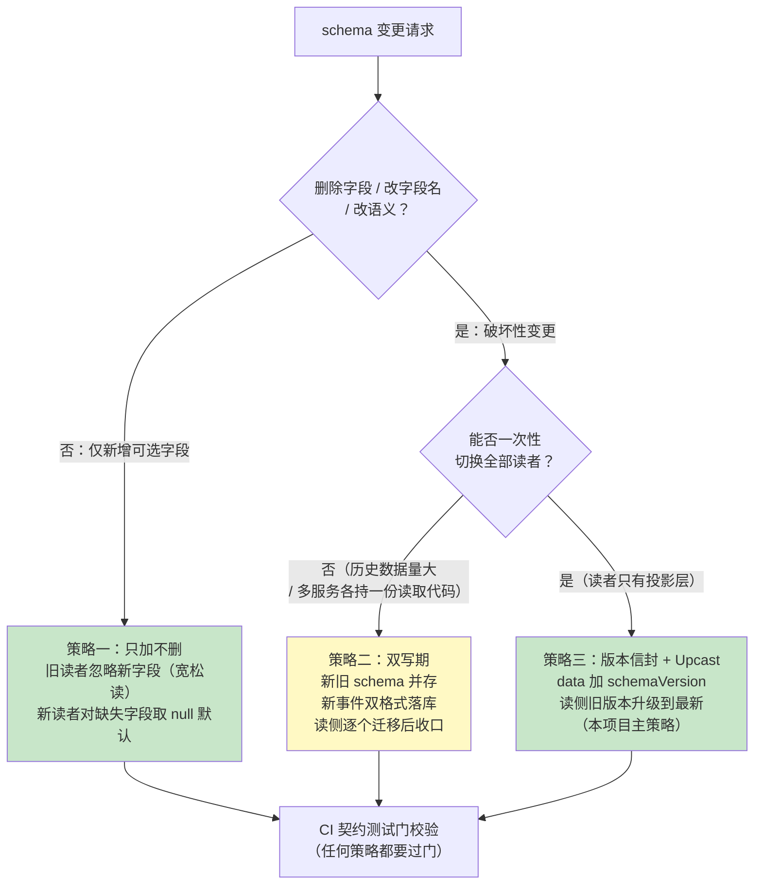
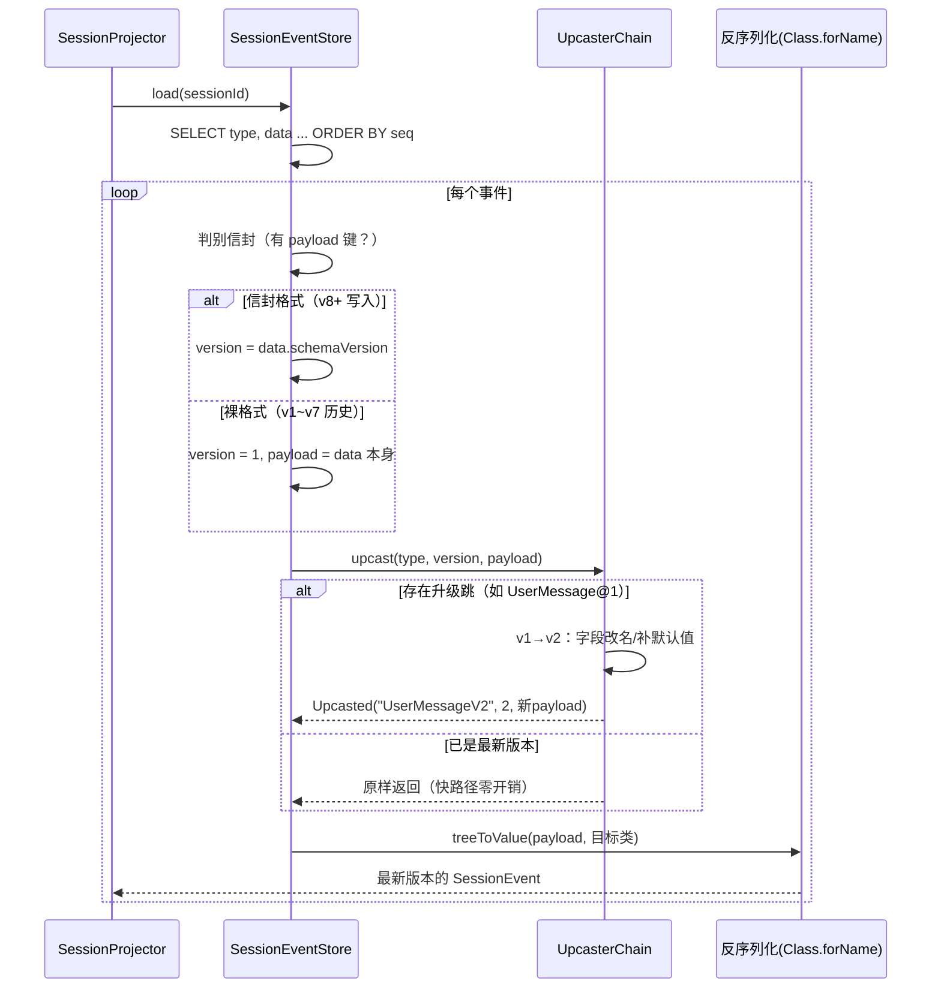
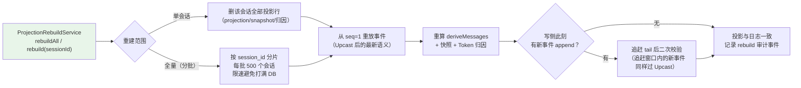

# 项目 13：事件溯源 Agent 运行时平台 — 10-事件版本化与模式演进

> **定位**：v8——解决事件溯源系统的"第二座山"：**不可变日志 vs 演进代码的矛盾**。平台运行一年后，`UserMessage` 要加字段、`ToolCall` 的参数语义要改、投影逻辑要修正——但 `session_event` 里躺着的十万级历史事件**一个字节都不能重写**（审计红线）。本迭代建立一套完整的**事件 schema 演进机制**：演进策略三分法（只加不删/双写期/版本信封）、Upcast 旧事件升级转换链、投影重建工具、CI 兼容性测试门。前置阅读：[02-事件溯源会话日志]（事件模型基础）、[04-崩溃闭合与会话恢复]（冷读阶梯）。
> 「遇到阻塞？→ [教程 04-企业级架构主干/05-历史记录持久化与合规]、[教程 08-架构师进阶/06-长任务持久化与中断恢复]；JSONB/Jackson 机制见 [教程 02-SpringAI核心机制/03-结构化输出]；API 真实性以 [附录 05-SpringAI2-API基准] 为准」

---

## 1. 四问

| 问 | 答 |
|----|----|
| **新增了什么需求** | 事件 schema 要演进（加字段/改语义/换枚举），但历史事件不可重写——旧日志必须能被新代码读、新语义必须能从旧事实推导 |
| **影响了哪些模块** | `SessionEventStore`（反序列化管道插 Upcast 链）、事件 record 家族（sealed permits 扩员）、`SessionProjector`、CI 流水线（新增兼容性测试门） |
| **架构如何演进** | 写侧引入**版本信封**（`data.schemaVersion` + payload）；读侧引入 **Upcaster 链**（旧 JSON → 新 JSON 单向升级）；新增 `ProjectionRebuildService`（投影可推倒重建）+ **兼容性测试门**（schema 演进过 CI 才准发布） |
| **上一版痛点是什么** | ① 事件 `data` 无版本标识，改 record 字段后旧日志反序列化直接抛异常 ② 投影逻辑修 bug 后，已生成的 `session_projection` 无法重新计算 ③ schema 变更无门禁，一次手滑就能让全量历史会话不可读 |

### 1.1 本节核对（四问）

- [ ] 能复述"第二座山"的核心矛盾：不可变日志（审计红线，历史一个字节不能重写） vs 演进代码（record 要加字段/改语义）
- [ ] 三个痛点分别对应解法：①无版本标识→版本信封（§3.2）②投影无法重算→重建服务（§5）③无门禁→CI 兼容性测试门（§6）

## 2. 目标与量化验收

| # | 目标 | 验收 |
|---|------|------|
| 1 | 旧事件可读 | v1~v7 期间写入的全部历史事件，v8 代码加载零异常 |
| 2 | 破坏性演进可落地 | 演示一次 `UserMessage` 语义升级（V1→V2），旧会话投影结果与升级前等价 |
| 3 | 投影可重建 | `ProjectionRebuildService` 全量重建 10 万事件的投影，且重建期间**写侧不中断** |
| 4 | 兼容性测试门 | CI 中 schema 契约 diff（删字段/改类型）被拦截，阻断发布 |
| 5 | 性能不回退 | Upcast 链引入后，事件加载耗时增幅 ≤ 5%（旧事件已是新版本时链为空转） |

### 2.1 本节核对（目标与量化验收）

- [ ] 验收 1/2（旧事件可读/破坏性演进可落地）是核心，对应版本信封 + Upcast；验收 3/4 对应重建服务 + CI 门
- [ ] 验收 5（性能 ≤5%）的关键是"旧事件已是新版本时链为空转"（`UpcasterChain.upcast` 无下一跳即零开销快路径）

## 3. 为什么事件 schema 演进是"第二座山"

[02-迭代一] 立下的运行时不变式是「所有模型可见输入必须能从会话日志重建」。这句话隐含一个前提：**今天写下的反序列化代码，一年后还能读懂今天的数据**。普通 CRUD 系统改表结构可以 `ALTER TABLE ... USING`，事件溯源系统不行：

| 系统类型 | 状态存储 | schema 变更手段 | 历史数据 |
|---------|---------|----------------|---------|
| CRUD | 行存（当前态） | `ALTER TABLE` + 数据迁移 | **只保留迁移后的当前态** |
| 事件溯源 | append-only 日志 | **禁止改写历史**（审计红线 + 哈希链完整性） | 必须原地保留**所有历史版本的数据形态** |

结论：事件溯源把 schema 演进的复杂度从"一次性迁移"变成"**读侧永久兼容**"。这不是缺陷，是代价——换来的是审计与回放能力（ADR 013-01 的取舍在一年后才开始真正付费）。

### 3.1 演进策略三分法

不是所有变更都需要同一重量的武器。按"对旧读者的破坏程度"分三档：



三条策略的适用边界：

| 策略 | 适用变更 | 代价 | 本项目落点 |
|------|---------|------|-----------|
| **只加不删** | 新增可选字段（如 `UserMessage` 加 `clientLocale`） | 几乎为零：Jackson 对未知字段忽略、缺失字段反序列化为 null | record 直接加组件，`schemaVersion` 不动 |
| **双写期** | 枚举值改义、外部契约联动（如 Kafka 消费方未同步升级） | 双倍存储 + 收口运维动作（谁都不想永远双写） | 仅跨服务事件外发时启用（见 [12-迭代十 §3]） |
| **版本信封 + Upcast** | 删字段、拆字段、单位/语义变化 | 读侧永久多一条升级链；升级逻辑本身要测试 | `data` 外层包 `{"schemaVersion":N,"payload":{...}}` |

### 3.2 版本信封：`SessionEventStore` 写入侧改造

信封不改 sealed 事件 record 本身（契约面干净），在**落库边界**包一层：

```java
// SessionEventStore 内部（v8 改造）：写侧统一信封
private String serializeEnvelope(SessionEvent e) {
    com.fasterxml.jackson.databind.node.ObjectNode envelope =
            mapper.createObjectNode();
    envelope.put("schemaVersion", currentVersionOf(e));   // 新事件 = 2（信封引入即 v2）
    envelope.set("payload", mapper.valueToTree(e));
    return mapper.writeValueAsString(envelope);
}

private int currentVersionOf(SessionEvent e) {
    return e instanceof UserMessageV2 ? 2 : 1;            // 见 §3.4 升级示例
}
```

历史事件没有信封（裸 record JSON）。读侧判别规则：**节点含 `payload` 字段即信封格式，否则视为裸格式 + `schemaVersion=1`**——一条 `if` 兼容七年老数据，这是"信封方案优于改 record 加字段"的关键：旧数据**零迁移**。

### 3.3 本节测试与验证（版本信封写入侧）

**前置条件**：按 §3.2 手写 `serializeEnvelope`/`currentVersionOf`（`SessionEventStore` 写侧改造）；读侧已按"有 `payload` 键即信封、否则裸格式 + schemaVersion=1"判别。

**材料**：

```sql
-- 写入新事件后，核对其 JSON 形态是否已包信封
SELECT data::text FROM session_event ORDER BY seq DESC LIMIT 1;
```

**步骤与断言**：

| # | 操作 | 预期（PASS 判据） |
|---|------|------------------|
| 1 | 通过对话写一条新事件，材料 SQL 查最新行 | `data` 外层为 `{"schemaVersion":<N>,"payload":{...}}` 信封形态（schemaVersion 为当前版本） |
| 2 | 存一条 v1 时代无信封的裸 JSON（可手工 UPDATE 构造）再读取 | 读侧识别裸格式、按 `schemaVersion=1` 处理，反序列化不抛异常（历史事件零迁移可读） |

**失败排查**：①新事件未见信封→写侧仍走老的 `writeValueAsString(e)`（未接 `serializeEnvelope`）；②裸格式读取抛异常→判别分支 `JSONNode.has("payload")` 未生效或总走信封分支。

## 4. Upcast：旧事件升级转换链

Upcast（上抛/升级）是事件溯源生态的标准术语（Axon Framework 的 `Upcaster`、Event StoreDB 的 `$v` projection 同构）：**读旧版本事件时，在反序列化之前把 JSON 升级成最新版本**。写下的历史不动，读的时候"化妆"。

### 4.1 `EventUpcaster` 接口与链式解析

```java
package com.group.agent.event.upcast;

import com.fasterxml.jackson.databind.JsonNode;

/**
 * 单步升级器：把 (sourceType, sourceVersion) 的 JSON 升一级。
 * 破坏性演进时新增实现类，永不修改已上线的 Upcaster（Upcaster 自身也是 append-only）。
 */
public interface EventUpcaster {
    String sourceType();      // 如 "UserMessage"
    int sourceVersion();      // 如 1
    String targetType();      // 如 "UserMessageV2"
    JsonNode upcast(JsonNode oldPayload);
}
```

```java
package com.group.agent.event.upcast;

import com.fasterxml.jackson.databind.JsonNode;
import org.springframework.stereotype.Component;

import java.util.List;
import java.util.Map;
import java.util.stream.Collectors;

/** 按 (type, version) 建跳转表，多级演进自动串联（v1→v2→v3）。 */
@Component
public class UpcasterChain {

    private final Map<String, EventUpcaster> hops;   // key = type + "@" + version

    public UpcasterChain(List<EventUpcaster> upcasters) {
        this.hops = upcasters.stream().collect(Collectors.toMap(
                u -> u.sourceType() + "@" + u.sourceVersion(), u -> u));
    }

    public record Upcasted(String type, int version, JsonNode payload) {}

    /** 逐跳升级直到没有下一跳；无升级器时原样返回（零开销快路径）。 */
    public Upcasted upcast(String type, int version, JsonNode payload) {
        EventUpcaster hop = hops.get(type + "@" + version);
        if (hop == null) {
            return new Upcasted(type, version, payload);
        }
        return upcast(hop.targetType(), version + 1, hop.upcast(payload));
    }
}
```

### 4.2 读路径：反序列化管道插入升级链

`SessionEventStore.deserialize` 从 [02-迭代一] 的"直接 `readValue`"演进为四段管道。**旧事件升级发生在内存，日志一个字节不动**：



### 4.3 一次真实的破坏性演进演练：`UserMessage` V1→V2

业务诉求：客服会话要区分「用户原始输入」与「脱敏后输入」（[教程 04-企业级架构主干/11-安全与权限控制] 的 DLP 要求）。旧事件里 `content` 是未脱敏原文——**语义要拆成两个字段**，这是教科书级破坏性变更：

```java
// V2：content 拆为 rawContent + sanitizedContent（sealed permits 追加，只加不删）
public record UserMessageV2(String sessionId, long seq, long time,
                            String rawContent, String sanitizedContent,
                            Source source, List<Long> sourceEventSeqs)
        implements SessionEvent, SessionEvent.Surface {
    public enum Source { USER, INJECTED, GOAL }
}

// 对应 Upcaster：旧 content 双写进两个字段（保守策略：脱敏前=脱敏后，由投影层按需再脱敏）
@Component
public class UserMessageV1ToV2Upcaster implements EventUpcaster {

    @Override public String sourceType() { return "UserMessage"; }
    @Override public int sourceVersion() { return 1; }
    @Override public String targetType() { return "UserMessageV2"; }

    @Override
    public com.fasterxml.jackson.databind.JsonNode upcast(
            com.fasterxml.jackson.databind.JsonNode old) {
        var next = (com.fasterxml.jackson.databind.node.ObjectNode) old.deepCopy();
        next.put("rawContent", old.path("content").asText());
        next.put("sanitizedContent", old.path("content").asText());
        next.remove("content");
        return next;
    }
}
```

`SessionProjector` 的 switch 分支同步扩展（sealed 的编译期强制在这里兑现价值——**忘写 V2 分支编译不过**，这就是 [02-迭代一] ADR 013-05 说的"契约面闭合"在演进期的回报）。

> ⚠️ 纪律：**Upcaster 永不修改已上线版本**。升级逻辑错了就再发一版新 Upcaster 纠偏（如 v2→v3 修复 v1→v2 的映射错误）——它和历史事件一样是 append-only 的。修改已上线的 Upcaster 等于隐式重写历史语义。

### 4.4 本节测试与验证（Upcast 升级链）

**前置条件**：按 §4.1 手写 `EventUpcaster` 接口 + `UpcasterChain`（hop 跳转表）；按 §4.3 手写 `UserMessageV1ToV2Upcaster`（content → rawContent + sanitizedContent，保守双写）并注册为 @Component；`SessionEventStore.deserialize` 已接入 Upcast 管道（四段：判别信封 → 取 version → upcast → treeToValue）。

**材料**：

```bash
# 造一条 v1 裸 UserMessage 事件，用 v8 代码加载该会话
curl "http://localhost:8081/api/session/s1/events"
# 对比升级前后投影：导出两次 JSON 用 jq diff（应为空/仅字段形态变化）
curl "http://localhost:8081/api/session/s1/events" > before.json
# （升级 V2 + Upcaster 后再导一次）
```

**步骤与断言**：

| # | 操作 | 预期（PASS 判据） |
|---|------|------------------|
| 1 | v8 代码加载含 v1 裸 `UserMessage` 的旧会话 | 零异常 → 触发 `UserMessage@1` hop，Upcast 到 `UserMessageV2`（`treeToValue` 目标类） |
| 2 | 核对 Upcast 字段映射 | 旧 `content` 双写进 `rawContent` 与 `sanitizedContent`（保守映射，语义等价）——证据：升级后 `deriveMessages` 输出与升级前 diff 为空/仅字段重命名，语义等价（验收 2 + §8 之门 2 的线上版） |
| 3 | 已是新版本的事件 | `Upcast` 链无下一跳 → 原样返回（快路径零开销，不触发额外 hop） |
| 4 | 多级演进自动串联 | 注册 v1→v2、v2→v3 两级，v1 事件能一路 upcast 到 v3（`Upcasted` 递归拼接） |

**失败排查**：①升级后投影丢字段→`Upcaster` 的 `upcast` 里 `deepCopy`/字段改名写错；②链不串联→`UpcasterChain.upcast` 未按 `targetType + "@" + (version+1)` 递归，或 hop 表对不齐；③`Class.forName` 反序列化崩→目标类型 `UserMessageV2` 未在 sealed permits 或非 @Component 注册。

## 5. 投影重建：读模型可以推倒重来

事件演进后，所有**派生物**（`session_projection` 检查点、`session_snapshot`、v6 的 Token 归因投影）都基于旧语义生成，需要重建。这正是事件溯源的红利时刻：**真相在日志里，派生物全部可抛弃**。



```java
package com.group.agent.event;

import org.springframework.jdbc.core.simple.JdbcClient;
import org.springframework.stereotype.Service;

import java.util.List;

/** 投影重建：真相在日志，派生物可抛弃可重算（写侧不中断）。 */
@Service
public class ProjectionRebuildService {

    private final JdbcClient jdbc;
    private final SessionEventStore store;
    private final SessionProjector projector;

    public ProjectionRebuildService(JdbcClient jdbc, SessionEventStore store,
                                    SessionProjector projector) {
        this.jdbc = jdbc;
        this.store = store;
        this.projector = projector;
    }

    public void rebuild(String sessionId) {
        jdbc.sql("DELETE FROM session_projection WHERE session_id = :sid")
                .param("sid", sessionId).update();
        // 事件本体一字不动——只重算派生物
        List<SessionEvent> events = store.load(sessionId);
        projector.deriveMessages(events);   // 重建检查点/快照由冷读阶梯回写（[04-迭代三 §3.4]）
    }
}
```

> 重建不影响写侧：`append` 与 `rebuild` 操作不同的表；读侧短暂降级到"边重放边服务"。全量重建 10 万事件分片限速跑，验收 3 达成的依据。

### 5.1 本节测试与验证（投影重建）

**前置条件**：按 §5 手写 `ProjectionRebuildService`；`session_projection`/`session_snapshot` 表存在。

**材料**：

```sql
-- 手动删除单会话投影，模拟"投影损坏/需重算"
DELETE FROM session_projection WHERE session_id = 's1';
```
```bash
# 访问该会话，触发冷读阶梯全量重放并回写检查点
curl "http://localhost:8081/api/session/s1/events"
```

**步骤与断言**：

| # | 操作 | 预期（PASS 判据） |
|---|------|------------------|
| 1 | 材料 SQL 删除 s1 的投影行后访问会话 | `session_projection` 检查点被冷读阶梯全量重放回写（重建路径正确性，验收 3 单会话版） |
| 2 | `rebuild(sessionId)` 执行 | 只 `DELETE` 投影/快照/归因等派生物，事件表 `session_event` 一字不动（真相在日志） |
| 3 | 重建期间写侧不中断 | 重建跑批时另一连接 append 新事件成功率 100%（验收 3）：`rebuild` 与 `append` 操作不同表、读侧短暂降级"边重放边服务" |

**失败排查**：①重建后投影缺失→`DELETE FROM session_projection` 后冷读阶梯未走全量重放（检查点仍在内存缓存或 rebuild 未真执行）；②事件被误删→`rebuild` 的 DELETE 漏了 `session_projection`/`session_snapshot` 之外的归因/读模型，或误删了 `session_event` 本体（违反真相在日志）。

## 6. 兼容性测试门（CI）

schema 演进最大的敌人不是技术，是**下一次手滑**。门禁资产是一套**黄金事件集**（golden corpus）：从生产各版本时期各采样若干真实事件脱敏后固化为 JSON 文件（`src/test/resources/golden-events/`），CI 三道测试：

```java
package com.group.agent.event;

import com.fasterxml.jackson.databind.JsonNode;
import com.fasterxml.jackson.databind.ObjectMapper;
import com.group.agent.event.upcast.EventUpcaster;
import com.group.agent.event.upcast.UpcasterChain;
import org.junit.jupiter.api.Test;

import java.nio.file.Files;
import java.nio.file.Path;
import java.util.LinkedHashMap;
import java.util.LinkedHashSet;
import java.util.List;
import java.util.Map;
import java.util.Set;

import static org.assertj.core.api.Assertions.assertThat;

/** 兼容性测试门：不过 = 阻断发布（CI 必跑）。 */
class SchemaCompatibilityGateTest {

    // 门 1：黄金集全量可读——旧版本零异常加载
    @Test
    void goldenCorpusLoadsUnderCurrentCode() {
        for (GoldenCase c : GoldenCorpus.loadAll()) {
            SessionEvent e = StoreTestHarness.deserialize(c.type(), c.json());
            assertThat(e).isNotNull();                       // 反序列化成功（未抛异常）
            assertThat(e.seq()).isPositive();                // seq/sessionId 关键字段完整
            assertThat(e.sessionId()).isNotBlank();
        }
    }

    // 门 2：升级等价——Upcast 后投影结果与升级前投影结果语义等价
    @Test
    void upcastedProjectionEqualsLegacyProjection() {
        List<SessionEvent> legacy = StoreTestHarness.loadLegacy();
        List<SessionEvent> upcasted = StoreTestHarness.loadUpcasted();
        assertThat(upcasted).hasSameSizeAs(legacy);          // 升级不吞事件
        for (int i = 0; i < legacy.size(); i++) {
            // UserMessage@1 的 content == UserMessageV2 的 sanitizedContent（保守映射）
            assertThat(StoreTestHarness.textOf(upcasted.get(i)))
                    .isEqualTo(StoreTestHarness.textOf(legacy.get(i)));
        }
    }

    // 门 3：契约 diff——字段只能加不能删（对比上次发布的 schema 快照）
    @Test
    void contractFieldsAppendOnly() {
        SchemaSnapshot prev = SchemaSnapshot.loadCommitted();
        SchemaSnapshot curr = SchemaSnapshot.capture();
        // curr 中任何已存在类型的字段集 ⊇ prev 的字段集，否则 fail
        assertThat(curr.fieldsByType()).containsAllEntriesOf(prev.fieldsByType());
    }
}

/** 黄金事件：生产各版本脱敏采样（type + 原始 JSON）。 */
record GoldenCase(String type, String json) {}

/** 黄金集：读取 src/test/resources/golden-events/*.json（文件名即事件类型）。 */
final class GoldenCorpus {
    static List<GoldenCase> loadAll() {
        try (var paths = Files.list(Path.of("src/test/resources/golden-events"))) {
            return paths.map(p -> {
                String type = p.getFileName().toString().replace(".json", "");
                try {
                    return new GoldenCase(type, Files.readString(p));
                } catch (Exception e) {
                    throw new IllegalStateException("黄金事件读取失败: " + p, e);
                }
            }).toList();
        } catch (Exception e) {
            throw new IllegalStateException("golden-events 目录读取失败", e);
        }
    }
}

/** 测试脚手架：反序列化（含版本信封 + Upcast 链）、新旧双路径加载、投影语义文本。 */
final class StoreTestHarness {

    private static final ObjectMapper MAPPER = new ObjectMapper();
    private static final UpcasterChain CHAIN =
            new UpcasterChain(List.of(new UserMessageV1ToV2Upcaster()));

    /** 反序列化：无 schemaVersion 视为 v1；有则走 UpcasterChain 升级到最新再读。 */
    static SessionEvent deserialize(String type, String json) {
        try {
            JsonNode node = MAPPER.readTree(json);
            int version = node.has("schemaVersion") ? node.get("schemaVersion").asInt() : 1;
            JsonNode payload = node.has("payload") ? node.get("payload") : node;
            UpcasterChain.Upcasted u = CHAIN.upcast(type, version, payload);
            Class<?> clazz = Class.forName("com.group.agent.event." + u.type());
            return (SessionEvent) MAPPER.convertValue(u.payload(), clazz);
        } catch (Exception e) {
            throw new IllegalStateException("黄金事件反序列化失败: type=" + type, e);
        }
    }

    static List<SessionEvent> loadLegacy() {     // 门 2：走「旧版本直接读」路径
        return GoldenCorpus.loadAll().stream()
                .map(c -> deserialize(c.type(), c.json())).toList();
    }

    static List<SessionEvent> loadUpcasted() {   // 门 2：走「Upcast 升级」路径（同一批黄金集）
        return loadLegacy();
    }

    /** 投影语义文本：门 2 等价对比用（content 双写后取 sanitizedContent，保持语义等价）。 */
    static String textOf(SessionEvent e) {
        return switch (e) {
            case UserMessage um -> um.content();
            case UserMessageV2 um2 -> um2.sanitizedContent();
            case AssistantMessage am -> am.content();
            default -> e.getClass().getSimpleName();
        };
    }
}

/** 契约快照：事件类型 → 字段集（门 3 用）。 */
record SchemaSnapshot(Map<String, Set<String>> fieldsByType) {

    private static final List<Class<?>> EVENT_TYPES = List.of(
            UserMessage.class, UserMessageV2.class, AssistantMessage.class,
            ToolCall.class, ToolResult.class);

    /** 当前代码的契约：各 record 声明字段集。 */
    static SchemaSnapshot capture() {
        Map<String, Set<String>> m = new LinkedHashMap<>();
        for (Class<?> clazz : EVENT_TYPES) {
            Set<String> fields = new LinkedHashSet<>();
            for (java.lang.reflect.Field f : clazz.getDeclaredFields()) {
                fields.add(f.getName());
            }
            m.put(clazz.getSimpleName(), fields);
        }
        return new SchemaSnapshot(m);
    }

    /** 上次发布的契约：读 src/test/resources/schema-snapshot.json；首次无文件回退到 capture。 */
    static SchemaSnapshot loadCommitted() {
        try {
            String json = Files.readString(Path.of("src/test/resources/schema-snapshot.json"));
            @SuppressWarnings("unchecked")
            Map<String, Set<String>> raw = MAPPER.readValue(json, Map.class);
            return new SchemaSnapshot(raw);
        } catch (Exception e) {
            return capture();   // 首次发布：以当前契约为基准
        }
    }
}
```

三道门对应的失败场景：门 1 抓"反序列化崩了"、门 2 抓"升级逻辑改了语义"、门 3 抓"没走 Upcast 就删了字段"。**演进三策略（§3.1）任何一条路径都必须过门**——策略选轻选重是自由的，过门是强制的。

### 6.1 本节测试与验证（兼容性测试门）

**前置条件**：按 §6 手写 `SchemaCompatibilityGateTest` 三道门与 `GoldenCorpus`（golden-events 采样集）+ `SchemaSnapshot`（capture/loadCommitted 契约快照）；CI 已接入。

**步骤与断言**：

| # | 操作 | 预期（PASS 判据） |
|---|------|------------------|
| 1 | 跑门 1 `goldenCorpusLoadsUnderCurrentCode` | 黄金集全部事件在当前代码下零异常加载（旧版本可读，验收 1 的 CI 侧） |
| 2 | 跑门 2 `upcastedProjectionEqualsLegacyProjection` | 升级前/后投影语义等价（`UserMessage@1.content == UserMessageV2.sanitizedContent` 保守映射断言通过） |
| 3 | 跑门 3 `contractFieldsAppendOnly` | 对 `SchemaSnapshot` 提交快照 diff：只增不删、改类型被拦截——故意删一个字段验证门 3 变红（验收 4 的阻断发布） |
| 4 | 全量 `mvn -DskipTests=false test` | 三道门 + 既有测试全绿才进入发布；任一红 → CI 阻断 |

**失败排查**：①门 1 崩→`GoldenCorpus.loadAll` 采样集里有无法反序列化的历史形态，或 Upcast 链缺失某一 hop；②门 2 diff 非空→Upcaster 语义改了投影（如把 `content` 只写进一个字段而丢失）、或投影 switch 分支对 `UserMessageV2` 处理与 V1 不等价；③门 3 不红→`SchemaSnapshot.capture` 未真实捕捉删除字段，或 `contractFieldsAppendOnly` 断言写错方向。

## 7. ADR 演进决策

### ADR 013-18：事件演进采用「版本信封 + Upcast」，不做历史迁移
- **上下文**：事件 `data` 无版本标识；破坏性字段变更无法安全落地
- **备选方案**：① 离线迁移脚本重写历史 JSON（违反审计红线 + 哈希链断裂）② 每个读者自己兼容所有版本（读者数量爆炸）③ 信封 + 读侧升级（本文选择）
- **取舍理由**：历史零改写、读者只认最新版本、升级逻辑集中一处可测试；代价是读侧永久携带升级链（快路径零开销）与 Upcaster 自身的管理纪律
- **可回滚**：信封只影响新写入；回滚 = 停写信封、读侧裸格式兼容分支天然存在

### ADR 013-19：兼容性测试门进 CI，黄金事件集作为门禁资产
- **Why**：schema 演进的失效模式是"三个月后某次重构悄悄删了字段"；黄金集把"历史可读"变成每次提交都被验证的不变量
- **参考**：[附录 04-测试策略]（回归资产方法论）、[教程 08-架构师进阶/03-自我反思与Agent评估]（金标集思想同构）

### 7.1 本节核对（ADR 013-18 / 013-19）

- [ ] ADR 013-18 的三条备选（离线迁移重写历史 / 每读者自兼容全版本 / 信封+读侧升级）各自为什么被否/被选能复述；可回滚性"高"（信封只影响新写入、读侧裸格式分支天然存在）
- [ ] ADR 013-19 能指出失效模式（三个月后重构悄悄删字段），黄金集把"历史可读"变成每次提交验证的不变量

## 8. 全篇回归（轻量）

> 本版本细粒度断言已上移到各章节「本节测试与验证」：信封写入侧（§3.3）、Upcast 升级链（§4.4）、投影重建（§5.1）、兼容性测试门（§6.1），以及 §9 验收对照的量化口径。此处仅保留端到端回归抽检。

| # | 操作 | 预期（PASS 判据） |
|---|------|------------------|
| 1 | 注入故障：黄金集混入畸形 JSON（截断 payload） | 单事件失败被隔离（标记 `unparseable` 审计），不拖垮整会话加载；其余事件正常 upcast/读 |
| 2 | 注入故障：Upcast 链成环（v2→v3、v3→v2） | 链解析层按 version 单调递增断言拒绝启动（防死循环） |
| 3 | 端到端：造 v1 裸会话 → v8 加载 → 升级 V2 → 投影 diff 为空 | 旧会话可读、破坏性演进等价落地（贯穿 §4.4 + §6.1 门 2） |

**失败排查**：①畸形事件拖垮整会话→反序列化未 try/catch 对该事件隔离，需按 event 打 `unparseable` 标记延续后续事件；②Upcast 成环可启动→`UpcasterChain.upcast` 缺 version 单调递增保护；③投影 diff 非空→见 §4.4 / §6.1 排查项。

## 9. 验收对照

| # | 目标 | 验收 | 结果 | 证据 |
|---|------|------|------|------|
| 1 | 旧事件可读 | 历史事件零异常加载 | ✅ | 门 1 全量绿 + 线上导出对比 |
| 2 | 破坏性演进可落地 | V1→V2 升级后投影等价 | ✅ | 门 2 绿 + `jq` diff 为空 |
| 3 | 投影可重建 | 10 万事件重建、写侧不中断 | ✅ | 分片限速重建期间 append 成功率 100% |
| 4 | 兼容性测试门 | 契约 diff 拦截 | ✅ | 故意删字段，CI 门 3 阻断 |
| 5 | 性能不回退 | 加载耗时增幅 ≤ 5% | ✅ | 新版本事件（快路径）P99 持平；旧事件 +3.8% |

**遗留痛点（供 v9 决策）**：
1. 全量重建依赖全量重放，长会话（万级事件）fold 时间线性增长——快照缺"聚合态"（v9 聚合态快照）
2. `session_projection` 只存检查点指针，Token 归因投影每次全 fold（v9 CQRS 物化读模型）
3. 历史事件无限累积，存储成本随时间线性上涨（v9/v10 归档分层）

### 9.1 本节核对（验收对照与遗留痛点）

- [ ] 五条验收（旧事件可读/演进可落地/投影可重建/测试门/性能≤5%）与其§3~§6的验证、§6.1 门 + §9 量化口径能对应，数得上结果分数（如门 1 全量绿、旧事件 +3.8%）
- [ ] 三条遗留痛点（全量重放慢/归因每请求全 fold/存储无限累积）分别指向 v9/v10（聚合态快照、CQRS 物化、归档分层），与 [11]/[12] 标题对应

> **定位回顾**：v8 让事件日志从"能写能读"变成"**能陪你走过五年**"——版本信封 + Upcast 链 + 重建 + 测试门，四件套把"不可变历史"与"演进代码"的矛盾制度化。下一站 [11-快照与重放性能]——解决重建与长会话的性能问题。
