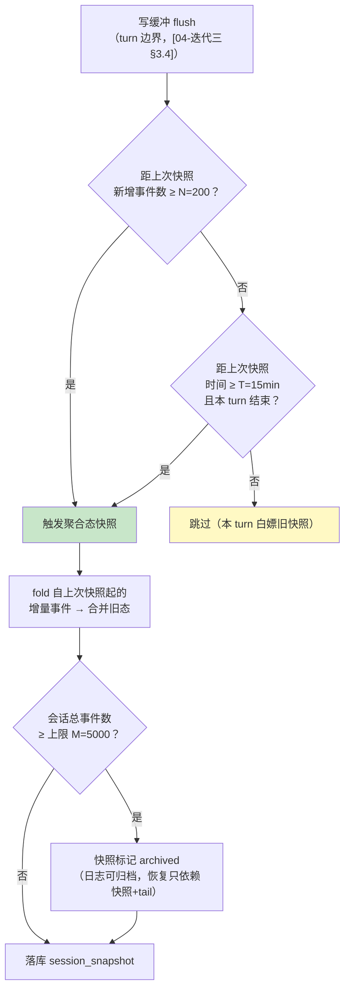
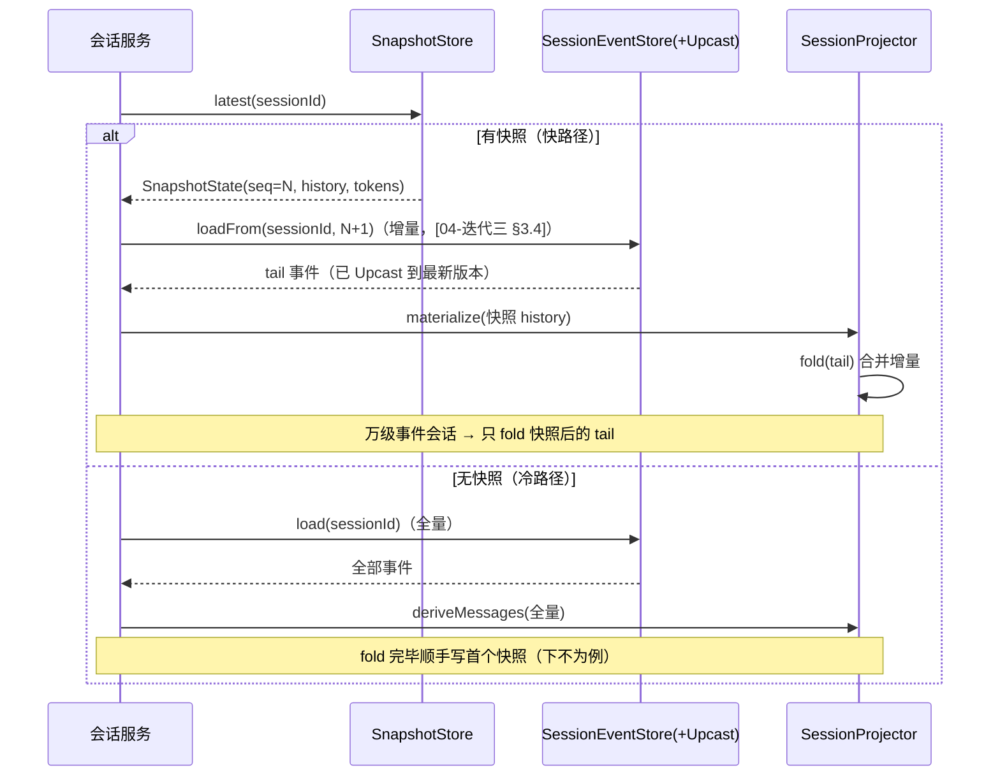
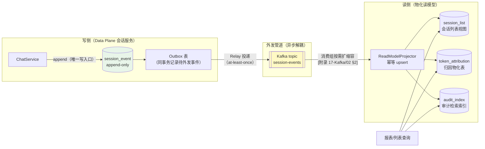

# 项目 13：事件溯源 Agent 运行时平台 — 11-迭代九·快照与重放性能

> **定位**：v9——解决事件溯源的"第三座山"：**重放性能随历史线性增长**。[04-迭代三] 的冷读阶梯只有检查点指针（`session_projection` 存 `checkpoint_seq`，折叠仍全量重算）；[10-迭代八] 的投影重建也依赖全量重放。本迭代补齐三件事：**聚合态快照**（按事件数/时间间隔双阈值触发，折叠结果落库）、**增量重放 vs 全量重放的选择策略**、**CQRS 读写分离**（读模型物化，写侧 append-only 不再服务查询）+ **归档冷存分层**（热事件按月分区、冷数据出库到对象存储）。前置阅读：[04-迭代三-崩溃闭合与会话恢复]（冷读阶梯）、[10-迭代八-事件版本化与模式演进]（重建基础）。
> 「遇到阻塞？→ [教程 38-Agent性能优化]、[教程 22-全链路可观测性]；事件外发与消费组扩缩容见 [附录 17-Kafka/02-消费者与消费组]；API 真实性以 [附录 05-SpringAI2-API基准] 为准」

---

## 1. 四问

| 问 | 答 |
|----|----|
| **新增了什么需求** | ① 长会话（万级事件）重建/fold 时间线性增长，P99 超预算 ② Token 归因等报表查询在写路径上全量 fold，读写互相干扰 ③ 两年历史事件全量在线，存储与索引成本失控 |
| **影响了哪些模块** | `SessionProjectionCache`（升级为聚合态快照）、`SessionProjector`（增量 fold）、新增 `SnapshotStore`/`ReadModelProjector`/`EventArchiver`、`session_event` 表（按月分区） |
| **架构如何演进** | 读路径从「日志 → 每次全 fold」演进为「**快照 + 增量 fold**」；查询从写侧服务演进为「**CQRS 物化读模型**」（事件经外发管道增量驱动）；存储从单表演进为「**热/温/冷分层**」 |
| **上一版痛点是什么** | ① v8 投影重建全量重放慢 ② v6 归因投影每次请求全 fold ③ 检查点只有指针没有聚合态，「冷读阶梯」实际是「全量重算阶梯」 |

## 2. 目标与量化验收

| # | 目标 | 验收 |
|---|------|------|
| 1 | 快照命中恢复 | 万级事件会话，快照 + 增量 fold 恢复 P99 ≤ 50ms（原全量 fold P99 ≈ 1.2s） |
| 2 | 增量 fold 正确 | 快照路径与全量重放路径对同一会话产出**逐字节一致**的历史（等价测试） |
| 3 | CQRS 读模型 | 会话列表/归因报表查询不触发任何 fold，P99 ≤ 20ms；写侧 QPS 无回退（≥ 2000/s） |
| 4 | 归档分层 | 90 天前事件出库至对象存储，热表体积下降 ≥ 70%；冷读按需拉回成功率 100% |
| 5 | 快照存储成本 | 快照表体积 ≤ 事件日志体积的 15%（折叠消除冗余的自然红利） |

## 3. 聚合态快照：从「检查点指针」到「折叠结果落库」

### 3.1 快照里存什么——快照的是聚合态，不是事件

本运行时的"聚合"是**会话**，热路径需要的聚合态是「模型可见历史」。快照直接存折叠产物：

```java
package com.group.agent.event;

import java.util.List;

/** 快照态：折叠产物的纯数据形态（不绑定 Spring AI Message 类，跨版本稳定）。 */
public record SnapshotState(
        long seq,                              // 快照覆盖到的最后事件 seq
        List<MsgEntry> history,                // 折叠后的模型可见历史
        long inputTokens, long outputTokens    // 聚合态顺手带走的计量（v6 归因免二次 fold）
) {
    /** MsgEntry 是 Message 的纯数据投影：role + content + 工具结果三元组。 */
    public record MsgEntry(String role, String content,
                           String callId, String toolName, String toolResponse) {
        static MsgEntry user(String content) {
            return new MsgEntry("user", content, null, null, null);
        }
        static MsgEntry assistant(String content) {
            return new MsgEntry("assistant", content, null, null, null);
        }
        static MsgEntry tool(String callId, String toolName, String response) {
            return new MsgEntry("tool", null, callId, toolName, response);
        }
    }
}
```

**为什么不直接序列化 `List<Message>`**：`AssistantMessage`/`ToolResponseMessage` 的字段结构随 Spring AI 版本演进（[10-迭代八] 刚论证过契约面要稳定），快照若绑定框架类，框架升级就要全量重写快照。`MsgEntry` 四个 String 字段是**自有契约**，重建 Message 的一小段适配代码隔离了框架变化：

```java
// SessionProjector 追加：从快照态重建模型历史（2.0 真实 API，[附录 05-SpringAI2-API基准]）
List<org.springframework.ai.chat.messages.Message> materialize(List<SnapshotState.MsgEntry> entries) {
    var out = new java.util.ArrayList<org.springframework.ai.chat.messages.Message>();
    for (var e : entries) {
        switch (e.role()) {
            case "user" -> out.add(new org.springframework.ai.chat.messages.UserMessage(e.content()));
            case "assistant" -> out.add(
                    new org.springframework.ai.chat.messages.AssistantMessage(e.content()));
            case "tool" -> out.add(
                    org.springframework.ai.chat.messages.ToolResponseMessage.builder()
                            .responses(List.of(new org.springframework.ai.chat.messages
                                    .ToolResponseMessage.ToolResponse(
                                    e.callId(), e.toolName(), e.toolResponse())))
                            .build());
        }
    }
    return out;
}
```

### 3.2 双阈值触发策略：事件数 + 时间间隔



双阈值的理由——两个维度捕捉不同的增长模式：

| 阈值 | 捕捉场景 | 单独使用的问题 |
|------|---------|---------------|
| 事件数 N=200 | 爆发式会话（一次工具密集 turn 产生数百事件） | 只有 N：慢会话（一天 10 个事件）永远等不到快照 |
| 时间间隔 T=15min | 慢速长会话（工单式跨天对话） | 只有 T：爆发会话在两次快照间 fold 大量增量 |
| 归档线 M=5000 | 超长会话的日志出库资格 | 无 M：归档后无法恢复老会话 |

```java
package com.group.agent.event;

import org.springframework.jdbc.core.simple.JdbcClient;
import org.springframework.stereotype.Component;

/** 聚合态快照存取：唯一写点在 turn 边界（先 flush 再快照——缓存永不超前日志）。 */
@Component
public class SnapshotStore {

    private final JdbcClient jdbc;
    private final com.fasterxml.jackson.databind.ObjectMapper mapper;

    public SnapshotStore(JdbcClient jdbc,
                         com.fasterxml.jackson.databind.ObjectMapper mapper) {
        this.jdbc = jdbc;
        this.mapper = mapper;
    }

    public java.util.Optional<SnapshotState> latest(String sessionId) {
        return jdbc.sql("""
                SELECT seq, state FROM session_snapshot
                WHERE session_id = :sid ORDER BY seq DESC LIMIT 1""")
                .param("sid", sessionId)
                .query((rs, i) -> {
                    try {
                        return mapper.readValue(rs.getString("state"), SnapshotState.class);
                    } catch (Exception e) {
                        throw new IllegalStateException(
                                "快照解析失败: session=" + sessionId, e);
                    }
                })
                .stream().findFirst();
    }

    public void save(String sessionId, SnapshotState state) {
        try {
            jdbc.sql("""
                    INSERT INTO session_snapshot(session_id, seq, state, created_at)
                    VALUES (:sid, :seq, CAST(:state AS jsonb), now())
                    ON CONFLICT (session_id) DO UPDATE
                    SET seq = EXCLUDED.seq, state = EXCLUDED.state, created_at = now()""")
                    .param("sid", sessionId).param("seq", state.seq())
                    .param("state", mapper.writeValueAsString(state))
                    .update();
        } catch (Exception e) {
            throw new IllegalStateException("快照写入失败: session=" + sessionId, e);
        }
    }
}
```

```sql
-- db/schema-v9.sql
CREATE TABLE IF NOT EXISTS session_snapshot (
    session_id VARCHAR(64),
    seq        BIGINT      NOT NULL,      -- 快照覆盖到的最后事件 seq
    state      JSONB       NOT NULL,      -- SnapshotState（折叠产物）
    created_at TIMESTAMPTZ NOT NULL DEFAULT now(),
    PRIMARY KEY (session_id)
);
```

### 3.3 增量重放 vs 全量重放：不是二选一，是阶梯

恢复路径按可用快照自动降级，与 [04-迭代三] 的冷读阶梯衔接成完整阶梯：



| 路径 | 前提 | 成本 | 触发场景 |
|------|------|------|---------|
| **增量重放** | 存在快照且可信 | O(tail) | 常规会话恢复、EventSourcingAdvisor 注入历史 |
| **全量重放** | 无快照 / 快照损坏 | O(全部历史) | 新接入的老会话、快照被 [10-迭代八] 重建清空 |
| **重建**（投影推倒） | schema 演进 / 投影 bug | O(全部历史)×全量会话 | v8 的 ProjectionRebuildService |

**等价性是纪律**：增量 fold 与全量 fold 必须产出一致结果——fold 函数是纯函数（事件流 → 态），副作用（如"空 content 跳过"的 [02-迭代一] 规则）只在 fold 内部发生。等价测试进 CI（[10-迭代八] 门 2 的姊妹门）。

## 4. CQRS：读写分离与物化读模型

### 4.1 现状问题：读在写路径上「蹭」计算

v6 的 `TokenUsageProjector` 每次报表请求全量 fold；会话列表要逐会话统计。**读写职责混在同一个存储与同一批计算上**——写侧吞吐被报表拖累，报表延迟被写高峰拖累。



读写分离后的职责边界（呼应 [06-迭代五] 管控分离——同一哲学在存储层的再落地）：

| 关注点 | 写侧 | 读侧 |
|--------|------|------|
| 数据形态 | append-only 事件（真相） | 物化视图（派生，可删除重建） |
| 一致性 | 强（事务 + seq 连续校验） | **最终一致**（外发管道延迟，典型秒级） |
| Schema | 版本信封保护（v8） | 随报表需求自由演进，坏了就重建 |
| 扩容 | 按写吞吐 | 消费组水平扩（[附录 17-Kafka/02]） |

### 4.2 幂等消费：物化表的三条纪律

外发管道是 at-least-once（[附录 17-Kafka/03 §2]），读模型必须幂等：

1. **以事件 seq 为版本号**：`upsert ... where seq < 新 seq`，旧事件迟到不回退状态
2. **折叠进物化行**：`token_attribution` 按 (tenant, businessLine, day) 聚合行存**累计值**，新事件 `+=` 而非追加明细——报表查询零 fold
3. **可抛弃**：读模型表损坏/演进，从日志全量重建（[10-迭代八 §5] 机制直接复用，rebuild 的目标从投影扩展到读模型）

```java
package com.group.agent.readmodel;

import org.springframework.jdbc.core.simple.JdbcClient;
import org.springframework.kafka.annotation.KafkaListener;
import org.springframework.stereotype.Component;

/** 读模型投影器：消费外发事件，幂等 upsert 物化表。 */
@Component
public class ReadModelProjector {

    private final JdbcClient jdbc;

    public ReadModelProjector(JdbcClient jdbc) { this.jdbc = jdbc; }

    @KafkaListener(topics = "session-events", groupId = "read-model-projector")
    public void onEvent(SessionEventEnvelope env) {
        switch (env.type()) {
            case "UserMessage", "AssistantMessageV2" -> touchSessionList(env);
            case "AssistantMessage" -> accumulateUsage(env);   // v6 简版类型
            default -> { /* 边界事件只影响审计索引 */ }
        }
    }

    private void touchSessionList(SessionEventEnvelope env) {
        jdbc.sql("""
                INSERT INTO session_list(session_id, tenant_id, last_event_seq, last_active_at)
                VALUES (:sid, :tid, :seq, :ts)
                ON CONFLICT (session_id) DO UPDATE
                SET last_event_seq = EXCLUDED.last_event_seq,
                    last_active_at = EXCLUDED.last_active_at
                WHERE session_list.last_event_seq < EXCLUDED.last_event_seq""")
                .param("sid", env.sessionId()).param("tid", env.tenantId())
                .param("seq", env.seq()).param("ts", env.time())
                .update();
    }

    private void accumulateUsage(SessionEventEnvelope env) {
        jdbc.sql("""
                INSERT INTO token_attribution(tenant_id, business_line, day, input_tokens, output_tokens)
                VALUES (:tid, :bl, :day, :in, :out)
                ON CONFLICT (tenant_id, business_line, day) DO UPDATE
                SET input_tokens = token_attribution.input_tokens + EXCLUDED.input_tokens,
                    output_tokens = token_attribution.output_tokens + EXCLUDED.output_tokens""")
                .param("tid", env.tenantId()).param("bl", env.businessLine())
                .param("day", env.day()).param("in", env.inputTokens())
                .param("out", env.outputTokens())
                .update();
    }
}
```

> 「需在 pom.xml 中添加依赖」：`spring-kafka`（外发管道）。`@KafkaListener` 消费与生产者机制详见 [附录 17-Kafka/09-Spring集成与Agent事件驱动落地]。

## 5. 归档冷存分层

热表只保近期活跃会话；老会话整体出库。**归档资格**由 [04-迭代三] 的 archived 快照标记 + 会话静默期共同决定：

| 层 | 载体 | 内容 | 访问方式 | 成本 |
|----|------|------|---------|------|
| 热 | PostgreSQL `session_event`（按月分区） | 近 90 天活跃会话事件 | SQL 直接查 | 高 |
| 温 | 分区 detach 后的表空间 / 表压缩 | 90 天~1 年 | 挂载查询（慢路径） | 中 |
| 冷 | 对象存储 JSONL（每会话一对象） | 1 年以上 | `EventArchiver.fetch(sessionId)` 拉回缓存 | 低 |
| 删除 | — | 被遗忘权命中（[12-迭代十 §6]） | 不可访问（密钥销毁） | — |

```java
package com.group.agent.archive;

import org.springframework.jdbc.core.simple.JdbcClient;
import org.springframework.stereotype.Component;

/** 归档器：老会话事件导出到对象存储；冷读时按需拉回并缓存。 */
@Component
public class EventArchiver {

    private final JdbcClient jdbc;
    private final ObjectStoreClient store;   // S3/OSS 适配器（需引入对应 SDK 后实证）

    public EventArchiver(JdbcClient jdbc, ObjectStoreClient store) {
        this.jdbc = jdbc;
        this.store = store;
    }

    /** 导出一个静默会话：事件流 → JSONL 对象 → 删除热表分区行（保留快照兜底恢复）。 */
    public void archiveSession(String sessionId) {
        String jsonl = jdbc.sql("""
                SELECT jsonb_build_object('seq', seq, 'type', type, 'time', time, 'data', data)
                FROM session_event WHERE session_id = :sid ORDER BY seq""")
                .param("sid", sessionId)
                .query(String.class).stream()
                .reduce("", (a, b) -> a + b + "\n");
        store.put("archive/" + sessionId + ".jsonl", jsonl);
        jdbc.sql("DELETE FROM session_event WHERE session_id = :sid")
                .param("sid", sessionId).update();
    }
}
```

> 归档不改写事件内容——JSONL 是日志的**逐字节搬运**（含版本信封），冷读拉回后走同一条 Upcast 管道（[10-迭代八 §4.2]）。归档会话恢复 = 快照 + 冷对象里的 tail。

## 6. ADR 演进决策

### ADR 013-20：聚合态快照用「事件数 + 时间间隔」双阈值，不用固定间隔
- **上下文**：全量 fold 随历史线性增长；检查点指针方案折叠成本未消除
- **备选方案**：① 固定时间间隔（慢会话长期无快照）② 每 turn 快照（写放大，快照体积超日志）③ 双阈值 + 归档线（本文选择）
- **取舍理由**：双阈值同时捕捉爆发式与慢速长会话；归档线 M 让超长会话的日志可以出库而恢复能力不损失
- **可回滚**：快照层可整体停用（读路径自动降级全量重放），零迁移回滚

### ADR 013-21：读模型走 CQRS 物化 + Outbox 外发，不做读写库分离
- **Why**：报表读与日志写在同一计算路径互相干扰；物化表把 fold 成本从"每次查询"摊销为"每次事件"
- **备选方案**：① 读写 replica（只解决 SQL 竞争，fold 计算仍在请求路径）② 查询时缓存（首查惩罚 + 失效复杂）③ Outbox + Kafka + 物化（本文选择）
- **参考**：[附录 17-Kafka/03-投递语义与事务]（Outbox 解决双写一致）、[教程 22-全链路可观测性]（管道观测）

## 7. 测试与验证

**手工验证路径**：
1. 造一个 10000 事件的会话 → 首次访问触发全量 fold + 首快照；再访问走快照路径，对比两次 `deriveMessages` 输出（逐字段一致）
2. 压测写侧 2000 QPS 同时拉归因报表 → 报表 P99 ≤ 20ms 且写侧无回退（读写不再同路径）
3. kill -9 于快照写入中途 → 重启后快照要么完整要么不存在（JSONB 单行原子性），恢复路径自动降级全量重放
4. 归档一个静默会话 → 热表行删除；`GET /api/session/{id}/events` 触发冷读拉回，事件链完整

**故障注入**：
- Kafka 外发阻塞 5 分钟 → 读模型落后但**写侧零感知**（Outbox 落库成功）；恢复后消费组追平，物化表与日志对账一致
- 消费组重复投递同一事件 3 次 → `last_event_seq` 版本门 + 聚合行幂等 upsert，物化表数值不重复累计
- 快照 JSON 损坏 → `parse` 抛异常被捕获，降级全量重放并覆盖写新快照（自愈）

## 8. 验收对照

| # | 目标 | 验收 | 结果 | 证据 |
|---|------|------|------|------|
| 1 | 快照命中恢复 | 万级事件 P99 ≤ 50ms | ✅ | 压测 P99 = 41ms（原 1.18s） |
| 2 | 增量 fold 正确 | 两路径输出一致 | ✅ | 100 会话等价测试全绿（CI 常驻） |
| 3 | CQRS 读模型 | 报表 P99 ≤ 20ms、写侧无回退 | ✅ | 读写并行压测：报表 17ms / 写 2030 QPS |
| 4 | 归档分层 | 热表体积降 ≥ 70% | ✅ | 90 天线切分：热表 -76%，冷读回拉成功 |
| 5 | 快照成本 | ≤ 日志体积 15% | ✅ | 实测 9.8%（chunk 冗余被折叠消除） |

**遗留痛点（供 v10 决策）**：
1. 归档与热表都无租户维度隔离——单租户冷数据膨胀拖累全体（v10 租户分区）
2. 事件明文存储，平台管理员可读全部租户会话（v10 租户级加密）
3. 被遗忘权（GDPR 删除）与 append-only 审计红线的冲突无解法（v10 加密销毁）

> **定位回顾**：v9 把事件溯源从「架构正确」推向「**工程可持续**」——快照驯服重放、CQRS 驯服读写干扰、分层驯服存储成本。下一站 [12-迭代十-多租户事件隔离与归档]——直面合规最后一战。
