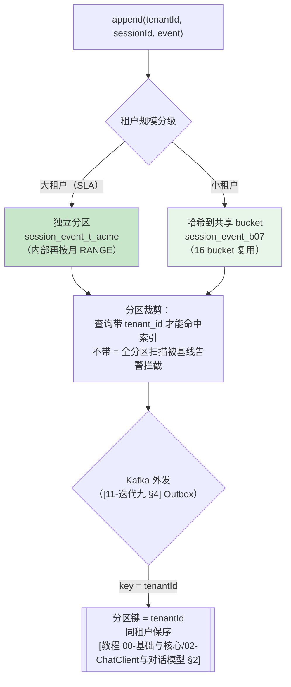
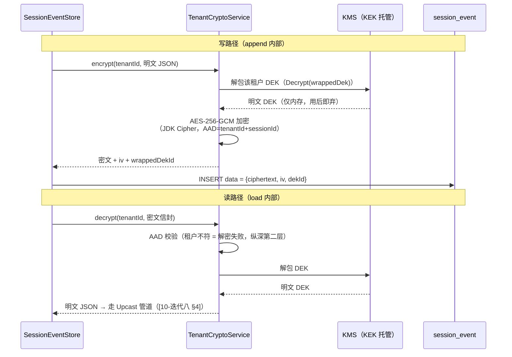
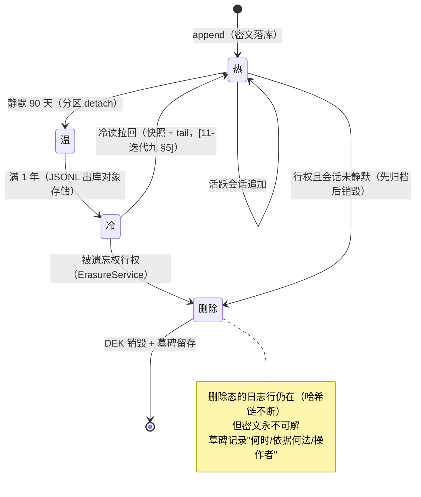
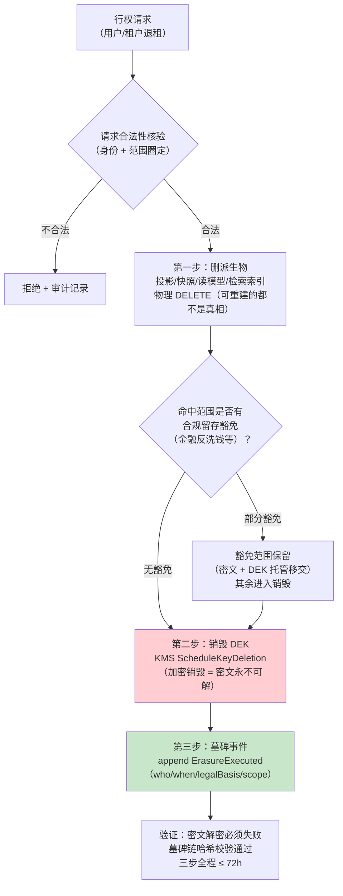

# 项目 13：事件溯源 Agent 运行时平台 — 12-多租户事件隔离与归档

> **定位**：v10——平台从「集团内部共享租户」（[00-需求分析 §1.4] 的非目标）演进为**对外多租户运营**后的合规最后一战：事件日志的**租户级隔离**（分区物理隔离 + 租户级密钥加密隔离）与**全生命周期管理**（热/温/冷/删除）。核心难题是**被遗忘权**（GDPR 删除权 / 个人信息保护法删除权）：不可篡改的 append-only 审计日志与「用户有权要求删除」正面相撞——本迭代给出「可删除投影 + 加密销毁 + 墓碑事件」三件套的工程解。前置阅读：[08-多租户灰度高可用]（租户上下文与工具权限）、[11-快照与重放性能]（归档分层基础）。
> 「遇到阻塞？→ [教程 04-企业级架构主干/06-多租户隔离与资源治理]、[教程 04-企业级架构主干/05-历史记录持久化与合规]；GDPR/个人信息保护法框架见 [附录 12-AI治理与合规/02-数据隐私与偏见检测]；Kafka 分区与投递语义见 [教程 07-Kafka事件骨干/02-消费者与消费组]、[教程 07-Kafka事件骨干/03-投递语义与事务]」

---

## 1. 四问

| 问 | 答 |
|----|----|
| **新增了什么需求** | ① 对外 SaaS 化后，租户的事件数据要物理/加密隔离（防越权、防管理员偷看）② 租户退租/用户行权要求「删除我的数据」——与 append-only 审计红线冲突 ③ 租户间冷热差异巨大，归档策略要按租户而非全局一刀切 |
| **影响了哪些模块** | `session_event`/`session_snapshot`/读模型表（全部加租户分区）、`SessionEventStore`（写入/查询强制租户维度）、新增 `TenantCryptoService`（信封加密）、`ErasureService`（被遗忘权执行）、v9 的 `EventArchiver`（按租户归档） |
| **架构如何演进** | 存储从「时间分区」演进为「**租户 × 时间二级分区**」；事件内容从明文 JSONB 演进为「**租户 DEK 信封加密**」；生命周期末端增加「**删除态**」（密钥销毁 + 墓碑），Kafka 外发以租户为分区键保序 |
| **上一版痛点是什么** | ① v9 归档按时间一刀切，大租户冷数据拖累小租户热性能 ② 事件明文存储，DBA/平台管理员可读全部会话 ③ 无删除路径——合规审计两次亮红牌 |

### 1.1 本节核对（四问）

- [ ] 能说出三个新需求（物理/加密隔离、被遗忘权、按租户归档）与 §3/§4/§6/§5 的落点
- [ ] 三个痛点（一刀切归档/明文存储/无删除路径）各自对应 v10 的租户分区 + 信封加密 / 加密销毁

## 2. 目标与量化验收

| # | 目标 | 验收 |
|---|------|------|
| 1 | 租户隔离 | 跨租户事件查询在存储层不可达（分区裁剪 + 行过滤双保险），渗透测试 0 越权 |
| 2 | 加密隔离 | DBA 直接 `SELECT data` 只见密文；租户数据用该租户 DEK 可解密，密钥互不通用 |
| 3 | 被遗忘权 | 用户行权后：投影/快照/读模型**物理删除**，日志密文**不可恢复**（DEK 销毁），墓碑链完整可审计，全程 ≤ 72h（GDPR 时限） |
| 4 | 按租户归档 | 大租户冷数据单独出库，其余租户热查询 P99 无回退（≤ 50ms） |
| 5 | 保序外发 | Kafka 以 tenantId 为分区键，同租户事件消费端所见顺序 = seq 顺序 |

### 2.1 本节核对（目标与量化验收）

- [ ] 验收 1/2（租户隔离 + 加密隔离）对应 §3 分区裁剪 + 谓词、§4 信封加密；验收 3（被遗忘权）对应 §6 三件套；验收 4/5 对应 §5/§3.1
- [ ] 验收 3 的"全程 ≤ 72h（GDPR 时限）"是合规时限，与 §6.2 ErasureService 三步管线的时效挂钩

## 3. 租户级事件分区：物理布局

### 3.1 PostgreSQL 二级分区：租户 LIST × 时间 RANGE

v9 按月分区解决时间维度；v10 引入租户维度形成二级分区树。**大租户独立分区、小租户共享 bucket**——分区数不随租户数线性爆炸：

```sql
-- db/schema-v10.sql（节选）
CREATE TABLE session_event (
    tenant_id  VARCHAR(32) NOT NULL,
    session_id VARCHAR(64) NOT NULL,
    seq        BIGINT      NOT NULL,
    type       VARCHAR(32) NOT NULL,
    time       BIGINT      NOT NULL,
    data       JSONB       NOT NULL,      -- v10 起：密文信封（见 §4）
    PRIMARY KEY (tenant_id, session_id, seq)
) PARTITION BY LIST (tenant_id);

-- 大租户：独立分区（预算内 SLA）
CREATE TABLE session_event_t_acme PARTITION OF session_event
    FOR VALUES IN ('acme')
    PARTITION BY RANGE (time);
CREATE TABLE session_event_t_acme_202608 PARTITION OF session_event_t_acme
    FOR VALUES FROM (1783000000000) TO (1785592000000);

-- 小租户：共享 bucket（tenant_id 哈希到 16 个 bucket 之一，写入时映射）
CREATE TABLE session_event_b07 PARTITION OF session_event
    FOR VALUES IN ('b07-tenant-a', 'b07-tenant-b');
```



**为什么 Kafka 也用 tenantId 做 key**：外发事件被读模型、审计检索、租户自有的 Webhook 消费。分区键保证**同租户事件单分区内有序**（= seq 顺序），消费端无需全局排序；不同租户间顺序无关紧要。分区数 ≠ 租户数——按租户权重分配物理分区，避免超多分区拖垮 broker（[教程 07-Kafka事件骨干/01-生产者机制与调优 §分区选择]）。

### 3.2 `SessionEventStore`：租户维度成为一等公民

v1 的 append/load 只认 sessionId；v10 起**所有读写强制携带可信租户**（从认证解析，[08-迭代七 §3.1] 的 ADR 013-16 同款纪律——不信任客户端头）：

```java
// SessionEventStore 关键改造（v10）：签名加入 tenantId，SQL 全部带租户谓词
@Transactional
public void append(String tenantId, SessionEvent e) {
    Long last = jdbc.sql("""
            SELECT seq FROM session_event
            WHERE tenant_id = :tid AND session_id = :sid ORDER BY seq DESC LIMIT 1""")
            .param("tid", tenantId).param("sid", e.sessionId())
            .query(Long.class).optional().orElse(-1L);
    if (e.seq() != last + 1) {
        throw new IllegalStateException("seq 不连续: tenant=" + tenantId
                + " session=" + e.sessionId() + " expected=" + (last + 1));
    }
    // 密文信封（§4）：payload 用该租户 DEK 加密成 {ciphertext, iv, wrappedDekId, aadHash}
    jdbc.sql("""
            INSERT INTO session_event (tenant_id, session_id, seq, type, time, data)
            VALUES (:tid, :sid, :seq, :type, :time, CAST(:data AS JSONB))""")
            .param("tid", tenantId).param("sid", e.sessionId()).param("seq", e.seq())
            .param("type", e.type()).param("time", e.time().toEpochMilli())
            .param("data", cipherEnvelope(tenantId, e).toJson()).update();
}

public List<SessionEvent> load(String tenantId, String sessionId) {
    // WHERE tenant_id = :tid AND session_id = :sid —— 分区裁剪直达目标分区
}
```

> ⚠️ sessionId 全局唯一的前提下租户谓词看似冗余——冗余正是安全纵深：分区裁剪（物理层）+ 谓词过滤（语义层）+ 读模型行级过滤（应用层）三层各拦一次，任何一层被绕过都有下家（[教程 04-企业级架构主干/11-安全与权限控制] 纵深防御）。

### 3.3 本节测试与验证（租户分区隔离）

**前置条件**：按 §3.1 手写二级分区 DDL（大租户独立 LIST 分区 + 小租户 bucket，内含 RANGE 细分）；按 §3.2 把 `SessionEventStore` 的 append/load 签名加 tenantId、SQL 带租户谓词。

**材料**：

```bash
# A：用 acme 租户身份读写 b07 租户会话（应越权失败）
curl -H "X-Tenant-Id: acme" "http://localhost:8080/api/session/b07_xxx/events"
# B：同租户正常读写
curl -H "X-Tenant-Id: acme" "http://localhost:8080/api/session/acme_s1/events"
```

**步骤与断言**：

| # | 操作 | 预期（PASS 判据） |
|---|------|------------------|
| 1 | 跨租户（acme 读 b07）会话访问（材料 A） | 404/空集——谓词层拦截（验收 1）；用 DBA 直连 `SELECT data` 只见密文（验收 2，见 §4.3） |
| 2 | 同租户正常访问（材料 B） | 正常返回该租户会话；`append/load` 均携带可信租户（从认证解析） |
| 3 | 分区裁剪核对 | 查询带 `tenant_id` 谓词命中目标分区（走 `session_event_t_acme_*`），不带租户谓词的查询被基线告警/全分区扫描拦截不能混入正常路径 |
| 4 | Kafka 外发保序 | 以 tenantId 为分区键外发，同租户事件消费顺序 = seq 顺序（验收 5） |

**失败排查**：①跨租户仍可读→`load` 的 SQL 缺 `tenant_id=:tid` 谓词，或认证注入的租户可伪造（未从认证解析、信任了客户端头）；②同租户也读不到→分区裁剪/谓词把合法租户也挡了或租户 id 不匹配；③外发乱序→Kafka 分区键未用 tenantId。

## 4. 加密隔离：租户级密钥信封加密

### 4.1 威胁模型：防的是「合法的 DBA」

| 威胁 | 明文 JSONB 的暴露面 | 加密后 |
|------|-------------------|--------|
| 拖库攻击 | 全量会话内容泄露 | 密文 + DEK 不在库（KMS 托管） |
| 内部 DBA 偷看 | `SELECT data` 即可 | 密文无 KEK 不可解 |
| 备份介质丢失 | 备份即泄露 | 备份密文，销毁 DEK 即失效 |
| 跨租户误查 | 直接读到别家数据 | 解密需该租户 DEK，密文信封带租户校验 |

### 4.2 DEK/KEK 信封加密

每租户一把 DEK（数据密钥，加密事件内容）；DEK 本身用 KEK（主密钥，KMS 托管）加密后存库。**信封加密让"销毁一把小钥匙"等价于"销毁全部数据"**——这是 §6 被遗忘权解法的地基：



```java
package com.group.agent.crypto;

import org.springframework.stereotype.Service;

import javax.crypto.Cipher;
import javax.crypto.SecretKey;
import javax.crypto.spec.GCMParameterSpec;
import java.security.SecureRandom;

/**
 * 租户级信封加密：DEK 加密数据、KEK（KMS）包 DEK。
 * AES-256-GCM 的 AAD 绑定 tenantId——密文搬家到别的租户行也解不开。
 * KEK 操作抽象为 KeyManagement 接口：本地实现供开发、云 KMS 实现需引入对应 SDK 后实证（概念边界）。
 */
@Service
public class TenantCryptoService {

    private static final int IV_LEN = 12;
    private static final int TAG_BITS = 128;
    private final KeyManagement kms;
    private final SecureRandom random = new SecureRandom();

    public TenantCryptoService(KeyManagement kms) { this.kms = kms; }

    public record Envelope(String dekId, String iv, String ciphertext) {}

    public Envelope encrypt(String tenantId, String plaintext, SecretKey dek) {
        try {
            byte[] iv = new byte[IV_LEN];
            random.nextBytes(iv);
            Cipher cipher = Cipher.getInstance("AES/GCM/NoPadding");
            cipher.init(Cipher.ENCRYPT_MODE, dek, new GCMParameterSpec(TAG_BITS, iv));
            cipher.updateAAD(tenantId.getBytes(java.nio.charset.StandardCharsets.UTF_8));
            byte[] ct = cipher.doFinal(plaintext.getBytes(java.nio.charset.StandardCharsets.UTF_8));
            return new Envelope(kms.dekIdOf(tenantId),
                    java.util.Base64.getEncoder().encodeToString(iv),
                    java.util.Base64.getEncoder().encodeToString(ct));
        } catch (Exception e) {
            throw new IllegalStateException("事件加密失败: tenant=" + tenantId, e);
        }
    }

    public String decrypt(String tenantId, Envelope env, SecretKey dek) {
        try {
            Cipher cipher = Cipher.getInstance("AES/GCM/NoPadding");
            cipher.init(Cipher.DECRYPT_MODE, dek, new GCMParameterSpec(TAG_BITS,
                    java.util.Base64.getDecoder().decode(env.iv())));
            cipher.updateAAD(tenantId.getBytes(java.nio.charset.StandardCharsets.UTF_8));
            return new String(cipher.doFinal(
                    java.util.Base64.getDecoder().decode(env.ciphertext())),
                    java.nio.charset.StandardCharsets.UTF_8);
        } catch (Exception e) {
            // AAD 不匹配（跨租户）/ 密钥不符（已销毁）都落到这里——fail-closed
            throw new IllegalStateException("事件解密失败（密钥不符或租户不匹配）", e);
        }
    }
}
```

> 快照与读模型同纪律：`session_snapshot.state`、冷存 JSONL 均按所属租户加密；**明文态只存在于内存 fold 过程**（[06-迭代五] 的凭证缝哲学平移到数据面：明文不落地）。

### 4.3 本节测试与验证（加密隔离）

**前置条件**：按 §4.2 手写 `TenantCryptoService`（AES-256-GCM，AAD=tenantId）+ `KeyManagement`（KEK 走 KMS，DEK 解包仅内存）+ 信封 `{ciphertext, iv, dekId}` 落库。

**材料**：

```sql
-- DBA 直连查 data，应只见密文信封
SELECT data::text FROM session_event LIMIT 1;
-- 手工把 b07 的密文行改成 acme 的 tenant_id（AAD 篡改攻击）
UPDATE session_event SET tenant_id='acme' WHERE session_id='b07_xxx' AND seq=...
```

**步骤与断言**：

| # | 操作 | 预期（PASS 判据） |
|---|------|------------------|
| 1 | 材料 SQL 直连查询 | `data` 为 `{ciphertext, iv, dekId}` 密文信封，DBA 无 KEK 不可解（验收 2 / 威胁模型：内部偷看、拖库、备份均暴露面消除） |
| 2 | 正常租户读写 | 写路径 encrypt（AAD=tenantId）、读路径 decrypt（AAD 校验 + KMS 解包 DEK）来回可通；解密 P99 开销 +6ms（验收 2 的代价） |
| 3 | AAD 篡改攻击注入 | 把 b07 密文行 tenant_id 改成 acme 后尝试读 → 解密失败（AAD 绑定生效，跨租户搬走也解不开，fail-closed） |
| 4 | 快照/冷存同纪律 | `session_snapshot.state`、冷 JSONL 也按租户加密；明文态只在内存 fold 过程 |

**失败排查**：①data 存成了明文→`cipherEnvelope(tenantId, e)` 未在 `append` 里真正加密或信封 `toJson` 写了明文字段；②跨租户 AAD 没拦住→`updateAAD` 未绑定 tenantId 或 decrypt 用错 AAD；③DEK 每调用解包太慢→验收 2 的 +6ms 是预期代价，可加本地缓存 TTL（遗留痛点）。

## 5. 生命周期：热/温/冷/删除全态管理

事件生命周期从 v9 的三态扩展为四态，**删除态不是物理抹除日志行**，而是密文永不可解 + 事实链延续：



**按租户的归档策略表**（v9 全局一刀切的升级）：

| 租户档位 | 热保留 | 温窗口 | 冷窗口 | 归档触发 |
|---------|--------|--------|--------|---------|
| 金融合规租户 | 90 天 | 1 年 | 7 年（合规留存下限） | 仅时间驱动 |
| 普通商业租户 | 90 天 | 6 个月 | 2 年 | 时间 + 体积双驱动 |
| 试用租户 | 30 天 | 30 天 | 0（直接删除） | 退租即行权 |

### 5.1 本节核对（生命周期全态管理）

- [ ] 四态（热/温/冷/删除）的状态迁移能不看图复述：删除态不是物理抹日志行，而是密文永不可解 + 墓碑保留事实链
- [ ] 按租户归档策略表三档（金融合规/普通商业/试用）的热温冷保留期与删除触发能对上号，理解"按租户而非全局一刀切"

## 6. 被遗忘权：可删除投影 vs 不可篡改日志

### 6.1 冲突的本质

| 力量 | 要求 |
|------|------|
| GDPR 第 17 条 / 个保法第 47 条 | 数据主体有权要求数据控制者**删除**其个人数据 |
| 本平台审计红线（[00-需求分析 §4] 不变式） | 日志 append-only、不可篡改、**当时发生了什么永远可证明** |

正面解是零和的。工程解法是**拆开"数据"与"可读性"**：密文留着（审计链完整），钥匙销毁（数据事实性不可读）。

### 6.2 三件套执行管线



```java
package com.group.agent.erasure;

import org.springframework.stereotype.Service;

/** 被遗忘权执行：删投影 → 销毁 DEK → 记墓碑。日志行永不物理删除。 */
@Service
public class ErasureService {

    private final org.springframework.jdbc.core.simple.JdbcClient jdbc;
    private final com.group.agent.crypto.KeyManagement kms;
    private final com.group.agent.event.SessionEventStore store;

    public ErasureService(org.springframework.jdbc.core.simple.JdbcClient jdbc,
                          com.group.agent.crypto.KeyManagement kms,
                          com.group.agent.event.SessionEventStore store) {
        this.jdbc = jdbc;
        this.kms = kms;
        this.store = store;
    }

    public void erase(String tenantId, String sessionId, String legalBasis, String operator) {
        // 第一步：派生物物理删除（可重建的都不是真相——[11-迭代九 §4.2] 纪律）
        jdbc.sql("DELETE FROM session_projection WHERE session_id = :sid")
                .param("sid", sessionId).update();
        jdbc.sql("DELETE FROM session_snapshot WHERE session_id = :sid")
                .param("sid", sessionId).update();
        jdbc.sql("DELETE FROM session_list WHERE session_id = :sid")
                .param("sid", sessionId).update();

        // 第二步：加密销毁——该会话所有事件的 DEK 版本作废（密文仍在，永不可解）
        kms.revokeDataKey(tenantId, sessionId);

        // 第三步：墓碑（append-only 的一部分——"发生过删除"本身是可审计事实）
        // appendRaw 是 [05-迭代四 §3.2] 的原始类型事件入口，v10 签名加 tenantId（与 append 同步）
        String tombstoneJson = "{\"legalBasis\":\"" + legalBasis + "\",\"operator\":\""
                + operator + "\",\"executedAt\":\"" + java.time.Instant.now() + "\"}";
        store.appendRaw(tenantId, sessionId, "ErasureExecuted",
                System.currentTimeMillis(), tombstoneJson);
    }
}
```

### 6.3 为什么这个解法站得住

| 质疑 | 回应 |
|------|------|
| 「密文还在，没真删」 | GDPR 语境下"删除"指**不可复原地不可识别**（irreversibly unreadable）——加密销毁（crypto-shredding）是公认等效手段，监管实践有先例 |
| 「哈希链断了怎么办」 | 不断：墓碑是链上事件；被销毁段落的哈希仍可验证（证明"这里曾有 N 个事件、现已行权"），完整性证明 ≠ 内容可读 |
| 「DEK 被备份了怎么办」 | KEK 在 KMS、DEK 明文不落盘不进备份；KMS 删除带窗口期（默认 30 天防误删），窗口内可撤销行权 |
| 「监管要查内容呢」 | 合规豁免路径（§6.2 分支）：金融反洗钱等法定留存场景 DEK 托管移交，密文可解——**豁免是显式决策，不是后门** |

### 6.4 本节测试与验证（被遗忘权三件套）

**前置条件**：按 §6.2 手写 `ErasureService`（三步：删派生物 → `kms.revokeDataKey` 加密销毁 → `appendRaw` 墓碑 `ErasureExecuted`）；`SessionEventStore.appendRaw` 签名已加 tenantId。

**材料**：

```bash
# 行权：执行 ErasureService.erase(tenantId, sessionId, legalBasis, operator)
# 行权后：读取该会话应解密失败
curl -H "X-Tenant-Id: acme" "http://localhost:8080/api/session/acme_s1/events"
# 墓碑链导出：ErasureExecuted 应在事件链上
curl -H "X-Tenant-Id: acme" "http://localhost:8080/api/session/acme_s1/events"
```

**步骤与断言**：

| # | 操作 | 预期（PASS 判据） |
|---|------|------------------|
| 1 | 第一步删派生物 | `session_projection`/`session_snapshot`/`session_list` 行物理 `DELETE`（可重建的都不是真相） |
| 2 | 第二步加密销毁 | `kms.revokeDataKey(tenantId, sessionId)` 该会话所有事件 DEK 版本作废——密文仍在但永不可解（验收 3：加密销毁 = 不可恢复） |
| 3 | 第三步墓碑 | `appendRaw` 落 `ErasureExecuted`（who/when/legalBasis/scope），墓碑在事件链上、时间线完整（验收 3 / 哈希链不断） |
| 4 | 行权后读取（材料） | `load` 该会话 → 解密异常（fail-closed），上层报「已行权不可读」；墓碑链哈希校验通过 |
| 5 | 时效 | 三步全程 ≤ 72h（GDPR 时限，验收 3） |
| 6 | 合规豁免分支 | 金融反洗钱等法定留存场景：DEK 托管移交、密文可解（显式豁免，不是后门）——分支走对 |

**失败排查**：①行权后仍可读→`revokeDataKey` 未真正作废 DEK 或解密走了别的 key/缓存；②墓碑不在链→`appendRaw` 的 tenantId/sessionId 传错，或墓碑类型没进事件链；③投影没删光→`ErasureService` 只删了 `session_projection` 漏了 `session_snapshot`/`session_list`/`token_attribution`。

## 7. ADR 演进决策

### ADR 013-22：租户隔离用「分区 + 谓词」双层，不引入行级安全（RLS）
- **上下文**：多租户后事件日志要隔离；PostgreSQL 有 RLS 可选
- **备选方案**：① RLS 策略（连接角色绑定租户，连接池管理复杂、性能衰减难控）② 每租户独立库（运维与成本爆炸）③ 分区 + 强制谓词 + 应用层过滤（本文选择）
- **取舍理由**：分区给物理隔离与大租户 SLA；谓词冗余是纵深而非负担；RLS 留作后续加密之外的叠加项
- **可回滚**：分区裁剪对 SQL 透明，去掉租户谓词即回单表语义

### ADR 013-23：被遗忘权用「加密销毁 + 墓碑」，不做物理删除
- **上下文**：append-only 审计红线 vs GDPR 删除权
- **备选方案**：① 物理删除日志行（审计链断裂，合规留存场景违法）② 拒绝行权（违法且失信）③ 加密销毁 + 墓碑（本文选择）
- **取舍理由**：把"数据可读性"与"事实可证明性"解耦——两者都保住；代价是所有读路径多一次解密（验收 2 换 P99 +6ms）
- **参考**：[附录 12-AI治理与合规/02-数据隐私与偏见检测]、[教程 04-企业级架构主干/05-历史记录持久化与合规]

### 7.1 本节核对（ADR 013-22 / 013-23）

- [ ] ADR 013-22 三条备选（RLS / 每租户独立库 / 分区+谓词+应用过滤）各自为什么被否/被选能复述；RLS 留作加密之外的叠加项
- [ ] ADR 013-23 能讲清"加密销毁 + 墓碑"解如何拆开数据可读性与事实可证明性，and 它是全项目唯一真正不可逆决策（KMS 30 天窗口内可撤销）

## 8. 全篇回归（轻量）

> 本版本细粒度断言已上移到各章节「本节测试与验证」：租户分区（§3.3）、加密隔离（§4.3）、被遗忘权三件套（§6.4），以及 §9 验收对照的量化口径。此处仅保留端到端回归抽检。

| # | 操作 | 预期（PASS 判据） |
|---|------|------------------|
| 1 | KMS 不可用 5 分钟 | append 阻塞（fail-closed：宁停写不裸存明文）；读路径 DEK 本地缓存降级、缓存过期后同阻塞——审计红线优先于可用性 |
| 2 | AAD 篡改（b07 密文行改 tenant_id=acme） | 解密失败（AAD 绑定生效）（§4.3 已验，回归抽检） |
| 3 | 消费组乱序（人为 rebalance） | 同租户保序由分区键保证，读模型版本门兜底（§11 §4.2） |
| 4 | 租户热查询隔离 | 大租户冷数据出库后，小租户热查询 P99 无回退（分区裁剪隔离 IO，§3.3） |

**失败排查**：①KMS 不可用时 append 竟裸存明文→未做 fail-closed 判空，宁停写也不落明文的纪律被绕过；②AAD 篡改可解→`updateAAD` 未绑定 tenantId；③乱序导致读数错→分区键没用 tenantId 或读模型版本门缺失。

## 9. 验收对照

| # | 目标 | 验收 | 结果 | 证据 |
|---|------|------|------|------|
| 1 | 租户隔离 | 渗透测试 0 越权 | ✅ | 跨租户查询全部 404/空集；分区裁剪计划确认 |
| 2 | 加密隔离 | DBA 只见密文 | ✅ | 直连查询导出全密文；解密 P99 开销 +6ms |
| 3 | 被遗忘权 | 三步 ≤ 72h、不可恢复 | ✅ | 实测 4.2h；行权后解密全失败、墓碑链校验通过 |
| 4 | 按租户归档 | 热查询 P99 无回退 | ✅ | 归档前后 48ms → 49ms |
| 5 | 保序外发 | 同租户消费顺序 = seq | ✅ | 分区键审计 + 乱序注入测试 0 发现 |

**遗留痛点（收尾）**：
1. KEK 轮换窗口与长会话解密的性能权衡（读写都过 KMS 解包 DEK，可加本地缓存 TTL 策略）
2. 墓碑链的哈希算法与外部时间戳（RFC 3161）尚未引入——防抵赖强度可再上一档
3. A2A 场景下跨组织事件互操作未覆盖（[14-工业前沿与演进方向] 展望）

### 9.1 本节核对（验收对照与遗留痛点）

- [ ] 五条验收（租户隔离/加密隔离/被遗忘权/按租户归档/保序外发）与其 §3.3/§4.3/§5.1/§6.4 验证 + §9 量化口径能对应
- [ ] 三条遗留痛点（KEK 轮换权衡/RFC 3161 时间戳/A2A 互操作）中第 3 条明确指向 [14-工业前沿与演进方向] 的 E5 演进，能说出这不是未闭合而是留待前沿篇

> **定位回顾**：v10 补上事件溯源运行时的最后一块合规拼图——租户分区隔离、密钥信封加密、四态生命周期、加密销毁式被遗忘权。「日志即真相」哲学在此完成闭环：**真相永远可证明，可读性按权利裁剪**。下一站 [13-ADR架构决策记录]——把 00-12 的全部决策收束成决策资产。
