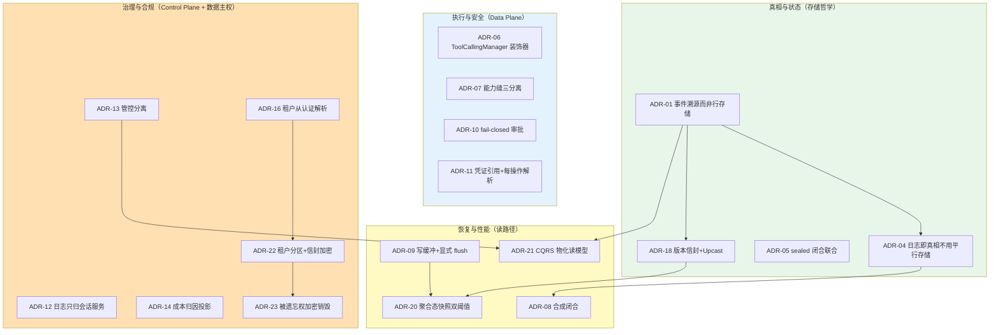
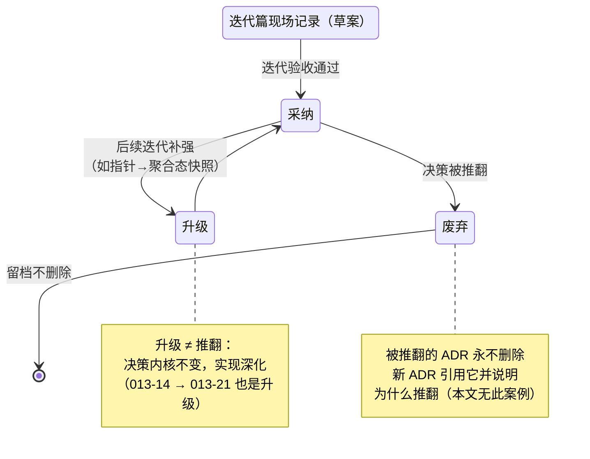
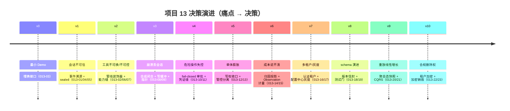

# 项目 13：事件溯源 Agent 运行时平台 — 13-ADR 架构决策记录

> **定位**：把项目 13 从 [00] 到 [12] 的全部**架构决策**收束成一份体系化 ADR（Architecture Decision Record）资产——每条记录**决策上下文 / 备选方案 / 取舍理由 / 可回滚性**。这是工业项目的"决策 DNA"：三个月后有人（包括你自己）想改架构时，先来这里查"当时为什么这么定"，而不是推倒重来。各迭代篇内的 ADR 是"决策发生时的现场记录"，本文是**全项目视角的汇总、分级与关联**——两者互补，冲突时以迭代篇为准（现场记录优先）。读者画像：想复盘项目 13 全部关键决策"为什么"的读者、以及把它当 ADR 写作范式的读者。前置阅读：[00-需求分析与架构设计]；ADR 方法论见 [附录 08-架构决策方法论/00-ADR架构决策记录]。
> 「遇到阻塞？→ [附录 08-架构决策方法论/00-ADR架构决策记录]、[附录 15-开源代码深度分析/11-设计哲学与架构模式]（决策的哲学源头）」

---

## 1. 为什么需要这份汇总

各迭代篇末尾的「ADR 演进决策」解决的是**当时的**决策留痕；跨迭代的三个问题它覆盖不了：

1. **决策全景**：23 条决策散在 13 篇文档里，"这个系统一共做过哪些关键选择"没有一处可答
2. **决策关联**：ADR 013-20（快照）依赖 013-01（事件溯源）成立；ADR 013-23（加密销毁）依赖 013-22（租户加密）成立——决策不是孤立的，链路要看全
3. **决策生命周期**：哪些还被坚持、哪些已被后续迭代修正（如 [04-迭代三] 的检查点指针被 [11-迭代九] 的聚合态快照**升级而非推翻**）

> 决策链的意义：真相与状态是**根决策**——后面三组全部站在「日志即真相」之上；反过来，若某天事件溯源被推翻（如换成纯检查点方案），上面 23 条里的 17 条要重新评估。**根决策的风险敞口最大，也最应该在最初被最慎重地对待**。

## 2. ADR 总览（013-01 ~ 013-23）

| # | 决策 | 首次落地 | 状态 | 详见 |
|---|------|---------|------|------|
| 013-01 | 会话状态用事件溯源而非关系行存 | v1 | ✅ 采纳 | 本文 §3.1 |
| 013-02 | 工具策略外置为执行管线而非硬编码 | v2 | ✅ 采纳 | [03-迭代二 §4] |
| 013-03 | v0 埋三个"换接口"而非直接正确架构 | v0 | ✅ 采纳（已兑现） | [01-最小Demo §4] |
| 013-04 | 事件溯源 vs 消息表+平行存储 | v1 | ✅ 采纳 | 本文 §3.1 |
| 013-05 | 事件类型 sealed 闭合联合 | v1 | ✅ 采纳（v8 兑现回报） | 本文 §3.2 |
| 013-06 | 工具拦截用 ToolCallingManager 装饰器 | v2 | ✅ 采纳 | 本文 §4.1 |
| 013-07 | 能力缝「接口+条件装配」 | v2 | ✅ 采纳 | 本文 §4.2 |
| 013-08 | 孤儿 turn 合成闭合而非截断 | v3 | ✅ 采纳 | 本文 §5.1 |
| 013-09 | 写缓冲 + 显式 flush 点 | v3 | ✅ 采纳 | 本文 §5.2 |
| 013-10 | 审批默认拒绝、批准只放行一次 | v4 | ✅ 采纳 | [05-迭代四 §4] |
| 013-11 | 凭证引用 + 每操作解析 | v4 | ✅ 采纳 | [05-迭代四 §4] |
| 013-12 | 会话日志只归会话服务 | v5 | ✅ 采纳 | 本文 §6.1 |
| 013-13 | 治理归 Control Plane、Data Plane 只执行 | v5 | ✅ 采纳 | 本文 §6.1 |
| 013-14 | 成本归因用日志投影不建成本表 | v6 | ✅ 采纳（v9 升级为物化） | 本文 §6.2 |
| 013-15 | 计量走 Observation 不改业务 | v6 | ✅ 采纳 | [07-迭代六 §4] |
| 013-16 | 租户从认证解析不信任客户端头 | v7 | ✅ 采纳 | [08-迭代七 §4] |
| 013-17 | 灰度规则存配置中心即时生效 | v7 | ✅ 采纳 | [08-迭代七 §4] |
| 013-18 | 版本信封 + Upcast 不做历史迁移 | v8 | ✅ 采纳 | 本文 §3.3 |
| 013-19 | 兼容性测试门 + 黄金事件集 | v8 | ✅ 采纳 | [10-迭代八 §7] |
| 013-20 | 聚合态快照事件数+时间双阈值 | v9 | ✅ 采纳（升级 013-08 时代的指针方案） | 本文 §5.3 |
| 013-21 | 读模型 CQRS 物化 + Outbox 外发 | v9 | ✅ 采纳 | [11-迭代九 §6] |
| 013-22 | 租户分区 + 租户级信封加密 | v10 | ✅ 采纳 | [12-迭代十 §7] |
| 013-23 | 被遗忘权用加密销毁 + 墓碑 | v10 | ✅ 采纳 | 本文 §6.3 |

**ADR 自身的生命周期**（与 [附录 08-架构决策方法论] 对齐）：

## 3. 主题一：真相与状态（存储哲学）

### 3.1 ADR 013-01 / 013-04：会话状态采用事件溯源（根决策）

- **上下文**：合规硬要求"任何会话过去发生的每一件事都能从日志重建"；v0 会话存内存，审计回放拿不出证据（[00-需求分析 §1.1]）
- **备选方案**：
  - A：关系表存会话最终态——简单，但**丢失中间过程**（工具调用、审批、中断都不可见），回放不可能
  - B：内存 + 定期快照——崩溃丢窗口，且快照之间的事实永久缺失
  - C：消息表 + 平行审计存储（"消息一份、审计一份"）——两份真相必有分歧时刻，对账是长期税
  - D：**事件溯源（append-only 日志 + 一切皆投影）**——本项目选择
- **取舍理由**：事件溯源用「写侧纪律（唯一 append 入口 + seq 连续）+ 读侧成本（fold）」换「可审计/可回放/可恢复/可派生**全免费**」。合规是硬需求，值得；且后续 v6 成本归因、v8 投影重建、v9 CQRS 全是这份红利的复利
- **可回滚性**：**低**——这是根决策，回滚等于重建项目。所以它在 v1（最早可能的时机）落地，且 [00-需求分析 §2] 用整张表论证了"为什么先做事件溯源再做一切"
- **风险敞口**：fold 成本（v9 快照驯服）、schema 演进复杂度（v8 Upcast 驯服）、存储增长（v9/v10 分层归档驯服）——三个代价在后续迭代各有一条 ADR 对冲，根决策的账算得清

### 3.2 ADR 013-05：事件类型用 sealed 闭合联合

- **上下文**：事件类型是整个系统的契约面，投影、恢复、审计全部 switch 遍历它
- **备选方案**：① 开放接口 + 注册表（灵活但穷尽性无人保证）② String type + 手写分发（字符串散落，新增类型编译器沉默）③ sealed permits（本项目选择）
- **取舍理由**：契约面**闭合**（改联合要过编译器），扩展面（事件 data 字段）**开放**（record 自由加字段）——一收一放正是 [附录 15-开源代码深度分析/11-设计哲学与架构模式 §二] 的"assertNever 纪律"在 Java 的原生表达。v8 演进期兑现回报：新增 `UserMessageV2` 忘写投影分支，**编译期**报错而非线上漏投影
- **可回滚性**：中——permits 列表只加不删（[10-迭代八 §4.3]），实际是单向门，但方向已被验证正确

### 3.3 ADR 013-18：版本信封 + Upcast，不做历史迁移

- **上下文**：运行一年后事件 schema 必须破坏性演进；历史日志是审计证据不可重写
- **备选方案**：① 离线迁移重写历史（违反审计红线）② 每个读者自兼容全版本（读者爆炸）③ 信封 + 读侧升级链（选择）
- **取舍理由**：历史零改写、读者只认最新版本、升级逻辑集中可测试；代价是读侧永久携带 Upcast 链（快路径零开销）。配套 ADR 013-19（CI 黄金集测试门）把"历史可读"变成每次提交都被验证的不变量
- **可回滚性**：高——信封只影响新写入，读侧裸格式兼容分支天然存在

## 4. 主题二：执行与安全（Data Plane）

### 4.1 ADR 013-06：工具拦截落点选 ToolCallingManager 装饰器

- **上下文**：审批/超时/审计策略需要插在「模型决定调工具」与「工具实际执行」之间
- **备选方案**：
  - A：**Advisor 层**——❌ Advisor 环绕整个 ChatClient 调用，看不到工具执行时点，且 call/stream 两栖（[03-迭代二 §2] 论证）
  - B：AOP 拦 `@Tool` 方法——❌ 拦不到非 @Tool 的 ToolCallback、拿不到完整调用上下文
  - C：**`ToolCallingManager` 装饰器**（`org.springframework.ai.model.tool`，真实 2.0 API）——✅ 工具循环统一入口，2.0 由 `ToolCallingAdvisor` 持有它驱动循环
- **取舍理由**：装饰器在 delegate 前后记录 `tool/call`、`tool/result`，审批守卫（v4）与观测（v6）复用同一落点。这与 CLAUDE.md「HITL 正确落点」铁律一致（[教程 28-Human-in-the-Loop与审批流 §正确落点]）
- **可回滚性**：高——装饰器是纯组合，移除即回到默认 `DefaultToolCallingManager`

### 4.2 ADR 013-07：能力缝三分离（定义/提供者/消费者）

- **上下文**：「换工具后端不改模型提问方式」是集团四大诉求之一（[00-需求分析 §1.2]）
- **备选方案**：① 工具内 switch 后端（每次新增后端改所有工具）② 配置驱动的工厂（工厂本身成为新耦合点）③ Port 接口 + `@ConditionalOnProperty` Provider + `@Tool` 消费者只见端口（选择）
- **取舍理由**：切后端 = 改一行配置；模型面 schema（@Tool 的 description/参数）永远稳定——**模型看到的契约与执行环境解耦**
- **可回滚性**：高——缝是结构性冗余，删掉缝代码照跑（这正是"策略可独立装卸"的证明）

## 5. 主题三：恢复与性能（读路径）

### 5.1 ADR 013-08：孤儿 turn 用「合成闭合」而非「截断」

- **上下文**：崩溃后日志尾部可能有未闭合 turn（TurnStart 无 TurnEnd）与孤儿工具调用（ToolCall 无 ToolResult）
- **备选方案**：① 截断到上个完整 turn（丢审计——已发生的事实被抹掉）② 保留悬挂（重建时状态机异常）③ **合成 `interrupted` 闭合事件补落库**（选择）
- **取舍理由**：闭合不丢事实；"系统在此时中断了"本身是可审计事件；修复动作也 append 进日志（**恢复本身可重放**）。这是 P4「状态由数据推导」的直接推论
- **可回滚性**：高——闭合逻辑是幂等扫描，不产生新不变式

### 5.2 ADR 013-09：写缓冲 + 显式 flush 点

- **上下文**：v1 每 append 一次同步事务，高并发下写吞吐瓶颈
- **备选方案**：① 全同步（慢）② 全异步（崩溃丢关键事实，违反不变式）③ **常规批量 + 关键点同步 flush**（turn 边界、审批审计对）（选择）
- **取舍理由**：吞吐与可靠性的折中点在「事实的重要性分级」——普通 chunk 事件赌得起毫秒级窗口，turn 边界与审批**赌不起**
- **可回滚性**：高——缓冲关闭即回 v1 行为

### 5.3 ADR 013-20：聚合态快照「事件数 + 时间间隔」双阈值

- **上下文**：[04-迭代三] 的 `session_projection` 只存检查点指针，fold 仍全量重算；长会话 P99 失守。**本 ADR 是对 013-09 时代方案的升级**（内核不变：缓存永不超前日志）
- **备选方案**：① 固定时间间隔（慢会话长期无快照）② 每 turn 快照（写放大）③ 双阈值 + 归档线 M（选择）④ 把快照存 Spring AI `Message` 序列化（框架版本耦合，快照随框架升级报废）
- **取舍理由**：双阈值捕捉爆发/慢速两类增长；快照态用纯数据 `MsgEntry`（[11-迭代九 §3.1]）隔离框架演进；先 flush 后快照保住"缓存永不超前日志"的原始纪律
- **可回滚性**：高——停用快照层，读路径自动降级全量重放，零迁移

## 6. 主题四：治理与合规（Control Plane + 数据主权）

### 6.1 ADR 013-12 / 013-13：日志单归会话服务；治理归 Control Plane

- **上下文**：v5 微服务拆分时，「谁有权写事件日志」「策略放在哪一层」决定治理是否可能
- **备选方案**：① 各服务都连事件库直写（seq 分配竞争 + 写侧纪律失守）② 事件中台独立服务（多一跳延迟，拆分过度的典型）③ **会话服务独占写权，其它服务经 API/外发管道消费**（选择）；治理侧：策略散在各服务 vs **Control Plane 集中配置、Data Plane 只执行**
- **取舍理由**：「写侧唯一入口」从代码纪律（单方法）升级为**架构纪律**（单服务）——违反即网络层不可达，不靠 code review 把关。管控分离呼应 [教程 20-管控分离架构]
- **可回滚性**：中——服务边界可合并（回单体），写权收口的方向不应回退

### 6.2 ADR 013-14：成本归因用日志投影，不建独立成本表

- **上下文**：v6 要按业务线归因 Token 成本
- **备选方案**：① 业务代码里埋点写成本表（双写不一致 + 侵入）② **从事件日志投影**（AssistantMessage 事件已含 usage）（v6 选择，v9 由 ADR 013-21 升级为 Outbox + 物化表）
- **取舍理由**：成本是事件的派生视图——真相只有一份；v9 升级后"每次查询全 fold"摊销为"每事件增量物化"，**决策内核（成本=投影）从未动摇，只有物化时机演进**
- **可回滚性**：高——物化表可抛弃重建

### 6.3 ADR 013-23：被遗忘权用「加密销毁 + 墓碑」

- **上下文**：v10 对外运营后 GDPR 删除权与 append-only 审计红线正面冲突
- **备选方案**：① 物理删除日志行（审计链断裂，金融场景违法）② 拒绝行权（违法失信）③ **销毁 DEK（密文永不可解）+ 删派生物 + 墓碑事件**（选择，依赖 ADR 013-22 的租户级密钥体系）
- **取舍理由**：把「数据可读性」与「事实可证明性」解耦——两者都保住。代价：读路径多一次解密（P99 +6ms）；豁免留存（金融反洗钱）走显式 DEK 托管移交，不是后门
- **可回滚性**：低——密钥销毁不可逆（KMS 30 天窗口内可撤销）。这是全项目**唯一真正不可逆的决策**，所以执行管线有三步核验与 72h 时限审计（[12-迭代十 §6.2]）

## 7. 决策时间线：痛点如何驱动决策

> 这条时间线本身是 [00-需求分析 §2]「演进顺序即架构决策」的验收证据：每个决策都能指认它回应的痛点，没有一个决策是"为了技术先进"而做。

## 8. 使用这份资产的三个场景

| 场景 | 怎么用 |
|------|--------|
| **新人接手** | 先读 §1 决策链图 + §2 总览表，30 分钟建立全景；再按主题精读 |
| **要改某条决策** | 找到该 ADR 的"可回滚性"栏——低/中回滚的（013-01/05/12/23）必须走 [附录 08-架构决策方法论] 的推翻流程：新 ADR 引用旧的、说明为什么推翻 |
| **对照自己项目** | 四主题（真相/执行/恢复/治理）是事件溯源 Agent 运行时的通用决策骨架，可作 checklist 逐条问自己的系统 |

**维护纪律**：后续任何迭代新增决策，① 现场记录写在迭代篇；② 本文 §2 总览表加一行；③ 影响决策链图的更新图。被推翻的决策**留档不删除**——ADR 的价值一半在"当时为什么对"，另一半在"后来为什么不再对"。

> **定位回顾**：23 条决策、四个主题、一条由痛点驱动的时间线——项目 13 的"为什么"至此有完整档案。下一站 [14-工业前沿与演进方向]——站到 2026 年的行业前沿，看这套架构还能往哪走。
