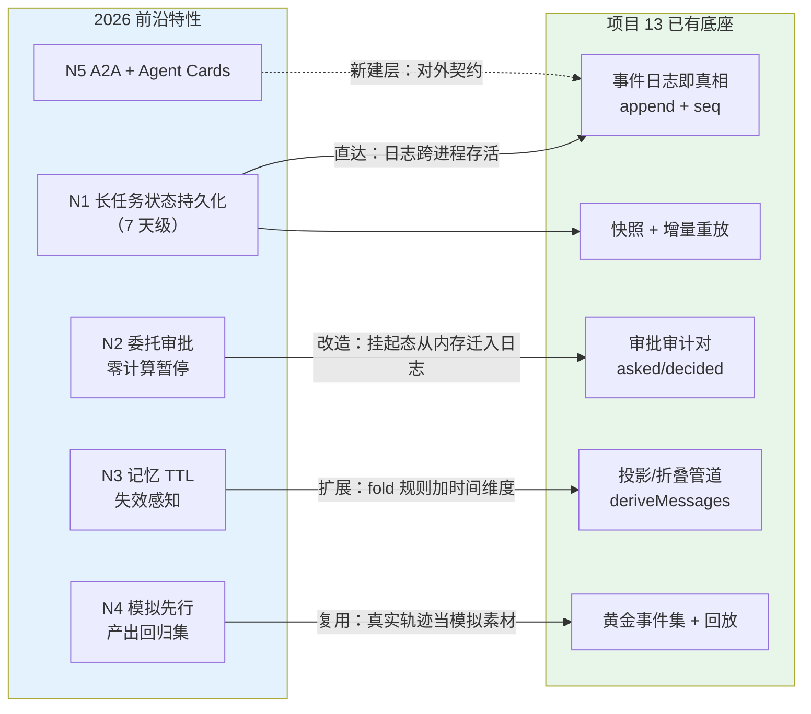
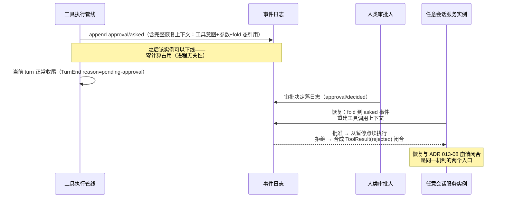
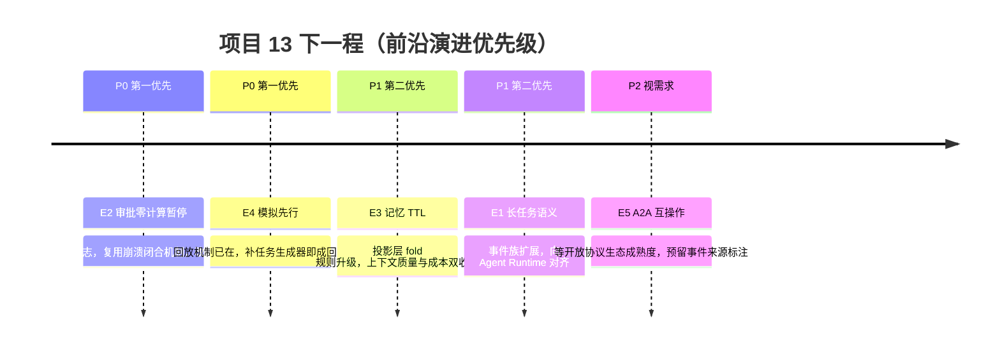

# 项目 13：事件溯源 Agent 运行时平台 — 14-工业前沿与演进方向

> **定位**：项目 13 的收官篇——把 [00]-[13] 建成的运行时放到 **2026 年行业前沿**的坐标系里对照：Google（Agent Runtime 长任务状态持久化 / 委托审批零计算暂停）、Nebius（Agents Blueprint 模拟先行）、PagerDuty（记忆 TTL / 失效感知）等关于生产级 Agent 的最新实践，与本项目已有能力逐条比对，给出**下一步演进方向**。读者画像：读完项目 13 全部迭代、想判断"这套架构在行业里处于什么位置、还能往哪走"的读者。前置阅读：[08-迭代七]、[12-迭代十]（演进基线）；[13-ADR架构决策记录]（决策资产）。
> 「遇到阻塞？→ [教程 40-长任务持久化与中断恢复]、[教程 39-高级记忆架构]、[教程 41-数据飞轮与持续改进]；开放协议背景见 [教程 11-MCP协议]」
>
> **来源**：本文外部引用均为真实公开资料并附链接（规则 14）：[Google: Five guides to building and scaling production-ready AI agents](https://cloud.google.com/blog/topics/developers-practitioners/five-guides-to-building-and-scaling-production-ready-ai-agents)、[Nebius: Introducing the Nebius Agents Blueprint](https://nebius.com/blog/posts/introducing-the-nebius-agents-blueprint)、[PagerDuty: Production AI agents — closing the gaps between idea and reality](https://www.pagerduty.com/eng/production-ai-agents-closing-the-gaps-between-idea-and-reality/)。

---

## 1. 2026 前沿共识：事件溯源正从"选项"变"底座"

对照三份一线生产实践资料，2026 年的共识正在向本项目 [00-需求分析] 的哲学靠拢：

1. **长任务状态是运行时的一等公民**：Google 的 Agent Runtime 把**长达 7 天的任务状态持久化**作为平台能力提供——Agent 的生存期不再等于进程生存期（[Google Five guides](https://cloud.google.com/blog/topics/developers-practitioners/five-guides-to-building-and-scaling-production-ready-ai-agents)）。这正是本项目「会话日志即真相」要解决的问题域：状态活在数据里，不活在进程里（P4）。
2. **审批暂停要"零计算"**：Google 提出**委托审批期间零计算暂停**（delegated approvals with zero compute pause）——等待人类批准时，Agent 不占任何计算资源，批准到达后从暂停点恢复（同上）。这与 [05-迭代四] 的挂起审批同题，但解法更彻底。
3. **模拟先行产出回归集**：Nebius 的 Agents Blueprint 强调**部署前跑数百个模拟任务**，把模拟轨迹固化为评估集与回归套件——「你的事件日志就是最好的模拟器素材」（[Nebius Blueprint](https://nebius.com/blog/posts/introducing-the-nebius-agents-blueprint)）。
4. **记忆要有 TTL 与失效感知**：PagerDuty 的生产复盘把「记忆过期（TTL）+ 失效感知（staleness-aware）+ 显式记住/忘记」列为 Agent 生产化的关键缺口（[PagerDuty](https://www.pagerduty.com/eng/production-ai-agents-closing-the-gaps-between-idea-and-reality/)）——本项目的事件目前是"永不过期的永恒事实"，这是真实差距。
5. **互操作走向 A2A + Agent Cards**：Google 的生产指南把 MCP（工具桥）与 A2A（Agent 间互操作）并列为开放标准双支柱；Agent Card 让跨组织的 Agent 能互相发现能力（[Google Five guides](https://cloud.google.com/blog/topics/developers-practitioners/five-guides-to-building-and-scaling-production-ready-ai-agents)）。

**总体判断**：本项目 2026 年的坐标系位置——**"日志即真相 + 状态由数据推导"的核心哲学与行业前沿同向**，且因事件溯源先行，多数前沿能力（零计算暂停、模拟回归）在本架构上的落地成本显著低于 CRUD+检查点式架构。差距集中在**记忆生命周期**与**跨组织互操作**两块。

### 1.1 本节核对（2026 前沿共识）

- [ ] 五条前沿共识（长任务状态一等公民/审批零计算暂停/模拟先行/记忆 TTL/互操作 A2A）各能报出来源（Google/Nebius/PagerDuty）——对不上来源即 FAIL
- [ ] 能复述总体判断：核心哲学与前沿同向，差距集中在「记忆生命周期」与「跨组织互操作」两块

## 2. 前沿特性对照表（N1-N6）

| # | 前沿特性 | 来源 | 项目 13 现状 | 差距判定 |
|---|---------|------|-------------|---------|
| N1 | 长任务状态持久化（7 天级） | [Google](https://cloud.google.com/blog/topics/developers-practitioners/five-guides-to-building-and-scaling-production-ready-ai-agents) | 事件日志 + 快照 + 归档，会话状态跨进程/跨天存活（[11-迭代九]） | **基本达标**，缺"任务级"语义（多会话长任务） |
| N2 | 委托审批零计算暂停 | 同上 | v4 审批挂起在服务内存（`ApprovalService` 挂起表） | **有差距**：等待期占内存、实例缩容会丢挂起态 |
| N3 | 记忆 TTL / 失效感知 | [PagerDuty](https://www.pagerduty.com/eng/production-ai-agents-closing-the-gaps-between-idea-and-reality/) | 投影无差别折叠全部历史（[02-迭代一] `deriveMessages`） | **有差距**：旧事实与新事实同等权重进入上下文 |
| N4 | 模拟先行 → 评估集/回归集 | [Nebius](https://nebius.com/blog/posts/introducing-the-nebius-agents-blueprint) | 黄金事件集只用于 schema 兼容门（[10-迭代八 §6]） | **半步之遥**：回放机制已在，缺"模拟任务生成器" |
| N5 | A2A + Agent Cards 互操作 | [Google](https://cloud.google.com/blog/topics/developers-practitioners/five-guides-to-building-and-scaling-production-ai-agents) | 单平台封闭运行时，无对外 Agent 契约 | **未覆盖** |
| N6 | 影子治理/审计可解释 | 同上 | 审计链 + 墓碑 + 归因（v6/v10） | **达标**：事件溯源的天然强项 |

> 图中实线是"前沿特性落在已有底座上的路径"，虚线是"需要新建的层"——五个前沿特性里四个能踩在事件溯源底座上落地，这就是根决策 ADR 013-01 的复利。

### 2.1 本节核对（前沿特性对照）

- [ ] N1-N6 六行各能报出「来源 + 项目 13 现状 + 差距判定」，任一行对不上即 FAIL
- [ ] 能说出 N2（零计算暂停）、N3（记忆 TTL）、N4（模拟先行）三块"有差距"的特性分别落到哪个演进方向（E2/E3/E4）

## 3. 演进方向详解

### 3.1 E1：长任务语义——从「会话」升到「任务」

Google Agent Runtime 的 7 天状态持久化揭示的深层需求：**任务的生存期 >> 会话的生存期**。一个"监控工单直至闭环"的任务可能横跨数十个会话、多次重启。本项目的演进方向：

- 引入 `TaskStarted/TaskProgressed/TaskClosed` 事件族（sealed permits 追加，走 [10-迭代八] 的 append-only 扩展纪律）
- 任务态是事件流的投影（跨会话 fold），快照策略复用 v9 双阈值
- 「遇到阻塞？→ [教程 40-长任务持久化与中断恢复]」是这一演进的教材锚点——本项目与它的差异在视角：教程讲检查点/预算/死循环防护通用机制，本演进把它们落到**事件族的 fold 规则**上

### 3.2 E2：审批零计算暂停——挂起态入日志

这是对 [05-迭代四] 最有价值的升级。现状：`ApprovalService` 的挂起审批住在服务内存挂起表，等待期占用计算、实例缩容即丢。前沿解法映射到本架构非常自然——**挂起态本身就是事件**：

事件溯源在这里的降维优势：**"等待人类"与"等待重启"在日志视角是同一种暂停**——不需要为审批专门建一套挂起基础设施，审批等待只是「一个尚未闭合的事件对」。这正应了 Google 用零计算暂停解决的成本问题：等待不花钱，因为状态在数据里不在进程里。

### 3.3 E3：记忆 TTL 与失效感知——折叠规则加时间维度

PagerDuty 指出的缺口在本项目的投影层修复。现状 `deriveMessages` 无差别折叠；演进后 fold 规则引入**事件年龄与类型权重**：

| 记忆层级 | TTL 策略 | fold 行为 | 对应教程 |
|---------|---------|----------|---------|
| 事实型（订单号/客户档案） | 长 TTL 或无 TTL | 全量进入 | [教程 39-高级记忆架构] 三层记忆 |
| 过程型（上一轮工具结果） | 短 TTL（如 24h） | 过期后折叠为摘要占位 | 同上 |
| 偏好型（用户习惯） | 显式记住/忘记事件控制 | 墓碑式失效（与 [12-迭代十] 同构） | 同上 |

**失效感知**（staleness-aware）落地为投影时的标注：旧事实折叠进历史时附带 `[stale: 30d]` 元信息，让模型自己判断可信度——这不是平台替模型做决定，而是把信息的时间维度如实呈现（呼应 [教程 34-上下文工程] 的上下文装配原则）。

### 3.4 E4：模拟先行——日志即模拟器

Nebius 的"部署前数百模拟任务产出评估集"在本架构上的落地路径最短：**生产事件流就是最真实的模拟剧本**。

1. **轨迹采样**：从事件日志抽高价值会话（长任务/含审批/含恢复的轨迹最珍贵），脱敏（v10 的 DLP 演进方向）后固化为模拟用例
2. **回放即模拟**：新 Prompt/新模型上线前，把历史 `UserMessage` 序列重放（工具调用打桩），比对新旧轨迹差异——[10-迭代八 §6] 的黄金集测试门从"schema 兼容"扩展到"行为回归"
3. **飞轮闭环**：模拟回归 → 灰度发布（v7 能力）→ 生产新轨迹 → 再采样——这就是 [教程 41-数据飞轮与持续改进] 的飞轮在事件溯源运行时上的具体转法

### 3.5 E5：A2A 互操作——事件溯源的对外契约

A2A（Agent-to-Agent）与 Agent Cards 让本平台的 Agent 可以被外部 Agent 发现与调用。对本项目的映射：

- **Agent Card** 从 Control Plane 的配置派生（能力 = 已注册工具面 + 治理策略的投影）
- 跨 Agent 协作产生的事件标注来源 Agent（`UserMessage.Source` 枚举已有 `INJECTED`，扩展 `DELEGATED`）
- 本地审计不变式不放松：**外部 Agent 的每一步在本日志同样留痕**——互操作不豁免审计（[教程 31-安全与权限控制] 的边界纪律）
- 具体协议细节属新知识域，落地前需专项调研（[前沿] 板块的持续课题）

### 3.6 本节核对（演进方向详解）

- [ ] E1~E5 五个方向各能说出核心落点（E1 任务事件族 / E2 挂起态入日志 / E3 fold 加时间维度 / E4 生产轨迹当模拟剧本 / E5 对外契约 + 审计不豁免）
- [ ] 能指出 E2（审批零计算暂停）为什么在事件溯源架构上落地最自然：挂起态本身是事件，「等待人类」与「等待重启」是同一种暂停

## 4. 演进优先级与收束

| 优先级 | 演进 | 判断依据 |
|--------|------|---------|
| **P0** | E2 审批零计算暂停 | 纯复用已有机制（事件对 + 闭合恢复），是 v4 痛点的正统解法 |
| **P0** | E4 模拟先行 | 回放/黄金集基建已在，边际成本最低的质量防线 |
| **P1** | E3 记忆 TTL | 上下文质量长期收益，但涉及 fold 语义变更需走 v8 式等价测试 |
| **P1** | E1 长任务语义 | 与 Google Runtime 对齐的方向性投资 |
| **P2** | E5 A2A | 生态成熟度未定，先在事件模型留缝（Source 枚举） |

**给架构师的三句收束**：

1. **状态在数据里，能力在缝上，治理在链上**——这三条是项目 13 可迁移的核心资产，换业务领域依然成立
2. **事件溯源的复利在后期兑现**——回放、重建、模拟、零计算暂停，全是 CRUD 架构要"另建系统"才能获得的能力，本架构里它们是同一份日志的不同读法
3. **前沿不是推翻理由，是升级清单**——[13-ADR架构决策记录] 的 23 条决策没有一条被 2026 前沿否定；正确的姿态是像 v9 升级 v3 那样，在新需求出现时把旧决策"升级"而非"推翻"

### 4.1 本节核对（演进优先级与收束）

- [ ] 优先级 P0/P1/P2（E2/E4 → E3/E1 → E5）及判断依据（复用已有机制/边际成本/生态成熟度）能复述
- [ ] 三句收束（状态在数据里/事件溯源复利在后期兑现/前沿是升级清单）能各自用项目 13 的一个具体例子佐证

> **定位回顾**：至此项目 13 正式收官。从 [00-需求分析与架构设计] 的五条设计哲学出发，经 v0 最小 Demo、v1 事件溯源地基、v2-v4 工具管线与安全、v5-v7 微服务与治理、v8-v10 演进与合规，到 [09-核心代码讲解] 的代码地图、[13-ADR架构决策记录] 的决策资产，再到本文的前沿坐标——一个「会话日志即真相」的工业级 Agent 运行时完整走完从理念到落地的全程。**下一步是你照着 01→12 一篇篇手写、跑每篇的量化验收，然后带着这份架构去回答你自己业务里的问题。**
