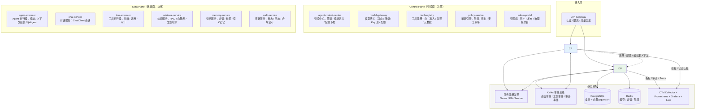
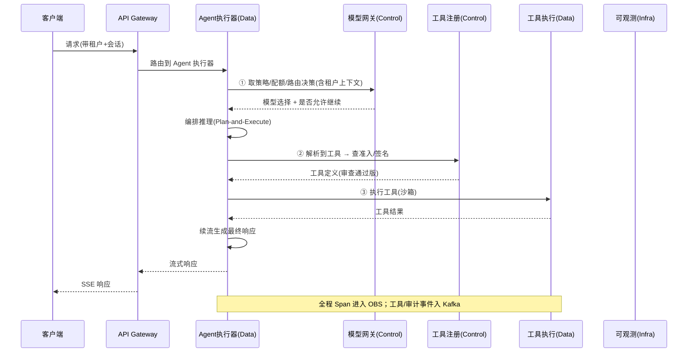
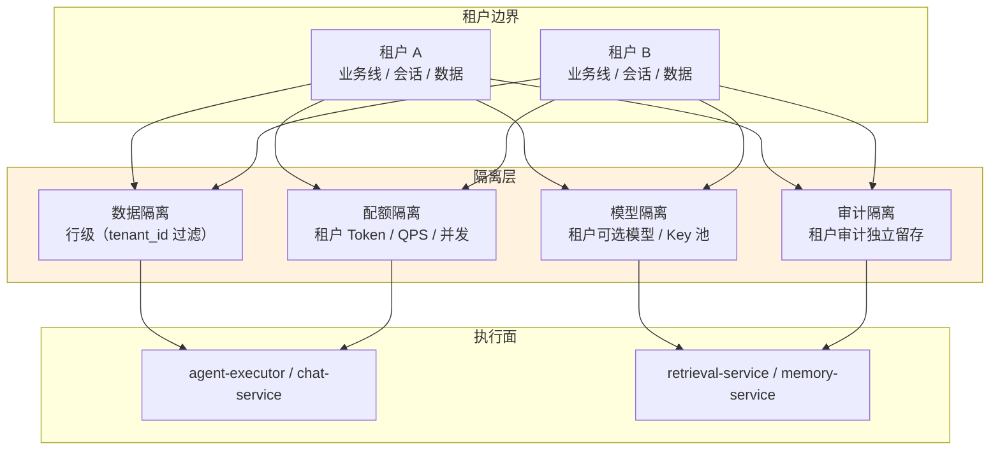
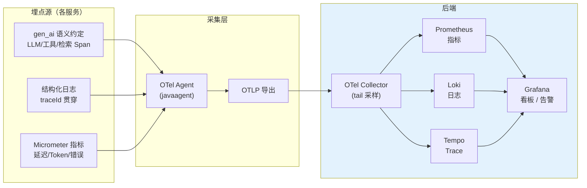
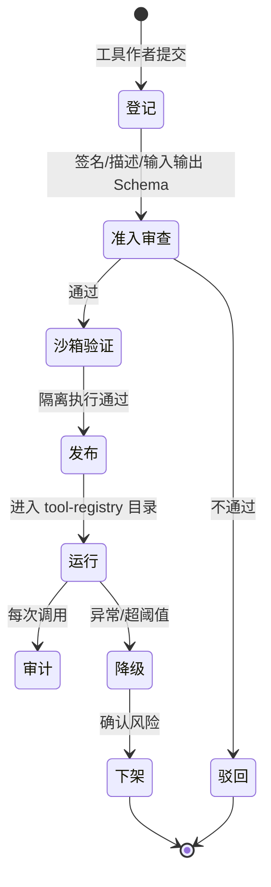
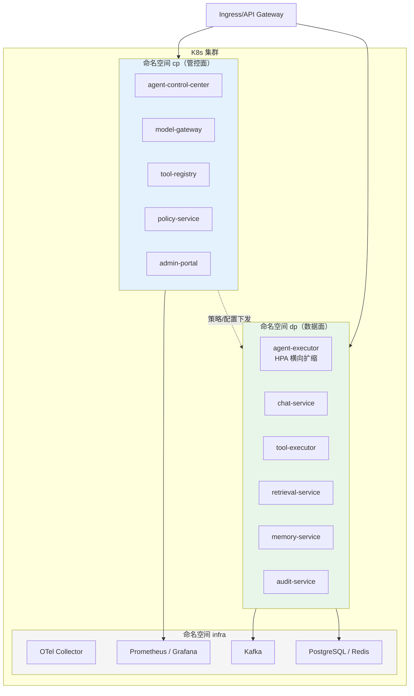
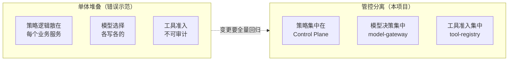
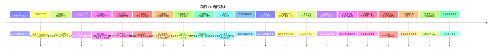

# 00-需求分析与架构设计：企业级多微服务管控分离 Agent 平台

> **定位**：本文是《企业级多微服务管控 Agent 平台》的奠基篇——给出一个**工业可落地**的、**多微服务**、**管控分离（Control Plane / Data Plane）** 的大型 Agent 平台的完整架构设计。读者画像：已经能写出单体 Agent 服务、掌握 Spring AI 2.0 核心用法，想要理解"一个生产级 Agent 平台到底拆成哪些服务、管控面与执行面如何分离、如何演进到工业落地"的 Java 架构师。前置阅读：[教程 20-管控分离架构]、[教程 21-微服务拆分与Agent部署]、[教程 22-全链路可观测性]。
>
> **API 真实性铁律（铁律 0）**：本文所有 Spring AI 2.0.0 代码/配置均经本地 jar `javap` 实证（`scripts/api-baseline-spring-ai-2.0.0.md` 为 ground truth）；未实证的写法一律标注「概念代码」。

---

## 一、项目背景与目标

### 1.1 为什么需要这样一个平台

单体 Agent 服务（一个 Controller + 一个 ChatClient + 若干工具）在企业里只能支撑 demo 和边缘场景。当 Agent 进入核心业务流（客服、审批、风控、运维处置、研发提效），会同时撞上八面墙：

1. **模型墙**：多个模型（DeepSeek/OpenAI/自建 vLLM）要按租户、按业务、按成本路由，还要降级、Key 池管理、配额
2. **工具墙**：工具数量上百，要准入、发现、沙箱执行、签名校验，不能谁都能注册
3. **编排墙**：复杂任务要 Plan-and-Execute、多 Agent 协作、HITL 审批，编排逻辑散落在业务服务里无法治理
4. **上下文墙**：会话记忆、长期记忆、RAG 检索要独立演进，不能塞在对话服务里
5. **治理墙**：限流、预算、灰度、审计、可解释——每个业务服务各写一套就失控
6. **可观测墙**：从 LLM 调用到工具执行到检索，全链路 Span 要对齐
7. **多租户墙**：数据隔离、配额隔离、模型隔离、审计隔离
8. **工业落地墙**：K8s 部署、优雅停机、容灾、容量规划、滚动发布

**结论**：当 Agent 承载的业务价值足够高时，它必须是一个"平台"而不是"服务"。平台 = 一组职责单一、独立扩缩容、通过契约协作的微服务，且**决策（管控）与执行（数据）分离**。

### 1.2 项目目标

构建一个工业可落地的企业级多微服务管控分离 Agent 平台：

| 维度 | 目标 |
|------|------|
| **规模** | 10+ 微服务，按负载独立扩缩容 |
| **管控分离** | Control Plane（决策）与 Data Plane（执行）物理/逻辑分离，策略/配置/编排定义走管控面下发 |
| **多租户** | 租户级数据/配额/模型/审计隔离，SaaS 化 |
| **多模型** | 模型网关统一路由、降级、Key 池、配额、成本归因 |
| **工具治理** | 工具注册中心 + 沙箱执行 + 准入/签名/审计 |
| **工业落地** | K8s + OTel 全链路 + 优雅停机 + 灾备 + 容量规划 + 灰度发布 |
| **可演进** | 从最小单体起步，按企业真实节奏迭代到大型微服务 |

### 1.3 与已有项目的关系

本项目是**独立项目**（CLAUDE.md 项目独立性铁律），不引用、不依赖任何其他项目。它的知识来源是**教程体系**（[教程 20-管控分离架构] 到 [教程 44-多模型协作与供应策略]），是教程企业级能力的一次**大型组合落地**。

---

## 二、四问（本轮：需求分析阶段）

| 问 | 答 |
|----|----|
| **新增了什么需求** | 需求分析阶段明确平台边界：多微服务拆分、管控分离、多租户、多模型、工具治理、可观测、HITL、灰度、成本、高可用——作为后续迭代的验收基线 |
| **影响了哪些模块** | 新平台，无历史模块 |
| **架构如何演进** | 定义目标架构（本文）→ 01 最小单体 → 02 起按迭代拆分/强化 |
| **上一版本的痛点是什么** | 单体 Agent 服务撞上"八面墙"（见 §1.1），无法支撑核心业务 |

---

## 三、整体架构：管控分离全景

### 3.1 架构总览

**核心思想**：**决策与执行分离**——
- **管控面（Control Plane）**：决定"应该做什么"——模型选哪个、工具能不能用、租户配额够不够、要不要人工审批、策略/配置/编排定义长什么样。变更频繁、有状态、少量实例。
- **数据面（Data Plane）**：执行"具体怎么做"——编排推理、调模型、执行工具、检索、读写记忆、生成响应。变更低频、尽量无状态、按负载大量扩缩容。

### 3.2 一次请求的完整旅程（管控/数据如何协作）

**关键点**：数据面在**每个决策点**回调管控面（模型路由、工具准入、配额、审批），但**执行本身**（推理、工具调用、检索）不经过管控面——保证低延迟关键路径不被打断。

### 3.3 多租户隔离设计

**隔离实现**：租户上下文经 Reactor Context 贯穿（WebFlux 铁律，禁 ThreadLocal）；数据访问统一走 `tenant_id` 过滤（`Filter.Expression`/行级权限）；配额/模型/审计在管控面按租户评估。

### 3.4 可观测数据流（Trace→Log→Metric 三支柱）

**三支柱打通**：一个 `traceId` 从 LLM 调用 → 工具执行 → 检索查询贯穿到日志与审计，排障"一次 trace 定位全链路"（[教程 22-全链路可观测性]）。

### 3.5 工具治理生命周期

**治理闭环**：登记→准入→沙箱验证→发布→运行→审计→下架，全生命周期在管控面（tool-registry）管理，执行面（tool-executor）只负责隔离运行（[教程 23-工具执行可观测与审计]）。

### 3.6 部署拓扑（K8s 工业落地形态）

**部署要点**：管控面少量实例（1-3）、数据面按负载 HPA 横向扩缩；命名空间隔离管控/数据/基础设施；滚动发布 + 优雅停机 + 就绪/存活探针（[教程 33-部署与运维]）。

---

## 四、微服务清单

| 服务 | 平面 | 职责 | 关键技术 | 教程锚点 |
|------|------|------|---------|---------|
| `agent-control-center` | Control | 管控中心：租户/策略/编排定义/配置下发 | Spring Boot + PG | [教程 20-管控分离架构] |
| `model-gateway` | Control | 模型路由/降级/Key池/配额/成本归因 | Spring AI + Resilience4j | [教程 32-模型路由与降级]、[教程 27-成本治理与Token计量] |
| `tool-registry` | Control | 工具准入/签名/发现/元数据 | Spring AI ToolCallback | [教程 23-工具执行可观测与审计] |
| `policy-service` | Control | 限流/审批/安全策略评估 | Spring WebFlux + Redis | [教程 31-安全与权限控制] |
| `admin-portal` | Control | 管理端操作台 | React（教程 15-18 前端层） | [教程 18-Agentic-UI设计] |
| `agent-executor` | Data | 编排/上下文组装/多Agent协作 | ChatClient + ToolCallingManager | [教程 07-ReAct推理模式]、[教程 36-Agent工作流编排] |
| `chat-service` | Data | 对话会话管理 + **多页面流式**（跨页签 SSE/断线重连/中断恢复） | ChatClient + ChatMemory + WebFlux SSE | [教程 02-ChatClient与对话模型]、[教程 04-记忆与会话管理]、[教程 24-多页面流式响应与会话管理] |
| `tool-executor` | Data | 工具沙箱执行/审计 + **结构化工具事件**（参数/结果/耗时，供可视化消费） | ToolCallback + 沙箱 + Kafka | [教程 03-工具调用]、[教程 19-流式工具调用与事件协议] |
| `retrieval-service` | Data | RAG/向量检索/混合检索 | VectorStore + RetrievalAugmentationAdvisor | [教程 05-RAG检索增强生成]、[教程 35-高级RAG与AgenticRAG] |
| `memory-service` | Data | 会话/长期/语义记忆 | ChatMemoryRepository(自研) + VectorStore | [教程 39-高级记忆架构] |
| `audit-service` | Data | 审计日志/回放/合规留存 | Kafka + PG | [教程 25-历史记录持久化与合规] |
| `api-gateway` | 接入 | 认证/限流/路由 | Spring Security + WebFlux | [教程 31-安全与权限控制] |
| `admin-portal`（前端） | Control | 管理端操作台 + **工具调用可视化**（工具名/参数/结果/耗时/审批状态实时呈现） | React + SSE/WebSocket 消费工具事件 | [教程 18-Agentic-UI设计]、[教程 17-React与SSE流式UI] |

---

## 五、管控分离设计原则

### 5.1 为什么分离（不是"多个服务堆在一起"）

分离带来的四个工业价值：

1. **变更隔离**：策略/配置/模型路由的变更只动管控面，数据面无状态滚动、不回归业务
2. **独立扩缩容**：检索服务（CPU/内存密集）与对话服务（IO 密集）按各自瓶颈扩缩
3. **权限边界**：工具准入、审批、审计集中在管控面，数据面"无决策权"
4. **可回滚**：编排定义/策略版本化，一次错误下发可秒级回滚

### 5.2 决策点与执行点的切分（本项目关键设计）

| 决策点 | 由谁决策（Control） | 由谁执行（Data） |
|--------|-------------------|-----------------|
| 选哪个模型 | model-gateway（租户/成本/可用性） | agent-executor 发起调用 |
| 工具能不能用 | tool-registry（准入/签名/租户权限） | tool-executor 沙箱执行 |
| 配额够不够 | policy-service（限流/预算） | 调用前拦截 |
| 要不要人工审批 | policy-service（HITL 判定） | tool-executor 挂起等审批 |
| 编排用什么 | agent-control-center（版本化定义） | agent-executor 解释执行 |

> **HITL 落点**（铁律）：人工审批挂在 **`ToolCallingManager` 装饰器 / `ToolCallback` 包装层**（`org.springframework.ai.model.tool`），不是 Advisor——见 [教程 28-Human-in-the-Loop与审批流]。

### 5.3 服务间契约

- **同步查询**：管控面决策用 HTTP（`WebClient`，低基数、毫秒级）——模型路由、工具准入、配额
- **异步事件**：会话/工具/审计事件走 Kafka（高吞吐、解耦、回放）——工具结果、审计流、记忆写入
- **上下文传递**：租户/会话上下文用 **Reactor Context**（WebFlux 铁律：禁 ThreadLocal）；跨服务经 `traceparent`/业务头透传

---

## 六、关键技术决策（ADR 风格）

| # | 决策 | 备选 | 取舍理由 |
|---|------|------|---------|
| ADR-1 | 管控面/数据面物理拆分为多服务 | 单体+模块化 | 变更隔离 + 独立扩缩容是"工业落地"前提（见 §5.1） |
| ADR-2 | 管控决策走 HTTP 同步、事件走 Kafka | 全异步 | 决策延迟敏感（路由/准入），事件高吞吐；混合最稳 |
| ADR-3 | 模型网关自研（基于 Spring AI + OpenAI 兼容） | 引入第三方 LLM 网关 | 自研可深度集成 Spring AI 2.0 的 ChatClient/Observation；外部网关作备选（见 [教程 44-多模型协作与供应策略]） |
| ADR-4 | 工具执行走独立沙箱服务 | 内联在 Agent 执行器 | 工具是最高风险面，隔离执行 + 单独扩容 + 审计闭环 |
| ADR-5 | 记忆服务自研 `ChatMemoryRepository` | 依赖框架 JDBC/Redis 记忆 | 本地 2.0.0 官方仅 `InMemoryChatMemoryRepository`（javap 实证），持久化/多服务共享需自研 |
| ADR-6 | 全链路 OTel（javaagent + OTLP Collector） | 只埋业务日志 | gen_ai 语义约定统一 LLM/工具/检索 Span（见 [教程 22-全链路可观测性]） |

---

## 七、迭代路线（工业落地演进）

**演进原则**：每次迭代从"上一版痛点"出发，回答"新增需求→影响模块→架构演进→痛点解决"四问；企业级能力（微服务拆分、管控分离、多租户、灰度、HITL、可观测、成本治理）作为**迭代里程碑落地**，不是文末展望。

---

## 八、量化验收标准（工业可落地的底线）

| 类别 | 指标 | 目标 | 对应迭代 |
|------|------|------|---------|
| **性能** | 端到端 P99 延迟（含 LLM） | ≤ 8s（流式首 token ≤ 1s） | 02-09 |
| **性能** | 模型网关路由决策 P99 | ≤ 50ms | 04 |
| **可靠性** | 服务可用性 SLO | ≥ 99.9%（月） | 10 |
| **可靠性** | 单服务故障自动恢复 | ≤ 60s 自愈 | 10 |
| **可靠性** | 无状态服务滚动发布 | 零停机 | 09 |
| **成本** | Token 成本可归因到租户/业务 | 100% 覆盖 | 04/09 |
| **成本** | 模型降级命中率（备用模型） | ≥ 95% 可用性保障 | 04 |
| **安全** | 工具准入覆盖率 | 100%（无未登记工具执行） | 05 |
| **安全** | 审计事件留存 | 100% 落库、可回放 | 07 |
| **安全** | 工具沙箱超时/资源限额 | 100% 工具受约束，超限即熔断 | 05 |
| **安全** | 敏感数据脱敏覆盖率（LLM 入参/出参） | 100% 命中规则 | 07 |
| **安全** | Prompt 注入/外发拦截率 | ≥ 99%（基准集） | 07 |
| **多租户** | 租户数据隔离违规数 | 0 | 04 |
| **评估** | Agent 评测回归通过率（金标集） | ≥ 95% 且无新增回归 | 08 |
| **性能** | 语义缓存命中率 | ≥ 20%（高频查询） | 09 |
| **运维** | 配置错误下发回滚 | ≤ 60s 全量回滚 | 09 |
| **运维** | 长任务断点恢复 | 100% 可续跑 | 09 |

---

## 九、工业级落地特性覆盖矩阵

> 「工业可落地」= 从"能演示"到"能生产"。以下矩阵把生产命门级特性**逐一**列出，标注**承载服务 / 落地迭代 / 教程锚点**。每项特性都在对应迭代作为**里程碑落地**（不是文末展望），并纳入该迭代的「测试与验证」。

### 9.1 安全与合规（纵深防御）

| 特性 | 承载服务 | 落地迭代 | 教程锚点 |
|------|---------|---------|---------|
| 工具沙箱隔离（进程/容器/WASM）+ 超时 + CPU/内存/磁盘限额 | tool-executor | 05 | [教程 31-安全与权限控制] |
| 沙箱网络隔离（出网白名单 / 禁内网探测） | tool-executor | 05 | [教程 31-安全与权限控制] |
| 危险操作白名单（高危工具须审批） | tool-registry + policy-service | 07 | [教程 28-Human-in-the-Loop与审批流] |
| 凭证注入（Vault / 环境注入，不落日志、不回显） | tool-executor + config | 05 | [教程 31-安全与权限控制] |
| Prompt 注入检测 / 间接注入（外部数据进上下文前过滤） | policy-service + agent-executor | 07 | [附录 09-Agent安全深度/00-Prompt注入分类与案例] |
| 输出安全过滤 / DLP（外发内容审查） | agent-executor（ToolCallback 包装层） | 07 | [附录 09-Agent安全深度/02-数据泄露防护] |
| LLM 入参/出参数据脱敏掩码（PII/密钥） | agent-executor（Masking Advisor） | 07 | [附录 09-Agent安全深度/02-数据泄露防护] |
| mTLS / 零信任（服务间双向认证） | api-gateway + 服务间 | 07 | [教程 31-安全与权限控制] |
| RBAC 角色权限（租户管理员/审计员/开发者） | api-gateway + admin-portal | 07 | [教程 31-安全与权限控制] |
| GDPR / 个人信息保护法（留存期限、被遗忘权删除） | audit-service + memory-service | 07 | [教程 25-历史记录持久化与合规] |
| 数据主权/驻留（多区域数据隔离） | 部署层 | 09 | [教程 31-安全与权限控制] |
| 供应链安全（SCA 依赖审计 / SBOM / 镜像签名） | 平台 CI/CD | 08 | [教程 33-部署与运维] |

### 9.2 模型与知识资产治理

| 特性 | 承载服务 | 落地迭代 | 教程锚点 |
|------|---------|---------|---------|
| 模型卡片 / 数据卡片（能力、局限、评测记录） | model-gateway + admin-portal | 04 | [附录 13-AI治理与合规/01-模型卡片与数据卡片] |
| 模型上线准入评估（先评测后上线） | 评估服务 + model-gateway | 08 | [教程 37-自我反思与Agent评估] |
| 模型退役 / 灰度切换 | model-gateway | 04/09 | [教程 29-灰度发布与版本管理] |
| Prompt 仓库 / Prompt 版本管理 | agent-control-center | 03 | [教程 29-灰度发布与版本管理] |
| 知识库/文档版本化（RAG 语料可回滚） | retrieval-service | 06 | [教程 05-RAG检索增强生成] |
| 向量索引管理（重建/迁移/一致性校验） | retrieval-service | 06 | [教程 06-向量数据库选型] |

### 9.3 质量与评估

| 特性 | 承载服务 | 落地迭代 | 教程锚点 |
|------|---------|---------|---------|
| LLM-as-Judge 输出质量评估（忠实/相关/安全） | 评估服务（官方 Evaluator 或自研 Judge） | 08 | [教程 37-自我反思与Agent评估] |
| 幻觉检测 / 引用溯源（回答须可回溯到证据） | retrieval-service + agent-executor | 06/08 | [教程 05-RAG检索增强生成] |
| 评测回归（金标数据集，防新增回归） | 评估服务 | 08 | [附录 04-测试策略/02-Eval评估] |
| 在线监控 + 离线评估闭环（数据飞轮） | 评估 + admin-portal | 08 | [教程 41-数据飞轮与持续改进] |

### 9.4 可观测深化

| 特性 | 承载服务 | 落地迭代 | 教程锚点 |
|------|---------|---------|---------|
| gen_ai 语义约定全链路 Span（LLM/工具/检索） | OBS + 各服务 | 06 | [教程 22-全链路可观测性] |
| trace→log→metric 三支柱关联（traceId 贯穿） | OBS | 06 | [教程 22-全链路可观测性] |
| SLO / SLI / 错误预算 + 告警收敛 | OBS | 06/09 | [教程 22-全链路可观测性] |
| 审计回放 / 决策可解释（推理轨迹可视化） | audit-service + admin-portal | 06/07 | [教程 25-历史记录持久化与合规] |
| 工具调用观测（参数/结果/耗时，脱敏后） | tool-executor + ToolCallingObservationContext | 06 | [教程 23-工具执行可观测与审计] |

### 9.5 会话与体验

| 特性 | 承载服务 | 落地迭代 | 教程锚点 |
|------|---------|---------|---------|
| 多页面流式输出（跨页签 SSE / 断线重连 / 中断恢复） | chat-service | 06 | [教程 24-多页面流式响应与会话管理] |
| 工具调用可视化（参数/结果/耗时/审批实时呈现） | admin-portal | 06 | [教程 18-Agentic-UI设计] |
| 长任务异步化 + 检查点断点续跑 | agent-executor | 09 | [教程 40-长任务持久化与中断恢复] |
| 失败转人工 / 工单升级 / SOP 集成 | agent-executor + 事件 | 08 | [教程 28-Human-in-the-Loop与审批流] |

### 9.6 发布与运维

| 特性 | 承载服务 | 落地迭代 | 教程锚点 |
|------|---------|---------|---------|
| 平台 CI/CD + 蓝绿 / 金丝雀发布 | 部署层 | 09 | [教程 29-灰度发布与版本管理] |
| 动态配置中心 + 策略版本化 + 秒级回滚 | agent-control-center | 03/09 | [教程 20-管控分离架构] |
| 优雅停机 / 滚动发布 / 就绪存活探针 | 部署层 | 09 | [教程 33-部署与运维] |
| 压测基线 + 容量模型（QPS→实例数） | 部署层 + 可观测 | 09 | [教程 33-部署与运维] |
| HPA 自动扩缩容（数据面无状态横扩） | 部署层 | 09 | [教程 21-微服务拆分与Agent部署] |
| 故障演练 / 混沌工程（注入中断/延迟/超限） | 部署层 | 09 | [教程 30-容错与弹性设计] |
| 数据备份 / 恢复演练（RPO / RTO 达标） | 数据层 | 09 | [教程 25-历史记录持久化与合规] |

### 9.7 成本与性能

| 特性 | 承载服务 | 落地迭代 | 教程锚点 |
|------|---------|---------|---------|
| 模型按任务定价 + Token 预算实时拦截 | model-gateway | 09 | [教程 27-成本治理与Token计量] |
| 预算自动暂停（租户/业务线超限自动停） | policy-service + model-gateway | 09 | [教程 27-成本治理与Token计量] |
| 语义缓存 / Prompt Cache / KV Cache 复用 | retrieval-service + model-gateway | 09 | [附录 10-语义缓存与性能] |
| 批量推理 / 请求合并（低峰优化） | model-gateway | 09 | [附录 10-语义缓存与性能/02-批量推理与请求合并] |
| 成本异常告警 / 按租户成本归因 | OBS + model-gateway | 09 | [教程 27-成本治理与Token计量] |

### 9.8 数据与合规

| 特性 | 承载服务 | 落地迭代 | 教程锚点 |
|------|---------|---------|---------|
| 数据生命周期（保留/归档/过期删除） | audit-service + memory-service | 07 | [教程 25-历史记录持久化与合规] |
| 敏感数据分类分级 + 匿名化 | 数据层 + agent-executor | 07 | [附录 13-AI治理与合规/02-数据隐私与偏见检测] |
| 不可篡改审计（审计签名 / 追加写） | audit-service | 07 | [教程 25-历史记录持久化与合规] |
| 合规报告导出（按租户/时间窗） | audit-service + admin-portal | 07 | [附录 13-AI治理与合规/00-NIST-AI-RMF框架] |
| 数据血缘 / 溯源（回答→文档→来源） | retrieval-service + audit-service | 06 | [教程 05-RAG检索增强生成] |

### 9.9 服务治理与弹性

| 特性 | 承载服务 | 落地迭代 | 教程锚点 |
|------|---------|---------|---------|
| 分布式限流分层（网关→服务→模型配额） | api-gateway + policy-service + model-gateway | 04 | [教程 26-多租户隔离与资源治理] |
| 熔断 / 降级 / 兜底（降级到规则引擎或人工） | model-gateway + 各服务 | 09 | [教程 30-容错与弹性设计] |
| 超时 / 重试 / 幂等（跨服务调用规范） | 各服务 | 02 | [教程 42-响应式错误处理] |
| 会话跨服务一致性（事件溯源 / 幂等键） | agent-executor + Kafka | 09 | [教程 40-长任务持久化与中断恢复] |

### 9.10 集成与组织

| 特性 | 承载服务 | 落地迭代 | 教程锚点 |
|------|---------|---------|---------|
| 企业系统集成（Webhook / 连接器 / 事件驱动） | api-gateway + 工具 | 05 | [教程 21-微服务拆分与Agent部署] |
| 多语言 / 国际化（模型/时区/文案） | chat-service + model-gateway | 04 | [教程 44-多模型协作与供应策略] |
| 多区域就近访问 + 数据同步一致性 | 部署层 | 09 | [教程 33-部署与运维] |
| 多 Agent 协作（任务委派 / 工作流） | agent-executor | 08 | [教程 36-Agent工作流编排] |

### 9.11 覆盖核对（验收清单）

- **每项特性**都有 ①承载服务 ②落地迭代 ③可测试验证点（对应迭代「测试与验证」小节）
- **每个迭代**至少承载 2 项上述工业级特性，迭代末尾以「量化验收」确认落地
- 未在某迭代落地的特性，不允许写"已支持"——只能标"规划中"

---

## 十、与教程体系的锚点

本项目是教程企业级与进阶能力的**组合落地**，各迭代在关键位置标注「遇到阻塞？→ [教程 XX-XXX §X]」：

| 教程篇目 | 项目落地点 |
|---------|-----------|
| [教程 20-管控分离架构] | 架构总览（§3）、迭代二 |
| [教程 21-微服务拆分与Agent部署] | 迭代一（服务拆分） |
| [教程 22-全链路可观测性] | 迭代六（OTel 全链路） |
| [教程 23-工具执行可观测与审计] | 迭代五/六（工具审计） |
| [教程 27-成本治理与Token计量] | 迭代四/九（成本归因） |
| [教程 28-Human-in-the-Loop与审批流] | 迭代七（HITL） |
| [教程 32-模型路由与降级] | 迭代四（模型网关） |
| [教程 35-高级RAG与AgenticRAG] | 迭代五（检索服务） |
| [教程 39-高级记忆架构] | 迭代五（记忆服务） |
| [教程 40-长任务持久化与中断恢复] | 迭代九（断点续跑） |
| [教程 44-多模型协作与供应策略] | 迭代四（多模型） |

---

## 十一、总结

本文定义了工业可落地的企业级多微服务管控 Agent 平台的**目标架构**：12 个服务按 **Control Plane（决策）/ Data Plane（执行）** 分离，管控面集中策略、路由、准入、审批，数据面专注编排、推理、工具执行、检索、记忆，中间经 HTTP 同步决策 + Kafka 异步事件协作，全链路 OTel 可观测，量化验收覆盖性能/可靠性/成本/安全/多租户。

**下一篇**：01-最小 Demo 搭建——先把最小闭环（单服务 ChatClient + 工具）跑通，再进入迭代拆分的演进之路。
