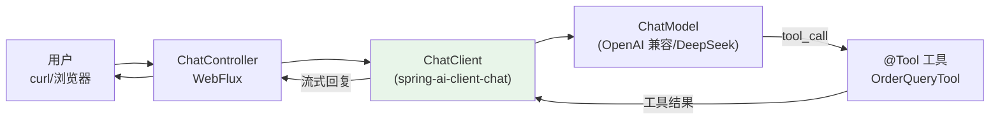
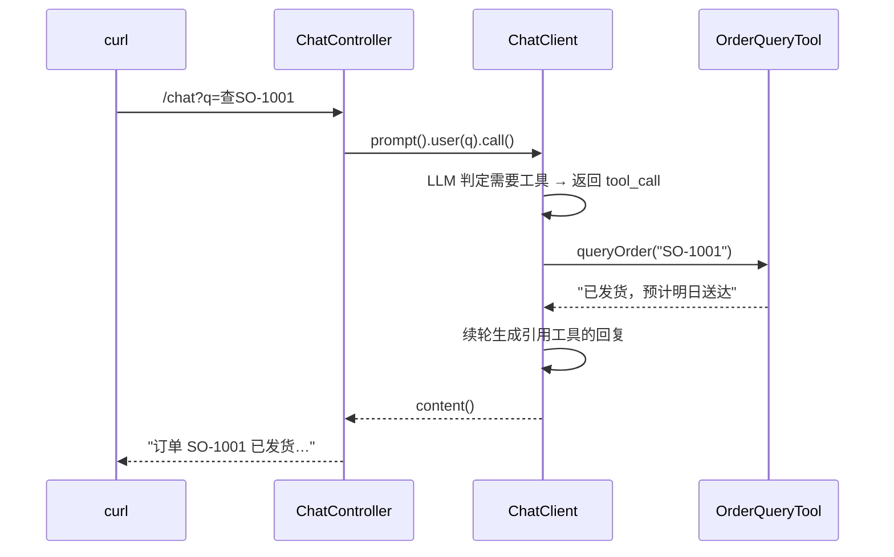
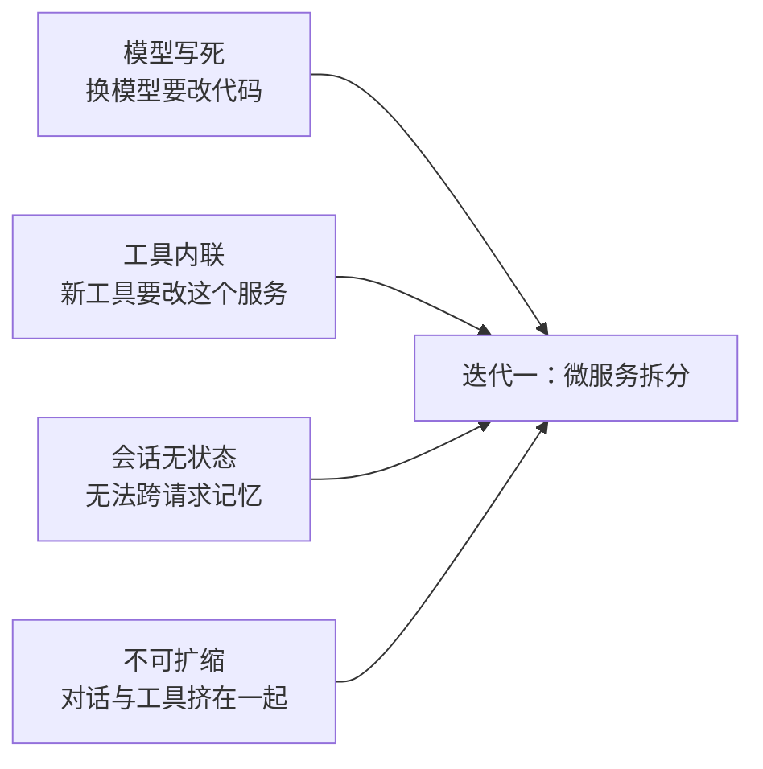

# 01-最小 Demo 搭建：先跑通一个可测试的最小闭环

> **定位**：本项目（企业级多微服务管控 Agent 平台）的**起点**——用一个单体 Spring Boot WebFlux 服务，把"用户提问 → Agent 推理 → 工具调用 → 流式回复"的最小闭环跑通，并**每一步都可测试**。读者画像：理解 00 篇目标架构、想先动手看到东西能跑的开发者。前置阅读：[00-需求分析与架构设计](00-需求分析与架构设计.md)、[教程 02-ChatClient与对话模型]。
>
> **铁律 0**：本文代码均经本地 jar `javap` 实证（Spring AI 2.0.0）；未实证的依赖标注「需引入依赖后实证」。

---

## 一、四问（本轮：最小闭环）

| 问 | 答 |
|----|----|
| **新增了什么需求** | 把"提问→推理→工具→流式回复"的最小闭环跑通，验证技术栈可编译、可测试 |
| **影响了哪些模块** | 新单体服务 `agent-app` |
| **架构如何演进** | 单体内聚（无拆分）；这是后续 02 起拆分的**基线** |
| **上一版本的痛点是什么** | 无（首个可运行版本） |

**本迭代验收**：① `curl` 问一句可得到流式回复；② 让 Agent 调用一个工具（如查订单）并正确引用结果；③ 有可复现的单元测试。

---

## 二、最小闭环长什么样



**关键点**：这一阶段没有多租户、没有管控分离、没有模型网关——就是"一个服务 + 一个 ChatClient + 几个工具"。先让它**能跑、能测**，再谈拆分。

---

## 三、技术栈与依赖（只加最小集）

```xml
<!-- pom.xml：仅 webflux + openai starter（与你的实操 pom 一致），pgvector 等后续迭代再加 -->
<parent>
    <groupId>org.springframework.boot</groupId>
    <artifactId>spring-boot-starter-parent</artifactId>
    <version>4.1.0</version>
</parent>
<properties>
    <java.version>21</java.version>
    <spring-ai.version>2.0.0</spring-ai.version>
</properties>
<dependencyManagement>
    <dependencies>
        <dependency>
            <groupId>org.springframework.ai</groupId>
            <artifactId>spring-ai-bom</artifactId>
            <version>${spring-ai.version}</version>
            <type>pom</type>
            <scope>import</scope>
        </dependency>
    </dependencies>
</dependencyManagement>
<dependencies>
    <dependency>
        <groupId>org.springframework.boot</groupId>
        <artifactId>spring-boot-starter-webflux</artifactId>
    </dependency>
    <dependency>
        <groupId>org.springframework.ai</groupId>
        <artifactId>spring-ai-starter-model-openai</artifactId>
    </dependency>
</dependencies>
```

```yaml
# application.yaml
spring:
  ai:
    openai:
      base-url: ${OPENAI_BASE_URL:https://api.deepseek.com}   # DeepSeek 兼容 OpenAI
      api-key: ${OPENAI_API_KEY}
      chat:
        model: deepseek-chat
```

> **配置键实证**：`spring.ai.openai.base-url/api-key/chat.model`（javap 实证 `OpenAiChatProperties`，前缀 `spring.ai.openai.chat`）。密钥用 `${ENV_VAR}` 占位（CLAUDE.md 规则 9）。

---

## 四、核心代码（最小闭环，仅此而已）

### 4.1 ChatClient Bean（真实 `ChatClient.Builder`，javap 实证）

```java
package com.example.agentapp.config;

import com.example.agentapp.tool.OrderQueryTool;
import org.springframework.ai.chat.client.ChatClient;
import org.springframework.context.annotation.Bean;
import org.springframework.context.annotation.Configuration;

@Configuration
public class AgentConfig {

    @Bean
    ChatClient chatClient(ChatClient.Builder builder) {
        // ChatClient.Builder 由 Boot 自动装配注入；defaultTools 挂载 @Tool 对象（javap 实证）
        return builder
                .defaultSystem("你是电商客服助手。只能依据工具查询结果回答，不要编造订单/物流信息。")
                .defaultTools(new OrderQueryTool())
                .build();
    }
}
```

### 4.2 一个工具（`@Tool` / `@ToolParam`，javap 实证）

```java
package com.example.agentapp.tool;

import java.util.Map;
import org.springframework.ai.tool.annotation.Tool;
import org.springframework.ai.tool.annotation.ToolParam;

/** 订单查询工具——用真实内存数据，验证工具调用闭环。 */
public class OrderQueryTool {

    private static final Map<String, String> ORDERS = Map.of(
            "SO-1001", "已发货，预计明日送达",
            "SO-1002", "待支付"
    );

    @Tool(description = "按订单号查询订单状态")
    public String queryOrder(@ToolParam(description = "订单号，如 SO-1001") String orderId) {
        return ORDERS.getOrDefault(orderId, "未找到该订单");
    }
}
```

### 4.3 Controller（同步 + 流式，`call().content()` / `stream().content()` 实证）

```java
package com.example.agentapp.web;

import org.springframework.ai.chat.client.ChatClient;
import org.springframework.web.bind.annotation.GetMapping;
import org.springframework.web.bind.annotation.RequestParam;
import org.springframework.web.bind.annotation.RestController;
import reactor.core.publisher.Flux;

@RestController
public class ChatController {

    private final ChatClient chatClient;

    public ChatController(ChatClient chatClient) {
        this.chatClient = chatClient;
    }

    /** 同步回复 */
    @GetMapping("/chat")
    public String chat(@RequestParam String q) {
        // javap 实证：CallResponseSpec.content() → String
        return chatClient.prompt().user(q).call().content();
    }

    /** 流式回复（SSE）——StreamResponseSpec.content() → Flux<String>（javap 实证） */
    @GetMapping(value = "/chat/stream", produces = "text/event-stream")
    public Flux<String> stream(@RequestParam String q) {
        return chatClient.prompt().user(q).stream().content();
    }
}
```

---

## 五、启动与手工验证（可测试性①）

```bash
mvn spring-boot:run -Dspring-boot.run.arguments=--OPENAI_API_KEY=sk-xxx

# 1. 同步提问
curl "http://localhost:8080/chat?q=帮我查一下订单SO-1001"
# 预期：Agent 调用 queryOrder 工具后回答 "订单 SO-1001 已发货，预计明日送达"

# 2. 流式提问（逐字 SSE 返回）
curl -N "http://localhost:8080/chat/stream?q=订单SO-1002状态"
```



---

## 六、单元测试（可测试性②）

> ⚠ `spring-boot-starter-test` 本地未下载（未 javap 实证），需引入依赖后运行：
> ```xml
> <dependency>
>     <groupId>org.springframework.boot</groupId>
>     <artifactId>spring-boot-starter-test</artifactId>
>     <scope>test</scope>
> </dependency>
> ```

工具是纯 Java，可直接单测（不依赖 LLM）：

```java
package com.example.agentapp.tool;

import org.junit.jupiter.api.Test;
import static org.assertj.core.api.Assertions.assertThat;

class OrderQueryToolTest {

    private final OrderQueryTool tool = new OrderQueryTool();

    @Test
    void shouldReturnStatus_whenOrderExists() {
        assertThat(tool.queryOrder("SO-1001")).contains("已发货");
    }

    @Test
    void shouldReturnNotFound_whenOrderMissing() {
        assertThat(tool.queryOrder("SO-9999")).isEqualTo("未找到该订单");
    }
}
```

**测试策略说明**：本阶段只单测纯逻辑工具（无 LLM、快、稳定）；ChatClient 与 LLM 的集成用上面的 `curl` 手工验证。到 [03-迭代二] 引入 `MockChatModel`/`FakeChatModel` 后再做 ChatClient 级测试。

---

## 七、本迭代痛点（为什么下一步要拆分）

单体能跑，但已经能看到四个隐患：



1. **模型写死**：模型名、Key、路由逻辑全在 `application.yaml` 与 Bean 里——多租户/多模型无法演进
2. **工具内联**：工具和 Agent 在同一进程，工具扩容/治理/沙箱无从谈起
3. **会话无状态**：每次请求独立，没有会话记忆（`ChatMemory` 都没接）
4. **不可独立扩缩**：对话（IO 密集）与工具（CPU 密集）互相拖累

---

## 八、验收对照

| 验收项 | 达标标准 | 本迭代 |
|--------|---------|--------|
| 最小闭环可运行 | curl 提问 → 工具调用 → 流式回复 | ✅ |
| 可测试 | 工具单测通过 + 手工验证步骤可复现 | ✅ |
| 未引入最终架构 | 无多租户/管控分离/多服务 | ✅（刻意不引入） |

**下一篇**：02-微服务拆分——把 Agent 执行、LLM 调用、工具执行拆成三个独立服务，各自的职责边界与独立部署。
