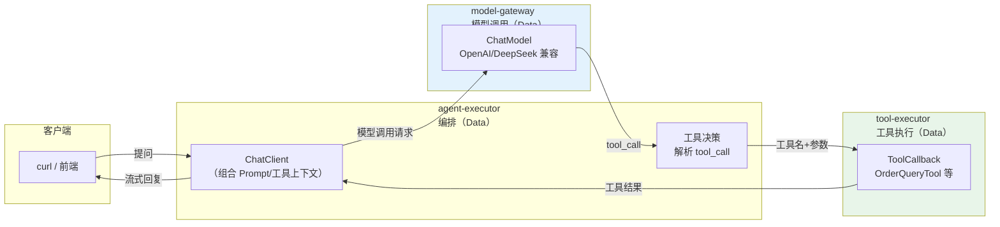
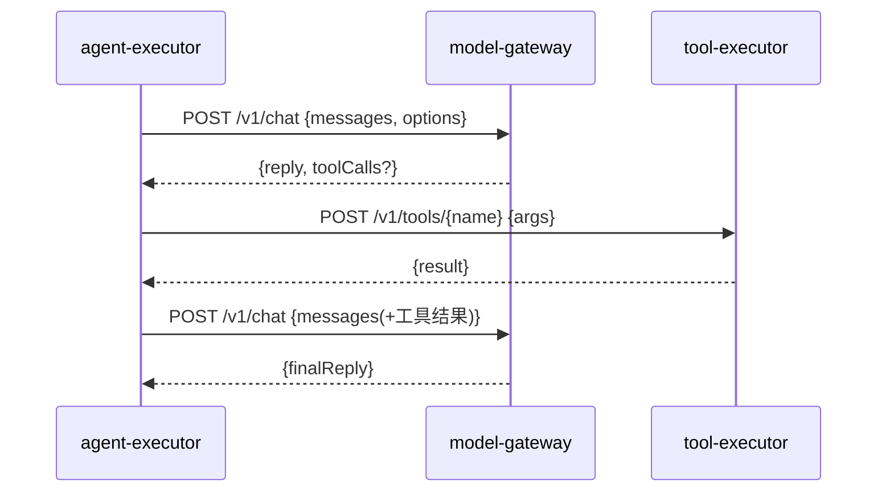
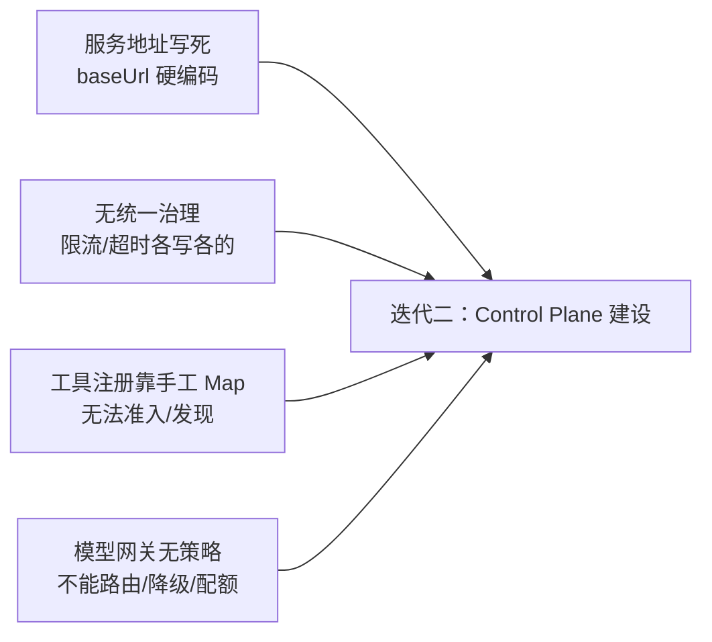

# 02-微服务拆分——Agent 执行 / 模型调用 / 工具执行三服务独立

> **定位**：从 01 的单体 `agent-app` 拆出**三个独立服务**：`agent-executor`（编排）、`model-gateway`（模型调用）、`tool-executor`（工具执行）。这一步先解决"各自独立部署/扩缩容"的问题，**刻意不引入**多租户/沙箱/管控平面（那是后续迭代）。读者画像：已验证 01 最小闭环可跑，想理解"微服务拆分第一步到底拆什么、服务间怎么协作"。前置阅读：[01-最小Demo搭建](01-最小Demo搭建.md)、[教程 30-微服务拆分与Agent部署]。
>
> **演进纪律**：本文只给**拆分本身**的代码；多租户（04）、工具沙箱（05）、可观测（06）等一律不提前实现。
> **铁律 0**：代码均经本地 jar `javap` 实证。

---

## 一、四问（本轮：微服务拆分）

| 问 | 答 |
|----|----|
| **新增了什么需求** | 把单体的三个职责拆成独立服务，各自独立部署/扩缩容/演进 |
| **影响了哪些模块** | `agent-app` → 拆为 `agent-executor` / `model-gateway` / `tool-executor` |
| **架构如何演进** | 单体 → 三服务直连（HTTP）；无注册中心、无消息、无管控面 |
| **上一版本的痛点是什么** | ① 模型写死在 ChatClient Bean ② 工具内联 ③ 对话与工具无法独立扩缩（01 §七） |

**本迭代验收**：① 三服务各自可独立启动/部署；② 一次提问跨三服务完成（agent→model→tool→agent）；③ 每个服务有独立测试。

### 1.1 本节核对（四问）

- [ ] "上一版痛点"（模型写死/工具内联/无法独立扩缩）与 [01 §七] 痛点表述一致，是本次拆分的直接动因
- [ ] 本迭代"刻意不引入"（多租户/沙箱/注册中心/管控面）与正文边界表（§二）、验收"未提前引入"口径一致
- [ ] 验收三项（独立启动/跨服务协作/独立测试）各自有下文章节承接（分别对应 §二架构、§三契约+§4.4 验证、§五回归）

---

## 二、拆分后的架构



**三个服务的边界**：

| 服务 | 职责 | 不做什么（留给后续） |
|------|------|--------------------|
| `agent-executor` | 编排：Prompt 组装、多轮、工具调用循环（`ToolCallingManager`） | 不做模型路由（04）、不做管控决策（03） |
| `model-gateway` | 模型调用：封装 ChatModel、统一请求入口 | 不做多租户/Key 池/配额（04）、不做降级策略（04） |
| `tool-executor` | 工具执行：持有 ToolCallback、执行并返回结果 | 不做沙箱/准入/凭证（05） |

> 这一步**服务间是直连 HTTP**（`WebClient`），没有注册中心/消息——先把"独立"做出来，治理手段迭代二再加。

### 2.1 本节核对（拆分后的架构）

- [ ] 能对照 §二 flowchart，说清一次提问流经三服务的边界；并背出三服务的"职责 / 不做什么"表，确认与 §1 四问一致
- [ ] 三个服务均归 Data 平面、无管控面介入——符合 01 之后的演进纪律（治理留待迭代三/四）
- [ ] 服务间通信方式为直连 HTTP（WebClient），未提前引入注册中心/消息队列

---

## 三、服务间契约（先定接口，再各写各的）



**契约要点**：
- `model-gateway` 暴露 `/v1/chat`（同步）与 `/v1/chat/stream`（SSE）
- `tool-executor` 暴露 `/v1/tools/{name}`（执行）+ `/v1/tools`（列出可用工具）
- 请求/响应用简单 DTO（`record`）；跨服务上下文用请求头透传（`X-Trace-Id`、`X-Tenant-Id` 占位）

### 3.1 本节核对（服务间契约）

- [ ] 能列出三个服务的 HTTP 端点契约：model-gateway 的 `/v1/chat`+`/v1/chat/stream`、tool-executor 的 `/v1/tools/{name}`+`/v1/tools`，并说明各自请求/响应形态
- [ ] 跨服务上下文用请求头（`X-Trace-Id`/`X-Tenant-Id` 占位）透传，未引入消息总线（契约阶段先行）
- [ ] 契约与 §4 各 Controller 的 `@PostMapping`/`@GetMapping` 路径一一对应

---

## 四、关键代码（演进式：只做拆分）

### 4.1 `model-gateway`：封装模型调用（不写死模型选择逻辑）

```java
package com.example.modelgateway.web;

import org.springframework.ai.chat.model.ChatModel;
import org.springframework.ai.chat.model.ChatResponse;
import org.springframework.ai.chat.messages.Message;
import org.springframework.ai.chat.prompt.Prompt;
import org.springframework.web.bind.annotation.*;
import reactor.core.publisher.Flux;
import java.util.List;

/** 模型调用服务——统一入口，后续路由/降级在这里加（迭代四）。 */
@RestController
public class ModelChatController {

    private final ChatModel chatModel;   // 自动装配的 OpenAI 兼容 ChatModel

    public ModelChatController(ChatModel chatModel) {
        this.chatModel = chatModel;
    }

    @PostMapping("/v1/chat")
    public ChatResponse chat(@RequestBody ChatRequest req) {
        // javap 实证：ChatModel.call(Prompt) → ChatResponse
        return chatModel.call(new Prompt(req.messages()));
    }

    @PostMapping(value = "/v1/chat/stream", produces = "text/event-stream")
    public Flux<ChatResponse> stream(@RequestBody ChatRequest req) {
        return chatModel.stream(new Prompt(req.messages()));
    }

    public record ChatRequest(List<Message> messages) {}
}
```

### 4.2 `tool-executor`：持有工具并执行

```java
package com.example.toolexecutor.web;

import com.example.toolexecutor.tool.OrderQueryTool;
import org.springframework.ai.tool.ToolCallback;
import org.springframework.web.bind.annotation.*;
import java.util.List;
import java.util.Map;

/** 工具执行服务——后续沙箱/准入在这里加（迭代五）。 */
@RestController
public class ToolExecuteController {

    private final Map<String, ToolCallback> tools;   // 工具名 → 回调

    public ToolExecuteController(OrderQueryTool orderQueryTool) {
        // 手工注册（本迭代）——迭代五换 tool-registry 动态发现
        this.tools = Map.of(
                "queryOrder", ToolCallbacks.toToolCallback(orderQueryTool)   // 见下方说明
        );
    }

    @PostMapping("/v1/tools/{name}")
    public Map<String, Object> execute(@PathVariable String name, @RequestBody Map<String, Object> args) {
        ToolCallback cb = tools.get(name);
        if (cb == null) {
            throw new IllegalArgumentException("unknown tool: " + name);
        }
        // javap 实证：ToolCallback.call(String) 入参是 JSON 字符串
        String result = cb.call(toJson(args));
        return Map.of("result", result);
    }

    @GetMapping("/v1/tools")
    public List<String> list() {
        return List.copyOf(tools.keySet());
    }

    private String toJson(Map<String, Object> args) {
        // 本迭代用简单拼接；迭代五引入 ObjectMapper
        return args.entrySet().stream()
                .map(e -> "\"" + e.getKey() + "\":\"" + e.getValue() + "\"")
                .reduce("{", (a, b) -> a + b + ",") + "}";
    }
}
```

> ⚠ **概念代码标注**：`ToolCallbacks.toToolCallback(obj)` 是本项目的简化示意——真实把 `@Tool` 注解对象转 `ToolCallback` 的入口是框架的 **`MethodToolCallbackProvider.builder().toolObjects(...)`**（javap 实证，`org.springframework.ai.tool.method`）。本迭代为演示 `ToolCallback.call(String)` 签名先手工包一层，迭代五统一走 Provider。下面是正确写法：

```java
// 真实 API（javap 实证）：
// MethodToolCallbackProvider.builder().toolObjects(new OrderQueryTool()).getToolCallbacks()
```

### 4.3 `agent-executor`：编排（用 ToolCallingManager 走工具循环）

```java
package com.example.agentexecutor.service;

import org.springframework.ai.chat.client.ChatClient;
import org.springframework.ai.chat.client.advisor.api.CallAdvisor;
import org.springframework.ai.chat.client.advisor.api.CallAdvisorChain;
import org.springframework.ai.chat.client.ChatClientRequest;
import org.springframework.ai.chat.client.ChatClientResponse;
import org.springframework.stereotype.Service;
import org.springframework.web.reactive.function.client.WebClient;
import reactor.core.publisher.Flux;

/** Agent 编排——把"调模型、执行工具"委托给独立服务（本迭代用 WebClient 直连）。 */
@Service
public class AgentOrchestrator {

    private final WebClient modelGateway;
    private final WebClient toolExecutor;

    public AgentOrchestrator(WebClient.Builder wb) {
        this.modelGateway = wb.baseUrl("http://model-gateway:8081").build();
        this.toolExecutor = wb.baseUrl("http://tool-executor:8082").build();
    }

    public String chat(String userText) {
        // ① 调模型网关
        String first = modelGateway.post().uri("/v1/chat")
                .bodyValue(Map.of("messages", List.of(Map.of("role", "user", "content", userText))))
                .retrieve().bodyToMono(String.class).block();
        // ② 判断是否含 tool_call（本迭代简化：文本匹配工具名，迭代三接入真实工具解析）
        if (first != null && first.contains("queryOrder")) {
            // 调工具执行服务
            String toolResult = toolExecutor.post().uri("/v1/tools/queryOrder")
                    .bodyValue(Map.of("orderId", "SO-1001"))
                    .retrieve().bodyToMono(String.class).block();
            // ③ 带工具结果再问一次模型网关
            return modelGateway.post().uri("/v1/chat")
                    .bodyValue(Map.of("messages", List.of(
                            Map.of("role", "user", "content", userText),
                            Map.of("role", "assistant", "content", "需要查询订单"),
                            Map.of("role", "tool", "content", toolResult))))
                    .retrieve().bodyToMono(String.class).block();
        }
        return first;
    }
}
```

> **演进说明**：本迭代的编排是**简化手写**（用 `block()` 串行 + 文本判断 tool_call），**目的只是让"三服务协作"跑通**。真实的工具循环由 **`ToolCallingManager`** 驱动（`executeToolCalls(Prompt, ChatResponse)`，javap 实证 `org.springframework.ai.model.tool`）——迭代三接入，把这段手写逻辑替换为框架能力。

### 4.4 本节测试与验证（关键代码：三服务拆分）

**前置条件**：三个服务分别编译通过（各自 pom 依赖齐全）；§3.1 契约一致。

**材料**：
- **tool-executor**：复刻 §四 的 `OrderQueryToolTest`（`queryOrder("SO-1001")` 断言 `contains("已发货")`）；
- **model-gateway**：用 §5.1 的契约冒烟 curl 直打 `POST /v1/chat`；
- **agent-executor**：用 mock `WebClient`（或 WireMock 模拟两个下游）验证编排"工具判定→执行→二次问模型"分支。

**步骤与断言**：

| # | 操作 | 预期（PASS 判据） |
|---|------|------------------|
| 1 | 三个服务 `mvn clean compile` | 各自 `BUILD SUCCESS`；`ChatModel.call(Prompt)`、`ToolCallback.call(String)`、`MethodToolCallbackProvider` 真实 API 编译通过（javap 实证） |
| 2 | tool-executor 单测（OrderQueryToolTest） | 用例通过："已发货" 命中 |
| 3 | model-gateway 契约冒烟：`curl -X POST http://localhost:8081/v1/chat ... {"messages":[{"role":"user","content":"你好"}]}` | 返回 ChatModel 真实回复（模型连通） |
| 4 | agent-executor 编排 mock 测试 | 当模型返回含 `queryOrder` 的 tool_call 时，编排调用 tool-executor 并带工具结果二次问模型——断言 `AgentOrchestrator.chat` 返回含工具引用的最终回复 |

**失败排查**：①`toJson` 拼接在参数含嵌套对象时出错→本迭代简化实现，迭代五换 `ObjectMapper`；②`block()` 在纯事件循环上下文会阻塞→`WebClient` 直连各服务为独立线程池，确认未被 Netty EventLoop 直接持有；③工具名不识别→校验 `ToolCallbacks`/`MethodToolCallbackProvider` 与 `@Tool` 注解扫描结果（对照 [01 §4.2]）。

---

## 五、全篇回归验证

**前置条件**：§1.1-§4.4 各节核对/测试均通过。

**材料**：三服务独立启动（agent-executor:8080 / model-gateway:8081 / tool-executor:8082），端到端 curl 探针。

**步骤与断言**：

| # | 操作 | 预期（PASS 判据） |
|---|------|------------------|
| 1 | 三服务各自 `mvn clean test`（含 §4.4 的 OrderQueryToolTest 与编排 mock 用例） | 全部通过，`BUILD SUCCESS`——每服务独立可测 |
| 2 | 三服务独立启动后端到端：`curl "http://localhost:8080/chat?q=帮我查订单SO-1001"` | 一次提问完成 agent→model→tool→model→回复 的完整跨越，回复引用工具结果"已发货" |
| 3 | 重复调用（连发 3 次相同查询） | 结果稳定、跨请求一致，无 `block()` 线程耗尽 |

**失败排查**：①跨服务调用失败，先分层冒烟定位坏在哪一跳——`curl` 直打 model-gateway(`/v1/chat`)→直打 tool-executor(`/v1/tools/queryOrder`)→再走 agent-executor 编排；②编排未触发工具→确认 `toJson` 拼接传入的 `args` 与 `tools.get(name)` 键一致；③断言不符优先核对前置数据/契约（§3.1），再怀疑实现。

---

## 六、本迭代痛点（下一步要治理什么）

拆分后暴露新问题：



1. **服务地址写死**：`http://model-gateway:8081` 硬编码——需要注册发现/配置
2. **无统一治理**：超时/重试/限流各服务各写——需要管控面策略下发
3. **工具注册靠手工 Map**：新工具要改代码——需要注册中心
4. **模型网关无策略**：还不能多租户路由/降级——迭代四做

### 6.1 本节核对（本迭代痛点）

- [ ] 四类痛点（地址写死/无治理/工具手工注册/网关无策略）与 §六 flowchart 一一对应，且分别指向后续迭代（03 管控面/04 模型网关）
- [ ] 痛点源于"直连三服务"的演化产物，非设计缺陷——与"治理手段治理迭代再加"的演进纪律一致

---

## 七、验收对照

| 验收项 | 达标标准 | 本迭代 |
|--------|---------|--------|
| 三服务独立部署 | 各自独立启动/独立端口 | ✅ |
| 跨服务协作 | 一次提问跨 agent→model→tool→model→回复 | ✅ |
| 独立可测 | 每服务有独立测试/冒烟步骤 | ✅ |
| 未提前引入后续能力 | 无多租户/沙箱/注册中心/消息 | ✅（刻意不引入） |

### 7.1 本节核对（验收对照）

- [ ] 四条验收项各有前文支撑：独立部署→§二/§5.1、跨服务协作→§五回归 2、独立可测→§4.4、未提前引入→§1.1/§2.1 口径
- [ ] "下一篇 03-Control Plane"与 §六 痛点"下一步治理"衔接到位，为演进起点

**下一篇**：03-Control Plane 建设——把服务地址/策略/编排定义收拢到管控面，决策与执行开始分离。
