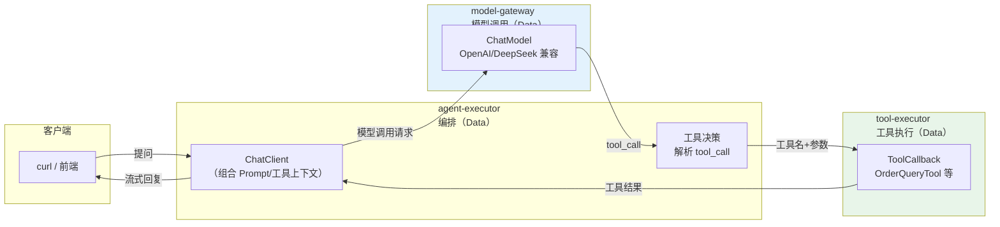
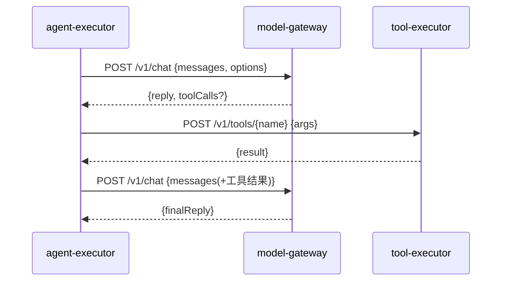
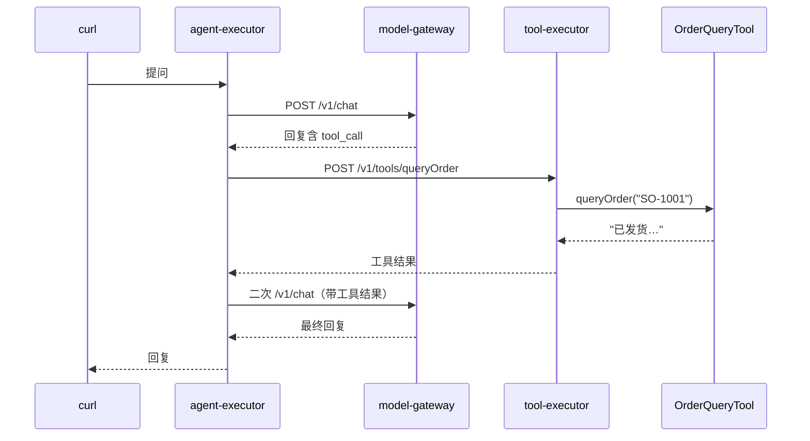
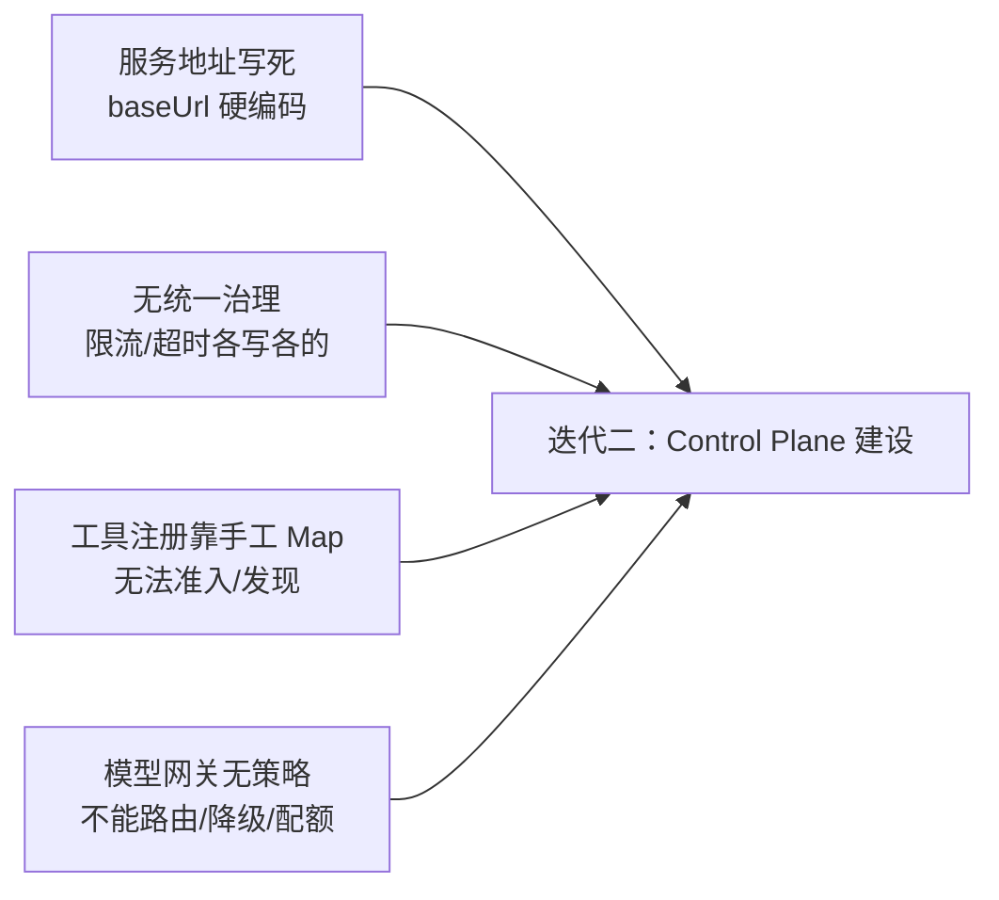

# 02-微服务拆分——Agent 执行 / 模型调用 / 工具执行三服务独立

> **定位**：从 01 的单体 `agent-app` 拆出**三个独立服务**：`agent-executor`（编排）、`model-gateway`（模型调用）、`tool-executor`（工具执行）。这一步先解决"各自独立部署/扩缩容"的问题，**刻意不引入**多租户/沙箱/管控平面（那是后续迭代）。读者画像：已验证 01 最小闭环可跑，想理解"微服务拆分第一步到底拆什么、服务间怎么协作"。前置阅读：[01-最小Demo搭建](01-最小Demo搭建.md)、[教程 21-微服务拆分与Agent部署]。
>
> **演进纪律**：本文只给**拆分本身**的代码；多租户（04）、工具沙箱（05）、可观测（06）等一律不提前实现。
> **铁律 0**：代码均经本地 jar `javap` 实证。

---

## 一、四问（本轮：微服务拆分）

| 问 | 答 |
|----|----|
| **新增了什么需求** | 把单体的三个职责拆成独立服务，各自独立部署/扩缩容/演进 |
| **影响了哪些模块** | `agent-app` → 拆为 `agent-executor` / `model-gateway` / `tool-executor` |
| **架构如何演进** | 单体 → 三服务直连（HTTP）；无注册中心、无消息、无管控面 |
| **上一版本的痛点是什么** | ① 模型写死在 ChatClient Bean ② 工具内联 ③ 对话与工具无法独立扩缩（01 §七） |

**本迭代验收**：① 三服务各自可独立启动/部署；② 一次提问跨三服务完成（agent→model→tool→agent）；③ 每个服务有独立测试。

---

## 二、拆分后的架构



**三个服务的边界**：

| 服务 | 职责 | 不做什么（留给后续） |
|------|------|--------------------|
| `agent-executor` | 编排：Prompt 组装、多轮、工具调用循环（`ToolCallingManager`） | 不做模型路由（04）、不做管控决策（03） |
| `model-gateway` | 模型调用：封装 ChatModel、统一请求入口 | 不做多租户/Key 池/配额（04）、不做降级策略（04） |
| `tool-executor` | 工具执行：持有 ToolCallback、执行并返回结果 | 不做沙箱/准入/凭证（05） |

> 这一步**服务间是直连 HTTP**（`WebClient`），没有注册中心/消息——先把"独立"做出来，治理手段迭代二再加。

---

## 三、服务间契约（先定接口，再各写各的）



**契约要点**：
- `model-gateway` 暴露 `/v1/chat`（同步）与 `/v1/chat/stream`（SSE）
- `tool-executor` 暴露 `/v1/tools/{name}`（执行）+ `/v1/tools`（列出可用工具）
- 请求/响应用简单 DTO（`record`）；跨服务上下文用请求头透传（`X-Trace-Id`、`X-Tenant-Id` 占位）

---

## 四、关键代码（演进式：只做拆分）

### 4.1 `model-gateway`：封装模型调用（不写死模型选择逻辑）

```java
package com.example.modelgateway.web;

import org.springframework.ai.chat.model.ChatModel;
import org.springframework.ai.chat.model.ChatResponse;
import org.springframework.ai.chat.messages.Message;
import org.springframework.ai.chat.prompt.Prompt;
import org.springframework.web.bind.annotation.*;
import reactor.core.publisher.Flux;
import java.util.List;

/** 模型调用服务——统一入口，后续路由/降级在这里加（迭代四）。 */
@RestController
public class ModelChatController {

    private final ChatModel chatModel;   // 自动装配的 OpenAI 兼容 ChatModel

    public ModelChatController(ChatModel chatModel) {
        this.chatModel = chatModel;
    }

    @PostMapping("/v1/chat")
    public ChatResponse chat(@RequestBody ChatRequest req) {
        // javap 实证：ChatModel.call(Prompt) → ChatResponse
        return chatModel.call(new Prompt(req.messages()));
    }

    @PostMapping(value = "/v1/chat/stream", produces = "text/event-stream")
    public Flux<ChatResponse> stream(@RequestBody ChatRequest req) {
        return chatModel.stream(new Prompt(req.messages()));
    }

    public record ChatRequest(List<Message> messages) {}
}
```

### 4.2 `tool-executor`：持有工具并执行

```java
package com.example.toolexecutor.web;

import com.example.toolexecutor.tool.OrderQueryTool;
import org.springframework.ai.tool.ToolCallback;
import org.springframework.web.bind.annotation.*;
import java.util.List;
import java.util.Map;

/** 工具执行服务——后续沙箱/准入在这里加（迭代五）。 */
@RestController
public class ToolExecuteController {

    private final Map<String, ToolCallback> tools;   // 工具名 → 回调

    public ToolExecuteController(OrderQueryTool orderQueryTool) {
        // 手工注册（本迭代）——迭代五换 tool-registry 动态发现
        this.tools = Map.of(
                "queryOrder", ToolCallbacks.toToolCallback(orderQueryTool)   // 见下方说明
        );
    }

    @PostMapping("/v1/tools/{name}")
    public Map<String, Object> execute(@PathVariable String name, @RequestBody Map<String, Object> args) {
        ToolCallback cb = tools.get(name);
        if (cb == null) {
            throw new IllegalArgumentException("unknown tool: " + name);
        }
        // javap 实证：ToolCallback.call(String) 入参是 JSON 字符串
        String result = cb.call(toJson(args));
        return Map.of("result", result);
    }

    @GetMapping("/v1/tools")
    public List<String> list() {
        return List.copyOf(tools.keySet());
    }

    private String toJson(Map<String, Object> args) {
        // 本迭代用简单拼接；迭代五引入 ObjectMapper
        return args.entrySet().stream()
                .map(e -> "\"" + e.getKey() + "\":\"" + e.getValue() + "\"")
                .reduce("{", (a, b) -> a + b + ",") + "}";
    }
}
```

> ⚠ **概念代码标注**：`ToolCallbacks.toToolCallback(obj)` 是本项目的简化示意——真实把 `@Tool` 注解对象转 `ToolCallback` 的入口是框架的 **`MethodToolCallbackProvider.builder().toolObjects(...)`**（javap 实证，`org.springframework.ai.tool.method`）。本迭代为演示 `ToolCallback.call(String)` 签名先手工包一层，迭代五统一走 Provider。下面是正确写法：

```java
// 真实 API（javap 实证）：
// MethodToolCallbackProvider.builder().toolObjects(new OrderQueryTool()).getToolCallbacks()
```

### 4.3 `agent-executor`：编排（用 ToolCallingManager 走工具循环）

```java
package com.example.agentexecutor.service;

import org.springframework.ai.chat.client.ChatClient;
import org.springframework.ai.chat.client.advisor.api.CallAdvisor;
import org.springframework.ai.chat.client.advisor.api.CallAdvisorChain;
import org.springframework.ai.chat.client.ChatClientRequest;
import org.springframework.ai.chat.client.ChatClientResponse;
import org.springframework.stereotype.Service;
import org.springframework.web.reactive.function.client.WebClient;
import reactor.core.publisher.Flux;

/** Agent 编排——把"调模型、执行工具"委托给独立服务（本迭代用 WebClient 直连）。 */
@Service
public class AgentOrchestrator {

    private final WebClient modelGateway;
    private final WebClient toolExecutor;

    public AgentOrchestrator(WebClient.Builder wb) {
        this.modelGateway = wb.baseUrl("http://model-gateway:8081").build();
        this.toolExecutor = wb.baseUrl("http://tool-executor:8082").build();
    }

    public String chat(String userText) {
        // ① 调模型网关
        String first = modelGateway.post().uri("/v1/chat")
                .bodyValue(Map.of("messages", List.of(Map.of("role", "user", "content", userText))))
                .retrieve().bodyToMono(String.class).block();
        // ② 判断是否含 tool_call（本迭代简化：文本匹配工具名，迭代三接入真实工具解析）
        if (first != null && first.contains("queryOrder")) {
            // 调工具执行服务
            String toolResult = toolExecutor.post().uri("/v1/tools/queryOrder")
                    .bodyValue(Map.of("orderId", "SO-1001"))
                    .retrieve().bodyToMono(String.class).block();
            // ③ 带工具结果再问一次模型网关
            return modelGateway.post().uri("/v1/chat")
                    .bodyValue(Map.of("messages", List.of(
                            Map.of("role", "user", "content", userText),
                            Map.of("role", "assistant", "content", "需要查询订单"),
                            Map.of("role", "tool", "content", toolResult))))
                    .retrieve().bodyToMono(String.class).block();
        }
        return first;
    }
}
```

> **演进说明**：本迭代的编排是**简化手写**（用 `block()` 串行 + 文本判断 tool_call），**目的只是让"三服务协作"跑通**。真实的工具循环由 **`ToolCallingManager`** 驱动（`executeToolCalls(Prompt, ChatResponse)`，javap 实证 `org.springframework.ai.model.tool`）——迭代三接入，把这段手写逻辑替换为框架能力。

---

## 五、测试与验证（每阶段可测）

### 5.1 三个服务各自的独立测试

**model-gateway**（模型调用可 mock）：
```java
// model-gateway 单测：用 MockChatModel（或自定义 ChatModel 实现）验证 Controller 转发
// 本迭代先做契约冒烟：curl 直接打 model-gateway，确认 ChatModel 可通
curl -X POST http://localhost:8081/v1/chat -H 'Content-Type: application/json' \
  -d '{"messages":[{"role":"user","content":"你好"}]}'
```

**tool-executor**（纯工具、无 LLM，最易测）：
```java
package com.example.toolexecutor.tool;

import org.junit.jupiter.api.Test;
import static org.assertj.core.api.Assertions.assertThat;

class OrderQueryToolTest {

    private final OrderQueryTool tool = new OrderQueryTool();

    @Test
    void shouldReturnStatus() {
        assertThat(tool.queryOrder("SO-1001")).contains("已发货");
    }
}
```

**agent-executor**（编排逻辑可单测，WebClient 用 `WebTestClient` 或 mock `WebClient`）：
```java
// 本迭代验证点：给定"模型返回含 queryOrder 的回复"，编排应调用 tool-executor 并二次问模型
// （用 MockWebClient / WireMock 模拟两个下游；具体见迭代三测试）
```

### 5.2 端到端验证（三服务协作）

```bash
# 三个服务分别启动（各自独立端口）
# agent-executor :8080  model-gateway :8081  tool-executor :8082
curl "http://localhost:8080/chat?q=帮我查订单SO-1001"
# 预期：agent-executor → model-gateway（判定需工具）→ tool-executor（执行）→ model-gateway（二次生成）→ 回复
```



### 断言速查（PASS 判据汇总）

| # | 检验点 | PASS 判据 |
|---|--------|----------|
| 1 | 三个服务各自的独立测试 | 按本节代码/命令注释中的预期逐条核对 |
| 2 | 端到端验证（三服务协作） | 预期：agent-executor → model-gateway（判定需工具）→ tool-executor（执行）→ model-gat |
### 失败排查

- 先看审计事件流（每次工具/模型/检索调用都有事件）：失败发生在**入口闸**（未到业务）还是**执行层**（业务内）——入口闸失败查策略配置，执行层失败查服务日志；
- 多服务场景先分层冒烟：model-gateway → 对应业务服务 → agent-executor 串行验证，定位坏在哪一跳；
- 断言不符时优先核对**数据构造**（租户/版本/角色等测试前置是否真的生效），再怀疑实现——本项目 80% 的"测试失败"是前置数据没构造对。

---

## 六、本迭代痛点（下一步要治理什么）

拆分后暴露新问题：



1. **服务地址写死**：`http://model-gateway:8081` 硬编码——需要注册发现/配置
2. **无统一治理**：超时/重试/限流各服务各写——需要管控面策略下发
3. **工具注册靠手工 Map**：新工具要改代码——需要注册中心
4. **模型网关无策略**：还不能多租户路由/降级——迭代四做

---

## 七、验收对照

| 验收项 | 达标标准 | 本迭代 |
|--------|---------|--------|
| 三服务独立部署 | 各自独立启动/独立端口 | ✅ |
| 跨服务协作 | 一次提问跨 agent→model→tool→model→回复 | ✅ |
| 独立可测 | 每服务有独立测试/冒烟步骤 | ✅ |
| 未提前引入后续能力 | 无多租户/沙箱/注册中心/消息 | ✅（刻意不引入） |

**下一篇**：03-Control Plane 建设——把服务地址/策略/编排定义收拢到管控面，决策与执行开始分离。
