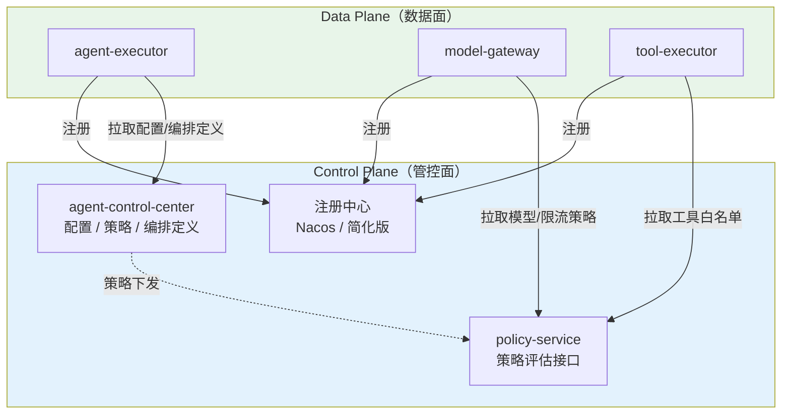
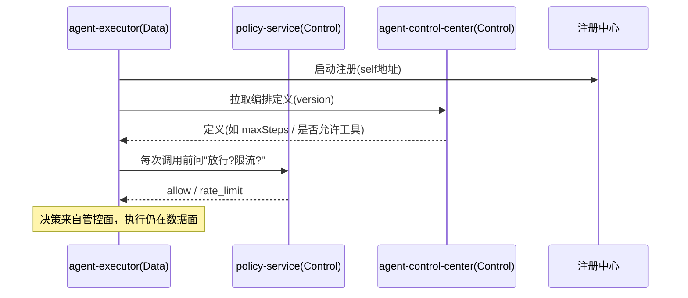
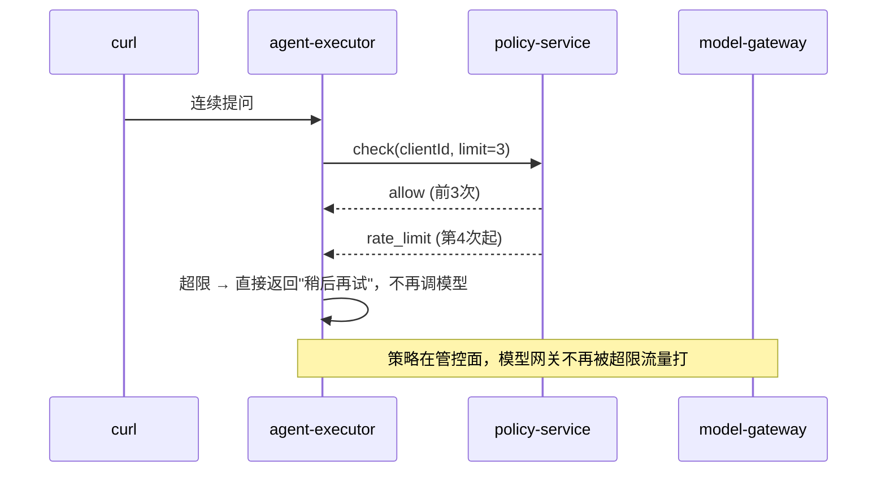
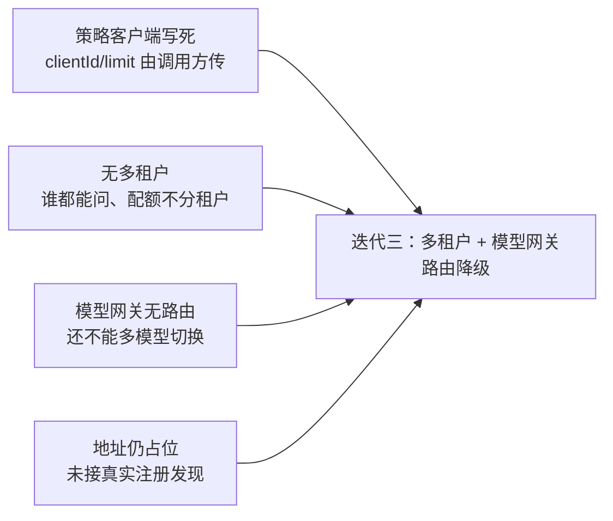

# 03-迭代二：Control Plane 建设——决策与执行分离落地

> **定位**：本迭代是项目**管控分离的第一次真正落地**：引入 `agent-control-center`（管控中心）与 `policy-service`（策略引擎），把"服务地址、策略、编排定义"从各服务里**收拢到管控面**，数据面通过"拉取/回调"获取决策，不再各自硬编码。读者画像：理解三服务拆分、想看到"管控面"从无到有的读者。前置阅读：[02-迭代一-微服务拆分](02-迭代一-微服务拆分.md)、[教程 20-管控分离架构]。
>
> **演进纪律**：本迭代只建管控面雏形（配置/策略/编排定义 + 注册发现）；多租户隔离（04）、工具准入沙箱（05）不提前实现。
> **铁律 0**：代码均经本地 jar `javap` 实证。

---

## 一、四问（本轮：Control Plane 建设）

| 问 | 答 |
|----|----|
| **新增了什么需求** | ① 服务注册与发现（不再硬编码地址）② 策略/配置/编排定义集中管理并可下发 ③ 数据面在决策点回调管控面 |
| **影响了哪些模块** | 新增 `agent-control-center`、`policy-service`；改造三服务（去掉硬编码地址、接入策略回调） |
| **架构如何演进** | 三服务直连 → 服务经注册发现互连 + 决策点回调管控面 |
| **上一版本的痛点是什么** | ① 服务地址写死 ② 限流/超时各写各的 ③ 编排逻辑埋在业务代码里（02 §六） |

**本迭代验收**：① 服务启动后自动注册、地址可动态获取；② 一条"限流策略"从管控面下发、数据面执行生效；③ 策略变更无需重启数据面。

---

## 二、管控面架构（雏形）



**本迭代的三个管控面组件**：

| 组件 | 职责 | 不做什么 |
|------|------|---------|
| `agent-control-center` | 配置/编排定义存储与版本化、下发 | 不做多租户（04）、不做灰度（09） |
| `policy-service` | 策略评估：限流/熔断/超时阈值 | 不做审批判定（07）、不做预算（09） |
| 注册中心 | 服务注册/发现 | 用简化实现（内存 Map 或 Nacos），本迭代演示为主 |

---

## 三、决策与执行分离的落地方式



**核心不变式**：数据面**不持有决策逻辑**——"允不允许、限不限流、用什么超时"都由管控面回答。数据面只关心"怎么执行"。

---

## 四、关键代码（演进式）

### 4.1 `policy-service`：一个可下发的限流策略

```java
package com.example.policyservice;

import org.springframework.data.redis.core.ReactiveStringRedisTemplate;
import org.springframework.stereotype.Service;
import org.springframework.web.bind.annotation.*;
import reactor.core.publisher.Mono;
import java.time.Duration;

/** 策略引擎（雏形）——本迭代只做"限流"一条策略，从配置下发。 */
@RestController
@RequestMapping("/v1/policy")
public class PolicyController {

    private final ReactiveStringRedisTemplate redis;   // 需引入 spring-boot-starter-data-redis-reactive（本地已实证存在）

    public PolicyController(ReactiveStringRedisTemplate redis) {
        this.redis = redis;
    }

    /** 滑动窗口限流：每分钟 N 次。返回 allow / rate_limit。 */
    @PostMapping("/check")
    public Mono<Decision> check(@RequestBody CheckRequest req) {
        String key = "rate:" + req.clientId();
        return redis.opsForValue().increment(key)
                .flatMap(count -> {
                    if (count == 1) {
                        return redis.expire(key, Duration.ofMinutes(1)).thenReturn(Decision.allow());
                    }
                    return Mono.just(count > req.limit() ? Decision.rateLimited() : Decision.allow());
                });
    }

    public record CheckRequest(String clientId, int limit) {}
    public record Decision(String action) {
        static Decision allow() { return new Decision("allow"); }
        static Decision rateLimited() { return new Decision("rate_limit"); }
    }
}
```

> **演进说明**：本迭代限流策略的 `limit` 由请求方传（演示）；迭代四由 `agent-control-center` 下发、策略**版本化**并支持回滚。

### 4.2 `agent-control-center`：编排定义（版本化，可下发）

```java
package com.example.agentcontrol;

import org.springframework.jdbc.core.JdbcTemplate;
import org.springframework.web.bind.annotation.*;
import java.util.List;

/** 管控中心（雏形）——存编排定义（版本化），数据面拉取。 */
@RestController
@RequestMapping("/v1/definitions")
public class DefinitionController {

    private final JdbcTemplate jdbc;   // 需 spring-boot-starter-jdbc

    public DefinitionController(JdbcTemplate jdbc) {
        this.jdbc = jdbc;
    }

    @GetMapping("/{name}/latest")
    public Definition latest(@PathVariable String name) {
        return jdbc.queryForObject(
                "SELECT name, version, content FROM agent_definition WHERE name=? ORDER BY version DESC LIMIT 1",
                (rs, i) -> new Definition(rs.getString("name"), rs.getInt("version"), rs.getString("content")),
                name);
    }

    @PostMapping("/{name}")
    public void publish(@PathVariable String name, @RequestBody String content) {
        jdbc.update(
                "INSERT INTO agent_definition(name, version, content) VALUES (?, (SELECT COALESCE(MAX(version),0)+1 FROM agent_definition WHERE name=?), ?)",
                name, name, content);
    }

    public record Definition(String name, int version, String content) {}
}
```

```sql
-- 建表（管控面存储）
CREATE TABLE agent_definition (
    name    text NOT NULL,
    version int  NOT NULL,
    content text NOT NULL,
    PRIMARY KEY (name, version)
);
```

### 4.3 数据面接入：`model-gateway` 在调用前回调策略

```java
package com.example.modelgateway.config;

import org.springframework.web.reactive.function.client.WebClient;
import org.springframework.stereotype.Component;
import reactor.core.publisher.Mono;

/** 决策回调客户端——每次模型调用前问管控面是否放行。 */
@Component
public class PolicyClient {

    private final WebClient policyService;

    public PolicyClient(WebClient.Builder wb) {
        // 地址从注册中心获取（本迭代先占位；迭代三接真实注册发现）
        this.policyService = wb.baseUrl("http://policy-service:8090").build();
    }

    public Mono<Boolean> allow(String clientId, int limit) {
        return policyService.post().uri("/v1/policy/check")
                .bodyValue(Map.of("clientId", clientId, "limit", limit))
                .retrieve().bodyToMono(PolicyClient.Decision.class)
                .map(d -> "allow".equals(d.action()));
    }

    public record Decision(String action) {}
}
```

> **演进说明**：本迭代 `WebClient.block()`/地址占位仅演示回调用法；迭代四统一用 Reactor 链 + 注册中心动态解析。

---

## 五、测试与验证

### 5.1 策略服务测试（Redis 可测）

```java
// policy-service：滑动窗口限流逻辑测试
// 第 1 次调用 → allow；超过 limit → rate_limit
// （用 embedded redis 或 mock ReactiveStringRedisTemplate；本迭代先手工 curl 验证）
curl -X POST http://localhost:8090/v1/policy/check -H 'Content-Type: application/json' \
  -d '{"clientId":"tenantA","limit":3}'
```

### 5.2 管控中心测试（定义版本化）

```bash
# 发布 v1 定义
curl -X POST http://localhost:8085/v1/definitions/agentA -d '{"maxSteps":3,"allowTools":true}'
# 再发布 v2，数据面拉取到 v2（版本号递增）
curl http://localhost:8085/v1/definitions/agentA/latest
```

### 5.3 端到端：策略生效



### 断言速查（PASS 判据汇总）

| # | 检验点 | PASS 判据 |
|---|--------|----------|
| 1 | 策略服务测试（Redis 可测） | 按本节代码/命令注释中的预期逐条核对 |
| 2 | 管控中心测试（定义版本化） | 按本节代码/命令注释中的预期逐条核对 |
| 3 | 端到端：策略生效 | 按本节代码/命令注释中的预期逐条核对 |
### 失败排查

- 先看审计事件流（每次工具/模型/检索调用都有事件）：失败发生在**入口闸**（未到业务）还是**执行层**（业务内）——入口闸失败查策略配置，执行层失败查服务日志；
- 多服务场景先分层冒烟：model-gateway → 对应业务服务 → agent-executor 串行验证，定位坏在哪一跳；
- 断言不符时优先核对**数据构造**（租户/版本/角色等测试前置是否真的生效），再怀疑实现——本项目 80% 的"测试失败"是前置数据没构造对。

---

## 六、本迭代痛点（下一步）



1. **策略没绑定租户**：`clientId` 是调用方自己传的，可伪造——需要租户身份从上下文注入
2. **模型网关仍单模型**：不能按租户/业务路由多个模型——迭代三做
3. **注册发现未落地**：地址还占位——迭代三补

---

## 七、验收对照

| 验收项 | 达标标准 | 本迭代 |
|--------|---------|--------|
| 管控面可下发 | 策略/定义存管控面、数据面拉取生效 | ✅ |
| 决策与执行分离 | 数据面不持有决策逻辑，回调管控面 | ✅ |
| 版本化 | 编排定义版本递增、可回滚 | ✅ |
| 未提前引入后续能力 | 无多租户隔离/模型路由/沙箱 | ✅（刻意不引入） |

**下一篇**：04-迭代三-多租户与模型网关——租户隔离落地 + 模型路由/降级/Key 池/配额。
