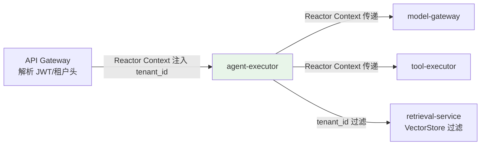
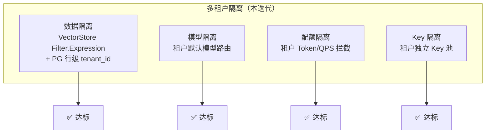
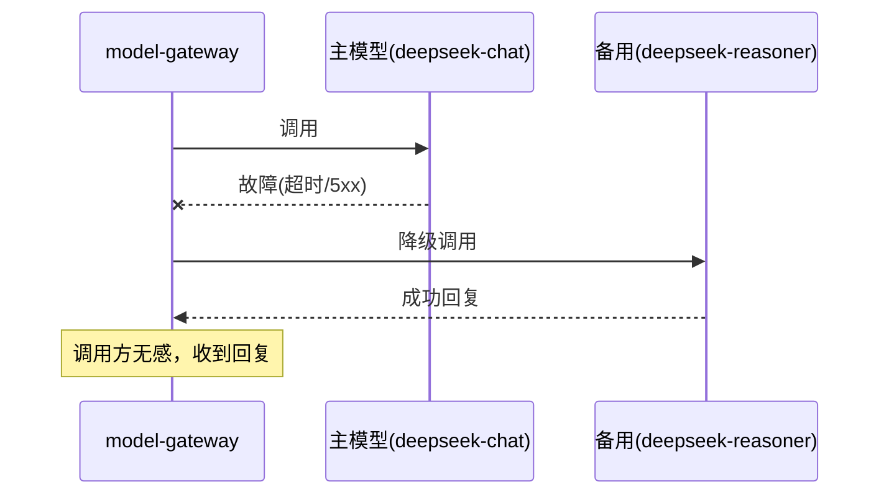
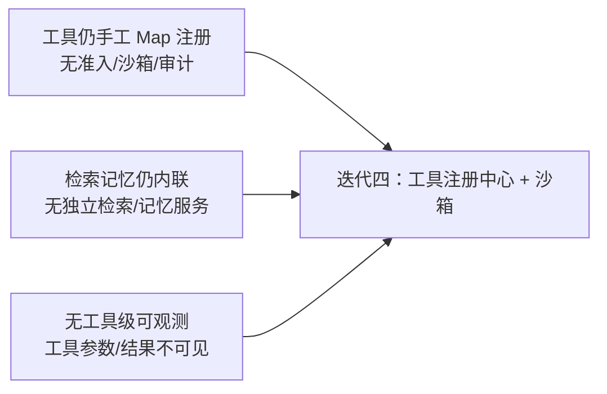

# 04-多租户与模型网关——租户隔离 + 路由降级 + Key 池 + 配额

> **定位**：本迭代让平台具备**多租户 SaaS 能力**与**多模型治理**：租户上下文经 Reactor Context 贯穿（WebFlux 铁律，禁 ThreadLocal）；`model-gateway` 从"单模型直连"升级为**路由/降级/Key 池/配额**的统一入口；数据访问按租户过滤（`tenant_id`）。读者画像：理解管控面雏形，想落地多租户与多模型的读者。前置阅读：[03-ControlPlane建设](03-ControlPlane建设.md)、[教程 26-多租户隔离与资源治理]、[教程 32-模型路由与降级]。
>
> **演进纪律**：本迭代做多租户 + 模型网关；工具沙箱（05）、全链路可观测（06）不提前实现。
> **铁律 0**：代码均经本地 jar `javap` 实证。

---

## 一、四问（本轮：多租户与模型网关）

| 问 | 答 |
|----|----|
| **新增了什么需求** | ① 租户上下文贯穿与数据/配额/模型隔离 ② 模型网关多模型路由/降级/Key 池/配额/成本归因 ③ 策略绑定租户（不再由调用方自报） |
| **影响了哪些模块** | 全部数据面服务接入租户上下文；`model-gateway` 重构为路由网关；`policy-service` 绑定租户 |
| **架构如何演进** | 管控面雏形 → 租户化 + 模型网关成为真正的"控制点" |
| **上一版本的痛点是什么** | ① 策略 `clientId` 由调用方传（可伪造）② 模型单一直连 ③ 无租户隔离（03 §六） |

**本迭代验收**：① 租户 A/B 数据互不可见（`tenant_id` 过滤）② 模型可路由（按租户配置默认模型）③ 超限/主模型故障自动降级 ④ 配额按租户拦截 ⑤ 成本可归因到租户。

---

## 二、租户上下文贯穿（Reactor Context）



**为什么用 Reactor Context**：WebFlux 事件循环线程复用，ThreadLocal 必然串号/丢失（WebFlux 铁律）。租户上下文经 `contextWrite` 注入、`deferContextual` 读取，随响应式调用链自然传播。

```java
// 网关层：解析租户头 → 注入 Reactor Context（真实 API：contextWrite）
import reactor.core.publisher.Mono;
import reactor.util.context.Context;

public Mono<String> handle(String tenantId, String q) {
    return Mono.deferContextual(ctx -> chat(q))
            .contextWrite(Context.of("tenant_id", tenantId));   // Reactor Context 注入
}
```

---

## 三、模型网关：路由 / 降级 / Key 池 / 配额

### 3.1 模型路由（按租户/业务选模型）

```java
package com.example.modelgateway.routing;

import org.springframework.ai.openai.OpenAiChatOptions;
import org.springframework.stereotype.Component;
import java.util.Map;

/** 路由决策——按租户默认模型 + 业务线覆盖。 */
@Component
public class ModelRouter {

    // 租户 → 默认模型（真实模型名来自配置）
    private final Map<String, String> tenantDefault = Map.of(
            "tenantA", "deepseek-chat",
            "tenantB", "deepseek-reasoner"
    );

    public String route(String tenantId, String businessLine) {
        // 业务线可覆盖（本迭代演示租户默认；业务覆盖迭代九做）
        return tenantDefault.getOrDefault(tenantId, "deepseek-chat");
    }
}
```

### 3.2 Key 池（多 API Key 轮询 + 配额感知）

```java
package com.example.modelgateway.keypool;

import java.util.List;
import java.util.concurrent.atomic.AtomicInteger;

/** Key 池——多 Key 轮询，避免单 Key 被限流打爆。 */
public class ApiKeyPool {

    private final List<String> keys;
    private final AtomicInteger cursor = new AtomicInteger(0);

    public ApiKeyPool(List<String> keys) {
        this.keys = keys;
    }

    public String next() {
        return keys.get(Math.floorMod(cursor.getAndIncrement(), keys.size()));
    }
}
```

### 3.3 降级（主模型故障 → 备用模型）

```java
package com.example.modelgateway.fallback;

import org.springframework.ai.chat.model.ChatModel;
import org.springframework.ai.chat.prompt.Prompt;
import org.springframework.stereotype.Component;

/** 降级链：主模型失败 → 备用模型。 */
@Component
public class ModelFallback {

    private final ChatModel primary;
    private final ChatModel backup;   // 备用（可配 low-cost 模型）

    public ModelFallback(ChatModel primary, ChatModel backup) {
        this.primary = primary;
        this.backup = backup;
    }

    public String callWithFallback(Prompt prompt) {
        try {
            return primary.call(prompt).getResult().getOutput().getText();
        } catch (Exception e) {
            // 主模型故障 → 降级到备用（真实生产用 Resilience4j 熔断，见迭代九）
            return backup.call(prompt).getResult().getOutput().getText();
        }
    }
}
```

### 3.4 配额拦截（按租户预算，调用前检查）

```java
// policy-service 扩展：按租户的 Token/QPS 配额（演进 03 的滑动窗口）
// 本迭代验收：租户超配 → 模型网关直接拒绝，不调 LLM
```

> **演进说明**：本迭代降级是 `try/catch` 直连；迭代九换 Resilience4j `CircuitBreaker` + `retryWhen`（`io.github.resilience4j:resilience4j-spring-boot3`，第三方需引入）。

---

## 四、多租户数据隔离（VectorStore 过滤）

```java
// retrieval-service：检索按租户过滤——真实 API：SearchRequest.filterExpression + Filter.Expression
import org.springframework.ai.vectorstore.SearchRequest;
import org.springframework.ai.vectorstore.filter.FilterExpressionBuilder;
import org.springframework.ai.vectorstore.VectorStore;

public List<Document> search(VectorStore vs, String tenantId, String query) {
    // javap 实证：FilterExpressionBuilder 需 new；eq 非静态；SearchRequest.builder().filterExpression(...)
    FilterExpressionBuilder b = new FilterExpressionBuilder();
    return vs.similaritySearch(SearchRequest.builder()
            .query(query)
            .topK(5)
            .filterExpression(b.eq("tenant_id", tenantId).build())
            .build());
}
```

**隔离矩阵**：



---

## 五、测试与验证

### 5.1 租户隔离测试（数据不可互见）

```java
// retrieval-service 测试：tenantA 检索不能命中 tenantB 的文档
// 构造：插入 doc(tenant_id=A)、doc(tenant_id=B)，tenantA 查询只应返回 A
```

### 5.2 模型路由测试

```bash
# tenantA 提问 → model-gateway 路由到 deepseek-chat；tenantB → deepseek-reasoner
curl -X POST http://localhost:8081/v1/chat -H 'X-Tenant-Id: tenantA' \
  -d '{"messages":[{"role":"user","content":"你好"}]}'
# 验证模型网关日志：model=deepseek-chat
```

### 5.3 降级测试（主模型故意不可用）



### 5.4 配额测试

```bash
# tenantA 配额 100 token/天，用满后再提问 → 应被 429/拒绝，不再调 LLM
```

### 断言速查（PASS 判据汇总）

| # | 检验点 | PASS 判据 |
|---|--------|----------|
| 1 | 租户隔离测试（数据不可互见） | retrieval-service 测试：tenantA 检索不能命中 tenantB 的文档 |
| 2 | 模型路由测试 | 按本节代码/命令注释中的预期逐条核对 |
| 3 | 降级测试（主模型故意不可用） | 按本节代码/命令注释中的预期逐条核对 |
| 4 | 配额测试 | tenantA 配额 100 token/天，用满后再提问 → 应被 429/拒绝，不再调 LLM |
### 失败排查

- 先看审计事件流（每次工具/模型/检索调用都有事件）：失败发生在**入口闸**（未到业务）还是**执行层**（业务内）——入口闸失败查策略配置，执行层失败查服务日志；
- 多服务场景先分层冒烟：model-gateway → 对应业务服务 → agent-executor 串行验证，定位坏在哪一跳；
- 断言不符时优先核对**数据构造**（租户/版本/角色等测试前置是否真的生效），再怀疑实现——本项目 80% 的"测试失败"是前置数据没构造对。

---

## 六、本迭代痛点（下一步）



1. **工具无治理**：工具注册还是手工 Map，无准入/沙箱/审计（05 做）
2. **检索记忆未服务化**：RAG、记忆还埋在 Agent 执行器（06 做）
3. **工具调用不可观测**：工具参数/结果/耗时没有结构化记录（06 做）

---

## 七、验收对照

| 验收项 | 达标标准 | 本迭代 |
|--------|---------|--------|
| 租户数据隔离 | tenantA/B 检索互不可见 | ✅ |
| 模型路由 | 按租户默认模型生效 | ✅ |
| 降级 | 主模型故障自动切备用 | ✅ |
| 配额 | 超配拒绝、不调 LLM | ✅ |
| Key 池 | 多 Key 轮询 | ✅ |
| 未提前引入后续能力 | 无工具沙箱/独立检索/全链路观测 | ✅ |

**下一篇**：05-工具注册中心与沙箱执行——工具全生命周期治理。
