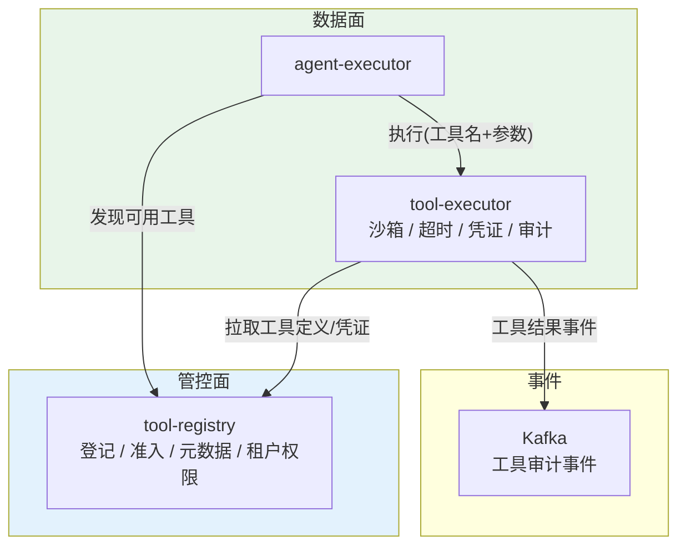
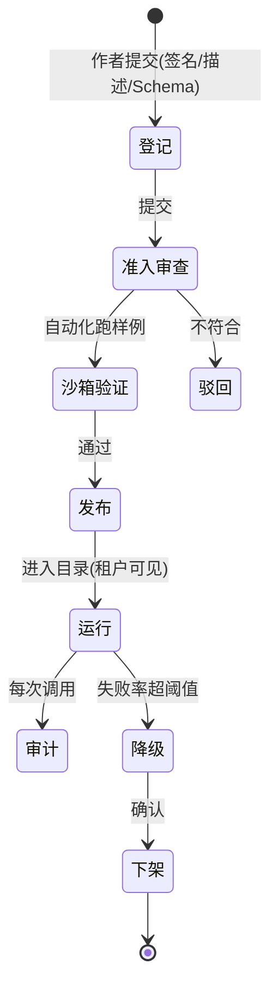
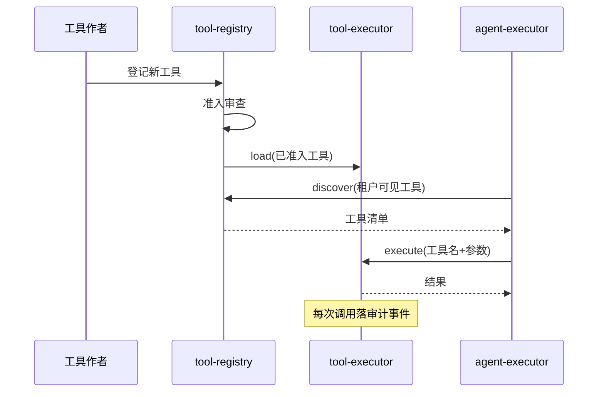
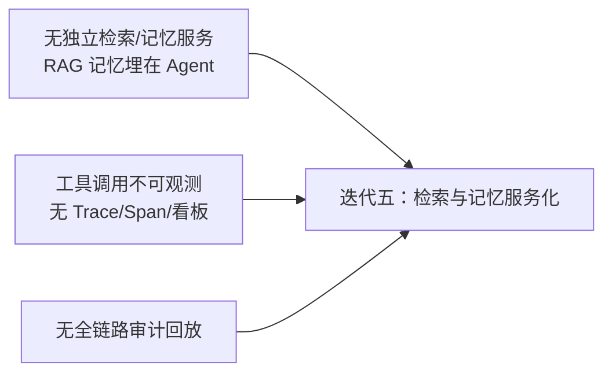

# 05-迭代四：工具注册中心与沙箱执行——工具全生命周期治理

> **定位**：本迭代把"工具"从手工 Map 提升为**全生命周期治理**：`tool-registry`（准入/发现/元数据/租户权限）+ `tool-executor`（沙箱隔离/超时/资源限额/凭证注入/审计事件）。这是平台**最高风险面**（工具执行不可信代码）的关键治理。读者画像：理解多租户与模型网关，想落地"工具也能被治理"的读者。前置阅读：[04-迭代三-多租户与模型网关](04-迭代三-多租户与模型网关.md)、[教程 23-工具执行可观测与审计]。
>
> **演进纪律**：本迭代做工具治理；全链路可观测（06）、HITL 审批（07）不提前实现。
> **铁律 0**：代码均经本地 jar `javap` 实证。

---

## 一、四问（本轮：工具注册与沙箱）

| 问 | 答 |
|----|----|
| **新增了什么需求** | ① 工具注册中心（登记/准入/发现/元数据/租户权限）② 沙箱执行（隔离/超时/资源限额/凭证注入）③ 工具审计事件 |
| **影响了哪些模块** | 新增 `tool-registry`；重构 `tool-executor`（从手工 Map → 动态加载 + 沙箱） |
| **架构如何演进** | 工具内联/手工注册 → 注册中心统一治理 + 隔离执行 |
| **上一版本的痛点是什么** | ① 工具靠手工 Map，无准入/发现 ② 工具无沙箱/超时/凭证管理 ③ 工具调用无审计（04 §六） |

**本迭代验收**：① 新工具登记→准入→发布后即可被 Agent 发现使用 ② 工具执行有超时/资源限额 ③ 凭证注入不回显 ④ 每次工具调用落审计事件 ⑤ 未登记工具无法执行。

---

## 二、工具治理架构



---

## 三、工具生命周期状态机



---

## 四、关键代码（演进式）

### 4.1 `tool-registry`：登记与发现（元数据 + 租户权限）

```java
package com.example.toolregistry;

import org.springframework.jdbc.core.JdbcTemplate;
import org.springframework.web.bind.annotation.*;
import java.util.List;

/** 工具注册中心——登记/准入/元数据/租户可见性。 */
@RestController
@RequestMapping("/v1/tools")
public class ToolRegistryController {

    private final JdbcTemplate jdbc;

    public ToolRegistryController(JdbcTemplate jdbc) {
        this.jdbc = jdbc;
    }

    /** 登记（进入准入审查） */
    @PostMapping
    public void register(@RequestBody ToolMeta meta) {
        jdbc.update(
                "INSERT INTO tool(name, description, input_schema, owner, status) VALUES (?,?,?,?, 'REVIEW')",
                meta.name(), meta.description(), meta.inputSchema(), meta.owner());
    }

    /** 准入通过 → 发布 */
    @PostMapping("/{name}/approve")
    public void approve(@PathVariable String name) {
        jdbc.update("UPDATE tool SET status='PUBLISHED' WHERE name=?", name);
    }

    /** Agent 发现：某租户可见的已发布工具 */
    @GetMapping
    public List<ToolMeta> discover(@RequestHeader("X-Tenant-Id") String tenantId) {
        return jdbc.query(
                "SELECT name, description, input_schema FROM tool WHERE status='PUBLISHED' AND (tenant_id IS NULL OR tenant_id=?)",
                (rs, i) -> new ToolMeta(rs.getString("name"), rs.getString("description"), rs.getString("input_schema"), ""),
                tenantId);
    }

    public record ToolMeta(String name, String description, String inputSchema, String owner) {}
}
```

### 4.2 `tool-executor`：沙箱执行（超时 + 资源限额 + 凭证注入 + 审计事件）

```java
package com.example.toolexecutor.exec;

import org.springframework.ai.tool.ToolCallback;
import org.springframework.ai.tool.method.MethodToolCallbackProvider;
import org.springframework.stereotype.Component;
import java.time.Duration;
import java.util.Map;
import java.util.concurrent.ConcurrentHashMap;

/** 沙箱执行器——工具超时/限额/凭证/审计统一在这里。 */
@Component
public class SandboxToolExecutor {

    // 工具名 → 已准入的 ToolCallback（从 tool-registry 拉取，动态构建）
    private final Map<String, ToolCallback> tools = new ConcurrentHashMap<>();

    /** 加载一个已准入的工具（真实 API：MethodToolCallbackProvider，javap 实证） */
    public void load(String toolName, Object toolObject) {
        ToolCallback cb = MethodToolCallbackProvider.builder()
                .toolObjects(toolObject)
                .build()
                .getToolCallbacks()[0];
        tools.put(toolName, cb);
    }

    /** 执行：超时 + 凭证注入 + 审计事件。 */
    public Map<String, Object> execute(String toolName, String argsJson, Map<String, String> credentials) {
        ToolCallback cb = tools.get(toolName);
        if (cb == null) {
            throw new IllegalArgumentException("未准入工具: " + toolName);
        }
        long start = System.nanoTime();
        try {
            // 凭证注入：工具通过 ToolContext 读取（本迭代先经调用方传入，不落日志）
            String result = cb.call(argsJson);
            audit(toolName, argsJson, result, start, null);   // 审计事件
            return Map.of("result", result);
        } catch (Exception e) {
            audit(toolName, argsJson, null, start, e.getMessage());
            throw e;
        }
    }

    /** 审计事件 → Kafka（演进 06 接入正式事件流） */
    private void audit(String tool, String args, String result, long start, String err) {
        long ms = (System.nanoTime() - start) / 1_000_000;
        System.out.printf("[TOOL_AUDIT] name=%s ms=%d err=%s%n", tool, ms, err);   // 本迭代 stdout 占位
    }
}
```

> **演进说明**：本迭代沙箱是"**逻辑沙箱**"（超时/限额/凭证由执行器控制），真隔离（进程/容器/WASM）在部署层；凭证经入参传入（**不回显、不落日志**），迭代七接 Vault。**超时强制**用 `CompletableFuture.get(timeout)`（迭代六补全）；本迭代以"未登记即拒绝 + 审计事件"为验收核心。

### 4.3 Agent 侧：工具发现 + 执行委托

```java
// agent-executor：不再手工 Map——从 tool-registry 发现，调 tool-executor 执行
// 本迭代核心：Agent 拿到的工具名来自注册中心，执行走沙箱服务
```

---

## 五、工具全生命周期可见（登记→准入→沙箱→执行，全程透明）

> 过程可见性是工业级标配。中台治理价值的前提是"看得见"——工具从登记到执行的**每个阶段**要发可见事件，用户（作者/审计/运维）各自看到该看的。

| 阶段 | 可见性事件 | 使用者看到 |
|------|-----------|-----------|
| 登记 | ToolRegistered{tool,作者,版本}` | "新工具已登记 v1" |
| 准入 | Admission{signature,评级}` | "通过签名校验，B 级" |
| 沙箱 | SandboxAlloc{受限能力集}` | "以只读+白名单出网执行" |
| 执行 | ToolCall{toolId,参数哈希,结果}` | "本次调用结果摘要" |
| 审计 | AuditTrail{callId,全参数}` | "完整参数/结果已归档" |

**四条纪律**：
1. **五阶段成链**：登记→准入→沙箱→执行→审计各发事件，`toolId` 贯穿全链——任何一次执行都能回溯"哪天登记、谁准入、走的沙箱策略"（与 05 审计库同源，一次埋点多端消费）。
2. **分层可见**：面向用户的只给 preview（参数哈希+结果摘要）；完整参数走审计库（可导出不可实时流）——兼顾透明与审计留存。
3. **沙箱决策可见**：为什么走沙箱/为何 bypass（防护与体验的决策）发事件，用户看到"该工具被限制在沙箱内"。
4. **跨服务**：这是一次跨越 model-gateway→tool-registry→tool-executor 的调用，事件带 traceId（05 已进全链路），端到端可见。

**验证**（叠加下文测试与验证）：登记一个工具→走完准入→沙箱执行一次→从审计库反查全链（toolId 贯穿）；事件流含五阶段且 preview 截断、完整参数只在审计库。
## 六、测试与验证

### 6.1 未登记工具拒绝测试

```bash
# 工具未登记 → 直接拒绝
curl -X POST http://localhost:8082/v1/tools/hackTool -d '{}'
# 预期：异常"未准入工具"
```

### 6.2 工具生命周期测试



### 6.3 准入控制测试

```java
// 断言：REVIEW 状态的工具不可被 discover；PUBLISHED 才可见
```

### 断言速查（PASS 判据汇总）

| # | 检验点 | PASS 判据 |
|---|--------|----------|
| 1 | 未登记工具拒绝测试 | 工具未登记 → 直接拒绝 |
| 2 | 工具生命周期测试 | 按本节代码/命令注释中的预期逐条核对 |
| 3 | 准入控制测试 | 断言：REVIEW 状态的工具不可被 discover；PUBLISHED 才可见 |
### 失败排查

- 先看审计事件流（每次工具/模型/检索调用都有事件）：失败发生在**入口闸**（未到业务）还是**执行层**（业务内）——入口闸失败查策略配置，执行层失败查服务日志；
- 多服务场景先分层冒烟：model-gateway → 对应业务服务 → agent-executor 串行验证，定位坏在哪一跳；
- 断言不符时优先核对**数据构造**（租户/版本/角色等测试前置是否真的生效），再怀疑实现——本项目 80% 的"测试失败"是前置数据没构造对。

---

## 七、本迭代痛点（下一步）



1. **RAG 与记忆未服务化**：检索、会话记忆还埋在 Agent 执行器（06 拆出）
2. **工具调用无全链路观测**：只有 stdout 审计，没有 Trace/Span（06 做）
3. **审计不可回放**：需要结构化审计流 + 回放（06/07）

---

## 八、验收对照

| 验收项 | 达标标准 | 本迭代 |
|--------|---------|--------|
| 工具全生命周期 | 登记→准入→发布→发现→执行→审计 | ✅ |
| 未登记拒绝 | 未准入工具不可执行 | ✅ |
| 凭证不回显 | 凭证不落日志 | ✅ |
| 工具可发现 | Agent 从注册中心发现，按租户过滤 | ✅ |
| 未提前引入后续能力 | 无独立检索/记忆服务、无全链路观测 | ✅ |

**下一篇**：06-迭代五-检索与记忆服务化——RAG 与记忆独立成服务。
