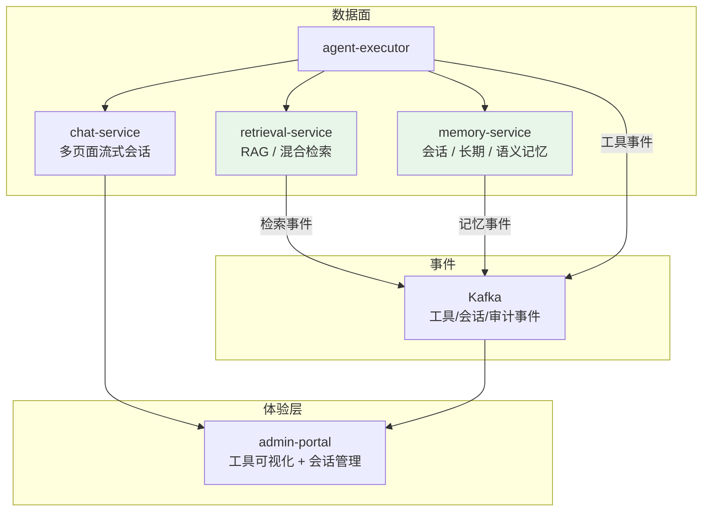
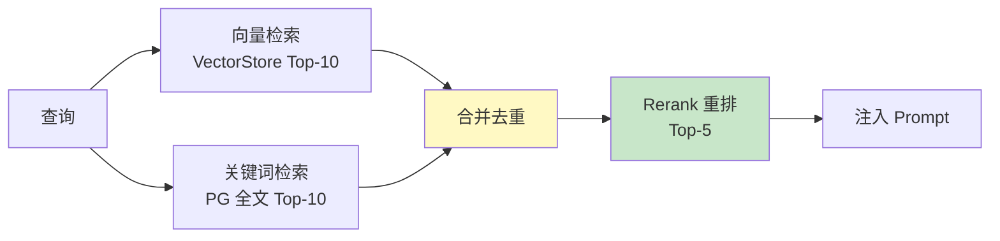
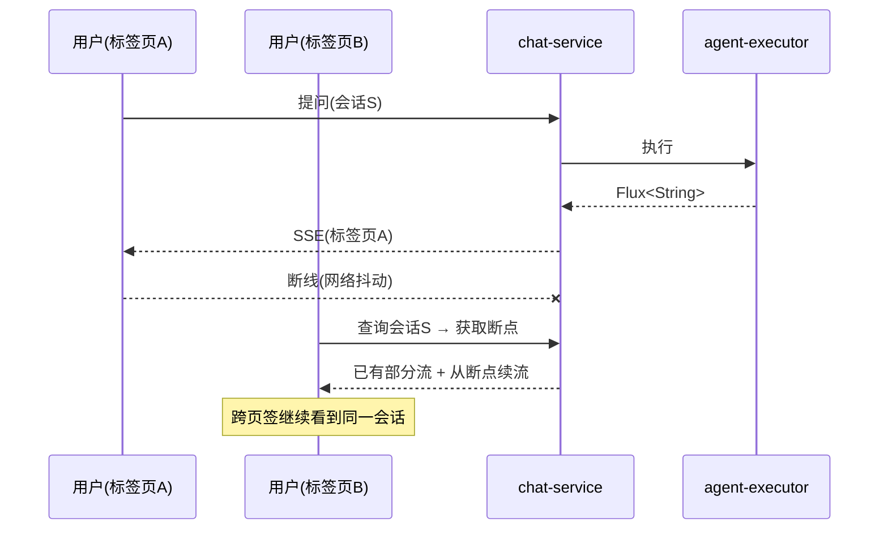
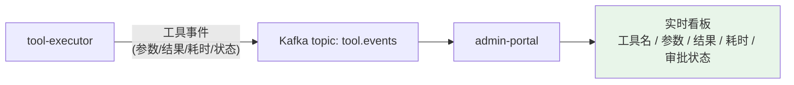
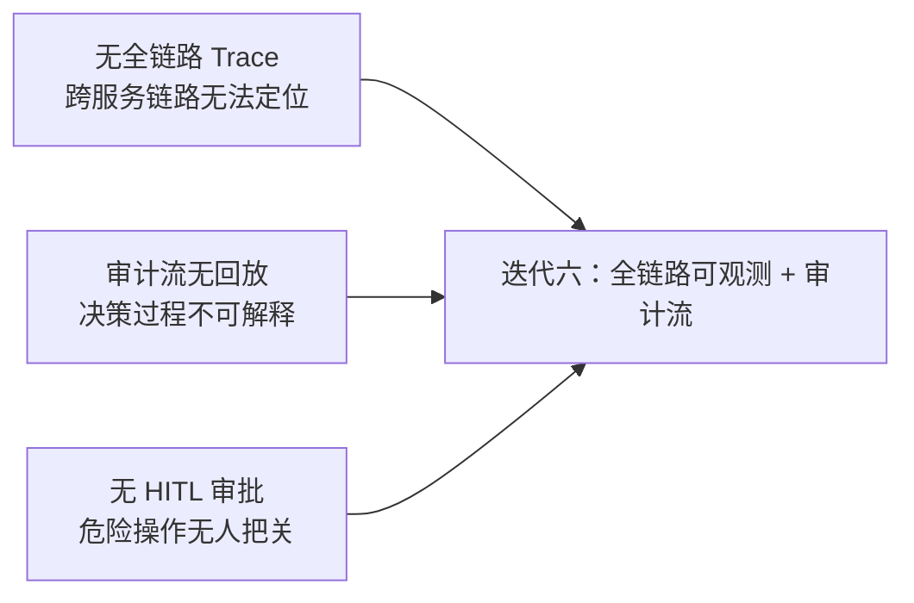

# 06-检索与记忆服务化——RAG / 记忆独立 + 多页面流式 + 工具可视化

> **定位**：本迭代把"上下文工程"从 Agent 执行器里**拆成独立服务**：`retrieval-service`（RAG/混合检索/向量库）、`memory-service`（会话/长期/语义记忆），并落地两项用户体验与可观测能力——**多页面流式输出**（跨页签 SSE/断线重连/中断恢复）与**工具调用可视化**（admin-portal 实时呈现工具参数/结果/耗时）。读者画像：理解工具治理，想把 RAG 与记忆服务化、并做出生产级交互体验的读者。前置阅读：[05-工具注册中心与沙箱执行](05-工具注册中心与沙箱执行.md)、[教程 78-高级RAG与AgenticRAG]、[教程 82-高级记忆架构]、[教程 57-多页面流式响应与会话管理]。
>
> **演进纪律**：本迭代做检索/记忆服务 + 流式/可视化；全链路 OTel（07）、HITL 审批（07）不提前实现。
> **铁律 0**：代码均经本地 jar `javap` 实证。

---

## 一、四问（本轮：检索与记忆服务化）

| 问 | 答 |
|----|----|
| **新增了什么需求** | ① `retrieval-service`（RAG 独立、混合检索、语料版本化）② `memory-service`（会话/长期/语义记忆，自研 `ChatMemoryRepository`）③ 多页面流式（跨页签 SSE/断线重连/中断恢复）④ 工具调用可视化（admin-portal） |
| **影响了哪些模块** | 新增 `retrieval-service`、`memory-service`；`chat-service` 接入流式会话管理；`admin-portal` 消费工具事件 |
| **架构如何演进** | 上下文工程内联 → 检索/记忆服务化 + 流式/可视化能力 |
| **上一版本的痛点是什么** | ① RAG 与记忆埋在 Agent（无法独立演进/扩缩）② 工具调用只有 stdout 无结构化事件 ③ 无多页面流式/可视化（05 §六） |

**本迭代验收**：① 检索/记忆独立服务、可独立扩容 ② 跨页签/断线后可恢复流式会话 ③ admin-portal 实时看到工具参数/结果/耗时 ④ 记忆持久化可跨请求（自研 `ChatMemoryRepository`）。

### 1.1 本节核对（四问）

- [ ] "上一版痛点"（RAG/记忆埋在 Agent、工具仅 stdout、无流式/可视化）与 [05 §七] 一致，是本次服务化动因
- [ ] 新增需求四项（检索服务/记忆服务/多页面流式/工具可视化）分别落到 §三/§四/§五/§六
- [ ] 验收四项均有对应验证章节承接（→§3/§4/§5/§6 的验证分支）

---

## 二、服务化架构



### 2.1 本节核对（服务化架构）

- [ ] 能对照 §二架构图，标出 retrieval-service / memory-service / chat-service 三者与 agent-executor 的关系，以及"事件→admin-portal"的消费链
- [ ] 检索/记忆独立成服务与验收项①②（独立扩容/持久化）对应，且工具事件（§六）也经 Kafka 进入可视化——与 00 篇架构微服务清单一致

---

## 三、`retrieval-service`：RAG 独立成服务

### 3.1 检索接口（真实 API：VectorStore + SearchRequest + Filter）

```java
package com.example.retrievalservice;

import org.springframework.ai.vectorstore.SearchRequest;
import org.springframework.ai.vectorstore.VectorStore;
import org.springframework.ai.vectorstore.filter.FilterExpressionBuilder;
import org.springframework.ai.document.Document;
import org.springframework.web.bind.annotation.*;
import java.util.List;

/** 检索服务——RAG 独立，语料版本化（doc_version 字段）。 */
@RestController
@RequestMapping("/v1/search")
public class RetrievalController {

    private final VectorStore vectorStore;   // PgVectorStore（javap 实证 builder(JdbcTemplate, EmbeddingModel)）

    public RetrievalController(VectorStore vectorStore) {
        this.vectorStore = vectorStore;
    }

    @PostMapping
    public List<Document> search(@RequestBody SearchReq req) {
        // 租户 + 语料版本 双过滤（真实 API：SearchRequest.filterExpression + Filter.Expression）
        FilterExpressionBuilder b = new FilterExpressionBuilder();
        return vectorStore.similaritySearch(SearchRequest.builder()
                .query(req.query())
                .topK(req.topK())
                .filterExpression(b.eq("tenant_id", req.tenantId())
                        .and(b.eq("doc_version", req.docVersion()))
                        .build())
                .build());
    }

    public record SearchReq(String tenantId, String docVersion, String query, int topK) {}
}
```

### 3.2 混合检索（向量 + 关键词，重排）



> **实现**：向量检索走 `VectorStore.similaritySearch`；关键词走 PG 全文（`JdbcClient`）；重排用轻量 Cross-Encoder 服务或 LLM 打分。本迭代先做向量 + 关键词双路合并（重排迭代八）。

### 3.3 本节测试与验证（检索服务）

**前置条件**：PgVectorStore 已建（含 `tenant_id`、`doc_version` 字段）。

**材料**：§三 `RetrievalController` + 混合检索双路（向量/关键词）。

**步骤与断言**：

| # | 操作 | 预期（PASS 判据） |
|---|------|------------------|
| 1 | 手写 `RetrievalController` 后 `mvn clean compile` | `BUILD SUCCESS`；`VectorStore.similaritySearch`/`SearchRequest`/`FilterExpressionBuilder` 真实 API 编译通过（javap 实证） |
| 2 | 插入 `tenantA/v1` 与 `tenantB/v1` 及 `tenantA/v2` 三组文档 | 索引就绪 |
| 3 | 以 `tenantA + v1` 检索 `POST /v1/search` | 只命中 `tenantA/v1`，不跨界（Filter 双条件生效） |
| 4 | 混合检索双路（向量 + 关键词） | 合并去重后返回 Top-N；重排尚为占位（迭代八补） |

**失败排查**：①过滤失效→`and` 连接的两个 `eq` 未 `build()` 正确；②pgvector 检索慢/空→确认 EmbeddingModel 与建索引一致；③跨版本命中→`doc_version` 过滤未进 `filterExpression`。

---

## 四、`memory-service`：记忆独立 + 自研持久化仓库

### 4.1 会话记忆（真实 API：ChatMemory + MessageChatMemoryAdvisor）

```java
package com.example.memoryservice;

import org.springframework.ai.chat.memory.ChatMemory;
import org.springframework.ai.chat.memory.MessageWindowChatMemory;
import org.springframework.context.annotation.Bean;
import org.springframework.context.annotation.Configuration;

@Configuration
public class MemoryConfig {

    @Bean
    ChatMemory chatMemory(MyChatMemoryRepository repository) {
        // 真实 API：MessageWindowChatMemory.builder().chatMemoryRepository(...).maxMessages(int)（javap 实证）
        return MessageWindowChatMemory.builder()
                .chatMemoryRepository(repository)   // 自研持久化仓库（见下）
                .maxMessages(20)
                .build();
    }
}
```

### 4.2 自研持久化仓库（铁律：本地 2.0.0 官方仅 InMemory，持久化需自研）

```java
package com.example.memoryservice;

import org.springframework.ai.chat.memory.ChatMemoryRepository;
import org.springframework.ai.chat.messages.Message;
import org.springframework.jdbc.core.JdbcTemplate;
import org.springframework.stereotype.Repository;
import java.util.List;

/** 自研会话仓库——真实接口签名：findConversationIds/findByConversationId/saveAll/deleteByConversationId（javap 实证） */
@Repository
public class MyChatMemoryRepository implements ChatMemoryRepository {

    private final JdbcTemplate jdbc;

    public MyChatMemoryRepository(JdbcTemplate jdbc) {
        this.jdbc = jdbc;
    }

    @Override
    public List<String> findConversationIds() {
        return jdbc.queryForList("SELECT DISTINCT conversation_id FROM chat_memory", String.class);
    }

    @Override
    public List<Message> findByConversationId(String conversationId) {
        return jdbc.query(
                "SELECT message_json FROM chat_memory WHERE conversation_id=? ORDER BY seq",
                (rs, i) -> deserialize(rs.getString("message_json")),
                conversationId);
    }

    @Override
    public void saveAll(String conversationId, List<Message> messages) {
        // 幂等追加（seq 递增）
        for (int i = 0; i < messages.size(); i++) {
            jdbc.update(
                    "INSERT INTO chat_memory(conversation_id, seq, message_json) VALUES (?,?,?) ON CONFLICT DO NOTHING",
                    conversationId, i, serialize(messages.get(i)));
        }
    }

    @Override
    public void deleteByConversationId(String conversationId) {
        jdbc.update("DELETE FROM chat_memory WHERE conversation_id=?", conversationId);
    }
    // serialize/deserialize 用 ObjectMapper 实现（略）
}
```

### 4.3 本节测试与验证（记忆服务与自研持久化仓库）

**前置条件**：`chat_memory` 表已建（conversation_id/seq/message_json）。

**材料**：§四 `MemoryConfig` + `MyChatMemoryRepository`。

**步骤与断言**：

| # | 操作 | 预期（PASS 判据） |
|---|------|------------------|
| 1 | 手写两段代码后编译 | `BUILD SUCCESS`；`MessageWindowChatMemory.builder().chatMemoryRepository(...)`、`ChatMemoryRepository` 四方法签名真实（javap 实证） |
| 2 | 写入消息（saveAll）→ `findByConversationId` | 能按 `seq` 顺序取回消息（读回类型为真实 `Message` 重建，见 [附录 00-Advisor与ChatMemory §2.3]） |
| 3 | **重启 memory-service** 后再查 | 仍可取回（跨重启持久）——验证持久化而非仅内存 |
| 4 | 幂等复写 | 同 conversation 重复 saveAll 用 `ON CONFLICT DO NOTHING` 不重复 |

**失败排查**：①读回类型成 `LinkedHashMap`/`no property-based Creator`→`Message` 字段 final 不可 Jackson 直反序列化，须按 `MessageType` 用 `.builder()` 重建（铁律，见 [附录 00 §2.3]）；②重启后取不到→表结构与 `message_json` 序列化未落到库；③`ChatMemoryRepository` 方法签名不符→对照 javap 实证的 `findConversationIds/findByConversationId/saveAll/deleteByConversationId`。

---

## 五、多页面流式输出（跨页签 SSE / 断线重连 / 中断恢复）

### 5.1 场景



### 5.2 会话断点（Redis 存已流片段 + 游标）

```java
package com.example.chatservice.stream;

import org.springframework.data.redis.core.ReactiveStringRedisTemplate;
import org.springframework.stereotype.Component;
import reactor.core.publisher.Flux;

/** 多页面流式——Redis 存流式断点，断线/跨页签可从游标续。 */
@Component
public class SessionStreamStore {

    private final ReactiveStringRedisTemplate redis;   // 需 spring-boot-starter-data-redis-reactive（本地已实证）

    public SessionStreamStore(ReactiveStringRedisTemplate redis) {
        this.redis = redis;
    }

    /** 追加一段已流出的内容，返回最新游标。 */
    public Flux<Long> append(String sessionId, String chunk) {
        return redis.opsForValue().append("sse:" + sessionId, chunk)
                .map(len -> len);
    }

    /** 从游标续流（返回该会话已流内容，供跨页签/断线重连恢复）。 */
    public Flux<String> resumeFrom(String sessionId, long cursor) {
        return redis.opsForValue().get("sse:" + sessionId)
                .map(s -> s.substring((int) cursor))
                .flux();
    }
}
```

### 5.3 断线重连策略（前端 + 后端）

| 层 | 策略 | 说明 |
|----|------|------|
| 前端 | `EventSource`/`fetch` 断线指数退避重连 + `Last-Event-ID` 续传 | [教程 26-React与SSE流式UI] |
| 后端 | 会话流分段落 Redis（`sse:{sessionId}`）+ 游标续传 | 本迭代实现 |
| 后端 | 空闲会话清理（TTL） | 防 Redis 无限增长 |

### 5.4 本节测试与验证（多页面流式 / 断线重连）

**前置条件**：Redis 可用；chat-service 已起。

**材料**：§五 `SessionStreamStore` + `curl` 探针。

**步骤与断言**：

| # | 操作 | 预期（PASS 判据） |
|---|------|------------------|
| 1 | 手写 `SessionStreamStore` 后编译 | `BUILD SUCCESS`；`ReactiveStringRedisTemplate.opsForValue().append/get` 真实 API |
| 2 | 标签页A 对会话 S1 提问：`curl "http://localhost:8083/chat/stream?sessionId=S1"`，流出部分后中断 | 已流内容按 `sse:S1` 段落写入 Redis |
| 3 | 标签页B 查同一会话 S1 | 拿到已流内容，并可从游标续流（resume 不重复、不丢段） |
| 4 | 空闲会话（TTL 到期） | Redis key 自动清理，不无限增长 |

**失败排查**：①续流重复/丢段→游标计算 `substring((int)cursor)` 与实际已流长度不一致；②Redis key 不清理→TTL 未在 `append` 首个片段时 `expire`；③断线重连拿不到→`resumeFrom` 的游标来源（`Last-Event-ID`）与后端对齐。

---

## 六、工具调用可视化（admin-portal）

### 6.1 数据流



### 6.2 工具事件结构（结构化，供可视化）

```java
// 工具事件 DTO（tool-executor 发出、admin-portal 消费）
public record ToolEvent(
        String toolName,
        String tenantId,
        String sessionId,
        String arguments,     // 脱敏后
        String result,        // 截断 + 脱敏
        long durationMs,
        String status,        // success / error / pending_approval
        String traceId
) {}
```

### 6.3 admin-portal 实时看板（React + SSE 消费 Kafka 转 SSE）

```java
// admin-portal：把工具事件 Kafka → SSE 推给前端看板
// （React 端见 [教程 27-Agentic-UI设计]；后端用 WebFlux Flux + Sinks 广播）
```

### 6.4 本节测试与验证（工具调用可视化）

**前置条件**：Kafka `tool.events` 已建；admin-portal 已订阅并转 SSE。

**材料**：§6.2 `ToolEvent` 结构 + 触发一次工具调用。

**步骤与断言**：

| # | 操作 | 预期（PASS 判据） |
|---|------|------------------|
| 1 | 触发工具调用：`curl -X POST http://localhost:8082/v1/tools/queryOrder -d '{"orderId":"SO-1001"}'` | tool-executor 发出 `ToolEvent`（脱敏后）到 `tool.events` |
| 2 | admin-portal 看板刷新 | 实时出现该工具事件行：queryOrder | success | 耗時ms | args 脱敏 |
| 3 | 字段核对 | `arguments`/`result` 已脱敏截断、`traceId` 与请求链路一致 |

**失败排查**：①看板无事件→Kafka topic 未建或 admin-portal 未订阅；②参数未脱敏→`ToolEvent` 构造处脱敏逻辑丢失；③`traceId` 不贯穿→待 07 全链路 OTel 后自检。

---

## 七、全篇回归验证

**前置条件**：§1.1-§6.4 各节核对/测试均通过；检索/记忆/chat-service/admin-portal 均已就绪。

**材料**：四类验证探针（检索过滤/记忆持久/流式续流/工具事件）。

**步骤与断言**：

| # | 操作 | 预期（PASS 判据） |
|---|------|------------------|
| 1 | 检索隔离复查：`tenantA + v1` 检索（§3.3） | 只命中该租户该版本文档 |
| 2 | 记忆持久复查：写入 → **重启 memory-service** → `findByConversationId` | 仍可取回（跨重启持久） |
| 3 | 多页面流式复查：`curl "http://localhost:8083/chat/stream?sessionId=S1"` 先中断再续 | 标签页B 拿到已流内容并可续流（§5.4） |
| 4 | 工具可视化复查：`curl -X POST http://localhost:8082/v1/tools/queryOrder -d '{"orderId":"SO-1001"}'` | admin-portal 看板实时出现 queryOrder | success | 23ms | args 脱敏 |

**失败排查**：①失败先定位"入口闸还是执行层"；②分层冒烟直打检索/记忆/chat-service 定位坏跳；③断言不符优先核对前置数据（租户/版本/会话号）与序列化重建（记忆读回类型）。

---

## 八、本迭代痛点（下一步）



1. **无全链路 Trace**：检索/记忆/工具各服务没有统一 Span（07 做 OTel）
2. **审计不可回放**：事件入了 Kafka 但没形成可回放的审计链路（07 做）
3. **无 HITL**：危险工具/高危操作没有人工审批（07 做）

### 8.1 本节核对（本迭代痛点）

- [ ] 三类痛点（无全链路 Trace/审计不可回放/无 HITL）全部指向下一迭代 07，与本迭代演进纪律（OTel 与 HITL 不提前实现）一致
- [ ] 痛点源于服务化已铺开但可观测/审批未跟上的阶段特性，非设计缺陷

---

## 九、验收对照

| 验收项 | 达标标准 | 本迭代 |
|--------|---------|--------|
| 检索服务独立 | RAG 独立部署/扩容，租户+版本过滤 | ✅ |
| 记忆服务独立 | 会话记忆持久化、跨请求/跨重启 | ✅ |
| 多页面流式 | 跨页签/断线续流 | ✅ |
| 工具可视化 | admin-portal 实时呈现工具事件 | ✅ |
| 未提前引入后续能力 | 无 OTel 全链路/HITL | ✅ |

### 9.1 本节核对（验收对照）

- [ ] 五条验收项各有前文支撑：检索独立→§3.3、记忆独立→§4.3、流式→§5.4、可视化→§6.4、未提前引入→§1.1 口径
- [ ] "下一篇 07-全链路可观测与审计流"与 §八 痛点 ①②③ 全部衔接到位，为演进起点

**下一篇**：07-全链路可观测与审计流——gen_ai 语义约定 + 工具审计 + 回放。
