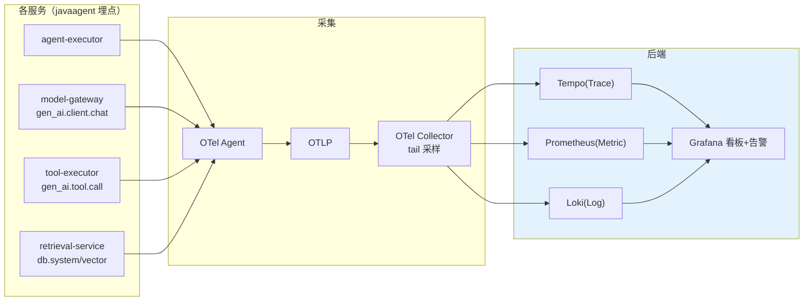
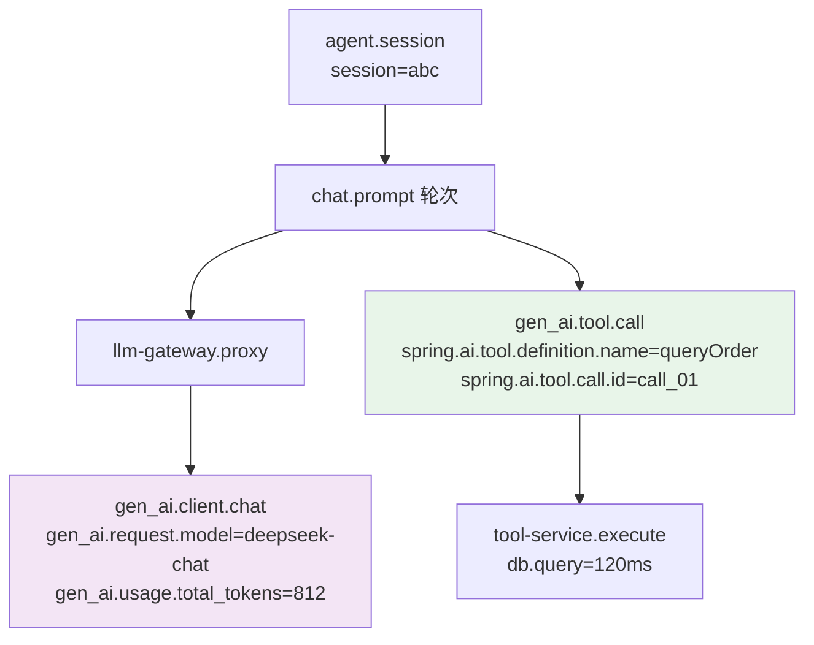
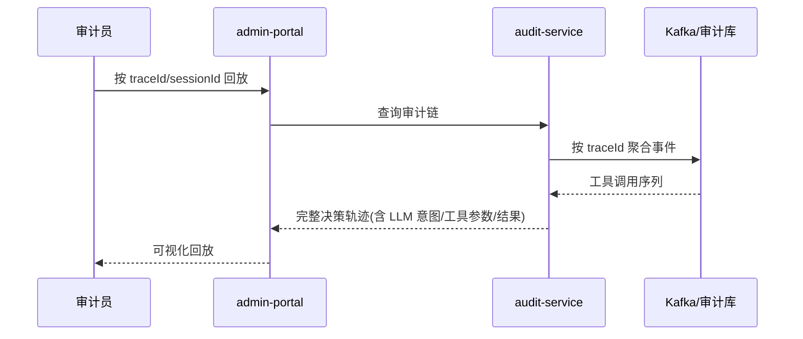
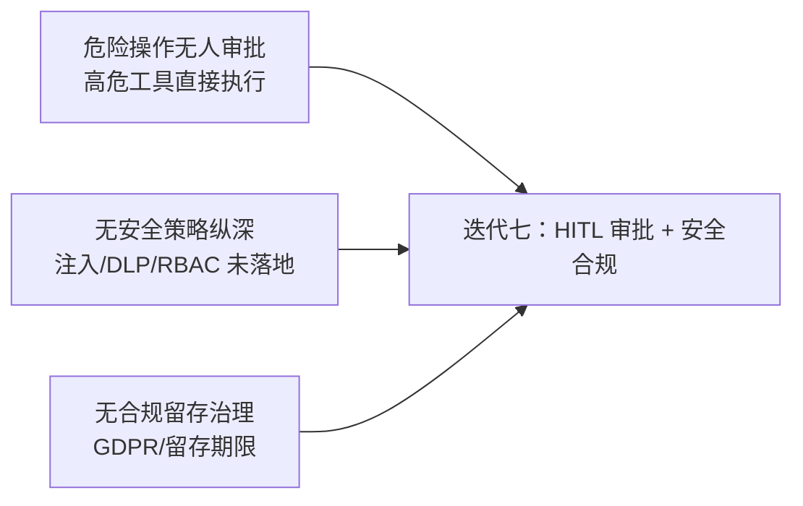

# 07-迭代六：全链路可观测与审计流——gen_ai 语义约定 + 工具审计 + 决策回放

> **定位**：本迭代把平台变成**可观测**的：OTel 全链路（`gen_ai` 语义约定统一 LLM/工具/检索 Span）、`traceId` 贯穿日志与指标（三支柱关联）、工具调用审计流（结构化事件 + 回放 + 决策可解释）。读者画像：理解检索/记忆服务化，想看到"排障一次定位全链路"的读者。前置阅读：[06-迭代五-检索与记忆服务化](06-迭代五-检索与记忆服务化.md)、[教程 22-全链路可观测性]、[教程 23-工具执行可观测与审计]。
>
> **演进纪律**：本迭代做可观测 + 审计流；HITL 审批（07）、灰度成本（09）不提前实现。
> **铁律 0**：代码均经本地 jar `javap` 实证；`io.micrometer.tracing.Tracer` 本地未下载，标注「需引入依赖后实证」。

---

## 一、四问（本轮：全链路可观测）

| 问 | 答 |
|----|----|
| **新增了什么需求** | ① OTel 全链路 Trace（gen_ai 语义约定）② trace→log→metric 三支柱关联 ③ 工具审计流 + 决策回放 ④ SLO 指标 |
| **影响了哪些模块** | 全部服务接 OTel；`tool-executor` 发结构化审计事件；新增审计回放查询 |
| **架构如何演进** | 各服务独立埋点 → 统一可观测平面 |
| **上一版本的痛点是什么** | ① 无全链路 Trace ② 审计不可回放 ③ 排障靠人肉拼时间线（06 §八） |

**本迭代验收**：① 一次 Agent 请求在 Grafana 看到一个完整 Trace 树 ② 工具调用审计 100% 落库可回放 ③ 故障定位从"跨 5 个服务猜"变成"点开一个 Trace"。

---

## 二、可观测架构



---

## 三、gen_ai 语义约定（真实 Span 结构）



> **标签名实证**（javap `ToolCallingObservationDocumentation` 字节码）：工具 Span 用 `spring.ai.tool.definition.name` / `spring.ai.tool.type` / `spring.ai.tool.call.id` / `spring.ai.tool.call.arguments` / `spring.ai.tool.call.result`；LLM Span 用 `gen_ai.request.model` / `gen_ai.usage.total_tokens` 等（详见 [教程 22-全链路可观测性 §4]）。

---

## 四、工具审计流（结构化事件 + 回放）

### 4.1 工具观测 Handler（真实 API：`ObservationHandler<ToolCallingObservationContext>`）

```java
package com.example.toolexecutor.obs;

import io.micrometer.observation.Observation;
import io.micrometer.observation.ObservationHandler;
import io.micrometer.tracing.Tracer;   // ⚠ 需引入依赖 io.micrometer:micrometer-tracing（本地未下载，未 javap 实证）
import org.springframework.ai.tool.observation.ToolCallingObservationContext;   // javap 实证：真实类
import org.springframework.stereotype.Component;

/** 工具审计——参数/结果脱敏后发 Kafka（可回放、可解释）。 */
@Component
public class ToolAuditHandler implements ObservationHandler<ToolCallingObservationContext> {

    private final AuditEventEmitter emitter;
    private final Tracer tracer;

    public ToolAuditHandler(AuditEventEmitter emitter, Tracer tracer) {
        this.emitter = emitter;
        this.tracer = tracer;
    }

    // Observation.Context 无 getDuration()（javap 实证）——用 ctx.put/get 计时
    private static final Object START_KEY = new Object();

    @Override
    public void onStart(ToolCallingObservationContext ctx) {
        ctx.put(START_KEY, System.nanoTime());
    }

    @Override
    public boolean supportsContext(Observation.Context context) {
        return context instanceof ToolCallingObservationContext;
    }

    @Override
    public void onStop(ToolCallingObservationContext ctx) {
        Long start = ctx.get(START_KEY);
        long ms = start != null ? (System.nanoTime() - start) / 1_000_000 : -1;
        String traceId = tracer.currentSpan() == null ? "n/a" : tracer.currentSpan().context().traceId();
        // 脱敏后入审计（参数/结果含敏感信息，见脱敏器）
        emitter.emit(new ToolAudit(
                ctx.getToolDefinition().name(),
                mask(ctx.getToolCallArguments()),
                truncate(ctx.getToolCallResult()),
                ms, traceId));
    }

    private String mask(String s) { return s == null ? null : s.replaceAll("(token|key)=\"[^\"]*\"", "$1=***"); }
    private String truncate(String s) { return s == null || s.length() <= 500 ? s : s.substring(0, 500) + "..."; }
}
```

### 4.2 审计回放（决策可解释）



---

## 五、SLO 指标（可量化）

```java
// 各服务暴露核心指标（Micrometer，真实 API）：
//   agent.request.duration        → 端到端 P99
//   gen_ai.client.token.usage     → Token 计量（类型标签 prompt/completion）
//   agent.tool.call.duration      → 工具执行 P99
//   agent.retrieval.duration      → 检索 P99
//   agent.slo.error_budget        → SLO 错误预算
```

| SLO | 目标 | 告警 |
|-----|------|------|
| 端到端 P99 | ≤ 8s | P99>8s 持续 5 分钟 |
| 模型网关 P99 | ≤ 50ms | 持续 2 分钟 |
| 工具执行 P99 | ≤ 2s | 持续 5 分钟 |
| 可用性 | ≥ 99.9% | 错误率>0.1% |

---

## 六、测试与验证

### 6.1 Trace 完整性测试

```bash
# 触发一次跨服务请求 → Grafana/Tempo 中应看到完整 Trace 树（4+ Span）
# 验证：traceId 在 4 个服务的日志中一致
```

### 6.2 审计回放测试

```bash
# 触发工具调用 → 按 traceId 查询审计 → 得到完整决策轨迹
curl "http://localhost:8084/v1/audit/trace?traceId=trace_xxx"
# 预期：LLM 意图 → 工具调用(queryOrder, 参数脱敏) → 结果 → 耗时
```

### 6.3 脱敏验证

```java
// 断言：审计事件中参数/结果的 token/key 字段已被掩码
```

---

## 七、本迭代痛点（下一步）



1. **无 HITL**：危险工具（删除/外发/写库）无人工审批（07 做，落点是 ToolCallingManager/ToolCallback）
2. **无安全纵深**：Prompt 注入、DLP、RBAC、mTLS 未落地（07 做）
3. **无合规留存**：审计无留存期限/被遗忘权（07 做）

---

## 八、验收对照

| 验收项 | 达标标准 | 本迭代 |
|--------|---------|--------|
| 全链路 Trace | 一次请求完整 Span 树、traceId 贯穿 | ✅ |
| 三支柱关联 | trace→log→metric 可互查 | ✅ |
| 工具审计 | 100% 落库、可回放、参数脱敏 | ✅ |
| SLO 指标 | 核心指标暴露 + 告警 | ✅ |
| 未提前引入后续能力 | 无 HITL/安全纵深/GDPR | ✅ |

**下一篇**：08-迭代七-HITL 审批与安全合规。
