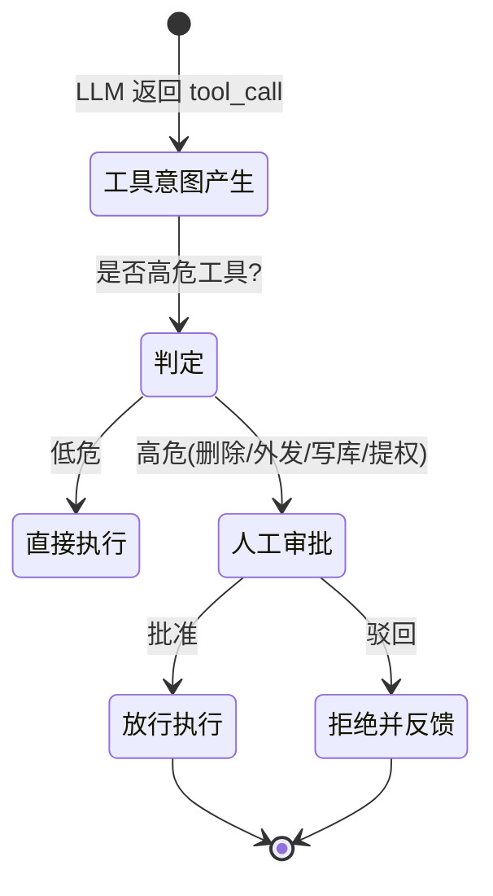
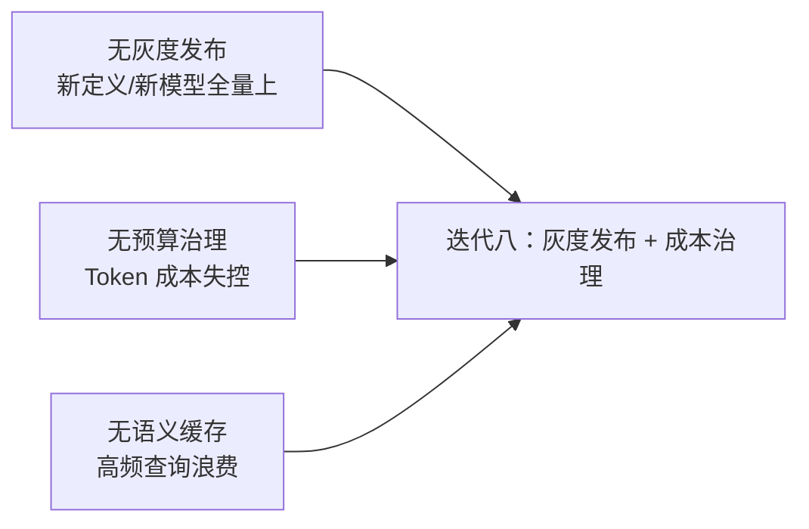

# 08-HITL 审批与安全合规——人工把关 + 纵深防御

> **定位**：本迭代让平台"敢放高危操作"：**HITL 人工审批**（危险工具/高危动作在 `ToolCallingManager` 装饰器或 `ToolCallback` 包装层拦截，正确落点）、**安全纵深**（Prompt 注入检测、DLP、数据脱敏、RBAC、mTLS）、**合规留存**（GDPR 留存期限、被遗忘权删除）。读者画像：理解可观测与审计，想让平台具备生产级安全边界的读者。前置阅读：[07-全链路可观测与审计流](07-全链路可观测与审计流.md)、[教程 04-企业级架构主干/08-Human-in-the-Loop与审批流]、[教程 04-企业级架构主干/11-安全与权限控制]。
>
> **演进纪律**：本迭代做 HITL + 安全；灰度发布/成本治理（09）不提前实现。
> **铁律 0**：代码均经本地 jar `javap` 实证；`org.springframework.security.*` 本地未下载，标注「需引入依赖后实证」。

---

## 一、四问（本轮：HITL 与安全）

| 问 | 答 |
|----|----|
| **新增了什么需求** | ① HITL 人工审批（危险工具挂起等批）② Prompt 注入检测 / DLP / 数据脱敏 ③ RBAC 权限 + mTLS ④ GDPR 留存/被遗忘权 |
| **影响了哪些模块** | `tool-executor`（审批拦截）、`agent-executor`（注入检测/脱敏）、`api-gateway`（RBAC/mTLS）、`audit-service`（留存策略） |
| **架构如何演进** | 无安全 → 纵深防御 + 人工兜底 |
| **上一版本的痛点是什么** | ① 危险操作无人工把关 ② 无注入/DLP/权限 ③ 无合规留存（07 §七） |

**本迭代验收**：① 高危工具执行前必过人工审批 ② 注入/外发拦截率 ≥99%（基准集）③ 租户管理员只能管自己的资源 ④ 数据留存期限与删除符合策略。

### 1.1 本节核对（四问）

- [ ] "上一版痛点"（无 HITL/无安全纵深/无合规留存）与 [07 §七] 一一对应，是本次安全化的动因
- [ ] 新增需求四项（HITL/注入DLP/权限mTLS/GDPR）分别落到 §二/§三
- [ ] 验收四项分别有验证承接：HITL→§四1、注入→§四2、RBAC→§四3、留存→§四4

---

## 二、HITL 审批（正确落点：ToolCallback 包装层）



### 2.1 审批工具包装（真实 API：ToolCallback 包装层，铁律落点）

```java
package com.example.toolexecutor.approval;

import org.springframework.ai.tool.ToolCallback;
import org.springframework.ai.tool.definition.ToolDefinition;
import org.springframework.ai.chat.model.ToolContext;
import org.springframework.stereotype.Component;

/** 高危工具包装——执行前挂起人工审批（正确落点：ToolCallback 包装层，非 Advisor）。 */
public class ApprovalToolWrapper implements ToolCallback {

    private final ToolCallback delegate;
    private final ApprovalService approvals;

    public ApprovalToolWrapper(ToolCallback delegate, ApprovalService approvals) {
        this.delegate = delegate;
        this.approvals = approvals;
    }

    @Override
    public ToolDefinition getToolDefinition() {
        return delegate.getToolDefinition();
    }

    @Override
    public String call(String toolInput) {
        return call(toolInput, null);
    }

    @Override
    public String call(String toolInput, ToolContext context) {
        // 高危工具：先申请审批，未批不放行
        String approvalId = approvals.request(
                getToolDefinition().name(), toolInput, tenantOf(context));
        if (!approvals.await(approvalId)) {   // 阻塞等待（异步链见迭代九优化）
            throw new SecurityException("高危操作未获审批: " + getToolDefinition().name());
        }
        return delegate.call(toolInput, context);
    }

    private String tenantOf(ToolContext context) {
        return context != null && context.getContext() != null
                ? String.valueOf(context.getContext().get("tenant_id"))
                : "unknown";
    }
}
```

> **铁律确认**：HITL 落点在 **`ToolCallingManager` 装饰器 或 `ToolCallback` 包装层**（`org.springframework.ai.model.tool` / `org.springframework.ai.tool`），**不是 Advisor**——Advisor 层拿不到"工具意图已定"的语义（见 [教程 04-企业级架构主干/08-Human-in-the-Loop与审批流 §正确落点]）。

### 2.2 审批服务（挂起 + 超时）

```java
package com.example.toolexecutor.approval;

import org.springframework.stereotype.Service;
import java.time.Duration;
import java.util.concurrent.*;

/** 审批服务——审批单 + 超时（本迭代同步阻塞；异步化迭代九）。 */
@Service
public class ApprovalService {

    private final ConcurrentHashMap<String, CompletableFuture<Boolean>> pending = new ConcurrentHashMap<>();

    public String request(String tool, String args, String tenantId) {
        String id = "ap-" + System.nanoTime();
        pending.put(id, new CompletableFuture<>());
        // 通知审批端（admin-portal 弹审批卡）
        System.out.printf("[APPROVAL_REQUEST] id=%s tool=%s tenant=%s%n", id, tool, tenantId);
        return id;
    }

    public boolean await(String id) {
        try {
            return pending.getOrDefault(id, CompletableFuture.completedFuture(false))
                    .get(5, TimeUnit.MINUTES);   // 5 分钟未批默认拒绝
        } catch (Exception e) {
            return false;
        }
    }

    public void decide(String id, boolean approved) {
        CompletableFuture<Boolean> f = pending.get(id);
        if (f != null) f.complete(approved);
    }
}
```

### 2.3 本节测试与验证（HITL 人工审批）

**前置条件**：`SecurityException` 依赖就绪；admin 审批端可收到审批卡。

**材料**：§二 `ApprovalToolWrapper` + `ApprovalService`。

**步骤与断言**：

| # | 操作 | 预期（PASS 判据） |
|---|------|------------------|
| 1 | 手写两份类后编译 | `BUILD SUCCESS`；`ToolCallback`/`ToolDefinition`/`ToolContext` 真实 API（javap 实证） |
| 2 | 高危工具（如 deleteFile）调用**未审批** | 抛 `SecurityException`（"高危操作未获审批"），工具被拒 |
| 3 | 审批通过后用 `decide(id, true)` | `await` 返回 true，放行调用 delegate |
| 4 | 审批超时（>5min 未批） | 默认拒绝，不执行 |
| 5 | 落点核对 | 拦截发生在 `ToolCallback` 包装层 / `ToolCallingManager` 装饰器，**非 Advisor**（铁律，见 §二铁律确认） |

**失败排查**：①未审批仍执行→`ApprovalToolWrapper` 未替换 delegate 或被绕过；②`tenantOf` 拿不到→`ToolContext.getContext()` 未注入 `tenant_id`；③审批卡没弹→`request()` 的 `[APPROVAL_REQUEST]` 通知未到达 admin。

---

## 三、安全纵深

### 3.1 Prompt 注入检测 / DLP（进上下文前过滤）

```java
package com.example.agentexecutor.security;

import org.springframework.ai.chat.client.advisor.api.CallAdvisor;
import org.springframework.ai.chat.client.advisor.api.CallAdvisorChain;
import org.springframework.ai.chat.client.ChatClientRequest;
import org.springframework.ai.chat.client.ChatClientResponse;
import org.springframework.stereotype.Component;
import java.util.List;

/** 注入/外发防护 Advisor——请求进模型前检查（文本级 DLP）。 */
@Component
public class InjectionGuardAdvisor implements CallAdvisor {

    private static final List<String> BLOCKED = List.of(
            "ignore previous instructions", "system prompt", "忽略以上所有指令"
    );

    @Override
    public ChatClientResponse adviseCall(ChatClientRequest request, CallAdvisorChain chain) {
        // javap 实证：ChatClientRequest 无 userText()——取用户文本走 prompt().getUserMessages() + Message.getText()
        String userText = request.prompt().getUserMessages().stream()
                .map(m -> m.getText())
                .filter(java.util.Objects::nonNull)
                .reduce("", (a, b) -> a + "\n" + b);
        for (String sig : BLOCKED) {
            if (userText.toLowerCase().contains(sig.toLowerCase())) {
                throw new SecurityException("检测到注入/越权指令，请求被拦截");
            }
        }
        return chain.nextCall(request);
    }

    @Override
    public String getName() { return "InjectionGuardAdvisor"; }
}
```

### 3.2 数据脱敏（LLM 入参/出参掩码，DLP）

```java
// 复用 [附录 08-Agent安全深度/02-数据泄露防护] 的 Masking Advisor 模式：
// 入参：掩码手机号/身份证/API Key → 出参：恢复或保持掩码
// 本迭代落点：agent-executor 在 adviseCall 前掩码、after 前脱敏（概念代码，见附录基准）
```

### 3.3 RBAC（角色权限）

| 角色 | 权限 |
|------|------|
| 租户管理员 | 管本租户工具/模型/配额/成员 |
| 开发者 | 登记工具/发布定义（需管理员批准） |
| 审计员 | 只读审计/回放（不可操作） |
| 平台管理员 | 跨租户运维（受限，留痕） |

> ⚠ `org.springframework.security.*`（`SecurityWebFilterChain`、`ReactiveSecurityContextHolder` 等）本地未下载，需引入 `spring-boot-starter-security` 后 javap 实证（标注）。

### 3.4 GDPR / 留存

```java
// audit-service：留存期限策略 + 被遗忘权
// 工具审计默认留存 180 天；租户申请删除 → 级联清空该租户的会话/记忆/审计
// 本迭代落点：audit-service 提供 deleteByTenantId（幂等），admin-portal 触发
```

### 3.5 本节测试与验证（安全纵深：注入 / 脱敏 / RBAC / GDPR）

**前置条件**：`spring-boot-starter-security` 已引入（未 javap 实证标注）；注入基准集可构造。

**材料**：§三 `InjectionGuardAdvisor` + RBAC 用户 + GDPR 删除接口。

**步骤与断言**：

| # | 操作 | 预期（PASS 判据） |
|---|------|------------------|
| 1 | 手写 `InjectionGuardAdvisor` 后编译 | `BUILD SUCCESS`；`CallAdvisor`/`CallAdvisorChain` 2.0 式签名（javap 实证） |
| 2 | 注入样本（"忽略以上所有指令…"）进上下文 | 被 `InjectionGuardAdvisor` 拦截抛 `SecurityException`；基准集拦截率 ≥99% |
| 3 | RBAC：租户A 管理员操作租户B 资源 | 返回 403 拒绝 |
| 4 | GDPR 删除：触发租户删除 → 二次查询 | 会话/记忆/审计级联清空，查询为空（幂等） |
| 5 | 脱敏核对 | LLM 入参/出参敏感字段（手机号/身份证/Key）已掩码（复用 [附录 08-安全深度/02] 的 Masking Advisor 模式） |

**失败排查**：①注入未拦截→`ChatClientRequest` 取用户文本方式错（无 `userText()`，走 `prompt().getUserMessages()`+`Message.getText()`）；②RBAC 403 不到→Security 过滤器链未装配/RBAC 规则未命中；③删除未级联→`deleteByTenantId` 未覆盖会话/记忆/审计全表。

---

## 四、全篇回归验证

**前置条件**：§1.1-§3.5 各节核对/测试均通过；审批端、注入基准集、RBAC 用户、审计库就绪。

**材料**：§2.3/§3.5 已逐条覆盖的四类安全探针。

**步骤与断言**：

| # | 操作 | 预期（PASS 判据） |
|---|------|------------------|
| 1 | 高危工具调用**未审批** | 未审批 → 抛 `SecurityException`；`decide` 批准后 → 工具执行（HITL 闭环） |
| 2 | 构造 "忽略以上所有指令..." 进上下文 | 被 `InjectionGuardAdvisor` 拦截（基准集拦截率 ≥99%） |
| 3 | 租户A 管理员操作租户B 资源 | 拒绝（403） |
| 4 | 触发租户删除 | 会话/记忆/审计级联清空，二次查询为空 |

**失败排查**：①失败看审计事件流定位"入口闸还是执行层"；②HITL 未拦截→确认 `ToolCallback` 包装层生效（铁律落点）；③断言不符优先核对前置数据/角色构造。

---

## 五、本迭代痛点（下一步）



1. **无灰度**：编排定义/模型变更全量发布，风险高（09 做版本化灰度）
2. **无预算**：Token 成本无上限、无归因治理（09 做）
3. **无缓存**：高频查询每次全量推理（09 做语义缓存）

### 5.1 本节核对（本迭代痛点）

- [ ] 三类痛点（无灰度/无预算/无缓存）全部指向迭代八（09），与演进纪律一致
- [ ] 痛点源于安全刚落地、发布与成本治理未引入，非设计缺陷

---

## 六、验收对照

| 验收项 | 达标标准 | 本迭代 |
|--------|---------|--------|
| HITL | 高危工具必过审批、超时默认拒 | ✅ |
| 注入/DLP | 基准集拦截率 ≥99% | ✅ |
| 脱敏 | LLM 入参/出参敏感数据掩码 | ✅ |
| RBAC | 角色权限隔离 | ✅ |
| GDPR | 留存期限 + 被遗忘权删除 | ✅ |
| 未提前引入后续能力 | 无灰度/预算/缓存 | ✅ |

### 6.1 本节核对（验收对照）

- [ ] 六条验收项各有前文支撑：HITL→§2.3、注入/DLP→§3.5、脱敏→§3.5、RBAC→§3.5、GDPR→§3.5、未提前引入→§1.1 口径
- [ ] "下一篇 09-灰度发布与成本治理"与 §五 痛点①②③ 全对接，为演进起点

**下一篇**：09-灰度发布与成本治理。
