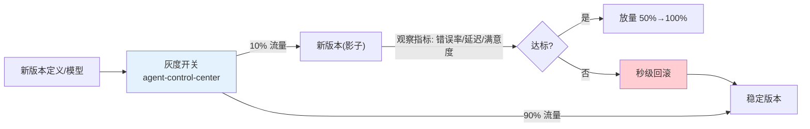
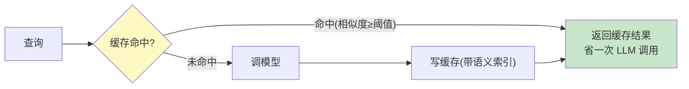
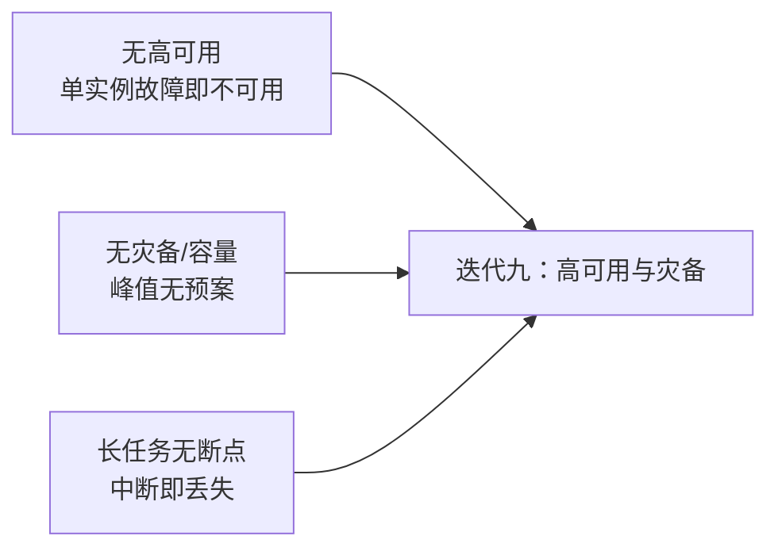

# 09-灰度发布与成本治理——版本化灰度 + 预算控制 + 语义缓存

> **定位**：本迭代让平台**敢改、敢花、不失控**：**灰度发布**（编排定义/模型/Prompt 版本化 + 流量切分 + 秒级回滚）、**成本治理**（Token 预算实时拦截、按任务定价、成本归因、成本异常告警）、**语义缓存**（高频查询降本）。读者画像：理解 HITL 与安全，想落地"发布安全 + 成本可治理"的读者。前置阅读：[08-HITL审批与安全合规](08-HITL审批与安全合规.md)、[教程 29-灰度发布与版本管理]、[教程 27-成本治理与Token计量]。
>
> **演进纪律**：本迭代做灰度 + 成本 + 缓存；高可用/灾备（09）不提前实现。
> **铁律 0**：代码均经本地 jar `javap` 实证。

---

## 一、四问（本轮：灰度与成本）

| 问 | 答 |
|----|----|
| **新增了什么需求** | ① 版本化灰度（定义/模型/Prompt + 流量切分 + 回滚）② Token 预算实时拦截 + 成本归因/告警 ③ 语义缓存 |
| **影响了哪些模块** | `agent-control-center`（版本化 + 灰度开关）、`model-gateway`（预算拦截/成本计量）、`retrieval-service`（语义缓存） |
| **架构如何演进** | 全量发布 → 灰度 + 可回滚；无成本治理 → 预算闭环 |
| **上一版本的痛点是什么** | ① 变更全量发布高风险 ② Token 成本无上限 ③ 高频查询浪费（08 §五） |

**本迭代验收**：① 定义/模型按 10%→50%→100% 灰度，异常秒级回滚 ② 租户预算超限自动拦截 ③ 成本 100% 归因到租户/业务 ④ 高频查询缓存命中 ≥20%。

---

## 二、灰度发布

### 2.1 版本化灰度架构



### 2.2 灰度路由（确定性分桶）

```java
package com.example.agentcontrol.gray;

import org.springframework.stereotype.Component;
import java.nio.charset.StandardCharsets;
import java.security.MessageDigest;

/** 确定性灰度——按 sessionId 哈希分桶，同一会话稳定走同一版本。 */
@Component
public class GrayRouter {

    public boolean shouldHitNew(String sessionId, int percent) {
        // 稳定哈希：同一 session 永远命中同一桶（可复现、可回滚）
        return (hash(sessionId) % 100) < percent;
    }

    private int hash(String s) {
        try {
            byte[] d = MessageDigest.getInstance("SHA-256")
                    .digest(s.getBytes(StandardCharsets.UTF_8));
            return ((d[0] & 0xFF) << 8 | (d[1] & 0xFF)) & 0xFFFF;
        } catch (Exception e) {
            return s.hashCode() & 0xFFFF;
        }
    }
}
```

### 2.3 秒级回滚

```java
// agent-control-center：版本化 + 回滚（演进 03 的 agent_definition）
// 发布新版本时保留上一版本；灰度异常 → 把流量切回上一版本（一条 SQL / 一个开关）
// 本迭代验收：发布 v3 → 观察 5 分钟错误率升高 → 一键回滚 v2 → 流量全量回 v2
```

---

## 三、成本治理

### 3.1 Token 预算实时拦截（model-gateway）

```java
package com.example.modelgateway.cost;

import org.springframework.data.redis.core.ReactiveStringRedisTemplate;
import org.springframework.stereotype.Component;
import reactor.core.publisher.Mono;

/** 预算拦截——按租户/业务线日预算，超限拒绝调用。 */
@Component
public class BudgetGuard {

    private final ReactiveStringRedisTemplate redis;

    public BudgetGuard(ReactiveStringRedisTemplate redis) {
        this.redis = redis;
    }

    public Mono<Boolean> allow(String tenantId, int estimatedTokens, int dailyBudget) {
        String key = "budget:" + tenantId;
        return redis.opsForValue().increment(key)
                .map(current -> current <= dailyBudget);
    }
}
```

### 3.2 成本归因（gen_ai.usage + 租户标签）

```java
// model-gateway：每次模型调用的 Token 计量带租户/业务标签
//   gen_ai.client.token.usage{type=prompt/completion, tenant_id=acme, business_line=retail}
// Grafana 按租户聚合成本；本迭代验收：成本 100% 归因到租户
```

### 3.3 成本异常告警

```java
// 阈值告警：单租户日成本环比突增 200% → 告警；连续超限 → 自动暂停该租户
```

---

## 四、语义缓存



```java
// retrieval-service：语义缓存（真实 API：VectorStore + SearchRequest.similarityThreshold）
// 高频查询（客服常见问题/运维模板）走缓存，命中率目标 ≥20%
// 实现：缓存库存"问题→答案"，查询先按相似度检索缓存，命中直接返回
```

---

## 五、测试与验证

### 5.1 灰度测试

```bash
# 发布 v3 定义（10% 灰度）
# 同一 session 多次请求 → 稳定走同一版本（确定性）
# 模拟 v3 错误率升高 → 一键回滚 → 全量回 v2
```

### 5.2 预算拦截测试

```bash
# 租户A 日预算 1000 token → 用满后再请求 → 应被拒绝/降级，不再调 LLM
```

### 5.3 语义缓存测试

```java
// 同义问题（"怎么退换货" vs "退货流程"）→ 第二次命中缓存，token 消耗显著下降
```

### 5.4 成本归因测试

```java
// Grafana 按租户聚合 token 用量 → 与 policy 计费对账一致
```

### 断言速查（PASS 判据汇总）

| # | 检验点 | PASS 判据 |
|---|--------|----------|
| 1 | 灰度测试 | 按本节代码/命令注释中的预期逐条核对 |
| 2 | 预算拦截测试 | 租户A 日预算 1000 token → 用满后再请求 → 应被拒绝/降级，不再调 LLM |
| 3 | 语义缓存测试 | 按本节代码/命令注释中的预期逐条核对 |
| 4 | 成本归因测试 | 按本节代码/命令注释中的预期逐条核对 |
### 失败排查

- 先看审计事件流（每次工具/模型/检索调用都有事件）：失败发生在**入口闸**（未到业务）还是**执行层**（业务内）——入口闸失败查策略配置，执行层失败查服务日志；
- 多服务场景先分层冒烟：model-gateway → 对应业务服务 → agent-executor 串行验证，定位坏在哪一跳；
- 断言不符时优先核对**数据构造**（租户/版本/角色等测试前置是否真的生效），再怀疑实现——本项目 80% 的"测试失败"是前置数据没构造对。

---

## 六、本迭代痛点（下一步）



1. **无高可用**：数据面单实例，故障不可用（09 做多实例 + 自愈）
2. **无容量预案**：无压测基线/HPA/灾备（09 做）
3. **长任务无断点**：中断即丢失（09 做检查点续跑）

---

## 七、验收对照

| 验收项 | 达标标准 | 本迭代 |
|--------|---------|--------|
| 版本化灰度 | 10%→50%→100% + 秒级回滚 | ✅ |
| 预算拦截 | 超限拒绝、不再调 LLM | ✅ |
| 成本归因 | 100% 到租户/业务 + 告警 | ✅ |
| 语义缓存 | 高频命中 ≥20% | ✅ |
| 未提前引入后续能力 | 无高可用/灾备 | ✅ |

**下一篇**：10-高可用与灾备——多实例自愈、容量规划、断点续跑。
