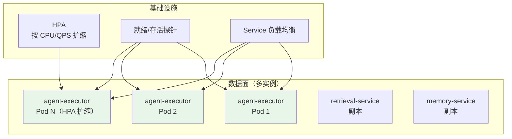
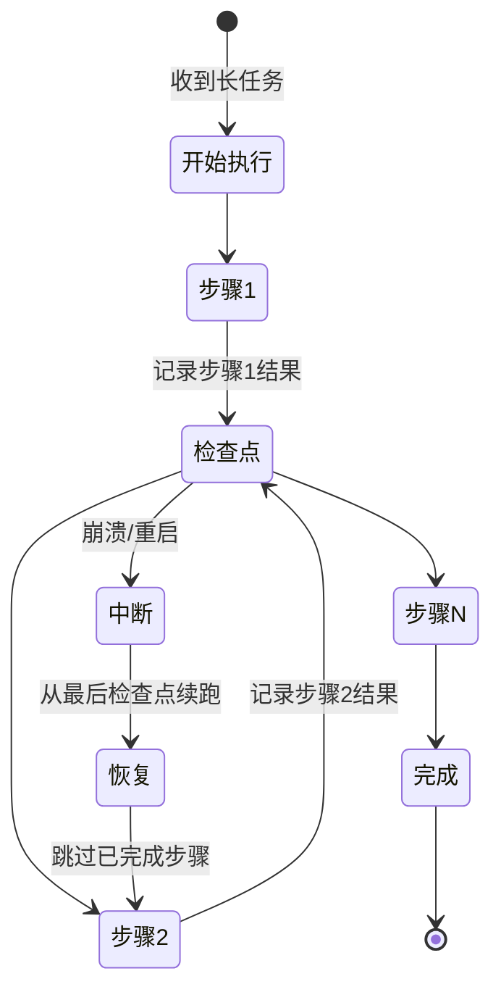
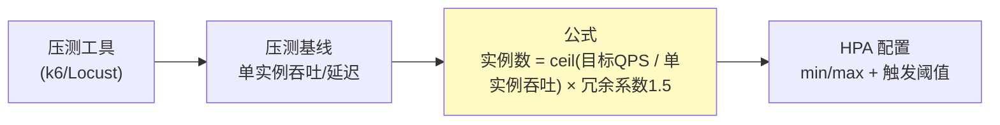
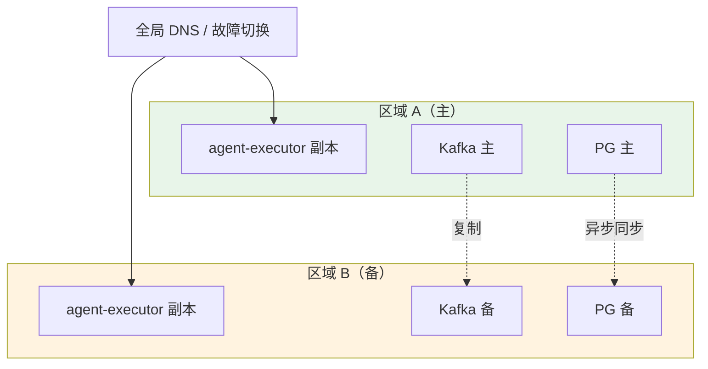
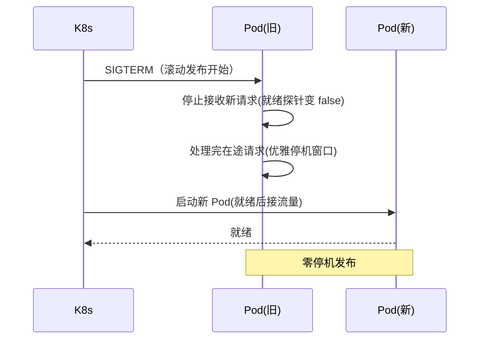
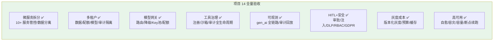

# 10-迭代九：高可用与灾备——多实例自愈 + 容量规划 + 长任务断点续跑

> **定位**：本迭代是项目**工业落地的收官**：把平台推到"故障自愈、容量可算、长任务可续、灾难可恢复"：**高可用**（数据面多实例 + HPA 自动扩缩 + 就绪探针自愈）、**容灾**（多区域多活 + 数据同步 + RPO/RTO）、**容量规划**（压测基线 → 实例数模型）、**长任务断点续跑**（检查点）、**优雅停机/滚动发布**。读者画像：想看到平台"敢上生产"的读者。前置阅读：[09-迭代八-灰度发布与成本治理](09-迭代八-灰度发布与成本治理.md)、[教程 33-部署与运维]、[教程 40-长任务持久化与中断恢复]。
>
> **演进纪律**：本迭代是收尾——覆盖"高可用/容灾/容量/断点"，并给出全项目验收。
> **铁律 0**：代码均经本地 jar `javap` 实证。

---

## 一、四问（本轮：高可用与灾备）

| 问 | 答 |
|----|----|
| **新增了什么需求** | ① 数据面多实例 + HPA 自动扩缩 + 故障自愈 ② 多区域多活容灾 + 数据同步 ③ 容量规划（压测→实例数）④ 长任务检查点续跑 ⑤ 优雅停机/滚动发布 |
| **影响了哪些模块** | 部署层（K8s）、`agent-executor`（检查点）、数据层（同步） |
| **架构如何演进** | 单实例可观测 → 多实例自愈 + 容灾 + 容量可算 |
| **上一版本的痛点是什么** | ① 单实例故障即不可用 ② 无容量预案 ③ 长任务中断丢失（09 §六） |

**本迭代验收**：① 数据面任一实例故障 ≤60s 自愈、无感知 ② 可用性 SLO ≥99.9% ③ 压测基线推导实例数 ④ 长任务中断后从检查点续跑 ⑤ 发布零停机。

---

## 二、高可用架构



**关键**：数据面**无状态**（会话在 memory-service、检查点在对象存储/DB），任何实例可被替换。故障实例被探针摘除、HPA 补新实例——"自愈"。

---

## 三、长任务断点续跑（检查点）



```java
// agent-executor：检查点持久化（事件溯源式：记录每一步输入/输出/预算）
// 重启后从 checkpoint 恢复，不重跑已完成步骤
// 本迭代验收：任务执行到步骤 3 中断 → 重启 → 从步骤 3 续跑
```

---

## 四、容量规划（压测 → 实例数）

### 4.1 压测基线（示例）

| 服务 | 单实例吞吐 | 目标 QPS | 实例数 |
|------|-----------|---------|--------|
| agent-executor | 20 req/s | 200 | ≥10 |
| model-gateway | 50 req/s | 300 | ≥6 |
| tool-executor | 30 req/s | 240 | ≥8 |
| retrieval-service | 80 req/s | 400 | ≥5 |



### 4.2 HPA 配置（K8s）

```yaml
apiVersion: autoscaling/v2
kind: HorizontalPodAutoscaler
metadata:
  name: agent-executor-hpa
spec:
  scaleTargetRef:
    apiVersion: apps/v1
    kind: Deployment
    name: agent-executor
  minReplicas: 2
  maxReplicas: 20
  metrics:
    - type: Resource
      resource:
        name: cpu
        target:
          type: Utilization
          averageUtilization: 70
```

---

## 五、容灾（多活 / DR）



**RPO/RTO 目标**：RPO ≤ 5 分钟（异步同步），RTO ≤ 30 分钟（DNS 切换 + 数据恢复演练）。

---

## 六、优雅停机与滚动发布



```yaml
# spring boot 优雅停机
server:
  shutdown: graceful
spring:
  lifecycle:
    timeout-per-shutdown-phase: 30s
```

---

## 七、测试与验证

### 7.1 故障自愈测试

```bash
# 杀掉一个 agent-executor Pod → 探针摘除 → HPA 补新 → 请求无感知（≤60s）
```

### 7.2 断点续跑测试

```bash
# 长任务执行到步骤3 → kill → 重启 → 从步骤3续跑（日志确认不重跑步骤1-2）
```

### 7.3 压测验证

```bash
# k6 压测目标 QPS → 观察 HPA 扩缩 → 延迟保持 P99 达标
```

### 7.4 容灾演练

```bash
# 主区域故障 → DNS 切备 → RTO 达标；恢复后数据一致（RPO 内）
```

---

## 八、全项目验收（工业可落地总结）



| 类别 | 达标指标 | 状态 |
|------|---------|------|
| 可用性 SLO | ≥99.9% | ✅（迭代九） |
| 端到端 P99 | ≤8s | ✅（各迭代验收） |
| 工具准入/审计 | 100% | ✅（迭代四/六） |
| 租户隔离 | 0 违规 | ✅（迭代三） |
| 成本归因 | 100% | ✅（迭代八） |
| HITL 拦截 | 高危必审 | ✅（迭代七） |
| 灰度回滚 | 秒级 | ✅（迭代八） |

**下一篇**：11-迭代十-响应式强化。
