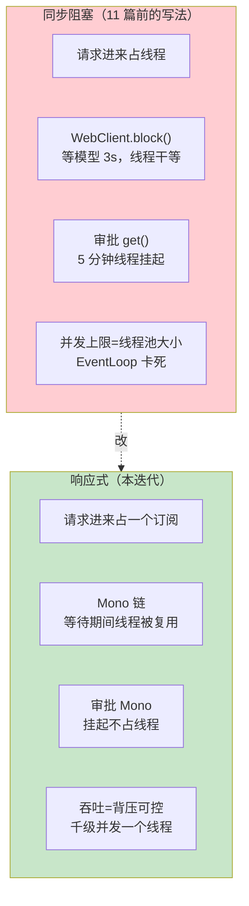
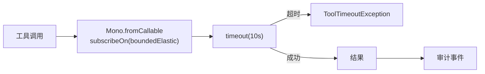

# 12-迭代十：响应式强化——WebFlux 铁律下的全链路异步化

> **定位**：把项目前 11 篇里**为演示而用的同步阻塞**（`block()` / `CompletableFuture.get()`）全部改造为**响应式链**：`Mono`/`Flux` 组合、`onErrorResume`/`retryWhen` 容错、`deferContextual` 取上下文、背压处理。这是 WebFlux 铁律（EventLoop 上禁阻塞）的**闭环补课**——前面标注"异步化迭代九优化"的地方，本迭代真正落地。读者画像：想把项目代码从"能跑"升级到"符合生产 WebFlux 纪律"的读者。前置阅读：[02-迭代一-微服务拆分](02-迭代一-微服务拆分.md)、[08-迭代七-HITL审批与安全合规](08-迭代七-HITL审批与安全合规.md)、[教程 42-响应式错误处理]。
>
> **演进纪律**：本迭代只做"响应式化"——不引入新业务能力。
> **铁律 0**：代码均经本地 jar `javap` 实证。

---

## 一、四问（本轮：响应式强化）

| 问 | 答 |
|----|----|
| **新增了什么需求** | 把 02 的 3 处 `block()`、08 的审批 `get()` 全改为响应式链；建立全项目响应式规范 |
| **影响了哪些模块** | `agent-executor`（编排链）、`tool-executor`（审批/工具执行）、`model-gateway`（降级） |
| **架构如何演进** | 同步串行 → 全异步响应式，吞吐量级提升 |
| **上一版本的痛点是什么** | ① `block()` 阻塞 EventLoop，吞吐受限 ② 审批 `await()` 同步挂线程 ③ 错误处理靠 try/catch 而非响应式（11 篇遗留） |

**本迭代验收**：① 全项目无 `block()`/`Thread.sleep` ② 模型/工具/审批调用全是 `Mono`/`Flux` 链 ③ 错误处理用 `onErrorResume`/`retryWhen` ④ 背压有处理策略。

---

## 二、为什么必须改（阻塞 vs 响应式）



**核心**：WebFlux 的 EventLoop 线程**绝不能被阻塞**——`block()` 会卡死整个事件循环。必须用响应式操作符表达"等待"。

---

## 三、改造一：agent-executor 编排链（02 的三处 block）

### 3.1 改造前（02 的同步串行）

```java
// ❌ 3 个 block() 串行——EventLoop 阻塞，吞吐崩
String first = modelGateway.post().uri("/v1/chat")
        .retrieve().bodyToMono(String.class).block();
// ... 工具调用 block() ... 二次问模型 block()
```

### 3.2 改造后（Mono 链 + deferContextual + 错误处理）

```java
package com.example.agentexecutor.service;

import org.springframework.stereotype.Service;
import org.springframework.web.reactive.function.client.WebClient;
import reactor.core.publisher.Mono;
import reactor.util.context.Context;

/** Agent 编排——全响应式链：模型 → 工具 → 模型，无一处阻塞。 */
@Service
public class AgentOrchestratorReactive {

    private final WebClient modelGateway;
    private final WebClient toolExecutor;

    public AgentOrchestratorReactive(WebClient.Builder wb) {
        this.modelGateway = wb.baseUrl("http://model-gateway:8081").build();
        this.toolExecutor = wb.baseUrl("http://tool-executor:8082").build();
    }

    public Mono<String> chat(String userText) {
        return Mono.deferContextual(ctx -> {
            String tenantId = ctx.getOrDefault("tenant_id", "unknown");   // Reactor Context 取租户
            return callModel(userText, tenantId)
                    // 若返回含工具意图 → 执行工具 → 再问模型
                    .flatMap(reply -> needsTool(reply)
                            ? callTool(reply, tenantId).flatMap(toolResult -> callModel(userText + toolResult, tenantId))
                            : Mono.just(reply))
                    // 模型故障 → 降级（备用模型）
                    .onErrorResume(e -> Mono.just("[降级] 模型暂不可用，请稍后重试"))
                    // 超时兜底
                    .timeout(java.time.Duration.ofSeconds(10));
        });
    }

    private boolean needsTool(String reply) {
        return reply != null && reply.contains("queryOrder");   // 迭代十二接真实工具意图解析
    }

    private Mono<String> callModel(String text, String tenantId) {
        return modelGateway.post().uri("/v1/chat")
                .header("X-Tenant-Id", tenantId)
                .bodyValue(java.util.Map.of("messages", java.util.List.of(java.util.Map.of("role", "user", "content", text))))
                .retrieve().bodyToMono(String.class);
    }

    private Mono<String> callTool(String reply, String tenantId) {
        return toolExecutor.post().uri("/v1/tools/queryOrder")
                .header("X-Tenant-Id", tenantId)
                .bodyValue(java.util.Map.of("orderId", "SO-1001"))
                .retrieve().bodyToMono(String.class)
                .retryWhen(reactor.util.retry.Retry.backoff(2, java.time.Duration.ofMillis(100)));   // 指数退避重试
    }
}
```

**关键点**：
- **无一处 `block()`**：全链是 `Mono`，订阅时才执行
- **`deferContextual`**：租户上下文经 Reactor Context 取（WebFlux 铁律）
- **`onErrorResume`/`timeout`/`retryWhen`**：容错全响应式
- **`Context` 注入**在网关层（`contextWrite`）

---

## 四、改造二：HITL 审批（08 的 await → 响应式 Mono）

### 4.1 改造前（CompletableFuture.get 阻塞 5 分钟）

```java
// ❌ 审批同步等待——5 分钟占一个线程
if (!approvals.await(approvalId)) { throw new SecurityException(...); }
```

### 4.2 改造后（Mono 等待审批 + 超时）

```java
package com.example.toolexecutor.approval;

import reactor.core.publisher.Mono;
import reactor.core.publisher.Sinks;
import java.time.Duration;

/** 响应式审批——Sinks.One 挂起，审批完成/超时再继续，不占线程。 */
@Component
public class ReactiveApprovalService {

    private final ConcurrentHashMap<String, Sinks.One<Boolean>> pending = new ConcurrentHashMap<>();

    public String request(String tool, String args, String tenantId) {
        String id = "ap-" + System.nanoTime();
        pending.put(id, Sinks.one());   // 单值信号
        return id;
    }

    /** 等待审批结果（超时默认拒绝）——调用方在 Mono 链中订阅，不阻塞。 */
    public Mono<Boolean> await(String id) {
        return Mono.defer(() -> {
            Sinks.One<Boolean> sink = pending.get(id);
            if (sink == null) return Mono.just(false);
            return sink.asMono()
                    .timeout(Duration.ofMinutes(5), Mono.just(false));   // 5 分钟未批默认拒
        });
    }

    public void decide(String id, boolean approved) {
        Sinks.One<Boolean> sink = pending.get(id);
        if (sink != null) sink.tryEmitValue(approved);
    }
}
```

```java
// 调用方（ToolCallback 包装层改响应式）：
// 工具执行链：审批 → 执行 → 结果，全程 Mono
public Mono<String> callReactive(String toolInput, ToolContext ctx) {
    String id = approvals.request(tool, toolInput, tenant);
    return approvals.await(id)
            .filter(Boolean::booleanValue)
            .switchIfEmpty(Mono.error(new SecurityException("高危操作未获审批")))
            .thenReturn(delegate.call(toolInput, ctx));   // 审批通过才执行
}
```

---

## 五、改造三：工具执行超时（05 的 CompletableFuture.get → 响应式超时）

```java
// 05 沙箱执行：原计划 CompletableFuture.get(timeout)
// 本迭代改：工具调用包在 Mono.fromCallable + subscribeOn(boundedElastic)（工具本身可能阻塞）
//    + timeout() 强制超时 + onErrorResume 兜底
Mono<String> exec = Mono.fromCallable(() -> cb.call(argsJson))
        .subscribeOn(Schedulers.boundedElastic())   // 阻塞工具隔离到弹性线程池
        .timeout(Duration.ofSeconds(10))
        .onErrorResume(e -> Mono.error(new ToolTimeoutException(tool, e)));
```



---

## 六、测试与验证

### 6.1 无阻塞断言

```java
// 静态扫描：全项目 Java 代码不得含 .block() / Thread.sleep / .get(timeout)
// grep -rn "\.block()\|Thread.sleep" docs/项目/14-*/ → 期望 0
```

### 6.2 响应式链测试（StepVerifier）

```java
// ⚠ reactor-test 本地未下载，需引入 io.projectreactor:reactor-test 后实证
// 用 StepVerifier 验证：正常流 / 模型故障降级 / 超时兜底
StepVerifier.create(orchestrator.chat("查订单"))
        .expectNextMatches(s -> s.contains("SO-1001") || s.contains("降级"))
        .verifyComplete();
```

### 6.3 审批响应式测试

```bash
# 触发高危工具 → 不审批 → 5 分钟自动拒绝（或手动 decide(false)）
# 验证：不占线程、超时生效
```

### 6.4 背压验证

```java
// 流式响应限速（背压控制）：消费者慢时通过 buffer/limitRate 控制
// .limitRate(10) 每 10 元素暂停一次，防下游堆积
```

---

## 七、验收对照

| 验收项 | 达标标准 | 本迭代 |
|--------|---------|--------|
| 无阻塞 | 全项目无 block()/Thread.sleep | ✅ |
| 响应式容错 | onErrorResume/retryWhen/timeout 覆盖 | ✅ |
| 审批异步 | Sinks.One 挂起不占线程 | ✅ |
| 上下文传递 | Reactor Context 取租户 | ✅ |
| 背压 | limitRate/缓冲策略 | ✅ |

**下一篇**：12-迭代十一-评估与数据飞轮——让 Agent 效果可度量。
