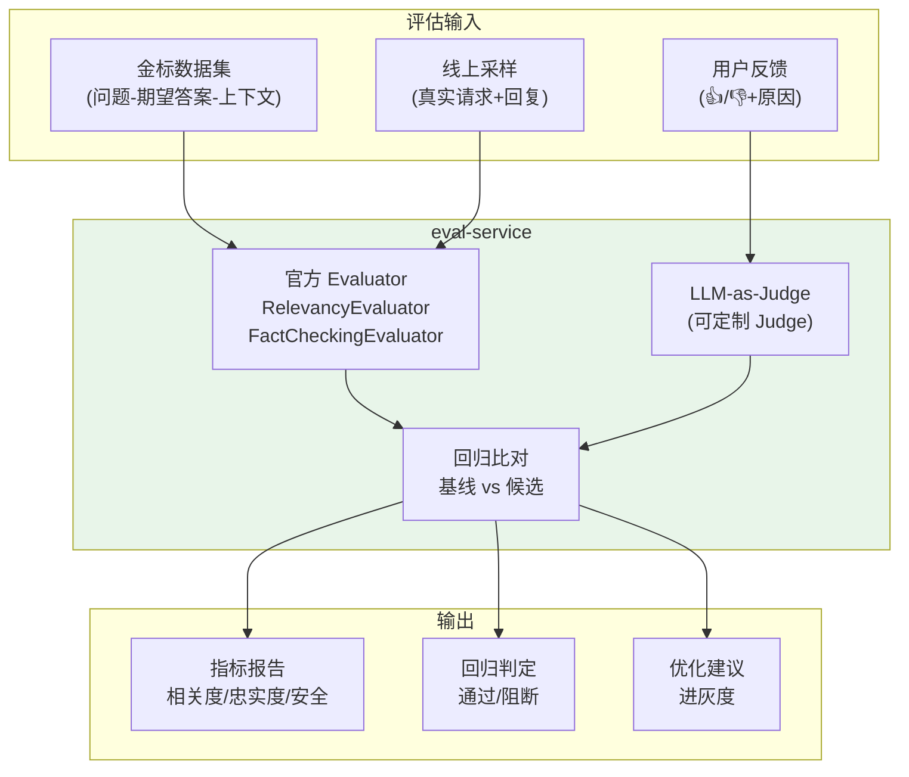
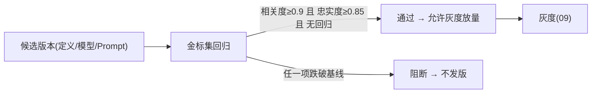
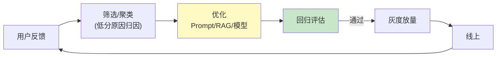
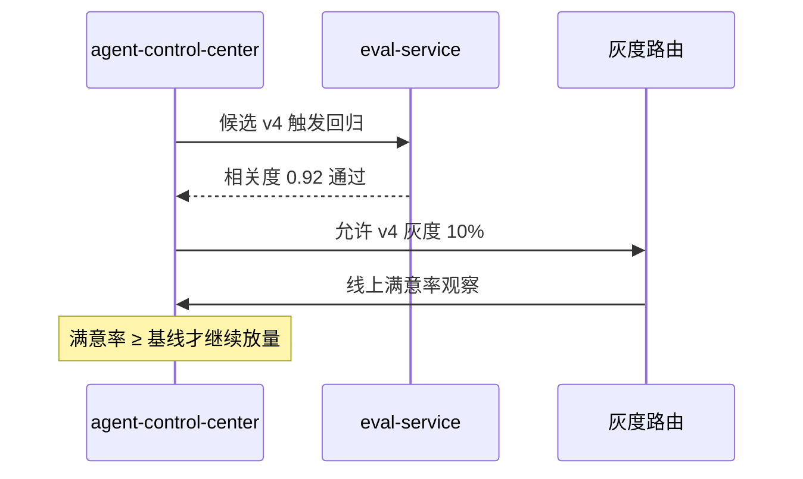

# 13-迭代十一：评估与数据飞轮——让 Agent 效果可度量、可回归、可进化

> **定位**：把项目从"能跑"推到"**效果可度量**"：官方 `Evaluator` 体系做 **LLM-as-Judge** 评估、**金标回归**防新增回归、**用户反馈采集**进数据飞轮（反馈→评测→优化→灰度→闭环）。本迭代同时给 09 的灰度发布补上"**评估通过才放量**"的闸门。读者画像：想让 Agent 效果"说得清、守得住、能进化"的读者。前置阅读：[11-迭代十-响应式强化](11-迭代十-响应式强化.md)、[教程 37-自我反思与Agent评估]、[教程 41-数据飞轮与持续改进]。
>
> **演进纪律**：本迭代做评估与飞轮；多 Agent 编排（14）、高级 RAG（15）不提前实现。
> **铁律 0**：官方 Evaluator 已 javap 实证（`org.springframework.ai.evaluation` + `org.springframework.ai.chat.evaluation`）。

---

## 一、四问（本轮：评估与数据飞轮）

| 问 | 答 |
|----|----|
| **新增了什么需求** | ① 官方 Evaluator 评估（相关性/忠实度）② 金标回归（防回归）③ 用户反馈采集 → 数据飞轮闭环 ④ 灰度评估闸门 |
| **影响了哪些模块** | 新增 `eval-service`（评估）；`admin-portal`（反馈采集）；`agent-control-center`（灰度闸门） |
| **架构如何演进** | 无度量 → 效果可度量、可回归、可进化 |
| **上一版本的痛点是什么** | ① 改 Prompt/模型不知好坏 ② 上线新版本无回归保护 ③ 用户反馈无闭环（12 前遗留） |

**本迭代验收**：① 金标集上相关度/忠实度可量化 ② 新版本回归通过才允许灰度放量 ③ 用户"👍/👎+原因"进入优化闭环。

---

## 二、评估架构



---

## 三、官方 Evaluator（javap 实证：真实存在，非虚构）

### 3.1 坐标确认（铁律 0）

| 类 | 包 | 说明 |
|----|----|------|
| `Evaluator` | `org.springframework.ai.evaluation` | 接口：`evaluate(EvaluationRequest)` → `EvaluationResponse` |
| `EvaluationRequest` | `org.springframework.ai.evaluation` | 构造：`(userText, responseContent)` / `(dataList, responseContent)` / `(userText, dataList, responseContent)` |
| `EvaluationResponse` | `org.springframework.ai.evaluation` | `isPass()` / `getScore()` / `getFeedback()` |
| `RelevancyEvaluator` | `org.springframework.ai.chat.evaluation` | 相关性评估，基于 `ChatClient.Builder` |
| `FactCheckingEvaluator` | `org.springframework.ai.chat.evaluation` | 事实核查，基于 `ChatClient.Builder` |

> 这些是 **Spring AI 2.0.0 官方真实类**（javap 实证）——之前体系曾误判"无官方 Evaluator"，已纠正（见基线 §17）。

### 3.2 评估服务

```java
package com.example.evalservice;

import org.springframework.ai.chat.evaluation.RelevancyEvaluator;
import org.springframework.ai.chat.evaluation.FactCheckingEvaluator;
import org.springframework.ai.evaluation.EvaluationRequest;
import org.springframework.ai.evaluation.EvaluationResponse;
import org.springframework.stereotype.Service;

/** 评估服务——用官方 Evaluator 对 Agent 回复打分。 */
@Service
public class EvalService {

    private final RelevancyEvaluator relevancy;
    private final FactCheckingEvaluator factChecking;

    public EvalService(RelevancyEvaluator relevancy, FactCheckingEvaluator factChecking) {
        this.relevancy = relevancy;
        this.factChecking = factChecking;
    }

    /** 相关度评估（需上下文文档）。 */
    public EvaluationResponse checkRelevance(String question, String response, java.util.List<org.springframework.ai.document.Document> docs) {
        return relevancy.evaluate(new EvaluationRequest(question, docs, response));
    }

    /** 忠实度/事实核查。 */
    public EvaluationResponse checkFact(String question, String response) {
        return factChecking.evaluate(new EvaluationRequest(question, response));
    }
}
```

---

## 四、金标回归（上线闸门）



```java
// 回归判定：候选 vs 当前基线，跌破阈值即阻断
// 本迭代验收：金标集 100 条，候选相关度/忠实度 ≥ 基线-0.02 才放行灰度
```

---

## 五、数据飞轮（反馈 → 优化 → 灰度 → 闭环）

### 5.1 反馈采集

```java
// admin-portal/对话页：用户对每条回复 👍/👎 + 可选原因
// 反馈事件入 Kafka（feedback topic），带 traceId 可回链到完整上下文
public record UserFeedback(String traceId, String sessionId, boolean helpful, String reason) {}
```

### 5.2 飞轮闭环



**飞轮环节**：
1. **采集**：用户反馈 + 自动采样（低置信度/超时/重试过的）
2. **归因**：失败原因聚类（上下文缺失 / 工具失败 / 模型幻觉 / 指令不清）
3. **优化**：Prompt 版本、RAG 语料、工具描述、模型选择——都走版本化
4. **评估**：金标回归把关
5. **灰度**：小流量验证线上指标（满意率/解决率）→ 放量

> **决策原则**（[教程 41-数据飞轮与持续改进]）：先试 Prompt/RAG（低成本），无效才微调模型；反馈驱动 vs 拍脑袋。

---

## 六、测试与验证

### 6.1 评估服务测试

```java
// 金标样例：问题/期望/上下文 → RelevancyEvaluator 打分 → 断言 ≥ 阈值
// 断言 isPass() / getScore() 符合预期
```

### 6.2 回归闸门测试

```java
// 构造一个"故意引入回归"的候选（如删掉关键语料）→ 回归评估应阻断发布
```

### 6.3 飞轮闭环测试

```bash
# 造 100 条反馈（60 条👎+原因"答案不全"）
# → 归因 → 触发 Prompt/RAG 优化 → 金标回归通过 → 灰度 → 模拟线上满意率回升
```

### 6.4 灰度联动验证



### 断言速查（PASS 判据汇总）

| # | 检验点 | PASS 判据 |
|---|--------|----------|
| 1 | 评估服务测试 | 金标样例：问题/期望/上下文 → RelevancyEvaluator 打分 → 断言 ≥ 阈值 |
| 2 | 回归闸门测试 | 构造一个"故意引入回归"的候选（如删掉关键语料）→ 回归评估应阻断发布 |
| 3 | 飞轮闭环测试 | 按本节代码/命令注释中的预期逐条核对 |
| 4 | 灰度联动验证 | 按本节代码/命令注释中的预期逐条核对 |
### 失败排查

- 先看审计事件流（每次工具/模型/检索调用都有事件）：失败发生在**入口闸**（未到业务）还是**执行层**（业务内）——入口闸失败查策略配置，执行层失败查服务日志；
- 多服务场景先分层冒烟：model-gateway → 对应业务服务 → agent-executor 串行验证，定位坏在哪一跳；
- 断言不符时优先核对**数据构造**（租户/版本/角色等测试前置是否真的生效），再怀疑实现——本项目 80% 的"测试失败"是前置数据没构造对。

---

## 七、验收对照

| 验收项 | 达标标准 | 本迭代 |
|--------|---------|--------|
| 官方 Evaluator | Relevancy/FactChecking 可用且打分 | ✅ |
| 金标回归 | 跌破基线阻断发布 | ✅ |
| 反馈闭环 | 👍/👎→归因→优化→灰度 | ✅ |
| 灰度闸门 | 评估通过才放量 | ✅ |
| 未提前引入后续能力 | 无多 Agent/高级 RAG | ✅ |

**下一篇**：13-迭代十二-多Agent协作与工作流编排。
