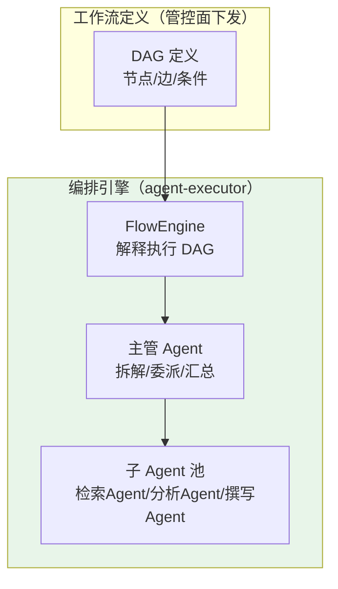
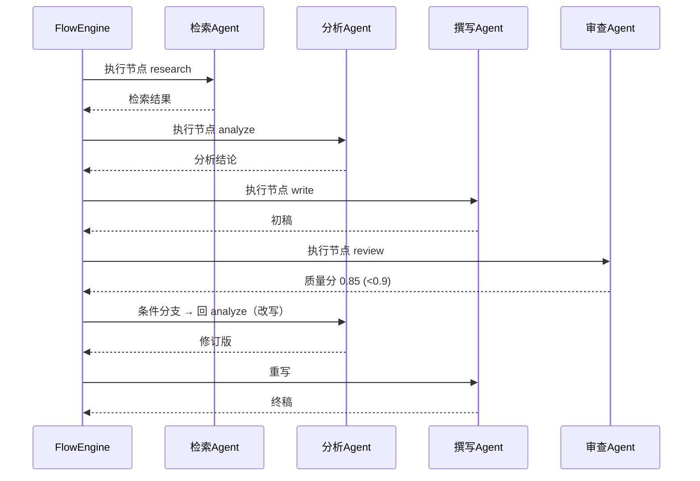
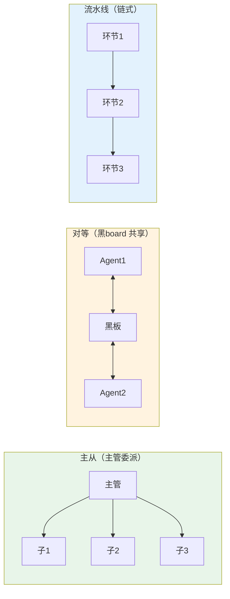

# 14-多 Agent 协作与工作流编排——从单 Agent 到多 Agent 分工

> **定位**：把 `agent-executor` 从"单个 Agent 直连模型"升级为**多 Agent 协作平台**：**DAG 工作流编排**（节点/边/条件分支/循环）、**任务委派**（主管 Agent 拆解委派给子 Agent）、三种协作模式（主从/对等/流水线）。读者画像：想让 Agent 从"单打独斗"到"团队分工"的读者。前置阅读：[12-评估与数据飞轮](12-评估与数据飞轮.md)、[教程 00-基础与核心/09-多Agent协作]、[教程 08-架构师进阶/02-Agent工作流编排]。
>
> **演进纪律**：本迭代做多 Agent 编排；高级 RAG（15）、模型供应（16）不提前实现。
> **铁律 0**：代码均经本地 jar `javap` 实证。

---

## 一、四问（本轮：多 Agent 编排）

| 问 | 答 |
|----|----|
| **新增了什么需求** | ① DAG 工作流编排（定义+执行器）② 任务委派与结果聚合 ③ 三种协作模式 |
| **影响了哪些模块** | `agent-executor`（新增编排引擎）、`agent-control-center`（工作流定义下发） |
| **架构如何演进** | 单 Agent 直连 → 多 Agent 协作平台 |
| **上一版本的痛点是什么** | ① 复杂任务单 Agent 无法分工 ② 无工作流定义/版本化 ③ 任务委派无治理（13 前遗留） |

**本迭代验收**：① 一个"调研报告"任务能被拆成"查资料/分析/撰写"三个子 Agent 并行+汇总 ② 工作流定义版本化、可灰度 ③ 条件分支/循环可执行。

### 1.1 本节核对（四问）

- [ ] "上一版痛点"（单 Agent 无法分工/无工作流版本化/委派无治理）指向本迭代，与演进纪律一致
- [ ] 新增需求三项（DAG 编排/任务委派/协作模式）分别落到 §三/§四/§五
- [ ] 验收三项分别有验证承接：并行委派→§6.2、版本化→§6.4、条件分支循环→§6.1

---

## 二、多 Agent 协作架构



### 2.1 本节核对（多 Agent 协作架构）

- [ ] 能对照 §二架构图，说清"DAG 定义（管控面）→ FlowEngine（解释执行）→ 主管/子 Agent"的分层与协作方式
- [ ] 编排引擎在 agent-executor 数据面、工作流定义在管控面下发——符合管控分离架构（决策定义走管控、执行走数据）

---

## 三、DAG 工作流定义（版本化，管控面下发）

### 3.1 定义模型

```java
package com.example.agentexecutor.flow;

import java.util.List;

/** 工作流定义（DAG）——节点 + 边 + 条件。 */
public record WorkflowDef(
        String name,
        int version,
        List<NodeDef> nodes,
        List<EdgeDef> edges
) {}

/** 节点：可以是"Agent 任务"或"聚合点" */
public record NodeDef(String id, String type, String agentRef, String prompt) {}

/** 边：source → target，可带条件 */
public record EdgeDef(String source, String target, String when) {}
```

```java
// 示例：调研报告工作流
//   research(检索) ──> analyze(分析) ──> write(撰写) ──> review(审查)
//   review.when = "quality < 0.9" 则回 analyze（循环）
```

### 3.2 编排引擎（解释执行 DAG）



### 3.3 本节测试与验证（DAG 工作流引擎）

**前置条件**：FlowEngine 已实现；子 Agent 可 mock（返回固定文本，不依赖 LLM）。

**材料**：§3.1 `WorkflowDef`/`NodeDef`/`EdgeDef` + §3.2 执行时序。

**步骤与断言**：

| # | 操作 | 预期（PASS 判据） |
|---|------|------------------|
| 1 | 定义一个线性 DAG（A→B，B→C 带 `when` 条件） | 执行顺序 A→B→C 正确（mock 日志断言） |
| 2 | 令 C 触发条件分支（quality<0.9） | 按 `when` 回跳 analyze（循环）正确执行，不无限循环 |
| 3 | 版本化核对 | `WorkflowDef.version` 递增（v1→v2 加审查节点），灰度路由可切换（§6.4） |

**失败排查**：①执行顺序错→`EdgeDef` 拓扑排序未按边依赖；②条件分支失效/死循环→`when` 判定未实现或回跳节点错；③DAG 环检测缺失→含环定义应报错而非死循环。

---

## 四、任务委派（主管 Agent 模式）

### 4.1 主管拆解 + 子 Agent 并行

```java
package com.example.agentexecutor.delegate;

import org.springframework.ai.chat.client.ChatClient;
import org.springframework.stereotype.Service;
import reactor.core.publisher.Flux;
import reactor.core.publisher.Mono;
import java.util.List;

/** 任务委派——主管 Agent 拆解任务，子 Agent 并行执行，聚合结果。 */
@Service
public class TaskDelegator {

    private final ChatClient supervisor;          // 主管
    private final ChatClient researchAgent;       // 子 Agent：检索
    private final ChatClient analysisAgent;       // 子 Agent：分析

    public TaskDelegator(ChatClient.Builder builder) {
        this.supervisor = builder.defaultSystem("你是任务主管：拆解任务为子任务，输出 JSON 数组 {subtasks:[{name,instruction}]}").build();
        this.researchAgent = builder.defaultSystem("你是资料检索员").build();
        this.analysisAgent = builder.defaultSystem("你是数据分析师").build();
    }

    /** 主管拆解 → 子 Agent 并行 → 聚合。 */
    public Mono<String> run(String task) {
        // ① 主管拆解
        return Mono.just(supervisor.prompt().user(task).call().content())
                .map(this::parseSubtasks)
                // ② 子 Agent 并行（Flux.merge 并发，限制并发数）
                .flatMapMany(Flux::fromIterable)
                .flatMap(sub -> Mono.fromCallable(() ->
                                "research".equals(sub.name())
                                        ? researchAgent.prompt().user(sub.instruction()).call().content()
                                        : analysisAgent.prompt().user(sub.instruction()).call().content()),
                        // 并发限制：同时最多 3 个子任务（响应式）
                        3)
                .collectList()
                // ③ 聚合（主管汇总）
                .map(results -> supervisor.prompt()
                        .user("汇总以下子任务结果: " + results)
                        .call().content());
    }

    private List<Subtask> parseSubtasks(String json) { /* 解析 JSON → List<Subtask> */ return List.of(); }
    public record Subtask(String name, String instruction) {}
}
```

> **并行度控制**：`flatMap(..., 3)` 限制同时 3 个子 Agent（防模型并发打爆配额）——这是响应式并发控制（12 的延续）。

### 4.2 本节测试与验证（任务委派 / 并行控制）

**前置条件**：主管/检索/分析三 ChatClient Bean 就绪（子 Agent 可 mock）。

**材料**：§4.1 `TaskDelegator`。

**步骤与断言**：

| # | 操作 | 预期（PASS 判据） |
|---|------|------------------|
| 1 | 手写 `TaskDelegator` 后编译 | `BUILD SUCCESS`；`flatMap(...,3)` 并发限制真实 API |
| 2 | 输入"调研2026年RAG趋势并给出技术选型建议" | 主管拆解出子任务列表（非空），检索/分析子 Agent 并行 | 
| 3 | 汇总 | 主管聚合结果含关键结论 |
| 4 | 并行上限 | 计数器/日志确认同时运行子 Agent ≤3（flatMap(...,3) 生效） |

**失败排查**：①子 Agent 未并行→`flatMapMany`/`flatMap` 串行化（如误用 `map`）；②并发超 3→并发参数未接入 `flatMap(...,3)`；③主管拆解空→`parseSubtasks` 解析 JSON 失败返回空列表。

---

## 五、三种协作模式



| 模式 | 适用 | 本项目落点 |
|------|------|-----------|
| 主从 | 任务可拆解（报告/调研/风控审查） | 迭代十二核心（§4） |
| 对等 | 多专家共同决策（评审/辩论） | 迭代十二扩展（评审场景） |
| 流水线 | 确定性流程（预处理→分析→产出） | 对应 DAG 线性子图 |

### 5.1 本节核对（三种协作模式）

- [ ] 能区分三种协作模式（主从/对等/流水线）及各自适用场景，并说出本项目分别落在哪些落点（§4 委派 / 评审扩展 / DAG 线性子图）
- [ ] 与 §三 DAG 定义、§四任务委派的关系（流水线=DAG 线性、主从=委派）口径一致

---

## 六、全篇回归验证

**前置条件**：§1.1-§5.1 各节核对/测试均通过；FlowEngine、主管/子 Agent、灰度路由就绪。

**材料**：§3.3/§4.2 已覆盖的 DAG 与委派探针。

**步骤与断言**：

| # | 操作 | 预期（PASS 判据） |
|---|------|------------------|
| 1 | 定义小 DAG（A→B，B→C 带条件），mock 子 Agent | 执行顺序与条件分支正确 |
| 2 | 输入"调研2026年RAG趋势并给出技术选型建议" | 主管拆解非空→检索/分析子 Agent 并行→汇总含关键结论 |
| 3 | 并行计数 | 同时运行子 Agent ≤3（`flatMap(...,3)` 生效） |
| 4 | 发布 v1 DAG→v2（加审查节点） | 灰度路由（09）从 v1 切到 v2 正常 |

**失败排查**：①失败看审计事件流定位；②DAG 死循环→环检测缺失；③子 Agent 未并行/超并发→响应式并发链核查。

---

## 七、验收对照

| 验收项 | 达标标准 | 本迭代 |
|--------|---------|--------|
| DAG 编排 | 定义+执行器，条件分支/循环可跑 | ✅ |
| 任务委派 | 主管拆解+子 Agent 并行+聚合 | ✅ |
| 协作模式 | 主从落地，对等/流水线可扩展 | ✅ |
| 并发控制 | 子 Agent 并发上限可控 | ✅ |
| 未提前引入后续能力 | 无高级 RAG/模型供应深化 | ✅ |

### 7.1 本节核对（验收对照）

- [ ] 五条验收项各有前文支撑：DAG 编排→§3.3、任务委派→§4.2、协作模式→§5.1、并发控制→§4.2、未提前引入→§1.1 口径
- [ ] "下一篇 14-高级RAG与上下文工程"顺延编号，且各回引处（标题/正文）与 13 文件号一致

**下一篇**：14-高级RAG与上下文工程。
