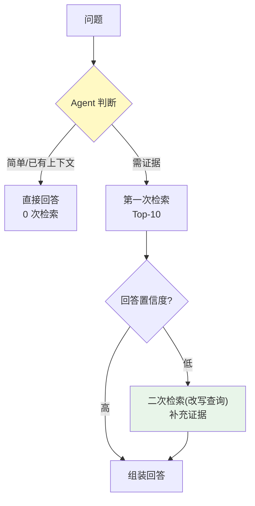
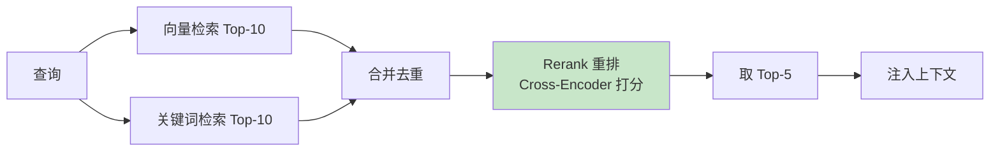
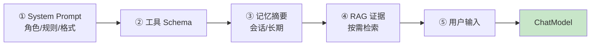

# 15-高级 RAG 与上下文工程——从"能检索"到"会检索"

> **定位**：把 `retrieval-service` 从"向量+关键词双路"升级为**高级 RAG**（Agentic RAG / 混合检索+重排 / 知识图谱可选），并落地**上下文工程**（五层拼接、上下文压缩、Prompt 版本化）。这是"回答质量"的分水岭——同样的问题，会检索的系统答得准、省 Token。读者画像：理解基础 RAG、想让检索质量与上下文利用到达生产级的读者。前置阅读：[13-多Agent协作与工作流编排](13-多Agent协作与工作流编排.md)、[教程 35-高级RAG与AgenticRAG]、[教程 34-上下文工程]。
>
> **演进纪律**：本迭代做高级 RAG + 上下文工程；模型供应（16）、可解释性（17）不提前实现。
> **铁律 0**：代码均经本地 jar `javap` 实证。

---

## 一、四问（本轮：高级 RAG 与上下文）

| 问 | 答 |
|----|----|
| **新增了什么需求** | ① Agentic RAG（Agent 自主决定检索深度/次数）② 混合检索+重排（Rerank）③ 上下文工程（五层拼接/压缩/Prompt 版本化） |
| **影响了哪些模块** | `retrieval-service`（检索策略）、`agent-executor`（上下文组装） |
| **架构如何演进** | 被动检索 → 自主检索 + 上下文优化 |
| **上一版本的痛点是什么** | ① 固定 Top-K 检索，复杂问题召回不足、简单问题浪费 ② 无重排，最相关块未必第一 ③ 上下文无压缩，长对话爆 Token（14 前遗留） |

**本迭代验收**：① Agentic RAG：Agent 判断"要不要再检索一次" ② 重排后 Top-1 准确率提升（金标评测）③ 长上下文压缩后 P99 Token 下降 ≥30% 且质量不降。

### 1.1 本节核对（四问）

- [ ] "上一版痛点"（固定 Top-K/无重排/无压缩）与演进纪律一致，是本次检索升级动因
- [ ] 新增需求三项（Agentic RAG/混合重排/上下文工程）分别落到 §二/§三/§四
- [ ] 验收三项分别有验证承接：按需检索→§6.1、重排准确率→§6.2、压缩→§6.3

---

## 二、检索策略分层



**Agentic RAG 关键**：Agent 不是"每次都检索"，而是**按需检索**——有上下文直接答、缺证据才查、证据不足再查一次。省 Token 且准。

### 2.1 本节核对（Agentic RAG 检索策略）

- [ ] 能对照 §二流程图，说清三类判决：简单问题 0 次检索 / 需证据 1 次 / 置信度低二次改写查询再查——与"按需检索省 Token"目标一致
- [ ] Agentic RAG 的决策逻辑与 13 迭代的多 Agent 编排（检索 Agent）可协作，未脱离现有 agent-executor 架构

---

## 三、混合检索 + 重排（生产级检索质量）



### 3.1 检索服务（向量 + 关键词 + 重排接口）

```java
package com.example.retrievalservice.rank;

import org.springframework.ai.vectorstore.SearchRequest;
import org.springframework.ai.vectorstore.VectorStore;
import org.springframework.ai.vectorstore.filter.FilterExpressionBuilder;
import org.springframework.ai.document.Document;
import org.springframework.stereotype.Service;
import java.util.*;

/** 混合检索 + 重排。 */
@Service
public class HybridRetriever {

    private final VectorStore vectorStore;

    public HybridRetriever(VectorStore vectorStore) {
        this.vectorStore = vectorStore;
    }

    public List<Document> hybridSearch(String tenantId, String query, int topK) {
        // ① 向量检索（真实 API：SearchRequest.builder + Filter）
        FilterExpressionBuilder b = new FilterExpressionBuilder();
        List<Document> vec = vectorStore.similaritySearch(SearchRequest.builder()
                .query(query).topK(topK)
                .filterExpression(b.eq("tenant_id", tenantId).build())
                .build());
        // ② 关键词检索（PG 全文，同 06 迭代的 JdbcClient 方案）
        List<Document> kw = keywordSearch(query, topK);
        // ③ 合并去重（按文档 id）
        return mergeDedupe(vec, kw);
    }

    private List<Document> keywordSearch(String query, int topK) { /* PG ts_rank */ return List.of(); }
    private List<Document> mergeDedupe(List<Document> a, List<Document> b) {
        LinkedHashMap<String, Document> m = new LinkedHashMap<>();
        for (Document d : a) m.putIfAbsent(d.getId(), d);
        for (Document d : b) m.putIfAbsent(d.getId(), d);
        return new ArrayList<>(m.values());
    }
}
```

> **重排落点**：本迭代先合并去重（重排打分服务可选接轻量 Cross-Encoder；金标评测驱动是否上重排）。

### 3.2 本节测试与验证（混合检索 + 重排）

**前置条件**：retrieval-service 含租户语料；金标评测集就绪。

**材料**：§3.1 `HybridRetriever`（向量+关键词+合并去重）。

**步骤与断言**：

| # | 操作 | 预期（PASS 判据） |
|---|------|------------------|
| 1 | 手写 `HybridRetriever` 后编译 | `BUILD SUCCESS`；`VectorStore.similaritySearch`/`FilterExpressionBuilder` 真实 API |
| 2 | 对一条查询 hybridSearch | 向量与关键词双路结果按 `id` 合并去重，无重复文档 |
| 3 | 金标评测（对比纯向量） | 重排后 Top-1 准确率提升（若上重排）或持平不加分（未上重排时如实记录） |
| 4 | 租户过滤（`FilterExpression`） | 只返回该租户文档，不跨界 |

**失败排查**：①去重失效→`putIfAbsent` 未按文档 `id` 去重（doc id 为空全相同）；②Top-1 无提升→重排未真正接入或打分器效果差（决策是否启用）；③过滤失效→`eq("tenant_id",…)` 未进 `filterExpression`。

---

## 四、上下文工程（五层拼接 + 压缩）

### 4.1 五层拼接顺序（[教程 34-上下文工程]）



### 4.2 上下文压缩（长对话省 Token）

```java
package com.example.agentexecutor.context;

import org.springframework.ai.chat.prompt.Prompt;
import org.springframework.ai.chat.messages.SystemMessage;
import org.springframework.ai.chat.messages.Message;
import java.util.List;

/** 上下文压缩——历史消息超阈值时摘要化（真实 API：Prompt/SystemMessage）。 */
public class ContextCompressor {

    private static final int MAX_HISTORY_TOKENS = 2000;

    /** 把超长历史压缩成摘要 SystemMessage。 */
    public Prompt compress(Prompt prompt, int historyTokens) {
        if (historyTokens <= MAX_HISTORY_TOKENS) {
            return prompt;   // 未超阈值不压缩
        }
        // 摘要 Agent 压缩历史（概念代码：真实用 ChatClient 调摘要）
        String summary = summarize(prompt);
        return new Prompt(List.of(new SystemMessage("历史对话摘要：" + summary)));
    }

    private String summarize(Prompt prompt) { return "…"; }
}
```

### 4.3 本节测试与验证（上下文工程：五层拼接 / 压缩）

**前置条件**：上下文组装点已接入五层顺序；压缩 Agent 可 mock。

**材料**：§4.1 五层顺序 + §4.2 `ContextCompressor`。

**步骤与断言**：

| # | 操作 | 预期（PASS 判据） |
|---|------|------------------|
| 1 | 手写 `ContextCompressor` 后编译 | `BUILD SUCCESS`；`Prompt`/`SystemMessage` 真实 API |
| 2 | 历史 ≤ 2000 token 的 prompt | `compress` 原样返回，不压缩 |
| 3 | 10 轮长对话超阈值 | 压缩为摘要 `SystemMessage`，Token 下降 ≥30%（金标验证） |
| 4 | 五层顺序核对 | 拼接顺序=System→工具 Schema→记忆→RAG→用户输入，与 [教程 34] 一致 |

**失败排查**：①未超阈值仍压缩→`MAX_HISTORY_TOKENS` 判断被绕过；②压缩后质量崩→摘要 Agent 信息丢失，需在评估回归把关；③五层顺序错→组装点顺序与 §4.1 不一致。

---

## 五、Prompt 版本化（灰度联动）

```java
// Prompt 作为版本化资产（与编排定义同管道，09 灰度路由复用）：
//   agent-control-center 存 prompt_version
//   灰度：10% 流量用 v2 Prompt，90% 用 v1 → 评估（13）通过才放量
// 本迭代验收：Prompt 改版可灰度、可回滚，评估闸门把关
```

### 5.1 本节核对（Prompt 版本化）

- [ ] 理解 Prompt 与编排定义走同一版本化管道（agent-control-center 存 prompt_version），灰度路由复用 09
- [ ] 改版流程（10%→评估通过→放量→回滚演练）前后闭环，与 13 评估闸门联动

---

## 六、全篇回归验证

**前置条件**：§1.1-§5.1 各节核对/测试均通过；金标集、检索服务、压缩、Prompt 灰度就绪。

**材料**：§3.2/§4.3 已覆盖的检索与压缩探针 + Agentic 决策与 Prompt 灰度。

**步骤与断言**：

| # | 操作 | 预期（PASS 判据） |
|---|------|------------------|
| 1 | 金标集简单 vs 复杂问题 | 简单问题 0 次检索、复杂问题检索 1-2 次（省 Token） |
| 2 | 混合检索金标评测 | Top-1 准确率（重排后）对比纯向量有提升或如实记录 |
| 3 | 10 轮对话压缩 | Token 下降 ≥30%，金标回答质量不降（评估回归） |
| 4 | v2 Prompt 灰度 10% | 评估通过→放量→回滚演练正常 |

**失败排查**：①失败看审计事件流定位；②Agentic 检索次数偏差→决策逻辑阈值调参；③压缩质量崩→评估回归拦截；④Prompt 灰度回滚→回 09 版本化开关核查。

---

## 七、验收对照

| 验收项 | 达标标准 | 本迭代 |
|--------|---------|--------|
| Agentic RAG | 按需检索、缺证据才二次查 | ✅ |
| 混合检索 | 向量+关键词合并、可重排 | ✅ |
| 上下文压缩 | 长对话 Token 降 ≥30% | ✅ |
| Prompt 版本化 | 灰度+回滚+评估闸门 | ✅ |
| 未提前引入后续能力 | 无模型供应/可解释性 | ✅ |

### 7.1 本节核对（验收对照）

- [ ] 五条验收项各有前文支撑：Agentic RAG→§2.1/§六回归 1、混合检索→§3.2、上下文压缩→§4.3、Prompt 版本化→§5.1、未提前引入→§1.1 口径
- [ ] "下一篇 15-模型供应与边缘部署"顺延编号，且各回引处（标题/正文）与 14 文件号一致

**下一篇**：15-模型供应与边缘部署。
