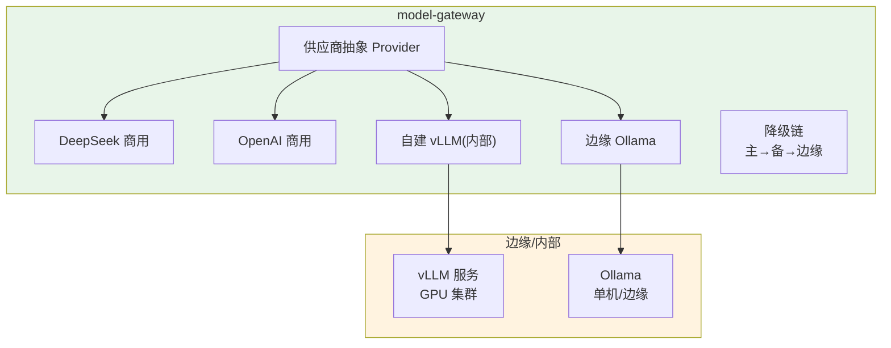
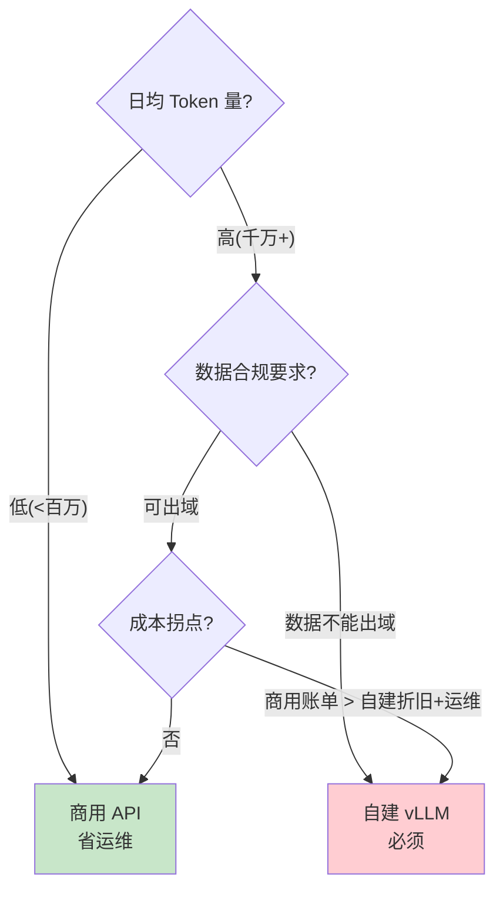
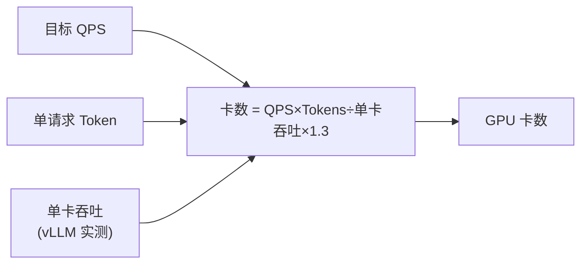

# 16-模型供应与边缘部署——多供应商 + 自建/商用决策 + 边缘推理

> **定位**：把 `model-gateway` 从"DeepSeek 单一供应商"升级为**多供应商供应**（商用 API + 自建 vLLM + 边缘 Ollama）、**Key 池配额深化**（滑动窗口）、**自建 vs 商用决策框架**、**降级链多级冗余**，并给出**GPU 容量规划**。读者画像：想理解"模型到底怎么供应、什么时候该自建、边缘怎么落地"的读者。前置阅读：[14-高级RAG与上下文工程](14-高级RAG与上下文工程.md)、[教程 44-多模型协作与供应策略]、[附录 16-AIInfra与推理部署]。
>
> **演进纪律**：本迭代做模型供应；可解释性（17）、安全深化（18）不提前实现。
> **铁律 0**：代码均经本地 jar `javap` 实证；vLLM/Ollama/Resilience4j 为第三方，标注真实坐标。

---

## 一、四问（本轮：模型供应与边缘）

| 问 | 答 |
|----|----|
| **新增了什么需求** | ① 多供应商接入（DeepSeek/OpenAI/自建 vLLM/Ollama）② Key 池滑动窗口配额 ③ 自建 vs 商用决策框架 ④ 多级降级链 ⑤ GPU 容量规划 |
| **影响了哪些模块** | `model-gateway`（供应商抽象）、部署层（边缘推理） |
| **架构如何演进** | 单供应商 → 多供应冗余 + 决策框架 + 边缘 |
| **上一版本的痛点是什么** | ① 单一供应商单点风险 ② Key 池无配额窗口 ③ 不知何时自建 ④ 边缘无落地（15 前遗留） |

**本迭代验收**：① 主供应商故障 → 自动切备用供应商（多级降级）② Key 池滑动窗口限流 ③ 自建 vs 商用决策表可用 ④ 边缘部署一套（Ollama/vLLM）可跑。

---

## 二、多供应商供应架构



---

## 三、供应商抽象 + 降级链

### 3.1 供应商 Provider（统一接口）

```java
package com.example.modelgateway.provider;

import org.springframework.ai.chat.model.ChatModel;
import org.springframework.ai.openai.OpenAiChatModel;
import org.springframework.ai.openai.OpenAiChatOptions;
import org.springframework.ai.deepseek.DeepSeekChatModel;   // javap 实证：spring-ai-deepseek
import org.springframework.stereotype.Component;
import java.util.List;

/** 供应商池——统一获取 ChatModel，按供应商路由。 */
@Component
public class ProviderPool {

    // 供应商 → 模型（构造方式因供应商而异，javap 实证）
    private final List<ProviderEntry> providers;

    public ProviderPool(OpenAiChatModel openAi, DeepSeekChatModel deepSeek) {
        this.providers = List.of(
                new ProviderEntry("deepseek", deepSeek),
                new ProviderEntry("openai", openAi)
                // 自建 vLLM = 一个 base-url 指向内网的 OpenAiChatModel
        );
    }

    /** 按名称取模型（找不到降级到默认）。 */
    public ChatModel byName(String name) {
        return providers.stream()
                .filter(p -> p.name.equals(name))
                .map(p -> p.model)
                .findFirst()
                .orElse(providers.get(0).model);
    }

    public record ProviderEntry(String name, ChatModel model) {}
}
```

### 3.2 多级降级链（主 → 备 → 边缘）

```java
package com.example.modelgateway.fallback;

import org.springframework.ai.chat.model.ChatModel;
import org.springframework.ai.chat.prompt.Prompt;
import org.springframework.stereotype.Component;
import reactor.core.publisher.Mono;
import java.util.List;

/** 多级降级——主供应商失败 → 备用 → 边缘；三级冗余。 */
@Component
public class MultiTierFallback {

    private final List<ChatModel> chain;   // [主, 备, 边缘]

    public MultiTierFallback(ChatModel primary, ChatModel backup, ChatModel edge) {
        this.chain = List.of(primary, backup, edge);
    }

    public Mono<String> callWithFallback(Prompt prompt) {
        return Mono.defer(() -> {
            Mono<String> result = Mono.error(new RuntimeException("start"));
            for (ChatModel model : chain) {
                result = result.onErrorResume(e ->
                        Mono.fromCallable(() -> model.call(prompt).getResult().getOutput().getText()));
            }
            return result;
        });
    }
}
```

> **演进**：12 迭代的 try/catch 降级 → 本迭代响应式链式降级（`onErrorResume` 逐级尝试）。生产可用 Resilience4j `CircuitBreaker`（坐标 `io.github.resilience4j:resilience4j-spring-boot3`，第三方需引入）。

---

## 四、Key 池滑动窗口（深化 04 的轮询）

```java
// 04 的 ApiKeyPool 是纯轮询；本迭代加滑动窗口配额：
//   Key 在窗口内调用次数/失败率超阈值 → 暂时摘除，窗口后恢复
// 实现：Redis 存每个 Key 的 (window_start, count, failures)，超阈值摘除
// 本迭代验收：单 Key 被限流 → 自动切其他 Key，不中断服务
```

---

## 五、自建 vs 商用决策框架



| 维度 | 商用 API | 自建 vLLM | 边缘 Ollama |
|------|---------|-----------|------------|
| 成本 | 按量，高负载贵 | 固定，高负载划算 | 零 API 费 |
| 数据合规 | 出域风险 | 可控 | 本地可控 |
| 延迟 | 网络 | 内网低 | 最低 |
| 运维 | 零 | GPU/容量/版本 | 设备管理 |
| 适用 | 起步/弹性 | 稳定高负载/合规 | 隐私/断网/边缘 |

---

## 六、GPU 容量规划（自建/边缘）

### 6.1 容量公式

```
所需 GPU 卡数 = 目标 QPS × 单请求生成 Token 数 / 单卡吞吐(Token/s) × 冗余系数(1.3)
```



### 6.2 边缘部署形态

```yaml
# 边缘/内部 vLLM 服务（第三方，真实坐标 vllm 项目）
# OpenAI 兼容端点：http://vllm-internal:8000/v1
# model-gateway 配一个 base-url 指向它即接入自建供应商
spring:
  ai:
    openai:
      base-url: ${VLLM_URL:http://vllm-internal:8000/v1}   # 自建 vLLM（OpenAI 兼容）
```

---

## 七、测试与验证

### 7.1 多级降级测试

```bash
# 主供应商故障 → 自动切备用 → 再切边缘
# 断言：调用方无感、降级链路日志可见、指标记录降级次数
```

### 7.2 Key 池滑动窗口测试

```java
// 模拟单 Key 限流 → 自动摘除 → 切其他 Key → 窗口后恢复
```

### 7.3 决策框架验证

```java
// 用决策表判断：某场景该用商用/自建/边缘（给出理由）
```

### 7.4 容量计算验证

```java
// 给定 QPS=50, Tokens=800, 单卡=2000 Token/s → 卡数 = ceil(50*800/2000*1.3)=26
```

### 断言速查（PASS 判据汇总）

| # | 检验点 | PASS 判据 |
|---|--------|----------|
| 1 | 多级降级测试 | 主供应商故障 → 自动切备用 → 再切边缘 |
| 2 | Key 池滑动窗口测试 | 按本节代码/命令注释中的预期逐条核对 |
| 3 | 决策框架验证 | 按本节代码/命令注释中的预期逐条核对 |
| 4 | 容量计算验证 | 按本节代码/命令注释中的预期逐条核对 |
### 失败排查

- 先看审计事件流（每次工具/模型/检索调用都有事件）：失败发生在**入口闸**（未到业务）还是**执行层**（业务内）——入口闸失败查策略配置，执行层失败查服务日志；
- 多服务场景先分层冒烟：model-gateway → 对应业务服务 → agent-executor 串行验证，定位坏在哪一跳；
- 断言不符时优先核对**数据构造**（租户/版本/角色等测试前置是否真的生效），再怀疑实现——本项目 80% 的"测试失败"是前置数据没构造对。

---

## 八、验收对照

| 验收项 | 达标标准 | 本迭代 |
|--------|---------|--------|
| 多供应商 | 商用+自建+边缘接入 | ✅ |
| 多级降级 | 主→备→边缘 三级冗余 | ✅ |
| Key 池窗口 | 滑动窗口限流+摘除恢复 | ✅ |
| 决策框架 | 自建 vs 商用判断表 | ✅ |
| 容量规划 | GPU 卡数公式可算 | ✅ |
| 未提前引入后续能力 | 无可解释性/安全深化 | ✅ |

**下一篇**：16-可解释性与事件溯源。
