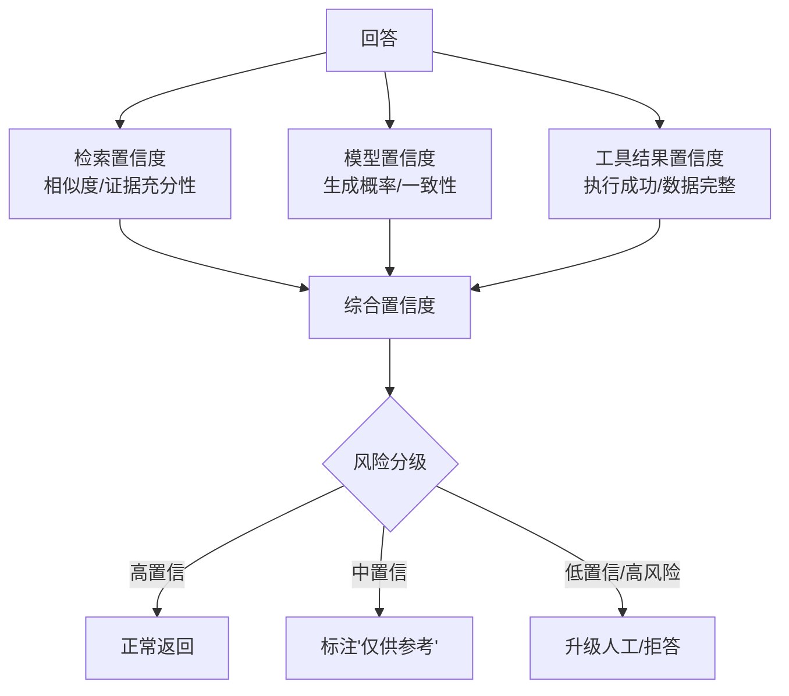
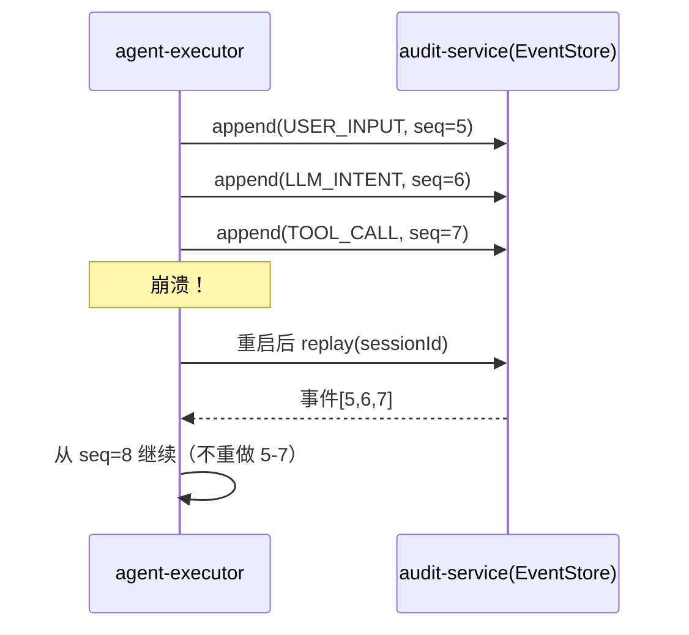
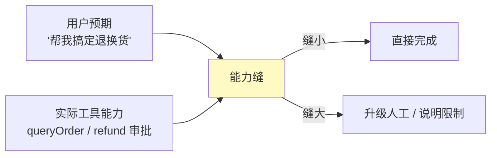

# 17-可解释性与事件溯源——每一步都有据可查

> **定位**：把平台推到"**可解释、可复盘、可恢复**"：**可解释性**（置信度/风险分级/决策回放可视化）、**事件溯源升级**（10 的检查点 → 完整事件溯源会话日志：每一步事件落库、崩溃闭合、能力缝记录）、**崩溃恢复**（重放事件重建会话）。读者画像：想回答"Agent 为什么这么答？崩了怎么恢复？"的读者。前置阅读：[15-模型供应与边缘部署](15-模型供应与边缘部署.md)、[教程 08-架构师进阶/06-长任务持久化与中断恢复]、[附录 12-AI治理与合规/00-NIST-AI-RMF框架]。
>
> **演进纪律**：本迭代做可解释 + 事件溯源；安全深化（18）、前端（19）不提前实现。
> **铁律 0**：代码均经本地 jar `javap` 实证。

---

## 一、四问（本轮：可解释与事件溯源）

| 问 | 答 |
|----|----|
| **新增了什么需求** | ① 置信度/风险分级（回答可信度）② 决策回放可视化（每步：意图→证据→结论）③ 事件溯源会话日志（升级检查点）④ 崩溃闭合/恢复 |
| **影响了哪些模块** | `agent-executor`（置信度/事件记录）、`audit-service`（事件溯源库）、`admin-portal`（回放） |
| **架构如何演进** | 检查点 → 完整事件溯源；黑盒 → 可解释 |
| **上一版本的痛点是什么** | ① Agent 回答无置信度，用户无从判断 ② 检查点只存步骤不存"为什么" ③ 崩溃后无法完整复盘（16 前遗留） |

**本迭代验收**：① 每个回答带置信度/风险分级 ② 决策可回放（意图→证据→结论）③ 会话全程事件溯源，崩溃可重放恢复 ④ 审计事件不可篡改。

### 1.1 本节核对（四问）

- [ ] "上一版痛点"（回答无置信度/检查点不存为什么/崩后无法复盘）指向本迭代，与演进纪律一致
- [ ] 新增需求四项（置信度分级/回放/事件溯源/崩溃恢复）分别落到 §二/§三
- [ ] 验收四项分别有验证承接：置信度→§5.1、回放→§5.3、事件溯源+崩溃→§5.2、不可篡改→§5.4

---

## 二、可解释性：置信度与风险分级

### 2.1 置信度来源



### 2.2 置信度模型

```java
package com.example.agentexecutor.explain;

import org.springframework.ai.chat.model.Generation;
import org.springframework.ai.chat.metadata.ChatGenerationMetadata;
import org.springframework.stereotype.Component;

/** 置信度计算——综合检索相似度 + 工具成功率 + 模型 finish_reason。 */
@Component
public class ConfidenceScorer {

    public double score(double retrievalSim, double toolSuccessRate, Generation generation) {
        // finishReason 来自 Generation 级 ChatGenerationMetadata（javap 实证）
        boolean stopped = "stop".equals(generation.getMetadata().getFinishReason());
        double modelFactor = stopped ? 1.0 : 0.7;   // 非正常终止降权
        return 0.4 * retrievalSim + 0.3 * toolSuccessRate + 0.3 * modelFactor;
    }
}
```

### 2.3 风险分级决策

```java
public record RiskVerdict(double confidence, String level /* LOW/MED/HIGH */) {
    // LOW: ≥0.85 正常；MED: 0.7-0.85 标注来源；HIGH: <0.7 或风险动作 → 升级/人工
}
```

### 2.4 本节测试与验证（置信度与风险分级）

**前置条件**：`Generation` 元数据可得（`ChatGenerationMetadata.getFinishReason()`，javap 实证）。

**材料**：§2.2 `ConfidenceScorer` + §2.3 `RiskVerdict` 分级逻辑。

**步骤与断言**：

| # | 操作 | 预期（PASS 判据） |
|---|------|------------------|
| 1 | 手写 `ConfidenceScorer` 后编译 | `BUILD SUCCESS`；`generation.getMetadata().getFinishReason()` 真实 API |
| 2 | 构造高相似/高工具成功/ finish_reason=stop | 综合置信度 ≥0.85，分级 LOW（正常返回） |
| 3 | 构造低置信/高风险动作（如退款） | 分级 HIGH → 升级人工/拒答；高风险动作即使置信度高也要求审批（与 08 HITL 联动） |
| 4 | 非正常 finish_reason | `modelFactor=0.7` 生效，综合分被降权 |

**失败排查**：①分级错→置信度阈值（0.85/0.7）边界未对齐；②高风险不升级→风险动作白名单未命中；③`getFinishReason` null→非正常终止的 Generation 元数据缺失（按降权口径处理）。

---

## 三、事件溯源会话日志（升级检查点）

### 3.1 事件模型

```java
// 会话每一步都是一个不可变事件（append-only，不可篡改）
public record AgentEvent(
        String eventId,
        String sessionId,
        long seq,            // 顺序号（回放依据）
        String type,         // USER_INPUT / LLM_INTENT / TOOL_CALL / TOOL_RESULT / LLM_RESPONSE / APPROVAL
        String payload,      // 事件内容（脱敏）
        double confidence,   // 该步置信度
        String traceId
) {}
```

### 3.2 事件溯源库（append-only + 审计签名）

```java
package com.example.auditservice.eventsourcing;

import org.springframework.jdbc.core.JdbcTemplate;
import org.springframework.stereotype.Repository;
import java.util.List;

/** 事件溯源——追加写，seq 递增，重建会话靠它。 */
@Repository
public class EventStore {

    private final JdbcTemplate jdbc;

    public EventStore(JdbcTemplate jdbc) {
        this.jdbc = jdbc;
    }

    /** 追加事件（幂等：eventId 唯一） */
    public void append(AgentEvent event) {
        jdbc.update(
                "INSERT INTO agent_event(event_id, session_id, seq, type, payload, confidence, trace_id) " +
                "VALUES (?,?,?,?,?,?,?) ON CONFLICT DO NOTHING",
                event.eventId(), event.sessionId(), event.seq(), event.type(),
                event.payload(), event.confidence(), event.traceId());
    }

    /** 重放：按会话取全部事件（顺序由 seq 保证）。 */
    public List<AgentEvent> replay(String sessionId) {
        return jdbc.query(
                "SELECT * FROM agent_event WHERE session_id=? ORDER BY seq",
                (rs, i) -> new AgentEvent(rs.getString(1), rs.getString(2), rs.getLong(3),
                        rs.getString(4), rs.getString(5), rs.getDouble(6), rs.getString(7)),
                sessionId);
    }
}
```

### 3.3 崩溃闭合 / 会话恢复



### 3.4 本节测试与验证（事件溯源 / 崩溃恢复 / 不可篡改）

**前置条件**：`agent_event` 表已建（含 event_id 唯一约束）。

**材料**：§3.1 `AgentEvent` + §3.2 `EventStore`。

**步骤与断言**：

| # | 操作 | 预期（PASS 判据） |
|---|------|------------------|
| 1 | 写入 5 个事件（seq=1..5） | `append` 幂等（eventId 唯一，`ON CONFLICT DO NOTHING`） |
| 2 | `replay(sessionId)` | 按 `seq` 顺序返回 5 个事件，内容完整 |
| 3 | 崩溃恢复模拟：事件只写到 seq=3 后"重启" | `replay` 拿到 1-3，从 seq=4 续写（不重做 1-3） |
| 4 | 不可篡改 | `agent_event` 仅 INSERT（无 UPDATE/触发器审计签名），校验通过 |

**失败排查**：①重放乱序→`ORDER BY seq` 缺失或 seq 未递增；②幂等失效→`ON CONFLICT DO NOTHING` 未命中（eventId 重复）；③崩溃续跑重做→恢复逻辑未读 `replay` 最大 seq 作游标。

---

## 四、能力缝（工具能力 vs 用户预期）



**能力缝记录**：当 Agent 发现"用户要的超出工具能力"时，记录能力缝事件 → 进数据飞轮 → 驱动新工具/优化（13 的反馈闭环联动）。

### 4.1 本节核对（能力缝）

- [ ] 能解释"能力缝=用户预期 vs 实际工具能力"的差距，以及缝小/缝大分别的处理（直接完成 / 升级人工）
- [ ] 能力缝事件进数据飞轮与 13 反馈闭环联动口径一致，未脱离现有事件流架构

---

## 五、全篇回归验证

**前置条件**：§1.1-§4.1 各节核对/测试均通过；EventStore、审计库、回放端就绪。

**材料**：§2.4/§3.4 已覆盖的置信度与事件溯源探针 + 回放可视化。

**步骤与断言**：

| # | 操作 | 预期（PASS 判据） |
|---|------|------------------|
| 1 | 构造不同相似度/工具成功率 | 置信度与分级正确；高风险（退款）即使置信度高也要求审批（与 08 HITL 联动） |
| 2 | 写入 5 个事件 → `replay(sessionId)` | 顺序与内容完整；崩溃模拟写到 seq=3 后"重启"→ 从 seq=4 续 |
| 3 | admin-portal 回放 | 每步（意图/证据/结论）可视化 + 置信度标注 |
| 4 | 不可篡改复查 | `agent_event` 无 UPDATE（仅 INSERT），审计签名校验通过 |

**失败排查**：①失败看审计事件流定位；②置信度→§2.4 回查；③事件乱序/续跑重做→§3.4 回查。

---

## 六、验收对照

| 验收项 | 达标标准 | 本迭代 |
|--------|---------|--------|
| 置信度/风险分级 | 每回答带分级，高风险升级 | ✅ |
| 决策回放 | 意图→证据→结论可视化 | ✅ |
| 事件溯源 | append-only + seq 重放 | ✅ |
| 崩溃恢复 | 崩溃后从断点续跑 | ✅ |
| 能力缝 | 记录并进飞轮 | ✅ |
| 未提前引入后续能力 | 无安全深化/前端深化 | ✅ |

### 6.1 本节核对（验收对照）

- [ ] 六条验收项各有前文支撑：置信度分级→§2.4、决策回放→§3.4/§五回归 3、事件溯源→§3.4、崩溃恢复→§五回归 2、能力缝→§4.1、未提前引入→§1.1 口径
- [ ] "下一篇 17-安全纵深深化"顺延编号，且各回引处（标题/正文）与 16 文件号一致

**下一篇**：17-安全纵深深化。
