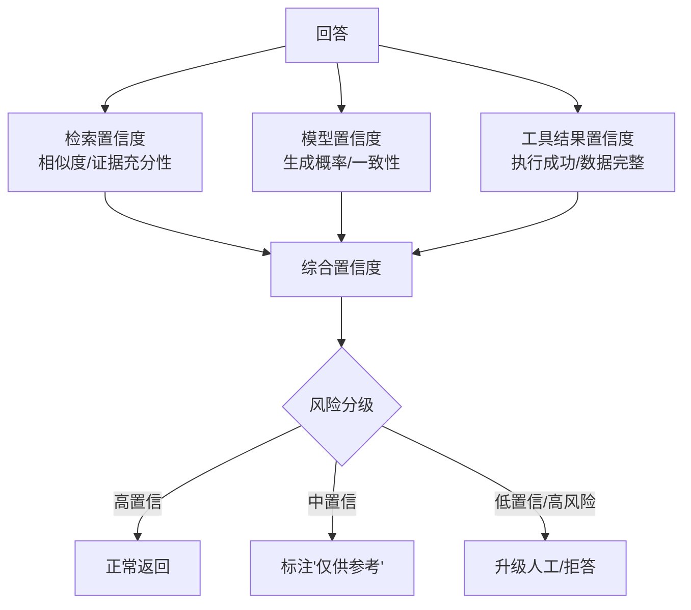
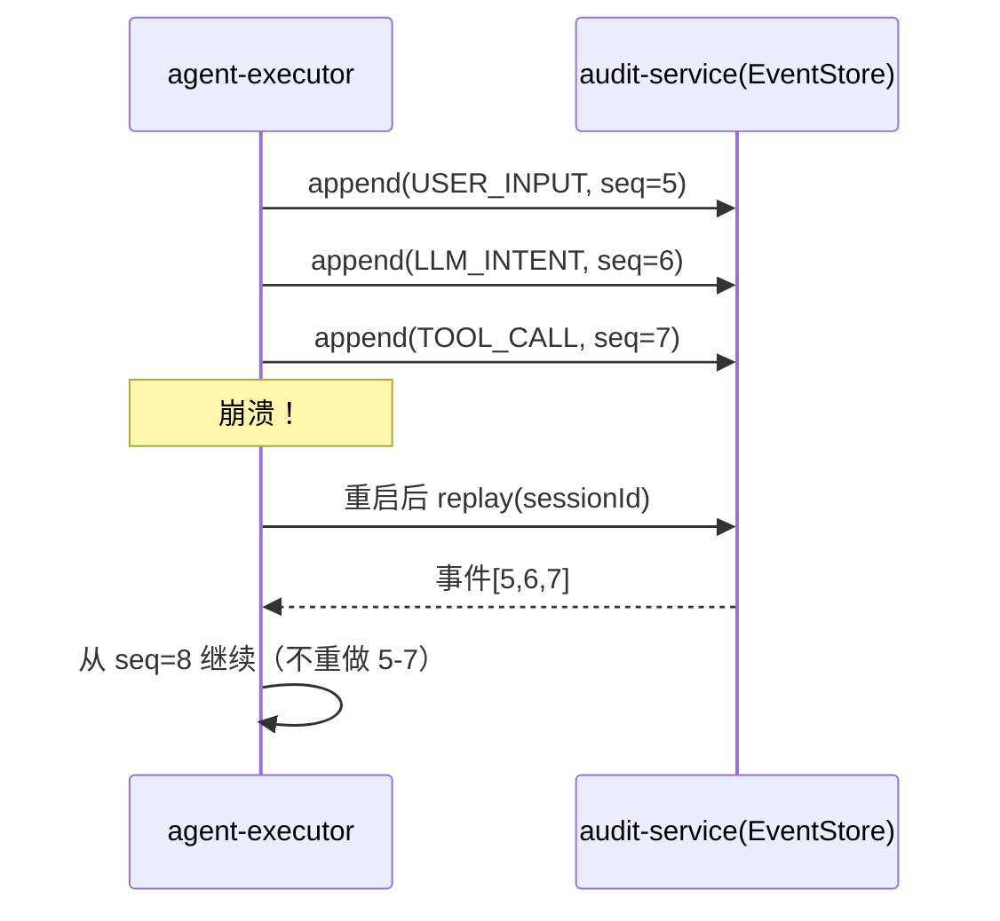
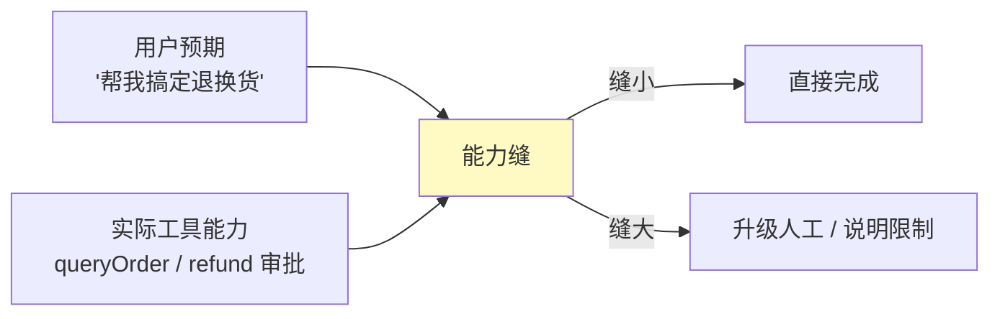

# 17-迭代十五：可解释性与事件溯源——每一步都有据可查

> **定位**：把平台推到"**可解释、可复盘、可恢复**"：**可解释性**（置信度/风险分级/决策回放可视化）、**事件溯源升级**（10 的检查点 → 完整事件溯源会话日志：每一步事件落库、崩溃闭合、能力缝记录）、**崩溃恢复**（重放事件重建会话）。读者画像：想回答"Agent 为什么这么答？崩了怎么恢复？"的读者。前置阅读：[16-迭代十四-模型供应与边缘部署](16-迭代十四-模型供应与边缘部署.md)、[教程 40-长任务持久化与中断恢复]、[附录 13-AI治理与合规/00-NIST-AI-RMF框架]。
>
> **演进纪律**：本迭代做可解释 + 事件溯源；安全深化（18）、前端（19）不提前实现。
> **铁律 0**：代码均经本地 jar `javap` 实证。

---

## 一、四问（本轮：可解释与事件溯源）

| 问 | 答 |
|----|----|
| **新增了什么需求** | ① 置信度/风险分级（回答可信度）② 决策回放可视化（每步：意图→证据→结论）③ 事件溯源会话日志（升级检查点）④ 崩溃闭合/恢复 |
| **影响了哪些模块** | `agent-executor`（置信度/事件记录）、`audit-service`（事件溯源库）、`admin-portal`（回放） |
| **架构如何演进** | 检查点 → 完整事件溯源；黑盒 → 可解释 |
| **上一版本的痛点是什么** | ① Agent 回答无置信度，用户无从判断 ② 检查点只存步骤不存"为什么" ③ 崩溃后无法完整复盘（16 前遗留） |

**本迭代验收**：① 每个回答带置信度/风险分级 ② 决策可回放（意图→证据→结论）③ 会话全程事件溯源，崩溃可重放恢复 ④ 审计事件不可篡改。

---

## 二、可解释性：置信度与风险分级

### 2.1 置信度来源



### 2.2 置信度模型

```java
package com.example.agentexecutor.explain;

import org.springframework.ai.chat.model.Generation;
import org.springframework.ai.chat.metadata.ChatGenerationMetadata;
import org.springframework.stereotype.Component;

/** 置信度计算——综合检索相似度 + 工具成功率 + 模型 finish_reason。 */
@Component
public class ConfidenceScorer {

    public double score(double retrievalSim, double toolSuccessRate, Generation generation) {
        // finishReason 来自 Generation 级 ChatGenerationMetadata（javap 实证）
        boolean stopped = "stop".equals(generation.getMetadata().getFinishReason());
        double modelFactor = stopped ? 1.0 : 0.7;   // 非正常终止降权
        return 0.4 * retrievalSim + 0.3 * toolSuccessRate + 0.3 * modelFactor;
    }
}
```

### 2.3 风险分级决策

```java
public record RiskVerdict(double confidence, String level /* LOW/MED/HIGH */) {
    // LOW: ≥0.85 正常；MED: 0.7-0.85 标注来源；HIGH: <0.7 或风险动作 → 升级/人工
}
```

---

## 三、事件溯源会话日志（升级检查点）

### 3.1 事件模型

```java
// 会话每一步都是一个不可变事件（append-only，不可篡改）
public record AgentEvent(
        String eventId,
        String sessionId,
        long seq,            // 顺序号（回放依据）
        String type,         // USER_INPUT / LLM_INTENT / TOOL_CALL / TOOL_RESULT / LLM_RESPONSE / APPROVAL
        String payload,      // 事件内容（脱敏）
        double confidence,   // 该步置信度
        String traceId
) {}
```

### 3.2 事件溯源库（append-only + 审计签名）

```java
package com.example.auditservice.eventsourcing;

import org.springframework.jdbc.core.JdbcTemplate;
import org.springframework.stereotype.Repository;
import java.util.List;

/** 事件溯源——追加写，seq 递增，重建会话靠它。 */
@Repository
public class EventStore {

    private final JdbcTemplate jdbc;

    public EventStore(JdbcTemplate jdbc) {
        this.jdbc = jdbc;
    }

    /** 追加事件（幂等：eventId 唯一） */
    public void append(AgentEvent event) {
        jdbc.update(
                "INSERT INTO agent_event(event_id, session_id, seq, type, payload, confidence, trace_id) " +
                "VALUES (?,?,?,?,?,?,?) ON CONFLICT DO NOTHING",
                event.eventId(), event.sessionId(), event.seq(), event.type(),
                event.payload(), event.confidence(), event.traceId());
    }

    /** 重放：按会话取全部事件（顺序由 seq 保证）。 */
    public List<AgentEvent> replay(String sessionId) {
        return jdbc.query(
                "SELECT * FROM agent_event WHERE session_id=? ORDER BY seq",
                (rs, i) -> new AgentEvent(rs.getString(1), rs.getString(2), rs.getLong(3),
                        rs.getString(4), rs.getString(5), rs.getDouble(6), rs.getString(7)),
                sessionId);
    }
}
```

### 3.3 崩溃闭合 / 会话恢复



---

## 四、能力缝（工具能力 vs 用户预期）



**能力缝记录**：当 Agent 发现"用户要的超出工具能力"时，记录能力缝事件 → 进数据飞轮 → 驱动新工具/优化（13 的反馈闭环联动）。

---

## 五、测试与验证

### 5.1 置信度测试

```java
// 构造不同相似度/工具成功率 → 断言置信度与分级正确
// 高风险动作（退款）即使置信度高也要求审批（与 08 HITL 联动）
```

### 5.2 事件溯源测试

```java
// 写入 5 个事件 → replay → 断言顺序与内容完整
// 崩溃模拟：写到 seq=3 后"重启" → 从 seq=4 续
```

### 5.3 回放可视化测试

```bash
# admin-portal 按 traceId/sessionId 回放 → 每步（意图/证据/结论）可视化 + 置信度标注
```

### 5.4 不可篡改测试

```java
// 断言：agent_event 无 UPDATE 操作（仅 INSERT），审计签名校验通过
```

---

## 六、验收对照

| 验收项 | 达标标准 | 本迭代 |
|--------|---------|--------|
| 置信度/风险分级 | 每回答带分级，高风险升级 | ✅ |
| 决策回放 | 意图→证据→结论可视化 | ✅ |
| 事件溯源 | append-only + seq 重放 | ✅ |
| 崩溃恢复 | 崩溃后从断点续跑 | ✅ |
| 能力缝 | 记录并进飞轮 | ✅ |
| 未提前引入后续能力 | 无安全深化/前端深化 | ✅ |

**下一篇**：18-迭代十六-安全纵深深化。
