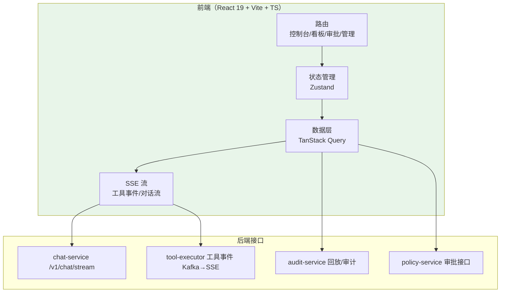
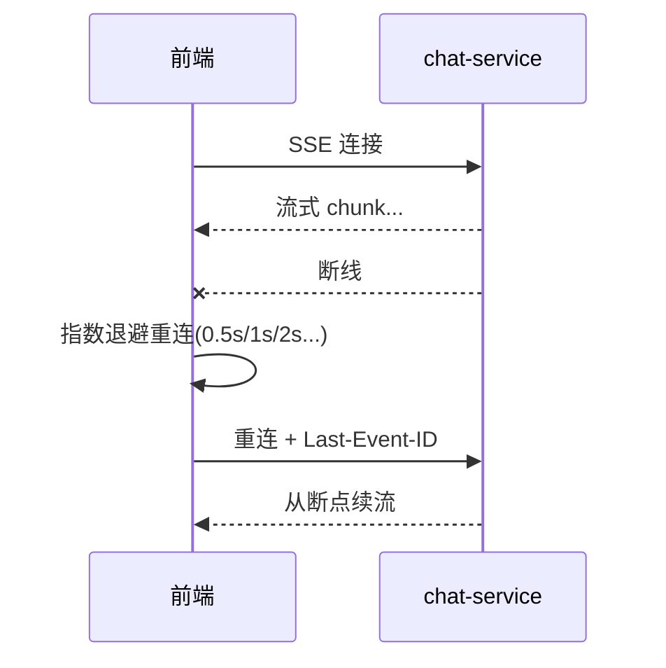
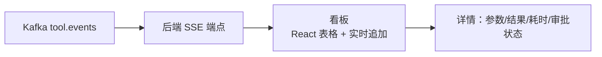
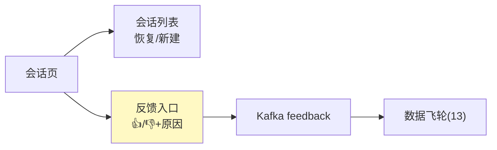

# 19-迭代十七：前端与体验深化——把后台能力做成可用、好看的界面

> **定位**：把 `admin-portal` 与用户控制台从"能看"做到"**好用**"：**React 前端架构**（不生成源码文件，只讲设计与关键 TSX 片段）、**多页面流式前端**（SSE 消费/断线重连/跨页签同步）、**工具可视化看板**（实时事件流）、**审批卡 UI**、**会话管理 + 反馈入口**（联动 13 数据飞轮）。读者画像：想让平台"有人用、用着顺"的读者。前置阅读：[17-迭代十六-安全纵深深化](17-迭代十六-安全纵深深化.md)、[教程 15-React入门与现代前端工程] 到 [教程 18-Agentic-UI设计]。
>
> **演进纪律**：本迭代做前端体验；多模态（20）不提前实现。前端为**概念设计与关键 TSX 片段**（不生成源码文件）。
> **铁律 0**：后端 API 均经本地 jar `javap` 实证；前端为 React 19 生态（教程 15-18 体系）。

---

## 一、四问（本轮：前端与体验）

| 问 | 答 |
|----|----|
| **新增了什么需求** | ① admin-portal React 架构 ② 多页面流式前端 ③ 工具可视化看板 ④ 审批卡 ⑤ 会话管理+反馈 |
| **影响了哪些模块** | `admin-portal`（前端）、`chat-service`（流式接口）、`audit-service`（事件接口） |
| **架构如何演进** | 后端能力 → 可用、好看的前端体验 |
| **上一版本的痛点是什么** | ① 能力全在后端无界面 ② 流式前端不可断线重连 ③ 工具调用不可视 ④ 审批无 UI（18 前遗留） |

**本迭代验收**：① 控制台可对话、可看工具调用、可批审批 ② 断线重连、跨页签同步 ③ 看板实时刷新。

---

## 二、admin-portal 前端架构



---

## 三、多页面流式前端（SSE 消费 + 断线重连 + 跨页签）

### 3.1 SSE 消费（React 19 + fetch ReadableStream）

```tsx
// 概念 TSX：用 fetch 流式读取，配合 useCallback 管理
// 断线重连：指数退避 + Last-Event-ID 续传（教程 17 体系）
function useChatStream(sessionId: string) {
  // 1. fetch /v1/chat/stream?sessionId=...，SSE 解析
  // 2. 收到 chunk → 追加到消息流（Zustand）
  // 3. 断线 → 用 lastEventId 重连，从断点续
  // 4. 跨页签：BroadcastChannel 同步同一会话消息（教程 17/24 体系）
}
```

### 3.2 断线重连策略



---

## 四、工具可视化看板（实时事件流）

```tsx
// 概念 TSX：工具事件（Kafka→SSE）→ 看板实时表格
// 每行：工具名 | 参数(脱敏) | 结果(截断) | 耗时 | 状态 | traceId(可跳回放)
// 过滤：按租户/工具/状态；WebSocket/SSE 实时追加
```



---

## 五、审批卡 UI（HITL 落地界面）

```tsx
// 概念 TSX：审批卡组件
// 高危工具调用 → 弹卡：工具名 | 参数(脱敏) | 租户 | 风险原因
// 操作：批准 / 驳回（调 policy-service 审批接口，08 联动）
// 挂起列表：未处理审批 + 超时倒计时
```

---

## 六、会话管理 + 反馈入口（联动 13 数据飞轮）



---

## 七、测试与验证

### 7.1 流式前端测试

```bash
# 控制台提问 → 逐字流式显示；网络断开 → 自动重连续传；另一标签页同步
```

### 7.2 看板测试

```bash
# 触发工具调用 → 看板实时出现事件行（<500ms 延迟）；过滤生效
```

### 7.3 审批卡测试

```bash
# 高危工具 → 审批卡弹出 → 批准/驳回 → 工具执行/阻断符合预期
```

### 7.4 反馈闭环测试

```bash
# 用户👎+原因 → Kafka → 数据飞轮（13）收到并进入优化
```

### 断言速查（PASS 判据汇总）

| # | 检验点 | PASS 判据 |
|---|--------|----------|
| 1 | 流式前端测试 | 按本节代码/命令注释中的预期逐条核对 |
| 2 | 看板测试 | 按本节代码/命令注释中的预期逐条核对 |
| 3 | 审批卡测试 | 高危工具 → 审批卡弹出 → 批准/驳回 → 工具执行/阻断符合预期 |
| 4 | 反馈闭环测试 | 按本节代码/命令注释中的预期逐条核对 |
### 失败排查

- 先看审计事件流（每次工具/模型/检索调用都有事件）：失败发生在**入口闸**（未到业务）还是**执行层**（业务内）——入口闸失败查策略配置，执行层失败查服务日志；
- 多服务场景先分层冒烟：model-gateway → 对应业务服务 → agent-executor 串行验证，定位坏在哪一跳；
- 断言不符时优先核对**数据构造**（租户/版本/角色等测试前置是否真的生效），再怀疑实现——本项目 80% 的"测试失败"是前置数据没构造对。

---

## 八、验收对照

| 验收项 | 达标标准 | 本迭代 |
|--------|---------|--------|
| 多页面流式前端 | 断线重连+跨页签同步 | ✅ |
| 工具看板 | 实时事件+过滤+详情 | ✅ |
| 审批卡 | 批准/驳回/超时 | ✅ |
| 反馈入口 | 进数据飞轮 | ✅ |
| 未提前引入后续能力 | 无多模态/浏览器 | ✅ |

**下一篇**：19-迭代十八-多模态与浏览器Agent。
