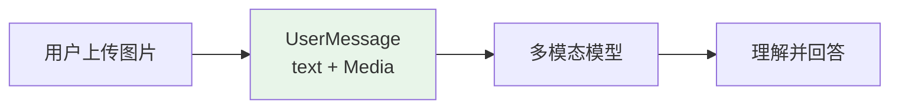
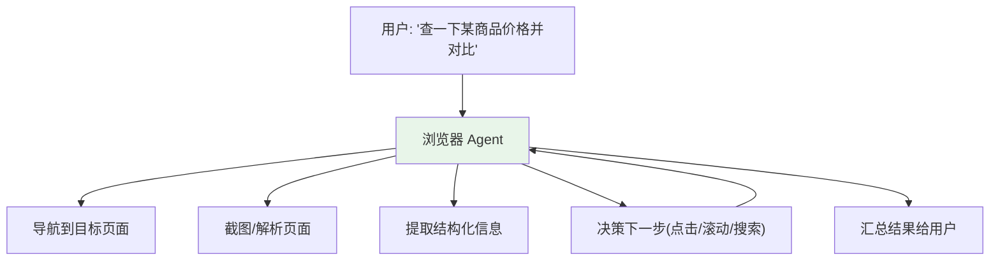
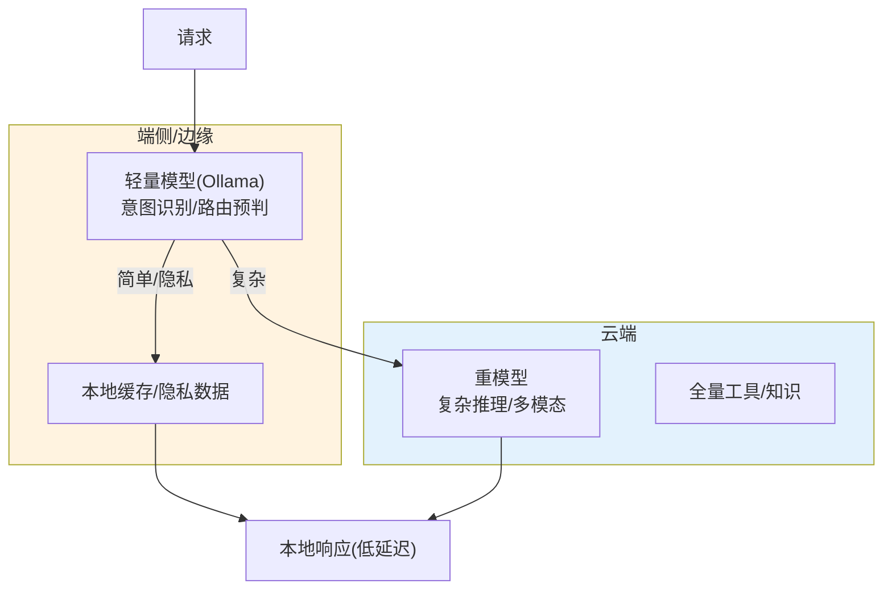

# 20-多模态与浏览器 Agent 扩展——从文本到看得到、能操作

> **定位**：把平台从"纯文本 Agent"扩展到**多模态与浏览器操作**：**多模态输入**（图片/文档，`UserMessage` + `Media`）、**浏览器 Agent**（ComputerUse 类操作 Web）、**边缘端云协同**（端侧轻量 + 云侧重型）。这是平台"能力边界"的扩展。读者画像：想让 Agent "看图"、"上网操作"的读者。前置阅读：[18-前端与体验深化](18-前端与体验深化.md)、[教程 47-ComputerUse与浏览器Agent]、[教程 48-多模态Agent开发]。
>
> **演进纪律**：本迭代做多模态/浏览器扩展；本迭代后进入收官。
> **铁律 0**：`UserMessage`/`Media` 已 javap 实证（`org.springframework.ai.content.Media`）；浏览器 Agent 为外部生态，标注第三方。

---

## 一、四问（本轮：多模态与浏览器）

| 问 | 答 |
|----|----|
| **新增了什么需求** | ① 多模态输入（图片/文档进上下文）② 浏览器 Agent（网页操作/截图理解）③ 边缘端云协同 |
| **影响了哪些模块** | `chat-service`/`agent-executor`（多模态消息）、新增浏览器执行器 |
| **架构如何演进** | 文本 Agent → 多模态 + 浏览器操作 |
| **上一版本的痛点是什么** | ① 只能看文本 ② 不能操作 Web ③ 边缘能力未用（19 前遗留） |

**本迭代验收**：① 用户传图 → Agent 理解并回答 ② 浏览器 Agent 能完成"查商品并下单"类任务 ③ 端云协同架构可行。

---

## 二、多模态输入（UserMessage + Media）

### 2.1 真实 API（javap 实证）

| 类 | 坐标 | 说明 |
|----|------|------|
| `UserMessage` | `org.springframework.ai.chat.messages` | 构造 `(String)`；可带 `Media` |
| `Media` | `org.springframework.ai.content.Media` | 图片等媒体内容 |

### 2.2 多模态消息（图片进上下文）

```java
package com.example.chatservice.multimodal;

import org.springframework.ai.chat.messages.Media;
import org.springframework.ai.chat.messages.UserMessage;
import org.springframework.ai.chat.client.ChatClient;
import org.springframework.core.io.ClassPathResource;
import org.springframework.core.io.Resource;
import org.springframework.stereotype.Service;
import org.springframework.util.MimeTypeUtils;
import java.util.List;

/** 多模态对话——图片 + 文本一起进上下文。 */
@Service
public class MultimodalChatService {

    private final ChatClient chatClient;

    public MultimodalChatService(ChatClient chatClient) {
        this.chatClient = chatClient;
    }

    public String chatWithImage(String question, Resource image) {
        // 真实 API：PromptUserSpec.media(MimeType, Resource)（javap 实证）
        return chatClient.prompt()
                .user(u -> u
                        .text(question)
                        .media(MimeTypeUtils.IMAGE_JPEG, image))
                .call()
                .content();
    }
}
```



---

## 三、浏览器 Agent（ComputerUse / Agentic Browser）

### 3.1 能力定位



### 3.2 架构落点（浏览器执行器独立服务）

| 组件 | 职责 | 说明 |
|------|------|------|
| `browser-executor`（新增） | 浏览器操作：导航/点击/输入/截图/提取 | 独立沙箱（复用 05/18 沙箱治理） |
| 浏览器工具集 | `navigate` / `click` / `type` / `screenshot` / `extract` | 暴露为 ToolCallback，走工具治理 |
| 页面理解 | 截图 → 多模态模型（20 §二）理解 DOM/视觉 | 与多模态联动 |

> ⚠ **第三方**：浏览器自动化底层用 Playwright/Puppeteer（第三方，坐标需引入）；ComputerUse 类能力参考 [教程 47-ComputerUse与浏览器Agent] 生态。

---

## 四、边缘端云协同



**协同策略**：端侧先做轻量判断（意图/隐私过滤/简单问答），复杂/多模态上云；隐私数据不出端（与 16 数据驻留联动）。

---

## 五、测试与验证

### 5.1 多模态测试

```bash
# 上传一张截图 → Agent 理解图中内容并回答（如"图中有几个按钮"）
```

### 5.2 浏览器 Agent 测试

```bash
# 目标：打开测试站 → 搜索 → 提取结果 → 汇总
# 断言：浏览器执行器事件入审计、工具调用可视化
```

### 5.3 端云协同测试

```bash
# 简单问题走端侧（日志确认）、复杂问题上云（日志确认）
```

### 断言速查（PASS 判据汇总）

| # | 检验点 | PASS 判据 |
|---|--------|----------|
| 1 | 多模态测试 | 按本节代码/命令注释中的预期逐条核对 |
| 2 | 浏览器 Agent 测试 | 断言：浏览器执行器事件入审计、工具调用可视化 |
| 3 | 端云协同测试 | 按本节代码/命令注释中的预期逐条核对 |
### 失败排查

- 先看审计事件流（每次工具/模型/检索调用都有事件）：失败发生在**入口闸**（未到业务）还是**执行层**（业务内）——入口闸失败查策略配置，执行层失败查服务日志；
- 多服务场景先分层冒烟：model-gateway → 对应业务服务 → agent-executor 串行验证，定位坏在哪一跳；
- 断言不符时优先核对**数据构造**（租户/版本/角色等测试前置是否真的生效），再怀疑实现——本项目 80% 的"测试失败"是前置数据没构造对。

---

## 六、验收对照

| 验收项 | 达标标准 | 本迭代 |
|--------|---------|--------|
| 多模态输入 | 图片进上下文可理解 | ✅ |
| 浏览器 Agent | 导航/提取/决策闭环 | ✅ |
| 端云协同 | 简单端侧/复杂云侧 | ✅ |
| 工具治理复用 | 浏览器操作走 ToolCallback+沙箱+审计 | ✅ |

**下一篇**：20-核心代码讲解。
