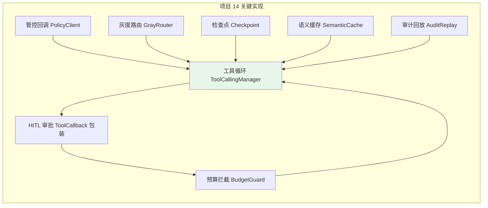
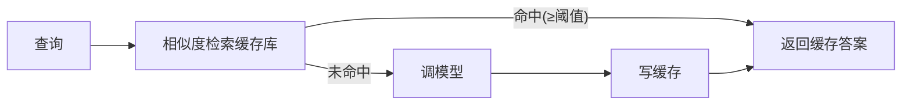
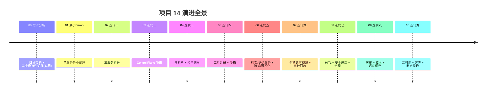

# 20-核心代码讲解：关键实现全景拆解

> **定位**：把项目 14 从 01 到 10 迭代里**最核心的 8 个实现模式**集中拆解——管控回调、工具循环、HITL 审批、灰度路由、预算拦截、检查点、语义缓存、审计回放。每一段讲清"设计意图 → 实现要点 → 演进路线"，让读者既能照抄也能理解为什么这么写。读者画像：已读完全部迭代、想把关键代码吃透的读者。前置阅读：[00-需求分析与架构设计](00-需求分析与架构设计.md) 到 [10-高可用与灾备](10-高可用与灾备.md)。
>
> **铁律 0**：所有 Spring AI 2.0.0 API 均经本地 jar `javap` 实证；`spring-security`/`micrometer-tracing` 等本地未下载依赖标注「需引入依赖后实证」。

---

## 一、关键实现全景



---

## 二、管控回调（PolicyClient）——决策与执行分离的钥匙

**设计意图**：数据面在每个决策点问管控面，但不持有决策逻辑。

```java
// 核心模式：每次模型调用前回调管控面
// 演进：03(雏形) → 04(绑租户) → 07(注入/DLP) → 08(预算)
public Mono<Boolean> allow(String tenantId, int estimatedTokens) {
    return policyClient.check(tenantId, estimatedTokens)   // → policy-service
            .map(Decision::isAllow);
}
```

**要点**：
- 决策点：模型调用前、工具执行前、检索前
- 失败语义：管控面不可用 → **fail-open 还是 fail-closed**（高风险动作 fail-closed）
- 性能：决策请求必须毫秒级（缓存策略结论）

---

## 三、工具循环（ToolCallingManager）——Agent 的核心引擎

**设计意图**：LLM 返回 `tool_call` → 执行工具 → 把结果喂回 → 续轮，直到无工具调用。

```java
// 真实 API（javap 实证 org.springframework.ai.model.tool.ToolCallingManager）：
//   resolveToolDefinitions(ToolCallingChatOptions)
//   executeToolCalls(Prompt, ChatResponse)
// 工具意图读取链：ChatResponse.getResult().getOutput().getToolCalls()
//                  → List<AssistantMessage.ToolCall>（record: id/type/name/arguments）

// 项目里把默认 ToolCallingManager 替换为装饰器（观测/审批的稳定挂点）
public class AuditedToolCallingManager implements ToolCallingManager {
    private final ToolCallingManager delegate;
    // executeToolCalls 前后：审计、审批检查、指标
}
```

**演进**：02（手写串行）→ 03（框架 ToolCallingManager）→ 06（观测）→ 07（审批）。

---

## 四、HITL 审批（ApprovalToolWrapper）——危险操作的闸门

**设计意图**：高危工具（删除/外发/写库/提权）执行前人工确认。

```java
// 正确落点：ToolCallback 包装层（非 Advisor）——工具意图已定、执行未发生
public class ApprovalToolWrapper implements ToolCallback {
    @Override
    public String call(String toolInput, ToolContext ctx) {
        if (approvals.request(tool, toolInput, tenant) &&
            approvals.await(approvalId)) {
            return delegate.call(toolInput, ctx);   // 放行
        }
        throw new SecurityException("高危操作未获审批");
    }
}
```

**要点**：审批信息（工具/参数/租户）推给 admin-portal 弹卡；超时默认拒绝；审批决策全程审计。

---

## 五、灰度路由（GrayRouter）——版本化发布的确定性

**设计意图**：同一会话稳定走同一版本（可复现、可回滚）。

```java
// 确定性分桶：sessionId 哈希 % 100 < 百分比
public boolean shouldHitNew(String sessionId, int percent) {
    return (sha256Hash(sessionId) % 100) < percent;
}
```

**演进**：09 灰度定义/模型 → 后续可灰度 Prompt/工具/评测策略。

---

## 六、预算拦截（BudgetGuard）——成本的上限

**设计意图**：租户/业务 Token 预算用满即拒，防失控。

```java
// Redis 计数 + 日预算比较（真实 API：ReactiveStringRedisTemplate）
public Mono<Boolean> allow(String tenantId, int estimatedTokens, int dailyBudget) {
    return redis.opsForValue().increment("budget:" + tenantId)
            .map(current -> current <= dailyBudget);
}
```

**要点**：预算 = 调用前**预估**拦截 + 调用后**实际**回补（gen_ai.usage）；超限可降级到低价模型而非直接拒绝。

---

## 七、检查点（Checkpoint）——长任务不丢

**设计意图**：长任务中断后从断点续跑，不重跑已完成步骤。

```java
// 事件溯源式：每一步记录（步骤ID/输入/输出/预算）到对象存储/DB
// 恢复：读最后检查点 → 跳过已完成 → 从下个步骤续跑
public record StepRecord(int step, String input, String output, long tokensUsed) {}
```

**演进**：10 落地；与审计流同源（同一份步骤记录既供续跑又供回放）。

---

## 八、语义缓存（SemanticCache）——降本的关键



```java
// 真实 API：VectorStore.similaritySearch(SearchRequest.builder()
//     .query(q).topK(1).similarityThreshold(0.92).build())
// 命中 → 直接返回，省一次 LLM 调用（目标命中率 ≥20%）
```

---

## 九、审计回放（AuditReplay）——决策可解释

```java
// 一条 traceId 聚合：LLM 意图 → 工具调用(参数脱敏) → 结果 → 耗时
// admin-portal 可视化回放，供合规/排障/复盘
// 与检查点同源（步骤记录），一处写多处读
```

---

## 十、架构演进回顾



| 迭代 | 核心交付 | 教程锚点 |
|------|---------|---------|
| 01 | 最小闭环 | [教程 02-ChatClient与对话模型] |
| 02 | 服务拆分 | [教程 21-微服务拆分与Agent部署] |
| 03 | 管控面 | [教程 20-管控分离架构] |
| 04 | 多租户+模型网关 | [教程 26-多租户隔离与资源治理]、[教程 32-模型路由与降级] |
| 05 | 工具治理 | [教程 23-工具执行可观测与审计] |
| 06 | 检索/记忆/流式/可视化 | [教程 35-高级RAG与AgenticRAG]、[教程 39-高级记忆架构]、[教程 24-多页面流式响应与会话管理] |
| 07 | 可观测+审计 | [教程 22-全链路可观测性] |
| 08 | HITL+安全 | [教程 28-Human-in-the-Loop与审批流]、[教程 31-安全与权限控制] |
| 09 | 灰度+成本 | [教程 29-灰度发布与版本管理]、[教程 27-成本治理与Token计量] |
| 10 | 高可用+容灾 | [教程 33-部署与运维]、[教程 40-长任务持久化与中断恢复] |

---

## 十一、给读者的动手建议

1. **按迭代顺序抄**：不要跳读最终版——每个迭代都能独立编译/测试
2. **每迭代先跑测试**：本项目的每篇都有「测试与验证」，先跑通再进下一步
3. **对照真实 jar**：抄代码前先 `javap` 对应类（铁律 0），确认签名与你引入的版本一致
4. **缺依赖标注**：`spring-security`/`micrometer-tracing`/`spring-boot-starter-test` 本地未下载的，按标注补依赖后实证

---

## 十二、总结

项目 14 从最小单体演进到**工业可落地的多微服务管控分离平台**：10+ 服务、管控/数据分离、多租户、多模型、工具全生命周期治理、全链路可观测、HITL、安全纵深、灰度成本、高可用容灾。每个迭代可测试、每个工业级特性有承载服务与验收指标——它是一套**可以照着从 0 搭到生产**的企业级 Agent 平台蓝图。

> 本文是项目 14 的**基础篇核心代码讲解**（管控/工具循环/HITL/灰度/预算/检查点/缓存/审计 8 个基础模式）。**进阶模式**（响应式强化、官方 Evaluator、DAG 编排、高级 RAG、模型供应、可解释事件溯源、安全纵深、前端、多模态）见 [11-迭代十-响应式强化] 至 [19-迭代十八-多模态与浏览器Agent]，全项目收官见 [21-进阶代码讲解]。独立项目。

**下一篇**：21-进阶代码讲解。
