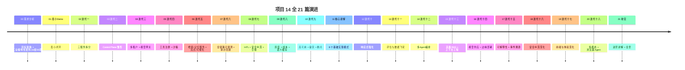
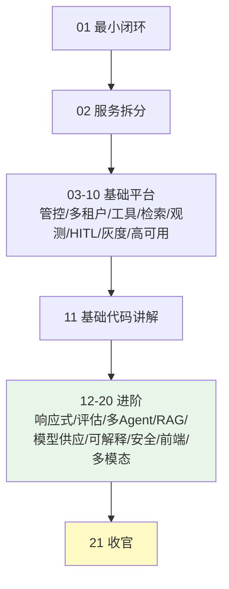

# 21-进阶代码讲解：21 篇全景 + 进阶模式

> **定位**：项目 14 的**收官篇**——把 12-20 进阶迭代里的关键实现模式集中拆解（响应式链、官方 Evaluator、DAG 编排、Agentic RAG、多级降级、事件溯源、DLP、多模态），并给出**全项目 21 篇全景**与"从 0 到生产"的完整路径。读者画像：读完全部迭代、想把进阶代码吃透并看到全貌的读者。前置阅读：[20-核心代码讲解](20-核心代码讲解.md) 到 [19-迭代十八-多模态与浏览器Agent](19-迭代十八-多模态与浏览器Agent.md)。
>
> **铁律 0**：所有 Spring AI 2.0.0 API 均经本地 jar `javap` 实证。

---

## 一、进阶关键实现（12-20 的精华）

### 1.1 响应式编排链（12）

```java
// 核心模式：Mono 链 + deferContextual + onErrorResume + retryWhen + timeout
Mono<String> chat(String text) {
    return Mono.deferContextual(ctx -> callModel(text, ctx.get("tenant_id"))
            .flatMap(r -> needsTool(r) ? callTool(r).flatMap(t -> callModel(text + t)) : Mono.just(r))
            .onErrorResume(e -> Mono.just("[降级]..."))
            .timeout(Duration.ofSeconds(10)));
}
```

**要点**：无 `block()`、容错全响应式、上下文经 Reactor Context。

### 1.2 官方 Evaluator（13）

```java
// 真实 API（javap 实证）：
// org.springframework.ai.chat.evaluation.RelevancyEvaluator / FactCheckingEvaluator
// org.springframework.ai.evaluation.EvaluationRequest / EvaluationResponse
EvaluationResponse r = relevancy.evaluate(new EvaluationRequest(question, docs, response));
r.isPass(); r.getScore(); r.getFeedback();
```

### 1.3 DAG 编排（14）

```java
// 核心模式：工作流定义(节点/边/条件) + 解释执行 + flatMap 并发控制(3)
// 任务委派：主管拆解 → 子 Agent 并行(flatMap(…,3)) → 聚合
```

### 1.4 Agentic RAG（15）

```java
// 核心模式：Agent 判断是否需要检索、检索几次（不是每次都查）
// 混合检索：向量 Top-10 + 关键词 Top-10 → 合并 → 重排 → Top-5
```

### 1.5 多级降级（16）

```java
// 核心模式：onErrorResume 逐级尝试 [主 → 备 → 边缘]，三级冗余
// 生产用 Resilience4j CircuitBreaker（第三方坐标 io.github.resilience4j:resilience4j-spring-boot3）
```

### 1.6 事件溯源（17）

```java
// 核心模式：append-only 事件(seq) + 审计签名 + replay 重建会话
// 崩溃闭合：从最后 seq 续跑，不重做已完成步骤
```

### 1.7 输出 DLP（18）

```java
// 核心模式：CallAdvisor 出站脱敏（API Key/私钥/密码 → ***）
// 间接注入：外部数据包"数据块"标记，提示模型忽略块内指令
```

### 1.8 多模态（20）

```java
// 真实 API：UserMessage + Media（org.springframework.ai.content.Media，javap 实证）
chatClient.prompt().user(u -> u.text(question).media(MimeTypeUtils.IMAGE_JPEG, image)).call().content();
```

---

## 二、进阶模式速查

| 模式 | 落点 | 关键 API/机制 | 用在哪 |
|------|------|--------------|--------|
| 响应式链 | 全项目 | Mono/Flux + deferContextual + onErrorResume | 12 |
| 官方 Evaluator | eval-service | `org.springframework.ai.chat.evaluation` | 13 |
| DAG 编排 | agent-executor | WorkflowDef + FlowEngine + flatMap 并发 | 14 |
| 混合检索重排 | retrieval-service | VectorStore + SearchRequest + Rerank | 15 |
| 多级降级 | model-gateway | onErrorResume 链 + Resilience4j | 16 |
| 事件溯源 | audit-service | append-only + seq 重放 + 签名 | 17 |
| 输出 DLP | policy-service | CallAdvisor 出站脱敏 | 18 |
| 多模态 | chat-service | UserMessage + Media | 20 |

---

## 三、全项目 21 篇全景



---

## 四、从 0 到生产的完整路径



**学习路径建议**：
1. **先搭 01-10**：把"能跑的平台"搭出来（每迭代先跑测试）
2. **再上 12-15**：响应式/评估/多Agent/高级RAG——质量与体验
3. **纵深 16-18**：模型供应/可解释/安全——生产命门
4. **体验与扩展 19-20**：前端/多模态
5. **对照 21 速查**：抄关键模式

---

## 五、全项目验收（工业可落地清单）

| 维度 | 达标项 |
|------|--------|
| 架构 | 多微服务 + 管控/数据分离 + 多租户 + 多模型 |
| 治理 | 工具全生命周期 + 模型供应 + 成本 + 灰度 |
| 安全 | HITL + 注入/DLP/脱敏/RBAC/mTLS/GDPR/Tool Poisoning/供应链 |
| 质量 | 官方 Evaluator + 金标回归 + 数据飞轮 + 可解释性 |
| 体验 | 多页面流式 + 工具可视化 + 审批卡 + 反馈闭环 |
| 工业落地 | 高可用/容灾/容量/断点/优雅停机/边缘 + 每阶段可测试 |
| 工程纪律 | 演进式 + Mermaid 全校验 + 铁律 0 实证 |

---

## 六、总结

项目 14 以 **21 篇、演进式迭代** 从最小单体走到工业可落地的多微服务管控分离 Agent 平台：基础平台（01-11）覆盖拆分/管控/多租户/工具/检索/观测/HITL/灰度/高可用，进阶（12-20）补齐响应式/评估/多Agent/高级RAG/模型供应/可解释/安全/前端/多模态。每个迭代可测试、每个工业级特性有承载与验收——这是可以**照着从 0 搭到生产**的企业级 Agent 平台蓝图。

> 本文是项目 14 的**进阶代码讲解**；运营资产层（ADR/数据模型/事件/SRE/运营纵深/前沿调研）见 [22-ADR架构决策记录] 至 [35-工业前沿调研与特性补充]，全项目收官见 [35-工业前沿调研与特性补充]。独立项目。

**下一篇**：22-ADR架构决策记录。
