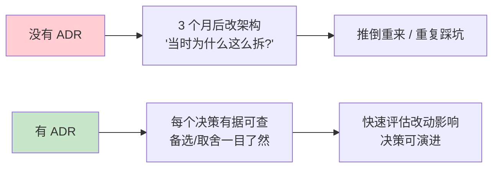

# 22-ADR 架构决策记录：全项目决策资产

> **定位**：把项目 14 从 00 到 21 的所有**架构决策**汇集成体系 ADR（Architecture Decision Record）——每条记录**决策上下文 / 备选方案 / 取舍理由 / 后果 / 可回滚性**。这是工业项目的"决策资产"：后人（或几个月后的你）改架构时，能知道"当时为什么这么定"。读者画像：想理解项目 14 每个关键决策"为什么"的读者，以及把它当架构决策范式的读者。前置阅读：[00-需求分析与架构设计](00-需求分析与架构设计.md)、[附录 08-架构决策方法论]。
>
> **铁律 0**：涉及 Spring AI 2.0 API 的决策均经本地 jar `javap` 实证。

---

## 一、为什么需要 ADR

**ADR 三要素**：上下文（当时的问题）、决策（选了哪个）、后果（代价与可回滚性）。

### 1.1 本节核对（为什么需要 ADR）

- [ ] 能说清 ADR 的"决策资产"价值（后人改架构时知道"当时为什么这么定"）与三要素（上下文/决策/后果）
- [ ] §一对比图（无 ADR 推倒重来 vs 有 ADR 有据可查）与 ADR 方法论（[附录 08]）口径一致

---

## 二、ADR 总览（全项目 00-21）

| # | 决策 | 落地迭代 | 状态 |
|---|------|---------|------|
| ADR-1 | 管控/数据面物理拆分为多服务 | 00/03 | ✅ 采纳 |
| ADR-2 | 管控决策走 HTTP 同步、事件走 Kafka | 00/03 | ✅ 采纳 |
| ADR-3 | 模型网关自研（基于 Spring AI + OpenAI 兼容） | 00/04 | ✅ 采纳 |
| ADR-4 | 工具执行走独立沙箱服务 | 00/05 | ✅ 采纳 |
| ADR-5 | 记忆服务自研 `ChatMemoryRepository` | 00/06 | ✅ 采纳 |
| ADR-6 | 全链路 OTel（gen_ai 语义约定） | 00/07 | ✅ 采纳 |
| ADR-7 | HITL 落点选 ToolCallback 包装层（非 Advisor） | 08 | ✅ 采纳 |
| ADR-8 | 响应式全链（无 block），审批用 Sinks 挂起 | 12 | ✅ 采纳 |
| ADR-9 | 评估驱动开发（官方 Evaluator + 金标回归闸门） | 13 | ✅ 采纳 |
| ADR-10 | 多 Agent 用 DAG 编排 + 主管委派 | 14 | ✅ 采纳 |
| ADR-11 | 高级 RAG 用 Agentic（按需检索）+ 混合重排 | 15 | ✅ 采纳 |
| ADR-12 | 模型多供应商 + 多级降级 + 自建 vs 商用决策框架 | 16 | ✅ 采纳 |
| ADR-13 | 会话用事件溯源（append-only + seq 重放） | 17 | ✅ 采纳 |
| ADR-14 | 工具治理用注册指纹 + 沙箱网络隔离 | 18 | ✅ 采纳 |
| ADR-15 | 多模态经 UserMessage+Media（真实 API） | 20 | ✅ 采纳 |

### 2.1 本节核对（ADR 总览）

- [ ] 15 条 ADR 的"落地迭代"与对应正文文件号（00-20）一一对应，且状态均为"采纳"（无未决）
- [ ] ADR-7（HITL 落点）表述与 08 铁律（ToolCallback 包装层/非 Advisor）一致

---

## 三、关键 ADR 详解（决策上下文 + 备选 + 取舍）

### ADR-7：HITL 落点选 ToolCallback 包装层

- **上下文**：危险工具（删除/外发/写库）需人工审批；但审批该挂在哪一层？
- **备选**：
  - A：Advisor 层（在 `adviseCall` 拦截）——❌ Advisor 拿不到"工具意图已定"的语义，且跨 call/stream 两栖难写
  - B：`ToolCallingManager` 装饰器（`org.springframework.ai.model.tool`）——✅ 工具循环统一入口
  - C：`ToolCallback` 包装层（`org.springframework.ai.tool`）——✅ 单工具粒度、最贴近执行
- **决策**：B+C 结合——审批信息在 ToolCallback 包装层（08），观测在 ToolCallingManager 装饰器（12）。
- **取舍**：B 拦批量、C 拦单个；C 更能拿到参数级信息。铁律确认：**不是 Advisor**。
- **可回滚**：审批逻辑内聚在包装类，换落点只改一处。

### ADR-8：响应式全链（无 block）

- **上下文**：02-08 为演示用 `block()`；WebFlux EventLoop 禁阻塞（铁律）。
- **备选**：A：虚拟线程兜底（`spring.threads.virtual.enabled`）；B：全响应式链。
- **决策**：B（12 迭代）——`Mono/Flux` + `deferContextual` + `onErrorResume/retryWhen/timeout`；阻塞工具用 `subscribeOn(boundedElastic)` 隔离。
- **取舍**：响应式学习曲线陡，但吞吐量级提升、背压可控；虚拟线程只能缓解不能根治 EventLoop 占用。

### ADR-9：评估驱动开发

- **上下文**：改 Prompt/模型不知好坏，上线无回归保护（AWS 2026 报告：40% Agent 项目因成本/价值/风险被砍）。
- **决策**：13 迭代——官方 `Evaluator`（`org.springframework.ai.chat.evaluation`，javap 实证）+ **企业自持金标集** + 回归闸门 + 数据飞轮。
- **取舍**：评估是护城河——**金标数据集与评分标准是企业自有的**，不能依赖第三方。
- **后果**：发布从"拍脑袋"变"评估驱动"；灰度必须过回归闸门。

### ADR-13：事件溯源会话

- **上下文**：10 迭代用检查点存"步骤结果"，但不知道"为什么这么做"（不可复盘）。
- **备选**：A：检查点（只存结果）；B：事件溯源（append-only 每步事件）。
- **决策**：B（17 迭代）——每步 `AgentEvent`（意图/工具/审批/置信度）+ seq 重放 + 审计签名。
- **取舍**：存储量更大、写放大，但换来崩溃恢复 + 决策可解释 + 审计合规。

### 3.1 本节核对（关键 ADR 详解）

- [ ] 每条详解 ADR 都有"上下文 / ≥2 备选 / 取舍 / 可回滚性"四要素（抽查 ADR-7/8/9/13）
- [ ] ADR-7 明确"B+C 结合：审批在 ToolCallback 包装层（08）、观测在 ToolCallingManager 装饰器（12），非 Advisor"——与铁律一致

---

## 四、ADR 使用规范（项目决策纪律）

| 规范 | 说明 |
|------|------|
| 触发 | 架构/API/依赖/安全/运维 任一重大决策 |
| 必填 | 上下文 + ≥2 备选 + 取舍理由 + 后果 |
| 编号 | ADR-N（追加，不改旧） |
| 回滚 | 记录如何回退（可回滚性） |
| 引用 | 决策处标 ADR 编号，ADR 里标落地迭代 |

### 4.1 本节核对（ADR 使用规范）

- [ ] 五条规范（触发/必填/编号/回滚/引用）能复述，其中"编号 ADR-N 追加不改旧"是关键纪律
- [ ] 规范流程（触发→上下文→备选→取舍→后果→登记）与 §四 flowchart 一致

---

## 五、全篇回归验证

**前置条件**：§1.1-§4.1 各节核对均通过。

| # | 操作 | 预期（PASS 判据） |
|---|------|------------------|
| 1 | 遍历 15 条 ADR 自检 | 每条含 4 要素（上下文/备选/取舍/后果），无缺要素 |
| 2 | 抽查代码/文档改动处 | 能对应到 ADR 编号（决策可追溯） |
| 3 | 假设某决策被推翻 | 应新增一条 ADR 记录"为什么推翻"，不覆盖旧 ADR（演进纪律） |

**失败排查**：①某 ADR 缺取舍说明→只记了结论没理解权衡；②编号重复→ADR-N 追加纪律被破坏；③改动处无 ADR 引用→补标落地迭代。

---

## 六、总结

项目 14 的 15 条 ADR 是它的"决策 DNA"：从"为什么拆服务"到"为什么 HITL 放 ToolCallback 层"，每条都有上下文、备选、取舍、可回滚性。它是工业项目的**决策资产**——也是架构师"决策能力"的体现（[附录 08-架构决策方法论]）。

### 6.1 本节核对（总结）

- [ ] "15 条 ADR 是决策 DNA"与 §二总览、§三详解承接一致；ADR-7 例子准确（HITL 落点 ToolCallback 层）
- [ ] "下一篇 23-数据模型与 Schema"顺延编号，进入运营资产层

**下一篇**：23-数据模型与 Schema 设计。
