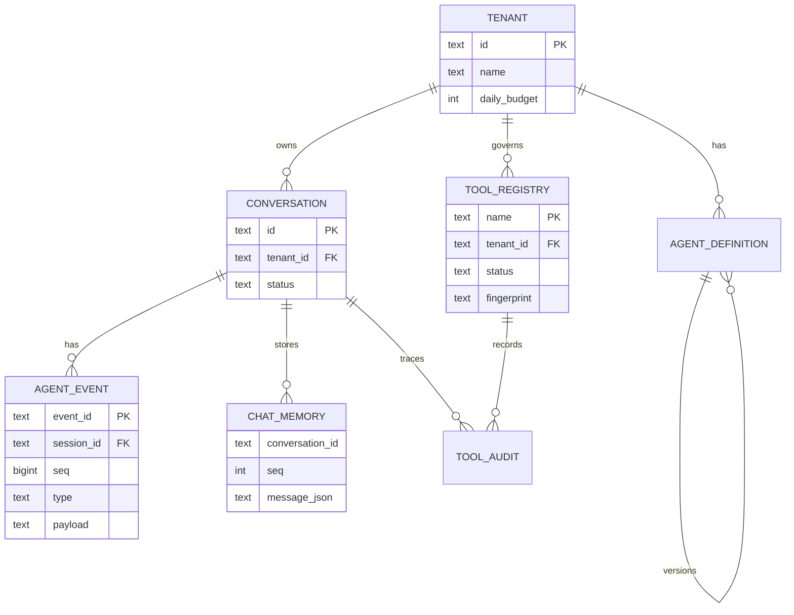
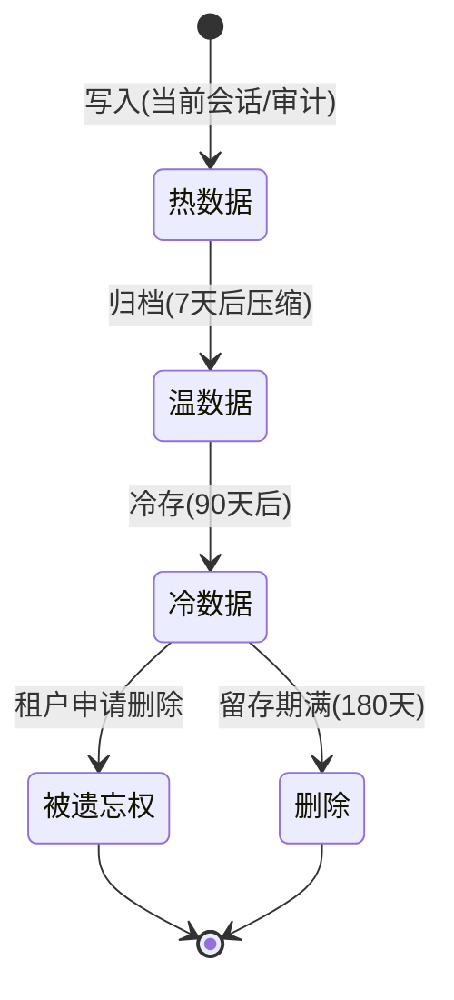

# 23-数据模型与 Schema 设计：统一 ER + 全表 + 索引 + 生命周期

> **定位**：把项目 14 散布在各迭代的建表 SQL **统一成一套数据模型**：ER 总览、关键表设计、索引策略、数据生命周期/归档。这是平台的数据资产全景，也是"改表先看这里"的入口。读者画像：需要理解平台数据如何组织的读者。前置阅读：[22-ADR架构决策记录](22-ADR架构决策记录.md)。
>
> **铁律 0**：代码/SQL 与迭代一致；无虚构 API。

---

## 一、数据模型总览（ER）



### 1.1 本节核对（数据模型总览 ER）

- [ ] 能对照 ER 图说出六大实体（tenant/conversation/agent_event/tool_registry/chat_memory/tool_audit/agent_definition）间的关系，以及"agent_event 属 conversation/事件溯源"、"tool_audit 可被 conversation 追踪"
- [ ] ER 关系与 §二 DDL（外键/trace_id）一致，无自相矛盾

---

## 二、核心表设计

### 2.1 租户与配额

```sql
CREATE TABLE tenant (
    id            text PRIMARY KEY,
    name          text NOT NULL,
    daily_budget  bigint NOT NULL DEFAULT 0,        -- Token 日预算
    model_default text,                              -- 默认模型
    status        text NOT NULL DEFAULT 'ACTIVE',   -- ACTIVE/SUSPENDED
    created_at    timestamptz NOT NULL DEFAULT now()
);
```

### 2.2 会话与事件溯源（17 迭代核心）

```sql
CREATE TABLE conversation (
    id        text PRIMARY KEY,
    tenant_id text NOT NULL REFERENCES tenant(id),
    status    text NOT NULL DEFAULT 'ACTIVE',   -- ACTIVE/COMPLETED/ABANDONED
    created_at timestamptz NOT NULL DEFAULT now()
);
CREATE INDEX idx_conversation_tenant ON conversation(tenant_id);

CREATE TABLE agent_event (                       -- 事件溯源（append-only）
    event_id   text PRIMARY KEY,
    session_id text NOT NULL REFERENCES conversation(id),
    seq        bigint NOT NULL,
    type       text NOT NULL,                    -- USER_INPUT/LLM_INTENT/TOOL_CALL/TOOL_RESULT/LLM_RESPONSE/APPROVAL
    payload    text NOT NULL,                    -- 脱敏后事件内容
    confidence double precision,
    trace_id   text,
    UNIQUE (session_id, seq)                     -- 幂等：seq 唯一
);
```

### 2.3 工具注册与指纹（18 迭代安全）

```sql
CREATE TABLE tool_registry (
    name         text PRIMARY KEY,
    tenant_id    text REFERENCES tenant(id),
    description  text NOT NULL,
    input_schema text NOT NULL,
    fingerprint  text NOT NULL,                  -- 描述+Schema 的 SHA-256（防投毒）
    owner        text NOT NULL,
    status       text NOT NULL DEFAULT 'REVIEW', -- REVIEW/PUBLISHED/DEPRECATED
    created_at   timestamptz NOT NULL DEFAULT now()
);
```

### 2.4 编排定义（版本化，03/09 迭代）

```sql
CREATE TABLE agent_definition (
    name    text NOT NULL,
    version int  NOT NULL,
    content text NOT NULL,                       -- 编排定义 JSON
    status  text NOT NULL DEFAULT 'DRAFT',       -- DRAFT/GRAY/FULL/DEPRECATED
    PRIMARY KEY (name, version)
);
```

### 2.5 本节测试与验证（核心表 DDL）

**前置条件**：Flyway/Liquibase 已接入（或手动 DDL）。

**材料**：§二 四组建表 SQL（tenant/conversation+agent_event/tool_registry/agent_definition）。

**步骤与断言**：

| # | 操作 | 预期（PASS 判据） |
|---|------|------------------|
| 1 | 执行四组 DDL | 建表成功，外键/唯一约束生效（如 `UNIQUE(session_id, seq)`、`REFERENCES tenant`） |
| 2 | 幂等复核：同 `event_id` 重复 `INSERT` | `ON CONFLICT` 拦截，不重复插入（§5.2） |
| 3 | Schema 与迭代一致性 | 表字段/类型与 06 `chat_memory`、17 `agent_event`、05 `tool_registry` 的建表 SQL 一致 |

**失败排查**：①外键失败→引用表先建或字段类型不符；②幂等失效→唯一约束未建；③字段漂移→DDL 与迭代正文 SQL 不一致，以本文为统一基线回告。

---

## 三、索引策略

| 表 | 索引 | 理由 |
|----|------|------|
| agent_event | (session_id, seq) 唯一 | 回放顺序 + 幂等 |
| conversation | tenant_id | 租户会话列表 |
| tool_registry | (tenant_id, status) | 租户可见已发布工具 |
| agent_definition | (name, version) | 取最新版本 |
| tool_audit | (trace_id) / (tenant_id, created_at) | 回放 + 合规留存查询 |
| tenant | status | 租户启停 |

**向量表**：`vector_store`（PgVector）——按 `tenant_id` + `doc_version` 过滤（06/15 迭代），全文检索 `tsv` GIN 索引（02/15 迭代）。

### 3.1 本节核对（索引策略）

- [ ] 能说清六类索引的"表 + 索引 + 理由"（尤其 `agent_event(session_id,seq)` 支撑回放顺序+幂等、`tool_audit(trace_id)` 支撑回放/合规查询）
- [ ] 向量表（PgVector）过滤与全文检索 GIN 索引实现了 06/15 的租户+版本过滤与关键词检索

---

## 四、数据生命周期



**留存策略（08 GDPR 联动）**：
- 会话事件：热 7 天 / 温 90 天 / 冷至留存期
- 工具审计：留存 180 天（可配置）
- 租户删除（被遗忘权）：级联清空该租户会话/记忆/审计

### 4.1 本节核对（数据生命周期）

- [ ] 热→温→冷→删除/被遗忘权的状态迁移与 §四 stateDiagram 一致，且留存天数与 08 GDPR（审计 180 天、被遗忘权级联清空）口径一致
- [ ] 被遗忘权删除范围（会话/记忆/审计级联）与 08 §4 留存删除语义一致

---

## 五、全篇回归验证

**前置条件**：§1.1-§4.1 各节核对/测试均通过；Schema 迁移与查询数据集就绪。

**材料**：§2.5 已覆盖的 DDL 与幂等探针。

**步骤与断言**：

| # | 操作 | 预期（PASS 判据） |
|---|------|------------------|
| 1 | Flyway/Liquibase 迁移后完整性校验 | 外键/索引均存在 |
| 2 | 同 `event_id` 重复 append | 不重复插入（`ON CONFLICT DO NOTHING`） |
| 3 | 归档任务（7 天前热→温→冷→删除） | 符合留存策略，被遗忘权级联清空 |
| 4 | 回放 10 万事件会话 | `seq` 索引命中、查询 <100ms |

**失败排查**：①迁移失败/外键缺→迁移脚本顺序与引用；②幂等失效→唯一约束未建；③查询慢→`(session_id,seq)` 索引未命中。

---

## 六、验收对照

| 验收项 | 达标标准 | 本迭代 |
|--------|---------|--------|
| ER 总览 | 核心实体关系清晰 | ✅ |
| 全表设计 | 关键表 DDL + 索引 | ✅ |
| 幂等 | 事件/写入幂等 | ✅ |
| 生命周期 | 归档/留存/被遗忘权 | ✅ |

### 6.1 本节核对（验收对照）

- [ ] 四条验收项各有前文支撑：ER 总览→§1.1、全表设计→§2.5、幂等→§五回归 2、生命周期→§4.1
- [ ] "下一篇 24-事件驱动与消息设计"顺延编号，持续运营资产层

**下一篇**：24-事件驱动与消息设计。
