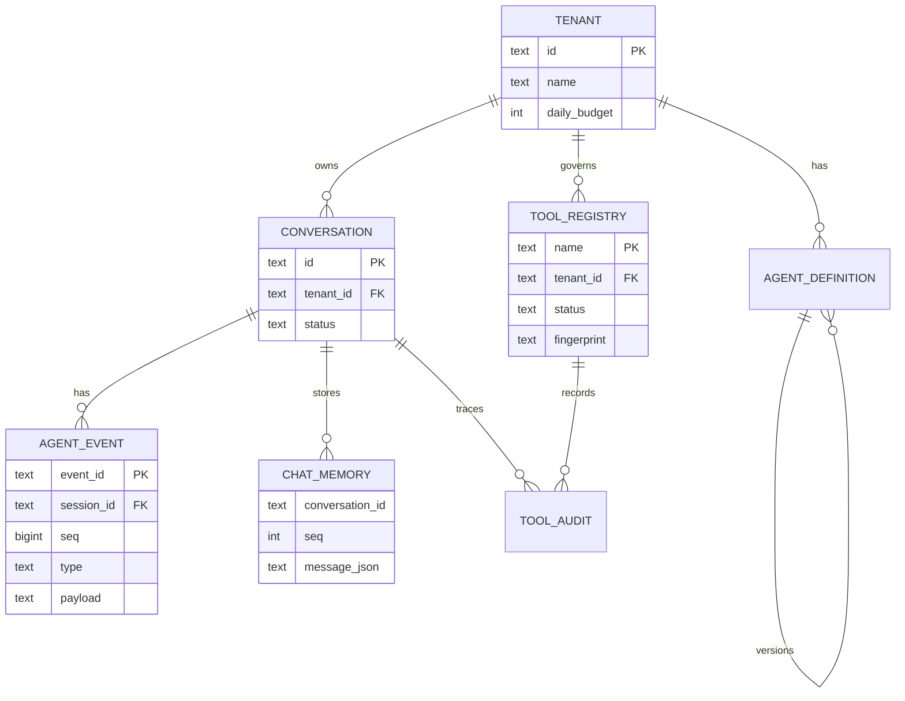
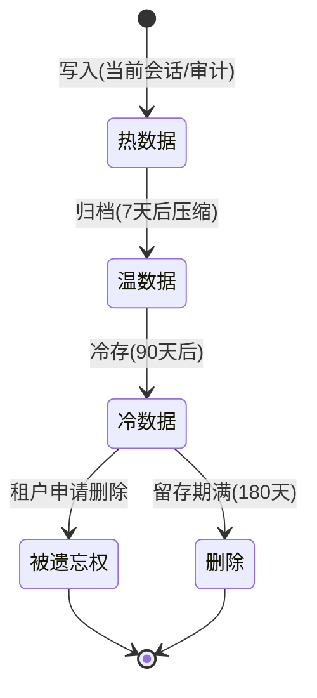

# 23-数据模型与 Schema 设计：统一 ER + 全表 + 索引 + 生命周期

> **定位**：把项目 14 散布在各迭代的建表 SQL **统一成一套数据模型**：ER 总览、关键表设计、索引策略、数据生命周期/归档。这是平台的数据资产全景，也是"改表先看这里"的入口。读者画像：需要理解平台数据如何组织的读者。前置阅读：[22-ADR架构决策记录](22-ADR架构决策记录.md)。
>
> **铁律 0**：代码/SQL 与迭代一致；无虚构 API。

---

## 一、数据模型总览（ER）



---

## 二、核心表设计

### 2.1 租户与配额

```sql
CREATE TABLE tenant (
    id            text PRIMARY KEY,
    name          text NOT NULL,
    daily_budget  bigint NOT NULL DEFAULT 0,        -- Token 日预算
    model_default text,                              -- 默认模型
    status        text NOT NULL DEFAULT 'ACTIVE',   -- ACTIVE/SUSPENDED
    created_at    timestamptz NOT NULL DEFAULT now()
);
```

### 2.2 会话与事件溯源（17 迭代核心）

```sql
CREATE TABLE conversation (
    id        text PRIMARY KEY,
    tenant_id text NOT NULL REFERENCES tenant(id),
    status    text NOT NULL DEFAULT 'ACTIVE',   -- ACTIVE/COMPLETED/ABANDONED
    created_at timestamptz NOT NULL DEFAULT now()
);
CREATE INDEX idx_conversation_tenant ON conversation(tenant_id);

CREATE TABLE agent_event (                       -- 事件溯源（append-only）
    event_id   text PRIMARY KEY,
    session_id text NOT NULL REFERENCES conversation(id),
    seq        bigint NOT NULL,
    type       text NOT NULL,                    -- USER_INPUT/LLM_INTENT/TOOL_CALL/TOOL_RESULT/LLM_RESPONSE/APPROVAL
    payload    text NOT NULL,                    -- 脱敏后事件内容
    confidence double precision,
    trace_id   text,
    UNIQUE (session_id, seq)                     -- 幂等：seq 唯一
);
```

### 2.3 工具注册与指纹（18 迭代安全）

```sql
CREATE TABLE tool_registry (
    name         text PRIMARY KEY,
    tenant_id    text REFERENCES tenant(id),
    description  text NOT NULL,
    input_schema text NOT NULL,
    fingerprint  text NOT NULL,                  -- 描述+Schema 的 SHA-256（防投毒）
    owner        text NOT NULL,
    status       text NOT NULL DEFAULT 'REVIEW', -- REVIEW/PUBLISHED/DEPRECATED
    created_at   timestamptz NOT NULL DEFAULT now()
);
```

### 2.4 编排定义（版本化，03/09 迭代）

```sql
CREATE TABLE agent_definition (
    name    text NOT NULL,
    version int  NOT NULL,
    content text NOT NULL,                       -- 编排定义 JSON
    status  text NOT NULL DEFAULT 'DRAFT',       -- DRAFT/GRAY/FULL/DEPRECATED
    PRIMARY KEY (name, version)
);
```

---

## 三、索引策略

| 表 | 索引 | 理由 |
|----|------|------|
| agent_event | (session_id, seq) 唯一 | 回放顺序 + 幂等 |
| conversation | tenant_id | 租户会话列表 |
| tool_registry | (tenant_id, status) | 租户可见已发布工具 |
| agent_definition | (name, version) | 取最新版本 |
| tool_audit | (trace_id) / (tenant_id, created_at) | 回放 + 合规留存查询 |
| tenant | status | 租户启停 |

**向量表**：`vector_store`（PgVector）——按 `tenant_id` + `doc_version` 过滤（06/15 迭代），全文检索 `tsv` GIN 索引（02/15 迭代）。

---

## 四、数据生命周期



**留存策略（08 GDPR 联动）**：
- 会话事件：热 7 天 / 温 90 天 / 冷至留存期
- 工具审计：留存 180 天（可配置）
- 租户删除（被遗忘权）：级联清空该租户会话/记忆/审计

---

## 五、测试与验证

### 5.1 Schema 迁移测试

```java
// 用 Flyway/Liquibase 管理 Schema 版本；迁移后跑完整性校验（外键/索引存在）
```

### 5.2 幂等测试

```java
// 同 event_id 重复 append → 不重复插入（ON CONFLICT DO NOTHING）
```

### 5.3 生命周期测试

```java
// 归档任务把 7 天前热数据转温 → 冷 → 删除符合留存策略
```

### 5.4 查询性能测试

```java
// 回放 10 万事件会话 → seq 索引命中、查询 < 100ms
```

### 断言速查（PASS 判据汇总）

| # | 检验点 | PASS 判据 |
|---|--------|----------|
| 1 | Schema 迁移测试 | 按本节代码/命令注释中的预期逐条核对 |
| 2 | 幂等测试 | 按本节代码/命令注释中的预期逐条核对 |
| 3 | 生命周期测试 | 按本节代码/命令注释中的预期逐条核对 |
| 4 | 查询性能测试 | 按本节代码/命令注释中的预期逐条核对 |
### 失败排查

- 先看审计事件流（每次工具/模型/检索调用都有事件）：失败发生在**入口闸**（未到业务）还是**执行层**（业务内）——入口闸失败查策略配置，执行层失败查服务日志；
- 多服务场景先分层冒烟：model-gateway → 对应业务服务 → agent-executor 串行验证，定位坏在哪一跳；
- 断言不符时优先核对**数据构造**（租户/版本/角色等测试前置是否真的生效），再怀疑实现——本项目 80% 的"测试失败"是前置数据没构造对。

---

## 六、验收对照

| 验收项 | 达标标准 | 本迭代 |
|--------|---------|--------|
| ER 总览 | 核心实体关系清晰 | ✅ |
| 全表设计 | 关键表 DDL + 索引 | ✅ |
| 幂等 | 事件/写入幂等 | ✅ |
| 生命周期 | 归档/留存/被遗忘权 | ✅ |

**下一篇**：24-事件驱动与消息设计。
