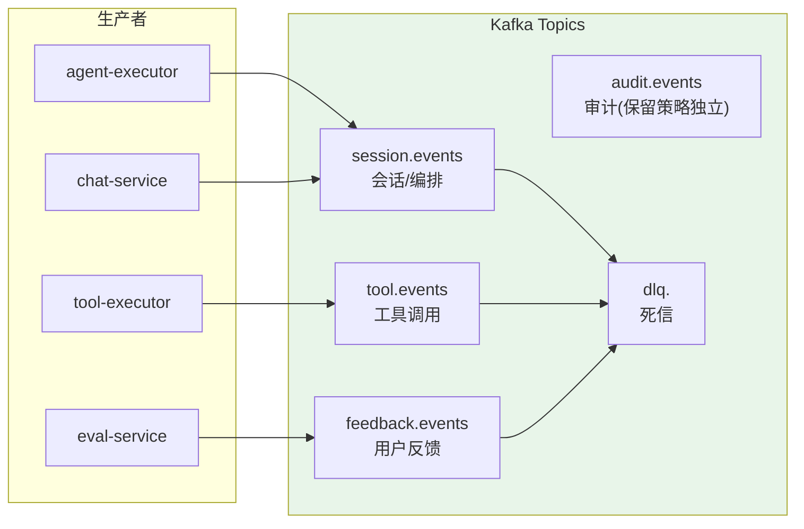
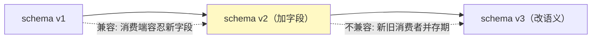
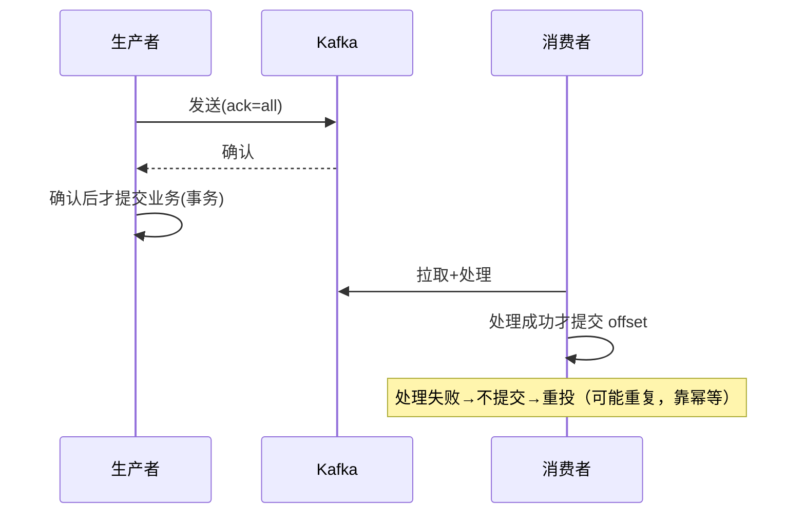
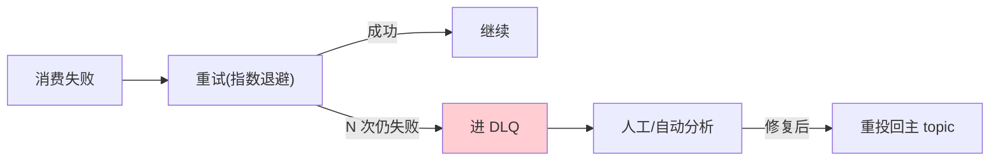

# 24-事件驱动与消息设计：Kafka Topic / Schema / 幂等 / 死信

> **定位**：把项目 14 散落的 Kafka 用法**统一成事件驱动设计**：事件分类与 Topic 划分、事件 Schema 与演进、幂等与顺序保证、死信队列与重试、消费端语义（at-least-once）。这是平台"异步事件底座"的规范。读者画像：想理解平台事件如何组织、如何不丢不重不漏的读者。前置阅读：[23-数据模型与Schema设计](23-数据模型与Schema设计.md)、[教程 07-Kafka事件骨干/00-Kafka全景与核心概念]。
>
> **铁律 0**：`spring-kafka` 为真实坐标（本地 4.1.0 实证存在）。

---

## 一、事件分类与 Topic 设计



### Topic 命名与分区策略

| Topic | 分区键 | 分区数 | 保留期 | 消费者 |
|-------|--------|--------|--------|--------|
| `session.events` | session_id | 24 | 7 天 | audit-service / memory-service / eval-service |
| `tool.events` | tool_name | 12 | 7 天 | admin-portal（可视化） |
| `audit.events` | tenant_id | 24 | **180 天**（合规） | audit-service（独立消费组） |
| `feedback.events` | trace_id | 6 | 30 天 | eval-service（数据飞轮） |

> **分区键选择**：会话事件按 `session_id` 分区 → 同会话事件保序；审计按 `tenant_id` → 租户审计可独立消费/留存。

### 1.1 本节核对（事件分类与 Topic 设计）

- [ ] 五大 Topic（session/tool/audit/feedback/dlq）的生产者来源与消费方、分区键、保留期能对上表（尤其 audit 180 天合规留存独立配置）
- [ ] 分区键选择逻辑（会话按 session_id 保序、审计按 tenant_id 留存）与 §三顺序保证、§五语义矩阵一致

---

## 二、事件 Schema 与演进

### 2.1 Schema 定义（版本化）

```java
// 事件信封（统一头 + 业务体）
public record Envelope<T>(
        String eventId,      // 全局唯一（幂等键）
        String schemaVersion,// "1.0"
        String type,         // 按"域.动作"命名，如 "tool.call" / "session.step" / "tool.result" / "session.failed"
        long occurredAt,     // 发生时间（UTC ms）
        String traceId,      // 贯穿
        String tenantId,
        T payload
) {}
```

### 2.2 Schema 演进原则



| 原则 | 说明 |
|------|------|
| 只加不删 | 新字段可选、默认值兜底（消费端容忍未知字段） |
| 双写期 | 破坏性变更：新旧事件并存 ≥2 个版本周期 |
| Schema Registry | 用 Schema Registry 校验版本兼容（第三方） |
| 版本在信封 | 消费者按 schemaVersion 分支处理 |

### 2.3 本节核对（事件 Schema 与演进）

- [ ] 事件信封（`Envelope`）的统一头七字段（eventId/schemaVersion/type/occurredAt/traceId/tenantId/payload）能背出，eventId 为幂等键
- [ ] 演进四原则（只加不删/双写期/Schema Registry/版本在信封）与 §2.2 示意图一致

---

## 三、幂等与顺序保证

### 3.1 幂等消费（不重）

```java
// 消费者：按 eventId 去重（配合 23 的 agent_event 唯一键）
// 处理前查已处理集合（Redis/DB），重复则跳过
public boolean alreadyProcessed(String eventId) {
    return redis.opsForValue().setIfAbsent("processed:" + eventId, "1",
            Duration.ofDays(7));   // 去重窗口
}
```

### 3.2 顺序保证（不乱）

| 场景 | 方案 |
|------|------|
| 同会话事件 | 分区键=session_id → 同分区保序 |
| 跨分区 | 事件带 seq，消费者按 seq 组装（17 事件溯源已做） |
| 乱序到达 | 会话级缓冲，按 seq 排序后再处理 |

### 3.3 不丢（at-least-once）



### 3.4 本节测试与验证（幂等 / 顺序 / 不丢）

**前置条件**：Kafka topic 已建（session/tool/audit/feedback）。

**材料**：§3.1 `alreadyProcessed`（eventId 去重）+ §3.2 seq 排序。

**步骤与断言**：

| # | 操作 | 预期（PASS 判据） |
|---|------|------------------|
| 1 | 同一事件投递两次 | 消费者只处理一次（eventId 去重，`setIfAbsent` 生效） |
| 2 | 打乱投递同会话事件 | 消费者按 `seq` 重组正确（会话重建 exactly-once 效果） |
| 3 | 消费者处理失败不提交 offset | 事件被重投（可能重复，靠 §3.1 幂等兜底），不丢 |

**失败排查**：①重复处理→`setIfAbsent` 去重窗口/键未生效；②顺序错乱→同会话事件分区键非 session_id 或未按 seq 重组；③丢消息→生产者未 `ack=all`/消费者提前提交 offset。

---

## 四、死信队列（DLQ）与重试

### 4.1 重试策略



```java
// spring-kafka 重试 + 死信（真实坐标 org.springframework.kafka:spring-kafka）
// 重试：@RetryableTopic / DefaultErrorHandler + 指数退避
// 死信：进 topic `dlq.<原topic>`，附原始事件 + 失败原因 + 重试次数
```

### 4.2 DLQ 事件结构

```java
public record DlqEvent(
        String originalTopic,
        Envelope<?> originalEvent,
        String failureReason,
        int retryCount,
        long firstFailedAt
) {}
```

### 4.3 本节测试与验证（DLQ 与重试）

**前置条件**：`spring-kafka` 已引入（本地 4.1.0 实证）。

**材料**：§4.1 重试+死信（`@RetryableTopic`/`DefaultErrorHandler`）+ `dlq.<topic>`。

**步骤与断言**：

| # | 操作 | 预期（PASS 判据） |
|---|------|------------------|
| 1 | 消费者抛异常（幂等除外） | 指数退避重试 N 次 |
| 2 | N 次仍失败 | 事件进 `dlq.<原topic>`，附原始事件+失败原因+重试次数（`DlqEvent` 结构可见） |
| 3 | 人工/自动分析修复后重投 | 重投回主 topic 后恢复处理 |

**失败排查**：①不进 DLQ→`@RetryableTopic`/`DefaultErrorHandler` 配置未生效；②DLQ 信息缺失→`DlqEvent` 未带原始事件/失败原因；③重投后仍死循环→重投未去除重次数或幂等键处理。

---

## 五、消费端语义矩阵

| 场景 | 语义 | 幂等键 | 顺序 |
|------|------|--------|------|
| 审计落库 | at-least-once | eventId | 无需（append-only） |
| 记忆写入 | at-least-once | session_id+seq | 需保序（seq 重放） |
| 看板可视化 | 最新即可 | 无需 | 无需 |
| 反馈飞轮 | at-least-once | traceId | 无需 |
| 会话重建 | exactly-once 效果 | session_id+seq | 必须保序 |

### 5.1 本节核对（消费端语义矩阵）

- [ ] 五种消费场景的"语义/幂等键/顺序"能对应上（尤其审计 append-only 无需顺序、会话重建必须保序）
- [ ] 语义矩阵与 §三幂等（eventId/session_id+seq）、§1 Topic 保留期一致

---

## 六、全篇回归验证

**前置条件**：§1.1-§5.1 各节核对/测试均通过；Kafka topics/schema registry 就绪。

**材料**：§3.4/§4.3 已覆盖的幂等/顺序/DLQ 探针 + Schema 演进。

**步骤与断言**：

| # | 操作 | 预期（PASS 判据） |
|---|------|------------------|
| 1 | 同一事件投递两次 | 消费者只处理一次（eventId 去重） |
| 2 | 打乱投递同会话事件 | 消费者按 seq 重组正确 |
| 3 | 消费者抛异常 N 次 | 进 DLQ → 人工重投后恢复 |
| 4 | v1 消费者收到 v2 事件（新增字段） | 不报错、用默认值（只加不删兼容） |

**失败排查**：①失败看审计事件流定位；②幂等/顺序→§3.4、DLQ→§4.3、Schema 演进→§2.3 回查。

---

## 七、验收对照

| 验收项 | 达标标准 | 本迭代 |
|--------|---------|--------|
| Topic 设计 | 分区键/保留期合理 | ✅ |
| Schema 演进 | 只加不删 + 双写期 | ✅ |
| 幂等 | 消费不重（eventId 去重） | ✅ |
| 顺序 | 同会话保序（seq） | ✅ |
| 死信 | 重试→DLQ→人工重投 | ✅ |
| 不丢 | at-least-once + 提交语义 | ✅ |

### 7.1 本节核对（验收对照）

- [ ] 六条验收项各有前文支撑：Topic 设计→§1.1、Schema 演进→§2.3、幂等→§3.4、顺序→§3.4/§5.1、死信→§4.3、不丢→§3.4
- [ ] "下一篇 25-SRE 运维手册"顺延编号，持续运营资产层

**下一篇**：25-SRE 运维手册。
