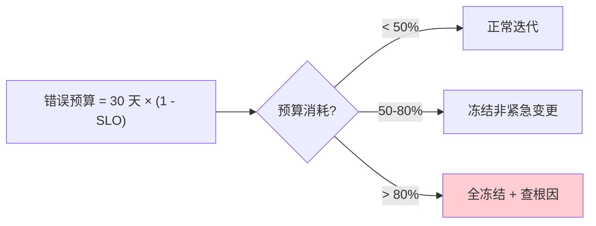
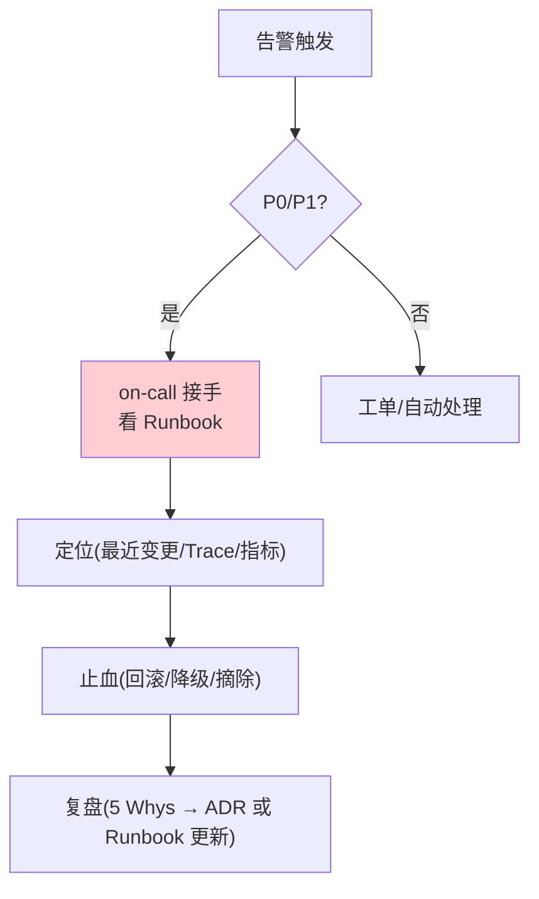
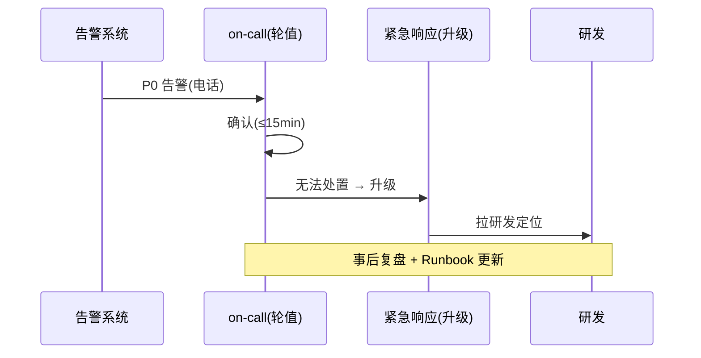
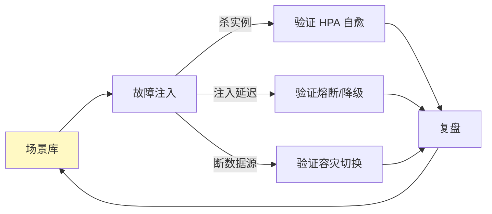

# 25-SRE 运维手册：SLO / 告警 Runbook / 故障分级 / 值班

> **定位**：把项目 14 从"能部署"推到"**能运维**"：SLO/SLI + 错误预算消费、告警规则分级 + 对应 **Runbook**（故障怎么处置）、故障分级（P0-P2）+ 值班 on-call、变更/发布门禁、混沌演练。这是平台 24×7 的"运行手册"。读者画像：想看到"平台出事怎么办"的读者。前置阅读：[24-事件驱动与消息设计](24-事件驱动与消息设计.md)。
>
> **铁律 0**：涉及 Spring AI 2.0 API 均实证；Prometheus/Alertmanager/Grafana 为真实第三方。

---

## 一、SLO 与错误预算

### 1.1 SLI / SLO 定义

| SLI | 定义 | SLO |
|-----|------|-----|
| 可用性 | 成功请求 / 总请求 | 99.9% |
| 端到端延迟 | P99 ≤ 8s | 95% 请求达标 |
| 模型网关延迟 | P99 ≤ 50ms | 99% 达标 |
| 工具执行延迟 | P99 ≤ 2s | 99% 达标 |

### 1.2 错误预算消费



```
月度错误预算（99.9%）= 43 分钟
累计超时/故障时间 > 21 分钟（50%）→ 冻结非紧急发布
```

---

## 二、告警规则与 Runbook

### 2.1 告警分级

| 级别 | 示例 | 响应 | 通道 |
|------|------|------|------|
| P0 | 核心服务宕机/数据丢失 | 立即，<15min 响应 | 电话+on-call |
| P1 | SLO 逼近/单区域故障 | <30min | 即时通讯 |
| P2 | 非核心降级/错误率升高 | <4h | 工单 |
| P3 | 容量水位/成本异常 | 工作日 | 工单 |

### 2.2 核心告警 + Runbook 示例

| 告警 | 触发 | Runbook（处置步骤） |
|------|------|--------------------|
| `agent_executor_5xx_rate > 0.05` | 错误率 5% | ① 查最近发布（回滚候选）② Trace 定位 ③ 降级到备用模型 ④ 若工具故障→摘除工具 |
| `agent_executor_p99 > 8s` | 延迟超 SLO | ① 查模型网关延迟 ② 查工具执行 ③ 检查背压/连接池 ④ 扩容 |
| `budget_remaining < 20%` | 租户预算告急 | ① 定位高消耗租户 ② 降级到低价模型 ③ 通知租户 ④ 可选暂停 |
| `tool_executor_success < 90%` | 工具成功率低 | ① 查沙箱 ② 查工具供应商 ③ 摘除故障工具 ④ 进审计 |
| `dlq_consumer_lag > 1000` | 死信堆积 | ① 查消费失败原因 ② 修复 ③ 重投 DLQ |



---

## 三、故障分级与值班

### 3.1 故障分级标准

| 级别 | 业务影响 | 示例 |
|------|---------|------|
| P0 | 全线不可用/数据丢失/合规事件 | 模型网关全挂、审计丢失 |
| P1 | 主要功能受损 | 工具执行大面积失败、多租户降级 |
| P2 | 局部/非核心 | 单租户慢、看板延迟 |
| P3 | 无感知 | 容量水位高、成本异常 |

### 3.2 值班 on-call



| 机制 | 说明 |
|------|------|
| 轮值表 | 每周一人 on-call，接 P0/P1 |
| 升级链 | on-call → 技术负责人 → 平台负责人 |
| 交接 | 值班交接清单（进行中故障/已知问题/变更） |
| 免打扰 | P2/P3 进队列，不扰 on-call |

---

## 四、变更与发布门禁


| 门禁 | 要求 |
|------|------|
| 代码评审 | 双人 + ADR 关联 |
| 测试 | 单测 + 契约 + 回归闸门 |
| 安全 | SCA + 签名 + SBOM |
| 发布 | 灰度 + 评估 + 可回滚 |
| 变更窗口 | 紧急变更走白名单 |

---

## 五、混沌演练



| 演练 | 频率 | 验证 |
|------|------|------|
| 杀数据面实例 | 每周 | HPA 自愈 ≤60s |
| 模型网关注入延迟 | 每月 | 熔断/降级生效 |
| 断主数据源 | 每季 | DR 切换 RTO 达标 |
| 混沌全量 | 每半年 | 全链路韧性 |

---

## 六、测试与验证

### 6.1 告警有效性测试

```java
// 注入错误率升高 → 告警触发 → Runbook 步骤可执行
```

### 6.2 错误预算测试

```java
// 模拟超时故障 → 预算消耗 → 达到 50% 触发发布冻结
```

### 6.3 on-call 演练

```bash
# 假 P0 演练：电话 → 确认 → Runbook 处置 → 复盘（≤15min 响应）
```

### 6.4 混沌测试

```bash
# 杀 agent-executor Pod → 自愈；验证请求无感
```

### 断言速查（PASS 判据汇总）

| # | 检验点 | PASS 判据 |
|---|--------|----------|
| 1 | 告警有效性测试 | 按本节代码/命令注释中的预期逐条核对 |
| 2 | 错误预算测试 | 按本节代码/命令注释中的预期逐条核对 |
| 3 | on-call 演练 | 假 P0 演练：电话 → 确认 → Runbook 处置 → 复盘（≤15min 响应） |
| 4 | 混沌测试 | 按本节代码/命令注释中的预期逐条核对 |
### 失败排查

- 先看审计事件流（每次工具/模型/检索调用都有事件）：失败发生在**入口闸**（未到业务）还是**执行层**（业务内）——入口闸失败查策略配置，执行层失败查服务日志；
- 多服务场景先分层冒烟：model-gateway → 对应业务服务 → agent-executor 串行验证，定位坏在哪一跳；
- 断言不符时优先核对**数据构造**（租户/版本/角色等测试前置是否真的生效），再怀疑实现——本项目 80% 的"测试失败"是前置数据没构造对。

---

## 七、验收对照

| 验收项 | 达标标准 | 本迭代 |
|--------|---------|--------|
| SLO/错误预算 | 指标定义 + 预算消费策略 | ✅ |
| 告警 Runbook | 分级 + 处置步骤 | ✅ |
| 故障分级 | P0-P3 + 升级链 | ✅ |
| 值班 | on-call 机制 | ✅ |
| 发布门禁 | 灰度+评估+回滚 | ✅ |
| 混沌演练 | 自愈/降级/容灾验证 | ✅ |

**下一篇**：26-运营纵深（压测/微调/计费/迁移）。
