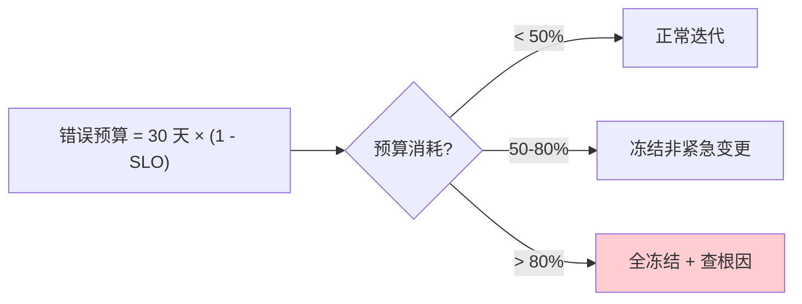
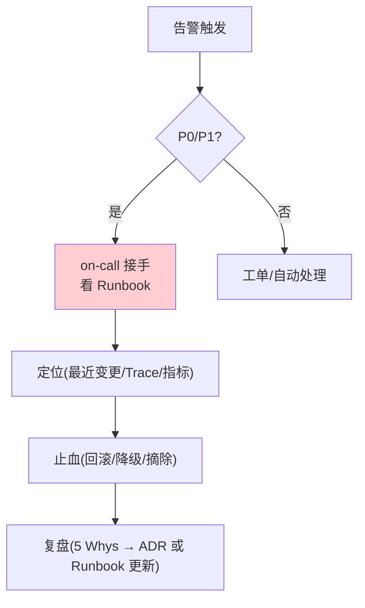
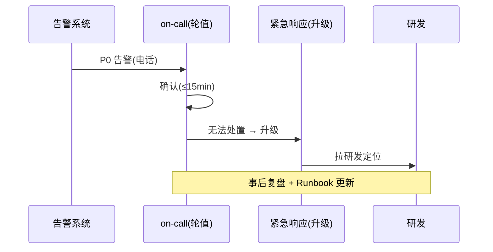
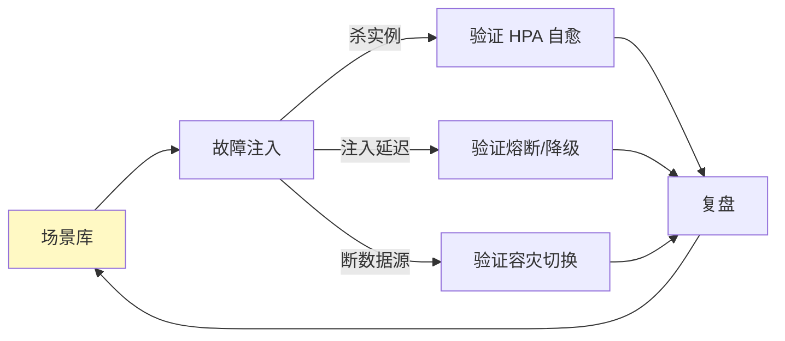

# 25-SRE 运维手册：SLO / 告警 Runbook / 故障分级 / 值班

> **定位**：把项目 14 从"能部署"推到"**能运维**"：SLO/SLI + 错误预算消费、告警规则分级 + 对应 **Runbook**（故障怎么处置）、故障分级（P0-P2）+ 值班 on-call、变更/发布门禁、混沌演练。这是平台 24×7 的"运行手册"。读者画像：想看到"平台出事怎么办"的读者。前置阅读：[24-事件驱动与消息设计](24-事件驱动与消息设计.md)。
>
> **铁律 0**：涉及 Spring AI 2.0 API 均实证；Prometheus/Alertmanager/Grafana 为真实第三方。

---

## 一、SLO 与错误预算

### 1.1 SLI / SLO 定义

| SLI | 定义 | SLO |
|-----|------|-----|
| 可用性 | 成功请求 / 总请求 | 99.9% |
| 端到端延迟 | P99 ≤ 8s | 95% 请求达标 |
| 模型网关延迟 | P99 ≤ 50ms | 99% 达标 |
| 工具执行延迟 | P99 ≤ 2s | 99% 达标 |

### 1.2 错误预算消费



```
月度错误预算（99.9%）= 43 分钟
累计超时/故障时间 > 21 分钟（50%）→ 冻结非紧急发布
```

### 1.3 本节核对（SLO 与错误预算）

- [ ] 四条 SLI/SLO（可用性 99.9%、P99 延迟）能与 10 迭代的 SLO 指标对应，且 99.9% 月度错误预算 = 43 分钟可自算
- [ ] 错误预算三个档位（<50% 正常 / 50-80% 冻结非紧急 / >80% 全冻结查根因）与 §1.2 flowchart 一致

---

## 二、告警规则与 Runbook

### 2.1 告警分级

| 级别 | 示例 | 响应 | 通道 |
|------|------|------|------|
| P0 | 核心服务宕机/数据丢失 | 立即，<15min 响应 | 电话+on-call |
| P1 | SLO 逼近/单区域故障 | <30min | 即时通讯 |
| P2 | 非核心降级/错误率升高 | <4h | 工单 |
| P3 | 容量水位/成本异常 | 工作日 | 工单 |

### 2.2 核心告警 + Runbook 示例

| 告警 | 触发 | Runbook（处置步骤） |
|------|------|--------------------|
| `agent_executor_5xx_rate > 0.05` | 错误率 5% | ① 查最近发布（回滚候选）② Trace 定位 ③ 降级到备用模型 ④ 若工具故障→摘除工具 |
| `agent_executor_p99 > 8s` | 延迟超 SLO | ① 查模型网关延迟 ② 查工具执行 ③ 检查背压/连接池 ④ 扩容 |
| `budget_remaining < 20%` | 租户预算告急 | ① 定位高消耗租户 ② 降级到低价模型 ③ 通知租户 ④ 可选暂停 |
| `tool_executor_success < 90%` | 工具成功率低 | ① 查沙箱 ② 查工具供应商 ③ 摘除故障工具 ④ 进审计 |
| `dlq_consumer_lag > 1000` | 死信堆积 | ① 查消费失败原因 ② 修复 ③ 重投 DLQ |



### 2.3 本节核对（告警规则与 Runbook）

- [ ] 告警分级四级（P0-P3）的响应时间与通道能对上表，且"P0/P1 走 on-call、P2/P3 走工单"分流逻辑与 flowchart 一致
- [ ] 5 条核心告警各自的触发条件与 Runbook 处置步骤能对应（agent 5xx/延迟/预算/tool 成功/DLQ 堆积）

---

## 三、故障分级与值班

### 3.1 故障分级标准

| 级别 | 业务影响 | 示例 |
|------|---------|------|
| P0 | 全线不可用/数据丢失/合规事件 | 模型网关全挂、审计丢失 |
| P1 | 主要功能受损 | 工具执行大面积失败、多租户降级 |
| P2 | 局部/非核心 | 单租户慢、看板延迟 |
| P3 | 无感知 | 容量水位高、成本异常 |

### 3.2 值班 on-call



| 机制 | 说明 |
|------|------|
| 轮值表 | 每周一人 on-call，接 P0/P1 |
| 升级链 | on-call → 技术负责人 → 平台负责人 |
| 交接 | 值班交接清单（进行中故障/已知问题/变更） |
| 免打扰 | P2/P3 进队列，不扰 on-call |

### 3.3 本节核对（故障分级与值班）

- [ ] 故障 P0-P3 分级（业务影响+示例）能复述，且与 §2 告警分级口径一致
- [ ] 值班四机制（轮值表/升级链/交接/免打扰）与 on-call 时序图（确认≤15min→无法处置升级→拉研发）一致

---

## 四、变更与发布门禁


| 门禁 | 要求 |
|------|------|
| 代码评审 | 双人 + ADR 关联 |
| 测试 | 单测 + 契约 + 回归闸门 |
| 安全 | SCA + 签名 + SBOM |
| 发布 | 灰度 + 评估 + 可回滚 |
| 变更窗口 | 紧急变更走白名单 |

### 4.1 本节核对（变更与发布门禁）

- [ ] 变更流程（评审→灰度→评估闸门→全量→监控→回滚）与 09 灰度、13 评估闸门、18 供应链（SCA/签名/SBOM）衔接一致
- [ ] 五类门禁（代码评审/测试/安全/发布/变更窗口）要求各自有前文承载

---

## 五、混沌演练



| 演练 | 频率 | 验证 |
|------|------|------|
| 杀数据面实例 | 每周 | HPA 自愈 ≤60s |
| 模型网关注入延迟 | 每月 | 熔断/降级生效 |
| 断主数据源 | 每季 | DR 切换 RTO 达标 |
| 混沌全量 | 每半年 | 全链路韧性 |

### 5.1 本节核对（混沌演练）

- [ ] 四类演练（杀实例/注入延迟/断数据源/全量）各自验证的能力与 10 高可用/SRE 指标一致（自愈≤60s、熔断降级、DR RTO）
- [ ] 演练闭环（场景库→注入→复盘→回场景库）与混沌工程方法论一致

---

## 六、全篇回归验证

**前置条件**：§1.1-§5.1 各节核对均通过；告警系统、预算监控、on-call、K8s 就绪。

**材料**：四类 SRE 演练探针（告警/预算/on-call/混沌）。

**步骤与断言**：

| # | 操作 | 预期（PASS 判据） |
|---|------|------------------|
| 1 | 注入错误率升高 | 告警触发，Runbook 步骤可执行 |
| 2 | 模拟超时故障 | 预算消耗达到 50% 触发发布冻结 |
| 3 | 假 P0 演练（电话→确认→Runbook→复盘） | 响应 ≤15min |
| 4 | 杀 agent-executor Pod | 自愈，请求无感 |

**失败排查**：①失败看审计事件流定位；②告警不触发→告警规则/阈值核对；③预算不冻结→预算消费口径；④混沌不自愈→HPA/探针配置。

---

## 七、验收对照

| 验收项 | 达标标准 | 本迭代 |
|--------|---------|--------|
| SLO/错误预算 | 指标定义 + 预算消费策略 | ✅ |
| 告警 Runbook | 分级 + 处置步骤 | ✅ |
| 故障分级 | P0-P3 + 升级链 | ✅ |
| 值班 | on-call 机制 | ✅ |
| 发布门禁 | 灰度+评估+回滚 | ✅ |
| 混沌演练 | 自愈/降级/容灾验证 | ✅ |

### 7.1 本节核对（验收对照）

- [ ] 六条验收项各有前文支撑：SLO/错误预算→§1.3、告警 Runbook→§2.3、故障分级→§3.3、值班→§3.3、发布门禁→§4.1、混沌演练→§5.1
- [ ] "下一篇 26-运营纵深（压测/微调/计费/迁移）"顺延编号，持续运营资产层

**下一篇**：26-运营纵深（压测/微调/计费/迁移）。
