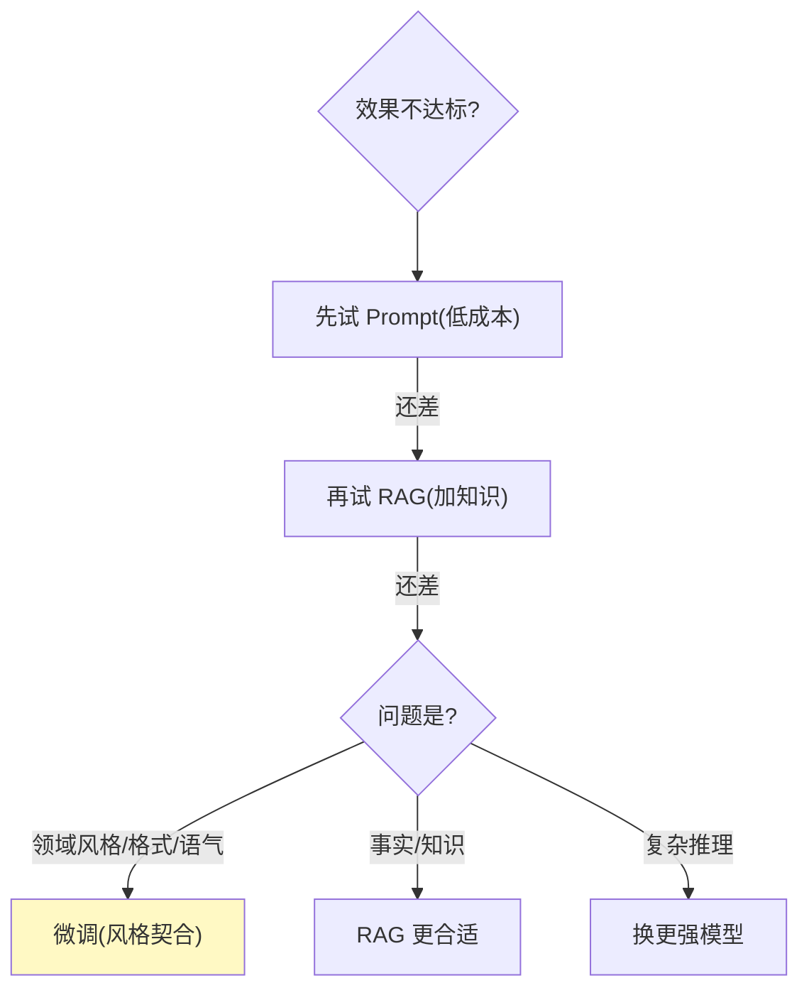

# 26-运营纵深：压测调优 / 微调决策 / SaaS 计费 / 迁移路线

> **定位**：把项目 14 的运营补齐四个**纵深主题**：**压测与性能调优**（方案/结果分析/调优清单）、**模型微调决策**（何时微调 vs Prompt/RAG）、**SaaS 计费与账单**（按租户用量/成本转嫁）、**迁移路线图**（从单体/现有系统迁移到平台）。读者画像：想看到平台"运营到底怎么纵深"的读者。前置阅读：[25-SRE运维手册](25-SRE运维手册.md)。
>
> **铁律 0**：涉及 Spring AI 2.0 API 均实证；压测/计费工具为第三方。

---

## 一、压测与性能调优

### 1.1 压测方案


| 场景 | 目标 | 指标 |
|------|------|------|
| 对话流式 | 单实例 QPS / P99 | 首 token ≤1s / 完成 ≤8s |
| 工具调用 | 单实例吞吐 | 工具 P99 ≤2s |
| 检索 | 单实例 QPS | 检索 P99 ≤200ms |
| 混合 | 平台全链路 | 端到端 P99 |

### 1.2 调优清单（按收益排序）

| 调优点 | 手段 | 收益 |
|--------|------|------|
| 模型网关 | 语义缓存（09 迭代）| 高频查询省 LLM |
| 上下文 | 压缩（15 迭代）| 长对话省 Token |
| 响应式 | 全链异步（12 迭代）| 吞吐量级 |
| 检索 | 混合+重排（15 迭代）| 质量↑ 重查↓ |
| 并发 | flatMap 限流（14 迭代）| 防打爆配额 |
| 连接池 | WebClient/DB 池调优 | 减少等待 |
| GPU | vLLM 批处理/连续批（16 迭代）| 吞吐↑ 成本↓ |

---

## 二、模型微调决策（何时微调 vs Prompt/RAG）



| 场景 | 推荐 | 理由 |
|------|------|------|
| 指令不清/格式 | Prompt 优化 | 低成本、可灰度 |
| 缺领域知识 | RAG | 可更新、可溯源 |
| 领域风格/输出格式固定 | 微调 | 风格契合、省 token |
| 复杂推理 | 换强模型 | 微调救不了推理 |

> **调研共识（2026）**：先 Prompt/RAG，无效才微调；**金标评估驱动**（13 迭代）判断"是否真进步"。

---

## 三、SaaS 计费与账单

### 3.1 计费模型


| 计费项 | 计量 | 费率 |
|--------|------|------|
| Token | gen_ai.usage（prompt/completion） | 按模型档位 |
| 工具调用 | 工具事件计数 | 按工具等级 |
| 检索 | 向量查询数 | 按量 |
| 存储 | 会话/记忆体积 | 按 GB |

### 3.2 账单 + 限额闭环

```java
// 计量：model-gateway 按租户 Token 计量（16 迭代成本归因）
// 计费：账单服务按租户×费率生成
// 限额：预算拦截（09 迭代）与账单联动——超限停服务（可配置降级）
// 本迭代验收：租户账单与实际用量一致、超限自动停
```

---

## 四、迁移路线图（从现有系统到平台）

### 4.1 迁移路径


### 4.2 迁移策略

| 阶段 | 动作 | 风险控制 |
|------|------|---------|
| ① 接入网关 | 统一认证/会话/审计 | 透明代理，行为不变 |
| ② 模型代理 | 调用走网关（路由/配额） | 单模型→多模型渐进 |
| ③ 工具登记 | 现有工具注册+准入 | 未登记不执行 |
| ④ 双跑 | 新旧并行 + 评估对比（13） | 评估驱动切流 |
| ⑤ 切流 | 按租户/业务灰度（09） | 秒级回滚 |
| ⑥ 下线 | 旧系统降流量→下线 | 全量验证后 |

---

## 五、测试与验证

### 5.1 压测验证

```bash
# 目标 QPS 压测 → P99 达标、HPA 扩缩正常；瓶颈定位到调优点
```

### 5.2 微调决策验证

```java
// 用金标集对比：Prompt 版 vs 微调版 vs RAG 版 → 评估驱动选择
```

### 5.3 计费验证

```java
// 模拟租户用量 → 账单金额与实际计量一致（对账）
```

### 5.4 迁移验证

```bash
# 单体请求 → 网关 → 新平台 → 评估对比 → 灰度切流 → 回滚演练
```

---

## 六、验收对照

| 验收项 | 达标标准 | 本迭代 |
|--------|---------|--------|
| 压测调优 | 方案+瓶颈定位+调优清单 | ✅ |
| 微调决策 | 何时微调 vs Prompt/RAG | ✅ |
| SaaS 计费 | 计量+账单+限额联动 | ✅ |
| 迁移路线 | 六阶段+风险控制 | ✅ |

**下一篇**：27-模型内容审核与安全护栏。
