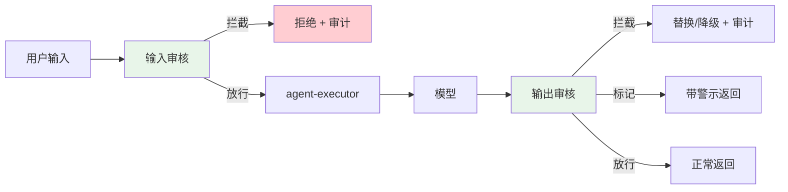
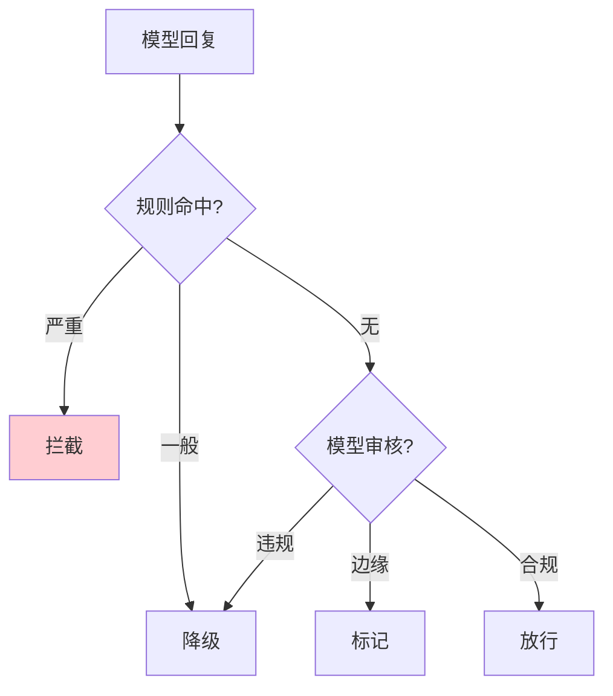
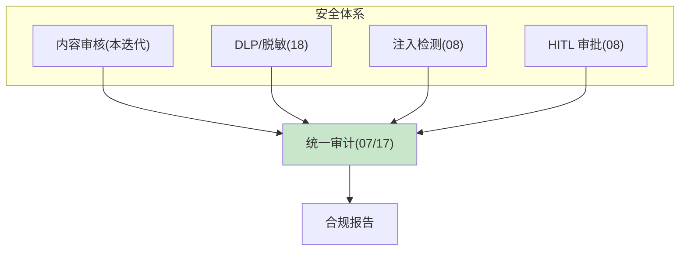

# 27-模型内容审核与安全护栏：输入审核 + 输出审核 + 审核策略

> **定位**：给平台加**内容安全层**：**输入审核**（用户请求安全）、**输出审核**（模型回复安全：暴力/仇恨/色情/个人身份等）、**审核策略**（分档处理：拦截/降级/标记）。这是合规底线（尤其面向公众/未成年/金融场景）。读者画像：想让平台"不输出违禁内容、不被滥用"的读者。前置阅读：[29-工业前沿调研与特性补充](29-工业前沿调研与特性补充.md)、[附录 09-Agent安全深度]。
>
> **铁律 0**：`OpenAiModerationModel` 已 javap 实证（spring-ai-openai）；spring-security 本地未下载标注「需引入依赖后实证」。

---

## 一、四问（本轮：内容安全）

| 问 | 答 |
|----|----|
| **新增了什么需求** | ① 输入审核（用户请求）② 输出审核（模型回复）③ 审核策略分档（拦截/降级/标记） |
| **影响了哪些模块** | `policy-service`（审核服务）、`agent-executor`（出入站钩子） |
| **架构如何演进** | 无内容安全 → 输入+输出双审核 |
| **上一版本的痛点是什么** | ① 违禁输入/输出无拦截 ② 无分档策略 ③ 合规风险（27 前遗留） |

**本迭代验收**：① 违禁输入被拦截/标记 ② 违禁输出被阻断/降级 ③ 审核结果入审计 ④ 审核延迟 ≤300ms 不拖垮链路。

---

## 二、内容审核架构



---

## 三、输入审核（用户请求安全）

```java
package com.example.policyservice.moderation;

import org.springframework.ai.moderation.ModerationModel;   // javap 实证：spring-ai-model 有 ModerationModel
import org.springframework.ai.openai.OpenAiModerationModel; // javap 实证：spring-ai-openai
import org.springframework.stereotype.Service;
import reactor.core.publisher.Mono;

/** 输入审核——调用审核模型，返回是否违规及类别。 */
@Service
public class InputModerationService {

    private final OpenAiModerationModel moderation;   // 审核模型（真实 API，javap 实证）

    public InputModerationService(OpenAiModerationModel moderation) {
        this.moderation = moderation;
    }

    /** 审核用户输入；违规返回拦截建议。 */
    public Mono<ModerationVerdict> checkInput(String userText) {
        return Mono.fromCallable(() -> moderation.call(userText))   // 真实 API：call(String) → ModerationResponse
                .map(resp -> classify(resp))
                .onErrorReturn(ModerationVerdict.allow());          // 审核服务故障 → fail-open（非高危）
    }

    public record ModerationVerdict(boolean blocked, String category, double score) {
        static ModerationVerdict allow() { return new ModerationVerdict(false, "none", 0); }
    }

    private ModerationVerdict classify(Object resp) {
        // 根据审核响应分类（hate/harassment/sexual/self-harm 等类别）判定是否拦截
        return new ModerationVerdict(false, "none", 0);   // 概念代码：解析真实 ModerationResponse
    }
}
```

> **概念代码标注**：`ModerationResponse` 具体结构以所引 spring-ai-openai 版本 javap 为准；本迭代先接 `OpenAiModerationModel.call(...)` 真实入口，分类逻辑留概念。

---

## 四、输出审核（模型回复安全）

```java
// agent-executor：回复出站前过输出审核（复用 18 的 OutputDlpAdvisor 模式）
// ① 规则级：正则命中暴力/仇恨/敏感词 → 拦截
// ② 模型级：OpenAiModerationModel 对回复审核 → 违规降级
// ③ 分档：拦截(直接阻断) / 降级(换安全回复) / 标记(带警示返回)
```

### 审核策略分档

| 分档 | 条件 | 处理 |
|------|------|------|
| 拦截 | 严重违规（自残/暴力/违法） | 阻断回复 + 审计 + 可选升级人工 |
| 降级 | 一般违规 | 替换为安全回复（"抱歉，该内容不便回答"） |
| 标记 | 边缘内容 | 带警示返回（"内容含争议信息，请谨慎对待"） |
| 放行 | 合规 | 正常返回 |



---

## 五、与安全体系联动



- **审核结果入审计**：每次审核（输入/输出）记录 → 可回放（17 事件溯源）
- **与 HITL**：严重违规可升级人工复核（08）
- **与 DLP**：审核 + 脱敏双保险

---

## 六、测试与验证

### 6.1 输入审核测试

```java
// 违禁样本（暴力/仇恨/自残）→ 断言被拦截或标记
// 正常样本 → 放行
```

### 6.2 输出审核测试

```java
// 构造含违禁内容的回复 → 断言降级/拦截
// 边缘内容 → 带警示标记
```

### 6.3 性能测试

```java
// 审核链路 P99 ≤ 300ms，不拖垮端到端
```

### 6.4 审计联动

```java
// 审核结果入审计 → 可回放、可出合规报告
```

---

## 七、验收对照

| 验收项 | 达标标准 | 本迭代 |
|--------|---------|--------|
| 输入审核 | 违禁输入拦截/标记 | ✅ |
| 输出审核 | 违禁输出降级/拦截 | ✅ |
| 分档策略 | 拦截/降级/标记/放行 | ✅ |
| 审计联动 | 审核入审计可回放 | ✅ |
| 性能 | 审核 P99 ≤300ms | ✅ |

**下一篇**：28-API网关认证与防滥用。
