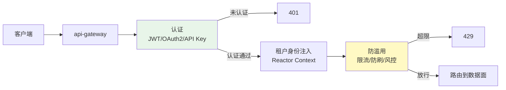
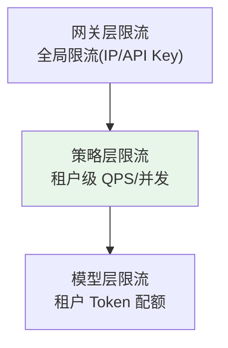
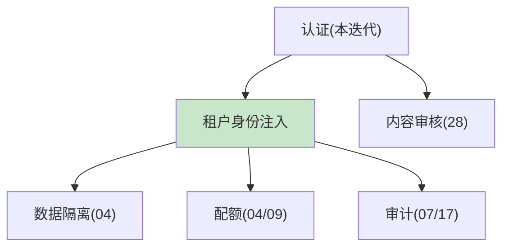

# 29-API 网关认证与防滥用：身份 / 租户 / 防刷 / 敏感接口

> **定位**：把平台的接入层安全补全：**认证**（JWT/OAuth2/API Key）、**租户身份注入**（Reactor Context）、**防滥用**（限流/防刷/风控）、**敏感接口保护**（审计/升级）。这是平台对外暴露的第一道门。读者画像：想让平台"外面的人进不来、进来的人有边界、滥用被拦"的读者。前置阅读：[27-模型内容审核与安全护栏](27-模型内容审核与安全护栏.md)、[教程 31-安全与权限控制]。
>
> **铁律 0**：`org.springframework.security.*` 本地未下载，标注「需引入 spring-boot-starter-security 后 javap 实证」。

---

## 一、四问（本轮：接入安全）

| 问 | 答 |
|----|----|
| **新增了什么需求** | ① 认证（JWT/OAuth2/API Key）② 租户身份注入 ③ 防滥用（限流/防刷/风控）④ 敏感接口保护 |
| **影响了哪些模块** | `api-gateway`（接入层）、`policy-service`（限流） |
| **架构如何演进** | 无接入认证 → 身份 + 租户 + 防滥用 |
| **上一版本的痛点是什么** | ① 谁都能调 API ② 租户身份可伪造 ③ 无防刷 ④ 敏感接口无保护（28 前遗留） |

**本迭代验收**：① 未认证请求被拒 ② 租户身份从可信源注入（不可伪造）③ 防刷限流生效 ④ 敏感接口强制审计/升级。

### 1.1 本节核对（四问）

- [ ] "上一版痛点"（谁都能调 API/租户可伪造/无防刷/敏感接口无保护）指向本迭代，与安全扩展板块一致
- [ ] 验收四项分别有验证承接：认证→§6.1、租户注入→§6.2、防刷→§6.3、敏感接口→§6.4

---

## 二、接入认证架构



### 2.1 本节核对（接入认证架构）

- [ ] 能沿 §二流程图说清接入链四段：认证→租户注入→防滥用→路由数据面，以及未认证 401、超限 429 两个拒绝出口
- [ ] 租户身份注入（Reactor Context）与 04 多租户、WebFlux 铁律一致

---

## 三、认证方式

### 3.1 三种认证方式

| 方式 | 场景 | 说明 |
|------|------|------|
| JWT（OAuth2 授权码） | 终端用户 | 登录态，含用户/租户 claim |
| Client Credentials | 服务间/企业应用 | 机器身份，含租户 claim |
| API Key | 简单集成 | 静态密钥，适合低风险调用 |

### 3.2 租户身份注入（Reactor Context，WebFlux 铁律）

```java
// api-gateway：认证后从 JWT/Key 解析租户 → 注入 Reactor Context
// 下游服务用 deferContextual 取（不可由调用方自报，防伪造）
Mono<String> handle(String token, String q) {
    String tenantId = parseTenantFrom(token);          // 可信来源：JWT claim / Key 绑定
    return downstream(q)
            .contextWrite(Context.of("tenant_id", tenantId));
}
```

> **关键**：租户身份**只从认证凭据解析**，绝不信任请求头自报的 `X-Tenant-Id`（防越权）。

### 3.3 本节测试与验证（认证方式与租户注入）

**前置条件**：`spring-boot-starter-security` 已引入（未 javap 实证标注）。

**材料**：§3.1 三种认证方式 + §3.2 租户注入 `contextWrite`。

**步骤与断言**：

| # | 操作 | 预期（PASS 判据） |
|---|------|------------------|
| 1 | 无 token 请求 | 返回 401 |
| 2 | 伪造 `X-Tenant-Id` 头 | 被忽略，用 JWT/Key 解析出的可信租户（`parseTenantFrom(token)`） |
| 3 | 过期/签名错误 token | 401 |
| 4 | tenantA 的 token | 下游 `deferContextual` 拿到 tenantA（不可伪造），且 tenantA 不能访问 tenantB 数据 |

**失败排查**：①伪造租户成功→未剥离 `X-Tenant-Id` 或未用认证凭据覆盖；②租户注入丢→`contextWrite` 作用域未覆盖到下游读取点；③认证失效→Security 过滤器链/JWT 校验配置（需引依赖后实证）。

---

## 四、防滥用（限流 / 防刷 / 风控）

### 4.1 分层限流



| 层 | 维度 | 手段 |
|----|------|------|
| 网关 | IP / API Key | Redis 滑动窗口（04 迭代限流演进） |
| 策略 | 租户 QPS / 并发 | policy-service |
| 模型 | 租户 Token 配额 | model-gateway 预算拦截（09 迭代） |

### 4.2 防刷（异常行为检测）

| 模式 | 检测 | 处置 |
|------|------|------|
| 高频重复请求 | 同请求哈希计数 | 限流/临时封禁 |
| 异常时间段流量 | 时段 QPS 基线偏离 | 告警/升级 |
| 恶意探测（扫描 4xx） | 4xx 率突增 | 封 IP 段 |
| 语义滥用（Prompt 注入批量） | 28 审核 + 注入检测 | 拦截/审计 |

### 4.3 敏感接口保护

```java
// 敏感操作（改配置/审批/删除/导出）→ 强制：
//   ① 二次验证（管理员身份/双因素）
//   ② 全量审计（谁在何时做了什么，17 事件溯源）
//   ③ 可选 HITL（高风险操作人工复核，08）
```

### 4.4 本节测试与验证（防滥用：限流 / 防刷 / 敏感接口）

**前置条件**：Redis 限流键与身份系统就绪。

**材料**：§4.1 分层限流 + §4.2 防刷 + §4.3 敏感接口。

**步骤与断言**：

| # | 操作 | 预期（PASS 判据） |
|---|------|------------------|
| 1 | 高频重复请求（同请求哈希） | 限流/临时封禁 |
| 2 | 4xx 探测（扫描） | 4xx 率突增 → 封 IP 段 |
| 3 | 改配置/审批无二次验证 | 被拒绝 |
| 4 | 有二次验证的敏感操作 | 放行且全量审计（谁在何时做了什么） |

**失败排查**：①限流不触发→Redis 滑动窗口未进网关链；②4xx 探测不封→IP 段封禁规则未关联 4xx 率；③敏感接口绕过→二次验证/审计未强制。

---

## 五、与安全体系联动



- **认证 → 租户** → 数据隔离/配额/审计全部按可信租户执行
- **认证 → 内容审核**：匿名/低信誉调用提高审核阈值

### 5.1 本节核对（与安全体系联动）

- [ ] 认证→可信租户→数据隔离/配额/审计全按可信租户执行，与 04/07/17 一致
- [ ] 匿名/低信誉调用提高内容审核阈值与 28（27）审核策略联动

---

## 六、全篇回归验证

**前置条件**：§1.1-§5.1 各节核对/测试均通过；身份系统与 Redis 限流就绪。

**材料**：§3.3/§4.4 已覆盖的认证/防滥用探针。

**步骤与断言**：

| # | 操作 | 预期（PASS 判据） |
|---|------|------------------|
| 1 | 无 token / 过期 / 签名错误 | 401；伪造 `X-Tenant-Id` 被忽略（用 JWT 租户） |
| 2 | tenantA token → 下游 | 拿 tenantA（不可伪造），不能访问 tenantB 数据 |
| 3 | 高频重复 / 4xx 探测 | 限流/封禁、封 IP |
| 4 | 敏感操作无二次验证 | 拒绝；有验证 → 放行且全量审计 |

**失败排查**：①失败看审计事件流定位"入口闸还是执行层"；②认证/租户注入→§3.3；③防滥用/敏感接口→§4.4 回查。

---

## 七、验收对照

| 验收项 | 达标标准 | 本迭代 |
|--------|---------|--------|
| 认证 | 未认证拒、可信租户注入 | ✅ |
| 防滥用 | 分层限流 + 防刷 | ✅ |
| 敏感接口 | 二次验证 + 全量审计 | ✅ |
| 联动 | 认证→租户→隔离/配额/审计 | ✅ |

### 7.1 本节核对（验收对照）

- [ ] 四条验收项各有前文支撑：认证→§3.3、防滥用→§4.4、敏感接口→§4.4、联动→§5.1
- [ ] "下一篇 35-工业前沿调研与特性补充"顺延编号（此为本组安全扩展的末尾结转）

**下一篇**：35-工业前沿调研与特性补充。
